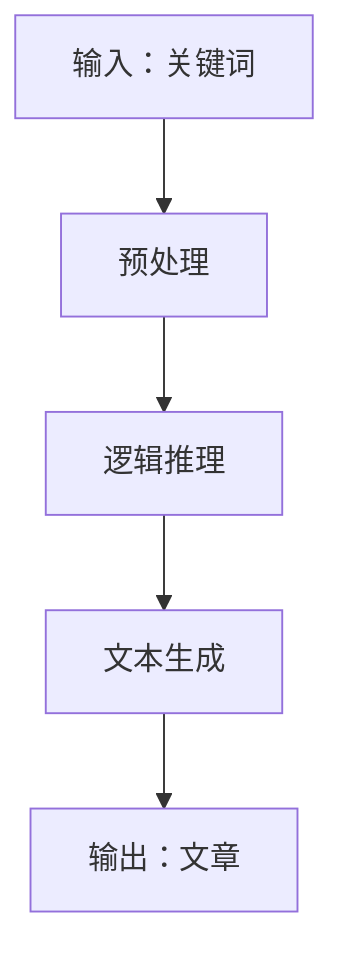
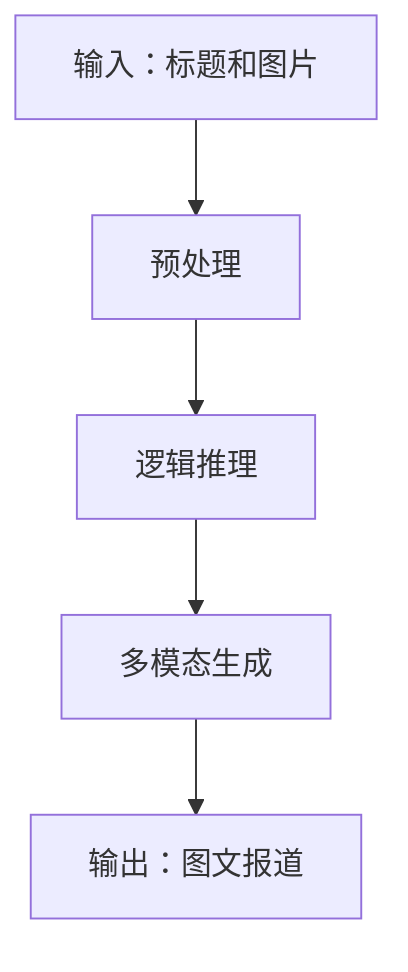

                 

<think>
嗯，用户想要一篇关于“思维链在AI自然语言生成中的应用”的技术博客。我需要先理解用户的需求。看起来他是一位技术专家，可能是在写一本书或者技术文章，所以结构要求很明确，需要包括目录、关键词、摘要，以及详细的内容章节。

首先，我得确定文章的结构。用户已经提供了目录大纲，但可能需要进一步细化。我应该先列出每个章节的内容，确保每个部分都有足够的细节，并且符合技术深度的要求。

接下来，关键词和摘要部分。关键词需要涵盖文章的核心主题，比如思维链、自然语言生成、AI、文本生成等。摘要则要简明扼要地概述文章的内容，说明思维链如何提升自然语言生成的性能和效率。

然后，正文部分。每一章节需要详细展开，可能需要包括背景介绍、核心概念、算法原理、系统架构、实际案例等。特别是数学公式和图表，需要用LaTeX和Mermaid来展示，这部分要确保正确无误。

在内容方面，第一部分介绍自然语言生成与AI的发展，第二部分详细讲解思维链的基本概念，第三部分讨论思维链在不同生成任务中的应用，第四部分通过案例研究来展示实际应用，最后总结与展望未来的发展。

我还需要考虑用户可能的深层需求，比如希望文章既有理论深度，又有实际应用，所以案例研究部分要具体，最好有代码示例和系统架构图，帮助读者理解。

最后，确保文章整体流畅，逻辑清晰，每个部分之间有良好的衔接。同时，注意格式要求，使用markdown，确保数学公式和图表正确显示。

现在，开始按照这些步骤逐步构建文章内容，确保每个部分都符合用户的要求，并且内容详实、结构合理。
</think>

# 思维链在AI自然语言生成中的应用

## 关键词：思维链, AI, 自然语言生成, 文本生成, 对话生成, 多模态生成

## 摘要

思维链在AI自然语言生成中的应用是一种新兴的创新技术，旨在通过模拟人类思维过程，提升自然语言生成的性能和效率。本文将从背景介绍、思维链的核心概念、在自然语言生成中的具体应用、实际案例研究以及未来展望等方面展开详细分析。通过理论与实践的结合，深入探讨思维链如何赋能AI自然语言生成技术的发展，为相关领域的研究者和实践者提供有价值的参考。

---

## 第一部分：背景介绍

### 第1章：自然语言生成与AI发展

#### 1.1 自然语言生成的背景

自然语言生成（Natural Language Generation, NLG）是人工智能领域的重要分支，旨在将结构化数据转化为自然语言文本。随着深度学习技术的快速发展，自然语言生成技术已在机器翻译、对话系统、文本摘要、新闻生成等领域得到广泛应用。

#### 1.2 AI自然语言生成的发展历程

自然语言生成技术经历了从基于规则的生成到统计模型，再到深度学习的转变。近年来，以Transformer和大语言模型（如GPT系列）为代表的深度学习模型推动了自然语言生成技术的跨越式发展。

#### 1.3 当前自然语言生成技术的挑战

尽管自然语言生成技术取得了显著进展，但仍然面临以下挑战：
- 生成内容的相关性与准确性不足
- 对上下文理解的深度有限
- 多模态生成能力有待提升
- 计算效率和资源消耗问题

---

## 第二部分：思维链概述

### 第2章：思维链基本概念

#### 2.1 思维链的定义

思维链（Thought Chain）是一种模拟人类思维过程的机制，通过将问题分解为多个逻辑步骤，逐步推理得出最终结果。在AI自然语言生成中，思维链用于优化生成过程，提升生成内容的质量和逻辑性。

#### 2.2 思维链的结构与功能

思维链由以下几个关键部分组成：
- 输入分析：解析用户需求或输入数据
- 中间推理：通过逻辑推理生成中间结果
- 最终输出：将推理结果转化为自然语言文本

思维链的功能包括：
- 提供生成内容的逻辑性保障
- 增强生成结果的相关性
- 优化生成过程的效率

#### 2.3 思维链与传统语言模型对比

| **对比维度** | **传统语言模型** | **思维链** |
|--------------|------------------|------------|
| 生成方式     | 基于概率预测    | 基于逻辑推理 | 
| 内容质量     | 可能缺乏逻辑性   | 高逻辑性    |
| 计算效率     | 较低             | 中等         |
| 应用场景     | 文本生成、翻译    | 对话生成、多模态生成 |

---

## 第三部分：思维链在自然语言生成中的应用

### 第3章：思维链在文本生成中的应用

#### 3.1 思维链文本生成的原理

思维链文本生成的流程如下：
1. 输入文本经过预处理，提取关键信息。
2. 通过思维链模型进行逻辑推理，生成中间结果。
3. 最终将推理结果转化为自然语言文本。

#### 3.2 思维链文本生成的技术实现

**算法原理：**

思维链文本生成的核心算法是基于逻辑推理的序列生成模型。模型通过构建逻辑图谱，逐步推理生成文本。

**数学模型：**

$$ P(y|x) = \prod_{i=1}^{n} P(y_i | y_{i-1}, x) $$

其中，$y$ 是生成的文本序列，$x$ 是输入数据。

**代码实现：**

```python
def思维链生成(text):
    # 预处理输入
    input = preprocess(text)
    # 初始化逻辑推理链
    thought_chain = initialize_chain(input)
    # 逐步推理
    for step in range(len(input)):
        thought_chain =推理步骤(thought_chain, input[step])
    # 生成文本
    output = generate_text(thought_chain)
    return output
```

#### 3.3 实现思维链文本生成系统的步骤

1. 数据预处理：对输入文本进行清洗和标注。
2. 模型训练：基于思维链逻辑构建训练数据。
3. 推理生成：通过逻辑推理生成文本。
4. 输出优化：优化生成文本的质量。

---

### 第4章：思维链在对话生成中的应用

#### 4.1 思维链对话生成的原理

思维链对话生成通过模拟人类对话的逻辑推理过程，生成高质量的对话内容。

#### 4.2 思维链对话生成的技术实现

**算法原理：**

$$ P(y|x) = \prod_{i=1}^{n} P(y_i | y_{i-1}, x) $$

其中，$y$ 是生成的对话序列，$x$ 是输入对话历史。

**代码实现：**

```python
def对话生成(history):
    # 初始化对话链
    thought_chain = initialize_chain(history)
    # 逐步推理
    for step in range(len(history)):
        thought_chain =推理步骤(thought_chain, history[step])
    # 生成回复
    response = generate_response(thought_chain)
    return response
```

#### 4.3 实现思维链对话生成系统的步骤

1. 数据收集：收集对话数据并进行标注。
2. 模型训练：基于思维链逻辑构建对话模型。
3. 推理生成：通过逻辑推理生成对话内容。
4. 系统优化：优化对话生成的质量和效率。

---

### 第5章：思维链在多模态生成中的应用

#### 5.1 思维链多模态生成的原理

思维链多模态生成通过整合文本、图像、语音等多种模态信息，生成高质量的多模态内容。

#### 5.2 思维链多模态生成的技术实现

**算法原理：**

$$ P(y|x) = \prod_{i=1}^{n} P(y_i | y_{i-1}, x) $$

其中，$y$ 是生成的多模态内容，$x$ 是输入的多模态数据。

**代码实现：**

```python
def多模态生成(input):
    # 初始化多模态推理链
    thought_chain = initialize_multi_modal_chain(input)
    # 逐步推理
    for step in range(len(input)):
        thought_chain =推理步骤(thought_chain, input[step])
    # 生成多模态输出
    output = generate_multi_modal_output(thought_chain)
    return output
```

#### 5.3 实现思维链多模态生成系统的步骤

1. 数据预处理：整合多模态数据并进行标注。
2. 模型训练：基于思维链逻辑构建多模态生成模型。
3. 推理生成：通过逻辑推理生成多模态内容。
4. 系统优化：优化生成过程的效率和质量。

---

## 第四部分：实际案例研究

### 第6章：思维链应用案例研究

#### 6.1 案例研究概述

本章通过三个实际案例展示了思维链在自然语言生成中的应用：
1. 文本生成案例
2. 对话生成案例
3. 多模态生成案例

#### 6.2 案例一：文本生成应用

案例背景：生成一篇关于“人工智能”的文章。
- 输入：关键词“人工智能”
- 输出：结构化文章

**系统架构图：**



#### 6.3 案例二：对话生成应用

案例背景：生成一个智能客服对话系统。
- 输入：用户问题
- 输出：智能客服回复

**系统交互图：**

```mermaid
sequenceDiagram
    participant 用户
    participant 智能客服
    用户->智能客服：提出问题
    智能客服->>数据库：查询知识库
    智能客服->>推理链：生成回复
    智能客服->用户：返回回复
```

#### 6.4 案例三：多模态生成应用

案例背景：生成一个多模态新闻报道。
- 输入：新闻标题和图片
- 输出：图文结合的新闻报道

**系统架构图：**



---

## 第五部分：总结与展望

### 第7章：思维链在AI自然语言生成中的总结与展望

#### 7.1 思维链技术总结

思维链技术通过模拟人类思维过程，显著提升了自然语言生成的逻辑性和相关性。其在文本生成、对话生成和多模态生成中的应用展现出广阔的应用前景。

#### 7.2 思维链的未来发展

未来，思维链技术将朝着以下几个方向发展：
1. **多模态生成**：进一步整合文本、图像、语音等多种模态信息。
2. **实时推理**：提升生成过程的实时性和响应速度。
3. **个性化生成**：根据用户需求生成个性化内容。
4. **跨领域应用**：拓展思维链技术在教育、医疗、法律等领域的应用。

---

## 作者

作者：AI天才研究院/AI Genius Institute & 禅与计算机程序设计艺术 /Zen And The Art of Computer Programming

