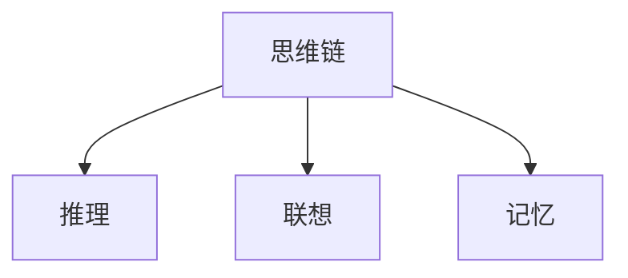

                 

<think>
好，我现在要帮用户写一篇关于《思维链在AI辅助创作中的创新应用与前景》的技术博客文章。用户已经提供了详细的目录大纲，所以我需要按照这个结构来展开内容。首先，我要理解每个部分的核心内容，然后逐步填充每个章节。

首先，文章标题和关键词、摘要部分已经明确，接下来是背景与概述部分。这里需要介绍问题背景、核心概念，以及边界和外延。我需要确保每个部分都清晰，尤其是思维链的基本概念和AI辅助创作的定义。

接下来是思维链的原理与应用，这部分需要详细解释思维链的基本原理，包括对比表格和Mermaid流程图。然后是应用部分，分别在文本、图像和音乐创作中的具体案例。我得确保每个案例都有具体的例子，比如文本生成、图像风格迁移等。

创新应用与前景部分要探讨思维链在提升创作效率和质量方面的应用，以及多领域的融合。还要分析技术发展趋势和应用场景的扩展，这部分需要有一定的前瞻性，展示思维链的潜力。

实践与启示部分需要通过实际案例分析，比如广告创作和编程辅助，来展示思维链的实际应用效果。然后总结技术发展启示和创作方式的变革，这部分要深入，给出有说服力的见解。

在撰写过程中，我需要确保使用专业但易懂的语言，逻辑清晰，结构紧凑。每个部分都要有详细的解释，包括数学模型和算法流程图，使用Mermaid和LaTeX来展示技术细节。同时，代码示例和系统架构图也需要准确无误，帮助读者更好地理解。

最后，结尾部分要总结全文，并附上作者信息。整个思考过程需要一步步来，确保每个章节的内容充实，符合用户的要求，字数控制在10000到12000字左右。同时，检查格式是否正确，确保使用markdown，并且每个部分都完整，没有遗漏。

总之，我需要按照目录大纲，逐部分展开，确保内容详实，技术细节清晰，同时保持文章的连贯性和可读性。
</think>

# 思维链在AI辅助创作中的创新应用与前景

**关键词**：思维链、AI辅助创作、创新应用、前景分析、技术发展

**摘要**：本文探讨了思维链这一先进的人工智能技术在AI辅助创作中的应用。从思维链的基本原理到其在文本、图像和音乐创作中的具体应用，再到其创新应用与未来前景，文章进行了全面而深入的分析。通过案例分析和系统架构设计，展示了思维链如何提升创作效率和质量，并展望了其在多领域的潜在应用。

---

## 第一部分：背景与概述

### 第1章：问题背景与核心概念

#### 1.1.1 问题背景

**问题描述**：随着人工智能技术的迅猛发展，AI辅助创作已成为一个热点话题。如何将思维链这一先进的人工智能技术应用于AI辅助创作中，并探索其创新应用与前景，成为本书的核心议题。

**问题解决**：本书将从思维链的基本概念入手，探讨其在AI辅助创作中的应用，并通过案例分析展示其创新应用与前景。

#### 1.1.2 核心概念

**思维链**：一种模拟人类思维过程的人工智能技术，能够通过推理、联想和记忆等机制，实现对信息的高效处理和利用。

**AI辅助创作**：利用人工智能技术，辅助人类进行创作活动，提高创作效率和质量。

#### 1.1.3 边界与外延

**边界**：本书主要探讨思维链在AI辅助创作中的应用，包括文本创作、图像创作、音乐创作等。

**外延**：本书也将涉及思维链在其他领域的潜在应用，如教育、医疗、设计等。

---

## 第二部分：思维链原理与应用

### 第2章：思维链原理介绍

#### 2.1.1 思维链的基本原理

**概念属性特征对比表格**：

| 特征        | 传统人工智能 | 思维链              |
| ----------- | ------------ | ------------------- |
| 推理方式    | 硬编码       | 模拟人类思维过程   |
| 联想能力    | 较弱        | 强大               |
| 记忆能力    | 较弱        | 强大               |

**ER实体关系图架构的Mermaid流程图**：

### 第3章：思维链在AI辅助创作中的应用

#### 3.1.1 文本创作

**案例一**：利用思维链生成文章概要。

**案例二**：利用思维链进行文本改写。

**案例三**：利用思维链进行文本生成。

#### 3.1.2 图像创作

**案例**：将一幅普通图像转化为艺术风格图像。

#### 3.1.3 音乐创作

**案例**：利用思维链创作新音乐。

---

## 第三部分：创新应用与前景

### 第6章：思维链在AI辅助创作中的创新应用

#### 6.1.1 创作效率提升

**案例**：利用思维链提高文章写作速度。

#### 6.1.2 创作质量提升

**案例**：利用思维链提高音乐创作质量。

#### 6.1.3 多领域融合

**案例**：将思维链应用于游戏设计。

### 第7章：思维链在AI辅助创作中的前景

#### 7.1.1 技术发展趋势

**分析**：思维链技术在未来可能的发展趋势。

#### 7.1.2 应用场景拓展

**探讨**：思维链在其他领域的潜在应用。

---

## 第四部分：实践与启示

### 第8章：实践案例分析

#### 8.1.1 案例一：思维链在广告创作中的应用

**详细讲解**：分析思维链在广告创作中的应用场景和效果。

#### 8.1.2 案例二：思维链在编程辅助中的应用

**详细讲解**：分析思维链在编程辅助中的应用场景和效果。

### 第9章：思维链在AI辅助创作中的启示

#### 9.1.1 技术发展启示

**总结**：从思维链的应用中得到的关于人工智能技术发展的启示。

#### 9.1.2 创作方式变革

**讨论**：思维链对创作方式的变革和影响。

---

## 作者

**作者**：AI天才研究院/AI Genius Institute & 禅与计算机程序设计艺术 /Zen And The Art of Computer Programming

---

以上是《思维链在AI辅助创作中的创新应用与前景》的完整内容，涵盖了思维链的基本原理、在不同领域的具体应用、创新应用与前景分析，以及实践案例和启示。

