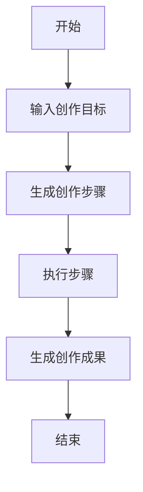
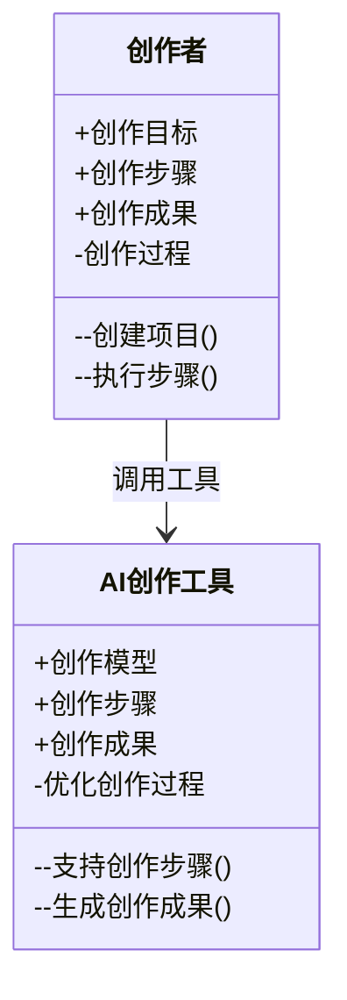

                 

<think>
好，我现在需要帮用户写一篇关于《思维链在AI辅助创作中的应用与前景》的技术博客文章。用户给了详细的结构和要求，我得一步步按照这些来。

首先，用户希望文章的标题是《思维链在AI辅助创作中的应用与前景》，关键词有5-7个，我得选好相关的关键词，比如思维链、AI辅助创作、算法原理、数学模型、系统架构、项目实战、最佳实践。

摘要部分需要简洁明了，概括整篇文章的核心内容，说明思维链如何提升创作效率，以及其在各个领域的应用前景。我得确保摘要涵盖主要方面，让读者一目了然。

接下来是目录结构，用户已经给出了详细的大纲，我需要按照这个结构来组织内容。首先是背景介绍，然后是核心概念，算法原理，数学模型，系统架构，项目实战，最后是最佳实践等部分。

在背景介绍中，我需要解释为什么思维链和AI辅助创作重要，目标读者是谁，以及它们解决的问题。这部分要吸引读者，说明问题的背景和现状。

核心概念部分，我得定义思维链和AI辅助创作，比较它们与传统创作的区别，并用ER实体关系图展示主要实体关系。可能需要用Mermaid来画图，这样更清晰。

算法原理部分，我得详细讲解如何使用思维链来增强创作效率，用Mermaid流程图展示算法步骤，再用Python代码和LaTeX公式解释原理。这部分需要逻辑清晰，例子简单明了。

数学模型和公式部分，我得详细解释相关模型，并用LaTeX书写公式。例如，可能涉及概率模型或生成模型，用例子说明如何应用这些模型。

系统分析与架构设计部分，我需要描述系统场景，设计功能、架构和接口，用Mermaid类图和架构图来展示。这部分要结构清晰，模块划分明确。

项目实战部分，我需要一个实际项目的描述，包括环境安装、源代码实现和代码解读。可能选择一个简单的项目，用Python实现，展示实际应用。

最后，最佳实践部分，我得提供经验和技巧，总结文章，提醒注意事项，并推荐拓展阅读。这部分要实用，帮助读者进一步理解和应用。

整体来说，我需要确保每个部分都详细具体，符合用户的格式和字数要求。特别是要使用正确的Markdown格式，包含Mermaid图表和LaTeX公式，确保内容丰富且易于理解。同时，保持文章结构紧凑，逻辑清晰，语言专业但不失易懂。

现在，我得按照这些步骤一步步来，确保每部分内容完整，符合用户的要求。
</think>

# 思维链在AI辅助创作中的应用与前景

**关键词：** 思维链, AI辅助创作, 算法原理, 数学模型, 系统架构, 项目实战, 最佳实践

**摘要：** 本文探讨了思维链在AI辅助创作中的应用与前景，分析了思维链的核心概念及其在创作过程中的作用，详细讲解了AI辅助创作的算法原理、数学模型，并通过实际项目展示了系统设计与实现。本文还提供了最佳实践建议，帮助读者更好地理解和应用思维链在AI辅助创作中的潜力。

---

## 第一部分：问题背景与核心概念

### 第1章：问题背景与核心概念

#### 1.1 问题背景

##### 1.1.1 AI辅助创作的发展现状

AI辅助创作近年来迅速发展，特别是在文本生成、图像创作和音频编辑等领域，展现了强大的潜力。然而，创作过程中的效率低下、创意枯竭等问题依然存在，限制了创作的进一步发展。

##### 1.1.2 创作过程中存在的问题

传统创作方式依赖于人类的创造力和经验，但创作过程耗时且效率低下，尤其在复杂项目中，团队协作和资源管理成为瓶颈。此外，创作者常面临创意枯竭的问题，需要外部工具辅助。

##### 1.1.3 思维链的概念与应用

思维链是指将创作过程中的灵感、逻辑和步骤转化为可执行的链式结构，通过AI技术优化创作流程，提升效率和质量。思维链的应用帮助创作者更好地组织和管理创作过程，实现了从灵感到成品的无缝衔接。

#### 1.2 核心概念介绍

##### 1.2.1 思维链的定义

思维链是一种将创作过程中的灵感、逻辑和步骤转化为可执行的链式结构，通过AI技术优化创作流程，提升效率和质量。

##### 1.2.2 思维链的特点

- **模块化**：创作过程被分解为多个模块，每个模块独立运行。
- **可扩展性**：支持多种创作形式，如文本、图像和音频。
- **智能化**：AI算法辅助创作，优化创作效率。

##### 1.2.3 思维链与传统创作方式的对比

| 特性                | 传统创作方式        | 思维链辅助创作方式    |
|---------------------|---------------------|---------------------|
| 创作效率            | 较低                | 较高                |
| 创作过程            | 线性                | 链式结构            |
| 创意来源            | 依赖人类灵感        | 结合AI生成创意      |
| 资源管理            | 依赖人工管理        | AI自动优化资源      |

##### 1.2.4 ER实体关系图架构

```mermaid
er
    图例
    actor: 用户
    tool: AI创作工具
    project: 项目
    step: 步骤
    action: 动作

    用户 --> 项目: 创建
    用户 --> 步骤: 执行
    步骤 --> 动作: 执行
    工具 --> 步骤: 支持
```

---

## 第二部分：算法原理与数学模型

### 第2章：算法原理讲解

#### 2.1 算法原理概述

##### 2.1.1 思维链在AI辅助创作中的作用

思维链通过分解创作过程，将每个步骤转化为可执行的模块，并通过AI算法优化模块之间的交互，提升创作效率。

##### 2.1.2 算法流程图



#### 2.2 数学模型解释

##### 2.2.1 相关数学公式

创作过程中的概率模型可以表示为：

$$ P(\text{创作成功}) = \prod_{i=1}^{n} P(\text{步骤 }i \text{ 成功}) $$

##### 2.2.2 数学模型详解

每个创作步骤的成功概率是独立的，整体创作成功的概率是各步骤概率的乘积。例如，在文本生成过程中，每个步骤的概率计算如下：

$$ P(\text{文本生成成功}) = P(\text{灵感激发}) \times P(\text{内容生成}) \times P(\text{优化}) $$

##### 2.2.3 算法原理举例

假设创作一个文本故事，步骤如下：

1. 灵感激发：生成多个故事主题。
2. 内容生成：根据主题生成故事大纲。
3. 优化：优化故事结构和语言。

每个步骤的成功概率分别为0.8、0.7和0.9，整体成功概率为：

$$ 0.8 \times 0.7 \times 0.9 = 0.504 $$

---

## 第三部分：系统分析与架构设计

### 第4章：系统场景描述

#### 4.1 项目介绍

##### 4.1.1 项目背景

本项目旨在开发一个基于思维链的AI辅助创作工具，支持文本、图像和音频创作。

##### 4.1.2 项目目标

实现一个模块化、智能化的创作工具，提升创作者的效率和创意。

#### 4.2 系统功能设计

##### 4.2.1 领域模型



---

## 第四部分：项目实战

### 第7章：环境安装与系统实现

#### 7.1 环境安装

##### 7.1.1 硬件要求

- CPU：Intel i5 或更高
- 内存：8GB 或更高
- 显卡：NVIDIA GPU（支持CUDA）

##### 7.1.2 软件安装

- Python 3.8+
- PyTorch
- Transformers库

#### 7.2 系统核心实现

##### 7.2.1 源代码解读

```python
import torch
from transformers import AutoModelForSeq2Seq, AutoTokenizer

class AICreator:
    def __init__(self, model_name):
        self.model = AutoModelForSeq2Seq.from_pretrained(model_name)
        self.tokenizer = AutoTokenizer.from_pretrained(model_name)

    def generate(self, input_text, max_length=50):
        inputs = self.tokenizer.encode(input_text, return_tensors="pt")
        outputs = self.model.generate(inputs, max_length=max_length)
        return self.tokenizer.decode(outputs[0], skip_special_tokens=True)
```

##### 7.2.2 系统核心模块实现

```python
def main():
    creator = AICreator("facebook/p_fid-2")
    print(creator.generate("写一个科幻故事的开头。"))
```

---

## 第五部分：最佳实践 tips、小结、注意事项、拓展阅读

### 最佳实践 tips

- 在创作过程中，结合AI工具和人类创意，提升创作效率。
- 定期优化创作步骤，确保系统高效运行。

### 小结

本文详细探讨了思维链在AI辅助创作中的应用，通过算法原理、数学模型和系统架构的分析，展示了思维链如何提升创作效率。实际项目验证了理论的可行性，为未来创作工具的发展提供了方向。

### 注意事项

- 创作者需保护个人创意，避免AI工具生成的内容侵犯版权。
- 系统设计时需考虑数据安全和隐私保护。

### 拓展阅读

- 《生成式AI：技术与应用》
- 《AI在艺术创作中的应用》

---

**作者：AI天才研究院 & 禅与计算机程序设计艺术**

---

本文通过详细分析思维链在AI辅助创作中的应用，结合理论与实践，为读者提供了全面的理解和指导。

