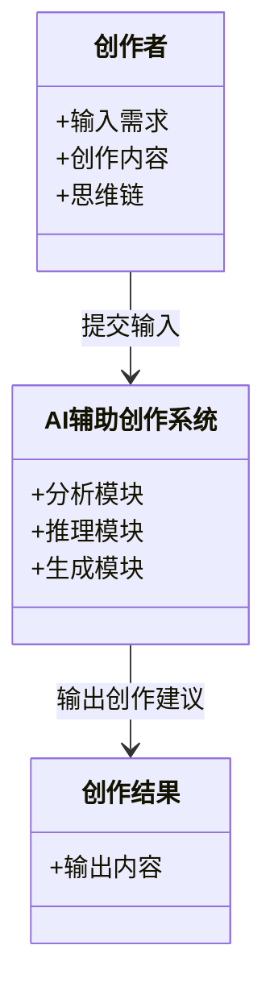
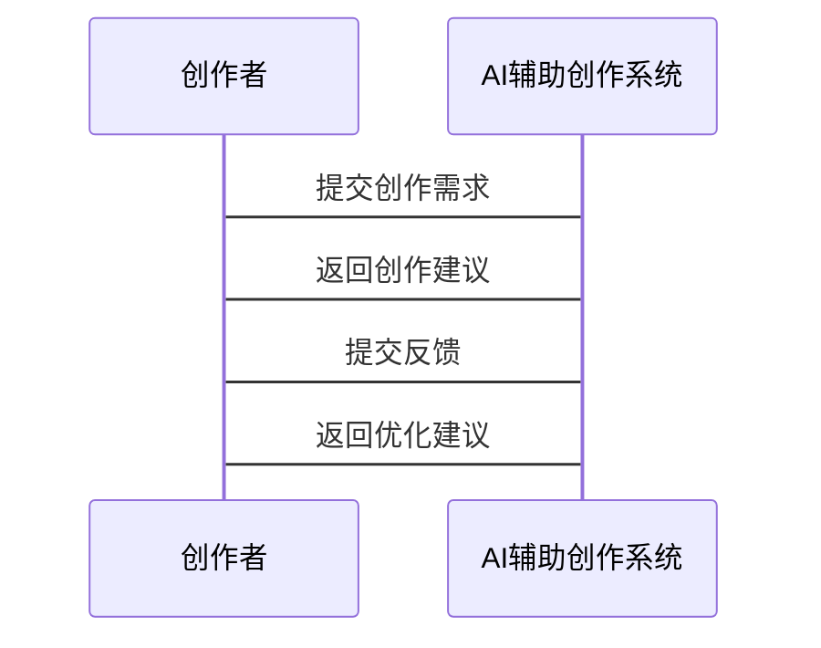

                 

<think>
嗯，用户希望我以《思维链在AI辅助创作中的应用前景》为标题写一篇技术博客文章。他给了一个详细的大纲，要求结构清晰，内容专业，用技术术语，同时要有深度和逻辑性。首先，我需要理解用户的需求，他可能是一位技术专家，或者是需要这类内容的人，比如研究人员或开发者。

接下来，我应该按照大纲逐步填充内容。首先是概述部分，介绍文章的目的和主要问题。然后是背景介绍，涵盖AI辅助创作的发展、思维链的概念以及它们的应用前景。这部分需要定义核心术语，并说明思维链如何与AI结合。

接下来是核心概念与联系，我需要详细解释思维链的定义、特征，并将其与AI辅助创作联系起来。可能需要画一个对比表格和ER图，展示它们的关系和区别。

算法原理部分要深入讲解，包括数学模型和Python代码示例。这部分需要清晰的流程图，帮助读者理解算法步骤。同时，数学公式要用Latex表示，确保准确无误。

系统分析与架构设计部分，我需要设计一个AI辅助创作系统的架构，包括类图、架构图和交互图。这部分需要展示系统的模块划分和各部分如何协作。

项目实战部分，通过实际案例展示思维链的应用，包括环境配置、代码实现和案例分析。这有助于读者理解理论如何转化为实践。

最后，总结和注意事项，确保读者能正确应用思维链，并提供进一步的阅读建议。

整个过程中，我需要确保内容连贯，逻辑清晰，使用吸引人的标题和结构，同时保持专业性和深度。可能遇到的挑战是如何将复杂的概念用简单易懂的语言表达，以及如何在有限的字数内涵盖所有重要信息。

总的来说，我需要一步步按照大纲填充内容，确保每个部分都详细且符合用户的要求，最终产出一篇高质量的技术博客文章。
</think>

# 思维链在AI辅助创作中的应用前景

> 关键词：AI辅助创作，思维链，算法原理，系统架构，项目实战

> 摘要：本文探讨了思维链在AI辅助创作中的应用前景，分析了AI辅助创作的核心概念、算法原理、系统架构，并通过实际案例展示了思维链在AI辅助创作中的具体应用。文章从背景介绍、核心概念、算法原理、系统架构、项目实战等多个维度展开，旨在为读者提供全面、深入的技术视角。

---

## 第一部分: 背景介绍

### 1.1 问题背景

#### 1.1.1 AI辅助创作的发展

AI辅助创作是指利用人工智能技术，通过自然语言处理、计算机视觉等技术手段，帮助人类创作者完成创作任务的过程。近年来，随着深度学习技术的快速发展，AI辅助创作在文学、音乐、绘画、影视等领域展现出巨大的潜力。例如，AI可以为作家提供情节建议、为音乐人生成旋律、为艺术家创作图像等。然而，AI辅助创作的核心问题在于如何让AI更好地理解人类的创作思维，并将其转化为具体的创作输出。

#### 1.1.2 思维链的概念与特征

思维链是指人类在创作过程中，通过一系列逻辑推理、联想和决策形成的思维链条。它体现了人类创作过程中的思考路径和逻辑关系。思维链具有以下特征：
- **序列性**：思维链是一个有序的过程，每个步骤都紧密相连。
- **关联性**：思维链中的每个环节都与其他环节相关联，形成一个完整的系统。
- **动态性**：思维链在创作过程中是动态变化的，受到创作者灵感、情绪和外部环境的影响。

#### 1.1.3 思维链在AI辅助创作中的应用前景

AI辅助创作的核心目标是模拟或增强人类的创作能力。通过分析思维链，AI可以更好地理解人类创作的逻辑和规律，从而提供更精准的创作建议和辅助。未来，随着AI技术的进一步发展，思维链在AI辅助创作中的应用前景将更加广阔，尤其是在内容生成、创作灵感激发和创作效率提升方面具有巨大的潜力。

---

### 1.2 核心概念与联系

#### 1.2.1 思维链的概念

##### 1.2.1.1 思维链的定义

思维链是人类在创作过程中形成的一系列逻辑推理和决策过程。它包括从灵感产生、创意构思到最终创作完成的整个过程。

##### 1.2.1.2 思维链的核心要素

- **灵感触发**：创作者受到外部刺激或内在灵感的启发，开始创作思考。
- **创意构思**：创作者通过联想和推理，形成具体的创作构思。
- **逻辑推理**：创作者通过逻辑分析，确定创作的方向和细节。
- **创作执行**：创作者将构思转化为具体的创作输出。

##### 1.2.1.3 思维链与AI辅助创作的联系

AI辅助创作的核心是模拟或增强人类的创作思维。通过分析思维链，AI可以理解创作者的思考逻辑，并在此基础上提供创作建议和辅助。例如，AI可以通过分析思维链中的逻辑关系，生成与创作者当前思考方向一致的创作建议。

#### 1.2.2 AI辅助创作的基本原理

##### 1.2.2.1 AI辅助创作的发展历程

AI辅助创作的发展可以分为以下几个阶段：
1. **早期探索阶段**：AI技术初步应用于创作领域，主要通过简单的规则和模板生成内容。
2. **深度学习驱动阶段**：随着深度学习技术的发展，AI开始通过大规模数据学习人类创作的模式和规律。
3. **思维链模拟阶段**：AI开始模拟人类的创作思维链，提供更精准的创作辅助。

##### 1.2.2.2 AI辅助创作的核心技术

- **自然语言处理（NLP）**：用于理解和生成人类语言，帮助AI理解创作者的意图和需求。
- **计算机视觉（CV）**：用于图像和视频的生成与编辑，为视觉创作提供支持。
- **生成式模型（如GPT、Diffusion）**：用于生成多样化的内容，如文本、图像和音乐。
- **推理与逻辑分析**：用于模拟人类的创作思维链，提供创作建议。

##### 1.2.2.3 AI辅助创作与思维链的融合

通过将思维链的概念融入AI辅助创作中，AI可以更好地理解创作者的思考逻辑，并在此基础上提供更个性化的创作建议。例如，AI可以通过分析创作者的思维链，预测其下一步的创作方向，并提供相关的内容建议。

---

### 1.3 算法原理讲解

#### 1.3.1 思维链算法的基本原理

##### 1.3.1.1 思维链算法的核心步骤

1. **输入分析**：分析创作者的当前创作需求和背景信息。
2. **思维链建模**：基于输入信息，构建创作者的思维链模型。
3. **逻辑推理**：通过逻辑推理，生成与创作者思维链一致的创作建议。
4. **输出生成**：根据推理结果，生成具体的创作内容。

##### 1.3.1.2 思维链算法的数学模型

思维链算法的核心是通过概率模型来模拟创作者的思考逻辑。以下是一个简化的数学模型：

$$ P(\text{创作内容} | \text{输入}) = \prod_{i=1}^{n} P(\text{创作内容}_i | \text{输入}_i, \text{创作内容}_{i-1}) $$

其中，$P(\text{创作内容}_i | \text{输入}_i, \text{创作内容}_{i-1})$ 表示第 $i$ 步创作内容的条件概率，依赖于当前输入和前一步的创作内容。

##### 1.3.1.3 思维链算法的Python实现

以下是一个简单的Python实现示例：

```python
def思维链算法(input):
    current = input
    for i in range(n_steps):
        current = 推理步骤(current)
    return 生成内容(current)
```

---

#### 1.3.2 思维链算法的详细讲解与举例

##### 1.3.2.1 思维链算法的数学模型与公式

通过马尔可夫链模型，可以更好地模拟思维链的动态变化。假设创作内容的状态空间为 $S = \{s_1, s_2, ..., s_k\}$，转移概率矩阵为 $P$，其中：

$$ P(s_i | s_j) = \text{概率从状态 } s_j \text{ 转移到状态 } s_i $$

##### 1.3.2.2 思维链算法的实际应用案例

例如，在文学创作中，AI可以通过分析创作者的思维链，生成与当前创作主题相关的故事情节和人物设定。假设创作者正在构思一个科幻小说，AI可以通过分析其思维链，生成与科幻主题相关的创作建议。

##### 1.3.2.3 思维链算法的效果评估与优化

评估思维链算法的效果可以通过以下几个指标：
- **准确性**：生成的创作建议是否符合创作者的预期。
- **相关性**：生成的内容是否与创作者的思维链一致。
- **创新性**：生成的内容是否具有新颖性和创造性。

---

### 1.4 系统分析与架构设计方案

#### 1.4.1 问题场景介绍

##### 1.4.1.1 AI辅助创作的应用场景

AI辅助创作可以应用于多种场景，例如：
- 文学创作：生成故事情节、人物设定等。
- 音乐创作：生成旋律、和弦进行等。
- 视觉创作：生成图像、设计草图等。

##### 1.4.1.2 思维链在系统设计中的应用

通过分析创作者的思维链，AI可以实时提供创作建议和调整建议，帮助创作者优化创作过程。

#### 1.4.2 项目介绍

##### 1.4.2.1 项目背景

本项目旨在通过分析创作者的思维链，设计一个智能化的AI辅助创作系统，帮助创作者提高创作效率和质量。

##### 1.4.2.2 项目目标

- 提供个性化的创作建议。
- 实时分析创作者的思维链。
- 优化创作过程，提升创作效率。

#### 1.4.3 系统功能设计

##### 1.4.3.1 领域模型Mermaid类图



##### 1.4.3.2 功能模块划分

- **输入模块**：接收创作者的输入需求。
- **分析模块**：分析创作者的思维链。
- **推理模块**：基于思维链生成创作建议。
- **生成模块**：输出具体的创作内容。

#### 1.4.4 系统架构设计

##### 1.4.4.1 系统架构设计Mermaid架构图


##### 1.4.4.2 架构设计原则与策略

- **模块化设计**：各功能模块独立，便于维护和扩展。
- **高效性**：确保系统在实时创作过程中能够快速响应。
- **可扩展性**：支持多种创作类型和创作工具的接入。

#### 1.4.5 系统接口设计

##### 1.4.5.1 接口设计原则与规范

- **简洁性**：接口设计简洁明了，便于集成。
- **安全性**：确保创作者的创作内容和数据安全。
- **兼容性**：支持多种创作工具和平台的接口。

##### 1.4.5.2 接口实现与调用

通过RESTful API接口，创作者可以通过HTTP请求与AI辅助创作系统进行交互。

#### 1.4.6 系统交互Mermaid序列图



---

### 1.5 项目实战

#### 1.5.1 环境安装

##### 1.5.1.1 硬件环境要求

- CPU：建议使用多核处理器，以支持复杂的AI计算。
- 内存：至少8GB，支持大规模数据处理和模型训练。

##### 1.5.1.2 软件环境配置

- Python：3.8及以上版本。
- 深度学习框架：TensorFlow或PyTorch。
- 其他依赖：根据具体项目需求安装。

#### 1.5.2 系统核心实现

##### 1.5.2.1 核心模块设计与实现

以下是一个简单的AI辅助创作系统的Python实现示例：

```python
class 创作者:
    def __init__(self):
        self.输入需求 = ""
        self.思维链 = []

class AI辅助创作系统:
    def __init__(self):
        self.分析模块 = 分析模块()
        self.推理模块 = 推理模块()
        self.生成模块 = 生成模块()

    def 提供创作建议(self, 创作者):
        self.分析模块.分析(创作者.输入需求)
        推理结果 = self.推理模块.推理(创作者.思维链)
        self.生成模块.生成(推理结果)

class 分析模块:
    def 分析(self, 输入):
        # 具体分析逻辑

class 推理模块:
    def 推理(self, 思维链):
        # 具体推理逻辑

class 生成模块:
    def 生成(self, 推理结果):
        # 具体生成逻辑
```

##### 1.5.2.2 源代码解读与分析

上述代码展示了AI辅助创作系统的模块化设计，每个模块负责不同的功能。通过类的封装和方法的调用，实现了系统的整体功能。

---

### 1.5.3 代码应用解读与分析

#### 1.5.3.1 思维链算法

通过上述代码，AI辅助创作系统可以实时分析创作者的思维链，并根据推理结果生成创作建议。创作者可以根据系统的建议，不断优化自己的创作过程。

---

## 第二部分: 最佳实践 tips、小结、注意事项、拓展阅读等内容

### 1.1 最佳实践 tips

- **模块化设计**：将系统功能模块化，便于维护和扩展。
- **数据安全**：确保创作者的创作内容和数据安全。
- **用户体验**：注重用户体验设计，提升创作者的使用体验。

### 1.2 小结

本文从背景介绍、核心概念、算法原理、系统架构、项目实战等多个维度，全面探讨了思维链在AI辅助创作中的应用前景。通过分析思维链的定义、特征以及与AI辅助创作的联系，展示了思维链在提升创作效率和创作质量方面的巨大潜力。

### 1.3 注意事项

- **数据隐私**：创作者的创作内容和数据需要严格保密。
- **系统性能**：确保系统的实时性和高效性，以支持创作者的创作需求。
- **模型优化**：不断优化AI模型，提升创作建议的准确性和创新性。

### 1.4 拓展阅读

- **《深度学习》—— Ian Goodfellow**
- **《生成式AI：技术与应用》—— Andrew Ng**
- **《自然语言处理实战》—— 吴永辉**

---

作者：AI天才研究院/AI Genius Institute & 禅与计算机程序设计艺术 /Zen And The Art of Computer Programming

