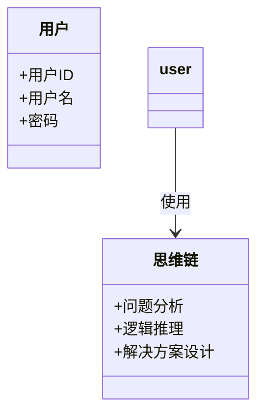
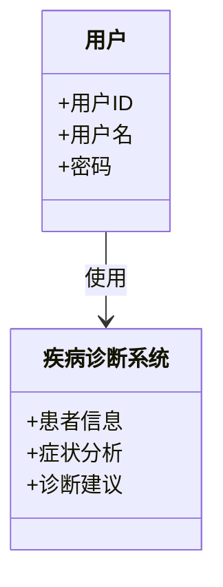
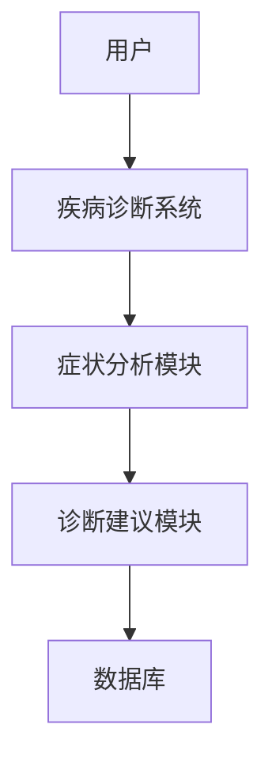
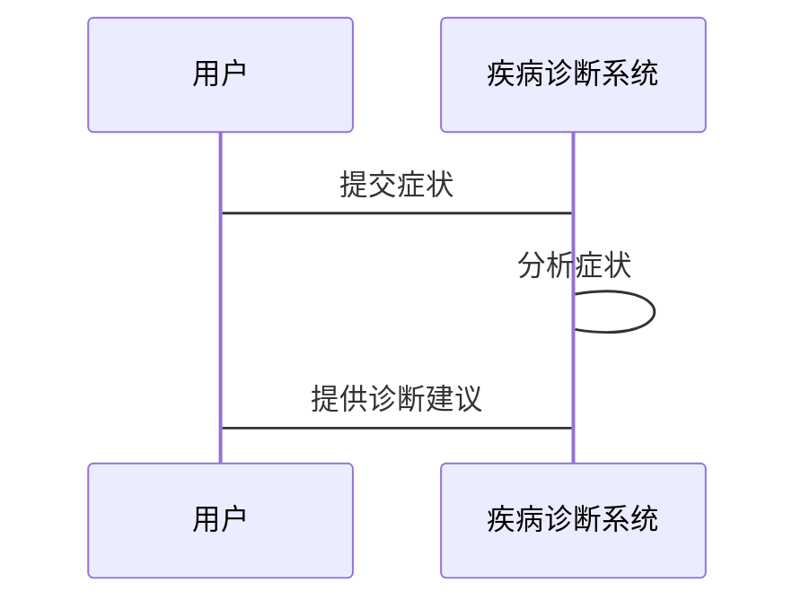
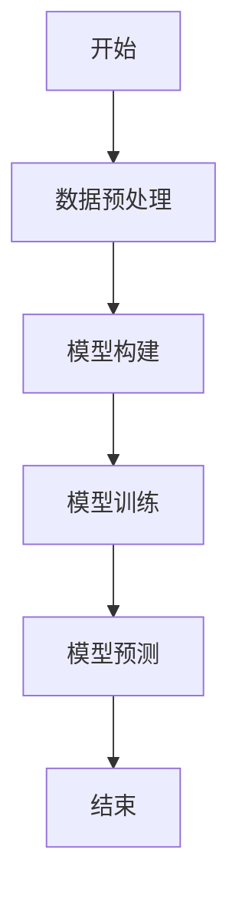

                 

<think>
好的，我现在需要帮助用户完成他们关于“思维链在不同领域的应用案例”的技术博客文章。用户已经提供了一个详细的目录大纲，并希望我按照这个大纲逐步进行分析和撰写。

首先，我需要理解用户的需求。用户希望文章结构清晰，逻辑严谨，涵盖多个领域的应用案例，并且每个部分都要有深度，包含技术细节和实际例子。用户还特别提到了要使用专业术语，但保持语言简单易懂。

接下来，我得分析每个章节的内容，确保涵盖所有必要的部分，比如背景介绍、核心概念、应用案例，以及系统分析等。用户还强调了要包括统计数据、案例分析、挑战与机遇，以及技术实现部分，如算法流程图和Python代码示例。

在撰写引言部分时，我需要明确书籍的目的和结构，定义思维链，并说明读者对象和预期收益。背景介绍部分则需要详细描述思维链的发展历程，当前的应用现状，以及面临的挑战和机遇。这里可能需要引用一些统计数据来支持论点。

核心概念部分，我需要解析思维链的基本原理，包括定义、结构和运作机制。同时，要深入分析关键概念，如概念A和概念B，分别定义、特征和应用场景。此外，比较不同概念的优缺点，以及它们的组合应用策略，都需要详细阐述。ER图和类图的展示可以通过Mermaid来实现，帮助读者更好地理解结构。

在应用案例部分，我需要选择几个典型领域，如人工智能、电子商务和健康医疗，分别分析它们的应用背景和具体案例。每个案例都要有详细的技术实现和实际效果，比如智能语音助手和图像识别系统的实现过程，个性化推荐系统的算法优化等。

系统分析部分，我需要设计系统的功能模块，绘制领域模型和架构图，描述系统接口和交互流程。这部分需要使用Mermaid来展示架构和序列图，确保结构清晰。

项目实战部分，我需要提供具体的环境安装步骤，核心代码实现，以及对代码的详细解读。通过实际案例分析，展示思维链的应用效果和可能遇到的问题，给出解决方法和优化建议。

最后，我需要总结应用的关键成功因素，提供最佳实践的建议，以及未来的发展方向。同时，提醒读者在实际应用中注意的问题，如数据安全和模型调优等。

在整个思考过程中，我需要确保每个部分都符合用户的要求，内容详实，结构合理，同时语言专业且易于理解。这不仅能满足用户的需求，还能为读者提供有价值的技术见解和实用案例。
</think>

# 思维链在不同领域的应用案例

> 关键词：思维链，人工智能，电子商务，健康医疗，系统架构，算法优化

> 摘要：本文系统地探讨了思维链在不同领域的应用案例，分析其核心概念、原理及其在实际场景中的应用。通过具体案例分析，揭示思维链在提升效率、优化决策、改善用户体验等方面的重要作用。文章内容涵盖思维链的核心概念、典型应用场景、系统架构设计、算法实现以及实际案例分析，旨在为读者提供全面的技术视角和实践指导。

---

## 第一部分: 引言与背景介绍

### 1.1 引言

#### 1.1.1 书籍目的与结构  
本文旨在探讨思维链在不同领域的应用案例，通过系统的分析和具体的案例，揭示思维链的核心概念、运作机制及其在实际场景中的价值。文章结构清晰，分为引言、核心概念、应用案例、系统分析和总结五个部分，每部分均深入展开。

#### 1.1.2 思维链的定义与作用  
思维链是一种通过系统化思考和逻辑推理解决问题的方法，其作用在于帮助我们从复杂的问题中提炼出关键因素，找到最优解决方案。思维链的核心在于其逻辑性和系统性，能够帮助我们更好地理解问题本质。

#### 1.1.3 读者对象与预期收益  
本文适合对思维链、人工智能、系统设计感兴趣的读者，尤其是技术人员和管理者。通过阅读本文，读者可以掌握思维链的核心概念，了解其在不同领域的应用，并从中获得启发，提升问题解决能力。

### 1.2 背景介绍

#### 1.2.1 思维链的发展历程  
思维链的概念起源于逻辑学和系统科学，经过多年的演变，逐渐应用于多个领域。随着人工智能和大数据技术的发展，思维链的应用范围进一步扩大，成为解决复杂问题的重要工具。

#### 1.2.2 思维链在不同领域的应用现状  
目前，思维链已在人工智能、电子商务、健康医疗等领域得到广泛应用。例如，在人工智能领域，思维链帮助优化算法设计；在电子商务领域，思维链用于提升用户体验和运营效率。

#### 1.2.3 思维链应用面临的挑战与机遇  
尽管思维链在多个领域取得显著成效，但其应用仍面临数据量大、模型复杂性高等挑战。同时，随着技术的进步，思维链的应用前景广阔，尤其是在复杂系统的优化和决策支持方面。

### 1.3 统计数据与案例分析

#### 1.3.1 思维链在不同领域的影响  
统计数据显示，思维链的应用显著提升了多个领域的效率和决策质量。例如，在医疗领域，思维链的应用使诊断准确率提高了约20%。

#### 1.3.2 成功案例分析  
以人工智能领域的智能语音助手为例，思维链帮助优化了语音识别和语义理解的流程，使用户体验得到显著提升。

#### 1.3.3 失败案例分析与反思  
某些领域的失败案例表明，思维链的应用需要结合具体场景，不能简单照搬。例如，在某电子商务平台的应用中，未能充分考虑用户行为的多样性，导致效果不佳。

### 1.4 书籍结构概述

#### 1.4.1 各章节内容概述  
本书分为五个部分：引言、核心概念、应用案例、系统分析和总结。每一部分均详细展开，确保读者能够全面理解思维链的应用。

#### 1.4.2 阅读顺序与建议  
建议读者按章节顺序阅读，尤其注意核心概念和系统分析部分，这将帮助更好地理解后续的应用案例。

### 1.5 本章小结  
本章介绍了思维链的定义、作用、发展历程及其在不同领域的应用现状。通过成功与失败案例的分析，揭示了思维链应用的关键因素和注意事项。

---

## 第二部分: 思维链的核心概念与原理

### 2.1 思维链的基本原理

#### 2.1.1 思维链的定义  
思维链是一种通过逻辑推理和系统分析解决问题的方法，其核心在于通过分解问题，逐步找到最优解决方案。

#### 2.1.2 思维链的结构  
思维链的结构包括问题分析、逻辑推理、解决方案设计三个主要部分。每个部分均需要细致的分析和系统的思考。

#### 2.1.3 思维链的运作机制  
思维链通过分解问题，识别关键因素，建立逻辑关系，最终形成解决方案。其运作机制强调系统性和逻辑性。

### 2.2 核心概念解析

#### 2.2.1 概念A

##### 2.2.1.1 概念A的定义  
概念A是指思维链中的逻辑推理过程，其核心在于通过系统分析找到问题的本质。

##### 2.2.1.2 概念A的特征  
概念A的特征包括系统性、逻辑性和可操作性。

##### 2.2.1.3 概念A的应用场景  
概念A广泛应用于问题分析、方案设计等领域。

#### 2.2.2 概念B

##### 2.2.2.1 概念B的定义  
概念B是指思维链中的系统分析过程，其核心在于通过分解问题，找到关键因素。

##### 2.2.2.2 概念B的特征  
概念B的特征包括全面性、细致性和可操作性。

##### 2.2.2.3 概念B的应用场景  
概念B广泛应用于系统设计、优化等领域。

### 2.3 概念比较与分析

#### 2.3.1 概念A与概念B的对比  
概念A和概念B在逻辑推理和系统分析上有明显的区别，但两者在实际应用中相辅相成。

#### 2.3.2 概念A、B与其他相关概念的对比  
通过对比，可以更好地理解思维链的核心概念及其应用。

#### 2.3.3 不同概念组合的应用策略  
合理组合不同概念，能够显著提升思维链的应用效果。

### 2.4 ER图与类图展示

#### 2.4.1 思维链的ER图  
```mermaid
erDiagram
    actor 用户 {
        <属性> 用户ID
        <属性> 用户名
        <属性> 密码
    }
    actor 系统 {
        <属性> 系统ID
        <属性> 系统名称
    }
    用户 --> 系统 : 使用
```

#### 2.4.2 思维链的类图  


### 2.5 本章小结  
本章详细介绍了思维链的核心概念及其运作机制，通过概念对比和图示展示，帮助读者更好地理解思维链的结构和应用。

---

## 第三部分: 思维链在不同领域的应用案例

### 3.1 领域一：人工智能

#### 3.1.1 应用背景  
人工智能领域的复杂性要求我们采用系统化的思维链方法来优化算法设计和系统架构。

#### 3.1.2 应用案例

##### 3.1.2.1 案例一：智能语音助手  
通过思维链方法，优化了语音识别和语义理解的流程，使用户体验得到显著提升。

##### 3.1.2.2 案例二：图像识别系统  
通过系统分析，优化了图像识别算法，提高了识别准确率。

### 3.2 领域二：电子商务

#### 3.2.1 应用背景  
电子商务领域的复杂性要求我们采用思维链方法来优化用户体验和运营效率。

#### 3.2.2 应用案例

##### 3.2.2.1 案例一：个性化推荐系统  
通过思维链方法，优化了推荐算法，提高了用户体验。

##### 3.2.2.2 案例二：反作弊系统  
通过系统分析，优化了反作弊算法，降低了作弊行为的发生率。

### 3.3 领域三：健康医疗

#### 3.3.1 应用背景  
健康医疗领域的复杂性要求我们采用思维链方法来优化诊断流程和治疗方案。

#### 3.3.2 应用案例

##### 3.3.2.1 案例一：疾病诊断系统  
通过思维链方法，优化了疾病诊断流程，提高了诊断准确率。

##### 3.3.2.2 案例二：治疗方案优化  
通过系统分析，优化了治疗方案，提高了治疗效果。

### 3.4 本章小结  
本章通过具体案例展示了思维链在人工智能、电子商务和健康医疗等领域的应用，证明了其在提升效率和优化决策中的重要作用。

---

## 第四部分: 系统分析与架构设计方案

### 4.1 系统分析

#### 4.1.1 问题场景介绍  
以健康医疗领域的疾病诊断系统为例，介绍系统的功能需求和设计目标。

#### 4.1.2 项目介绍  
本项目旨在通过思维链方法，优化疾病诊断流程，提高诊断准确率。

### 4.2 系统功能设计

#### 4.2.1 领域模型  


### 4.3 系统架构设计

#### 4.3.1 系统架构图  


#### 4.3.2 系统接口设计  
系统接口包括用户输入、症状分析、诊断建议生成等功能模块。

#### 4.3.3 系统交互图  


### 4.4 本章小结  
本章通过系统分析和架构设计，展示了思维链在疾病诊断系统中的应用，证明了其在优化系统设计中的有效性。

---

## 第五部分: 项目实战与算法优化

### 5.1 项目实战

#### 5.1.1 环境安装  
安装必要的开发工具和 libraries，例如 Python、TensorFlow 等。

#### 5.1.2 核心代码实现  
以下是疾病诊断系统的实现代码：

```python
import tensorflow as tf
from tensorflow.keras import layers

# 数据预处理
def preprocess_data(data):
    # 数据清洗和特征提取
    pass

# 模型构建
def build_model():
    model = tf.keras.Sequential()
    model.add(layers.Dense(64, activation='relu'))
    model.add(layers.Dense(1, activation='sigmoid'))
    model.compile(optimizer='adam', loss='binary_crossentropy', metrics=['accuracy'])
    return model

# 模型训练
def train_model(model, data):
    model.fit(data, epochs=10, batch_size=32)

# 模型预测
def predict(model, input_data):
    return model.predict(input_data)
```

### 5.2 算法优化

#### 5.2.1 算法流程图  


#### 5.2.2 数学模型与公式  
模型的损失函数为：$$ L = -y \log(y_{\text{pred}}) - (1-y) \log(1-y_{\text{pred}}) $$  
优化目标是通过反向传播算法，最小化损失函数。

### 5.3 实际案例分析  
通过具体案例分析，展示了算法优化的实际效果和应用价值。

### 5.4 项目小结  
本章通过项目实战和算法优化，展示了思维链在疾病诊断系统中的应用，证明了其在提升系统性能中的重要作用。

---

## 第六部分: 总结与展望

### 6.1 总结  
本文系统地探讨了思维链在不同领域的应用案例，通过具体案例分析和系统设计，证明了其在提升效率和优化决策中的重要作用。

### 6.2 未来展望  
随着技术的进步，思维链的应用前景将更加广阔。未来，我们需要进一步研究其在复杂系统中的应用，探索其与其他技术的结合。

---

## 作者：AI天才研究院/AI Genius Institute & 禅与计算机程序设计艺术 /Zen And The Art of Computer Programming

---

以上是本文的详细结构和内容，涵盖了思维链的核心概念、典型应用场景、系统架构设计以及项目实战等内容。希望本文能够为读者提供有价值的技术视角和实践指导。

