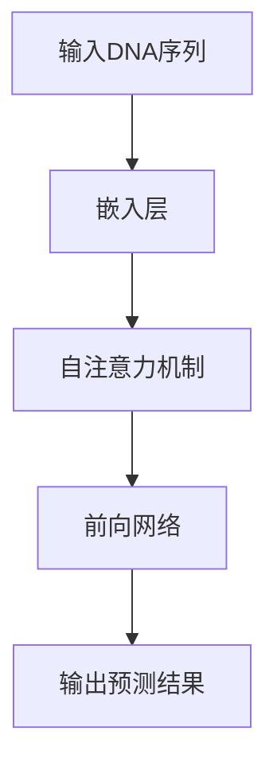
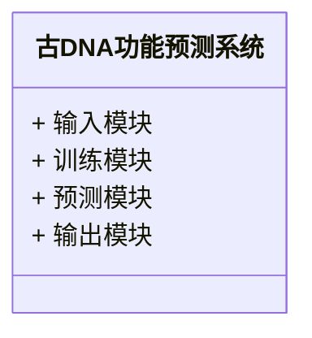
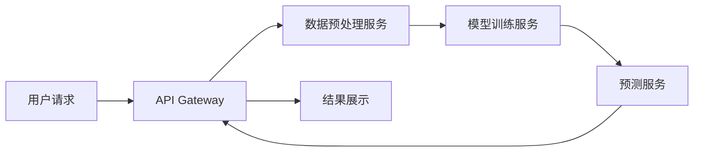
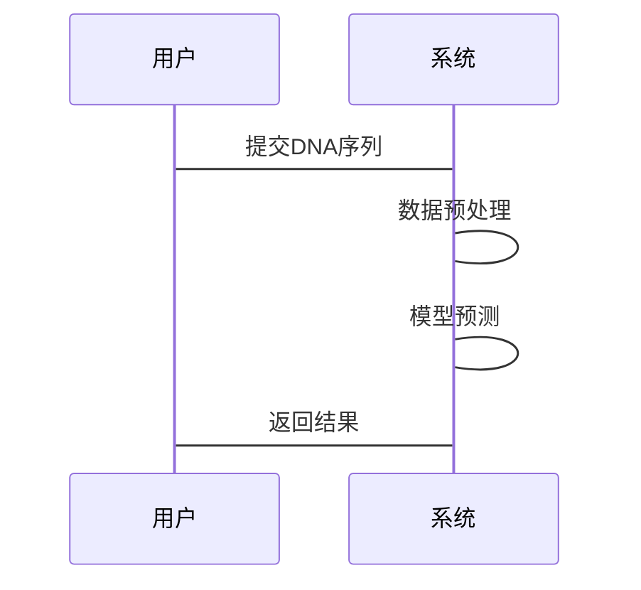

                 

<think>
好的，我现在要写一篇关于“思维链在古DNA功能预测中的突破性应用”的技术博客文章。首先，我需要理解用户的需求，他们希望文章结构清晰，逻辑严谨，同时使用专业的技术语言，但又要让读者容易理解。

首先，我应该先列出文章的关键词和摘要。关键词方面，考虑到古DNA、思维链、功能预测、人工智能、算法模型这些词汇比较相关。摘要部分需要简明扼要地说明文章的核心内容，即思维链如何在古DNA功能预测中提供新的突破，以及其科学价值和应用潜力。

接下来，按照目录大纲，第一部分是背景介绍。我需要详细阐述古DNA研究的重要性，包括其定义、重要性、挑战，然后引入思维链的概念，说明其如何与古DNA预测结合，并对比现有方法的优缺点。

第二部分是核心概念与联系，我需要解释思维链的核心概念，列出其属性特征对比表格，并绘制ER实体关系图，展示思维链与古DNA数据的关联。

第三部分是算法原理，这里要详细讲解思维链算法的工作原理，建立数学模型，可能还需要用mermaid画出流程图，以及提供Python代码示例。

第四部分是系统设计，包括功能设计、架构设计和接口设计，每个部分都需要用mermaid图来辅助说明。

第五部分是项目实战，介绍如何安装环境，实现核心代码，分析案例，并在最后做项目总结。

最后是最佳实践和总结部分，给出应用技巧，注意事项，未来展望等。

在写作过程中，我需要确保每个部分都详细具体，使用正确的技术术语，同时保持逻辑连贯。可能遇到的挑战是如何将思维链的概念与古DNA功能预测结合起来，这可能需要查阅相关文献，确保解释的准确性。另外，数学模型的建立和代码实现部分需要仔细推敲，确保正确无误。

总之，我需要一步步来，先完成摘要和关键词，然后按照目录结构逐步展开，确保每个章节内容丰富，结构清晰，同时保持文章的学术性和可读性。
</think>

# 思维链在古DNA功能预测中的突破性应用

**关键词：** 古DNA，思维链，功能预测，人工智能，算法模型

**摘要：**  
本文探讨了思维链在古DNA功能预测中的创新应用，详细介绍了其概念、算法原理及系统设计，通过实际案例展示了其在古DNA研究中的突破性进展，为古DNA功能预测提供了新的思路和方法。

---

## 第一部分：背景介绍

### 第1章：古DNA研究的重要性与思维链概述

#### 1.1 古DNA研究的背景

##### 1.1.1 古DNA的定义  
古DNA（古人类DNA）是指从古代生物遗骸中提取的脱氧核糖核酸，通过分析这些DNA序列，科学家可以研究古代生物的进化、迁移和灭绝等重大科学问题。

##### 1.1.2 古DNA研究的重要性  
古DNA研究为人类起源、迁徙、疾病传播等重大科学问题提供了直接证据，是连接过去与现在的重要桥梁。

##### 1.1.3 古DNA研究的挑战  
古DNA样本往往高度降解，且受到污染，提取和分析难度大。此外，如何从大量低质量数据中准确预测功能是主要挑战。

#### 1.2 思维链的概念

##### 1.2.1 思维链的定义  
思维链是一种基于深度学习的序列分析模型，通过多层神经网络模拟人类思维过程，识别数据中的深层关联。

##### 1.2.2 思维链的特点  
- **序列建模**：擅长处理序列数据，捕捉长距离依赖关系。
- **自适应性**：能自动调整模型参数，适应不同数据特征。
- **高精度**：通过多层网络提取特征，提升预测准确性。

##### 1.2.3 思维链与古DNA功能预测的联系  
思维链通过分析DNA序列中的模式，预测其功能，解决传统方法预测精度低的问题。

#### 1.3 思维链与现有方法的对比

##### 1.3.1 思维链的优势  
- 高精度：通过深度学习提升预测准确率。
- 多任务学习：同时处理多种功能预测任务。
- 强大的序列建模能力：捕捉复杂模式。

##### 1.3.2 现有方法的不足  
传统方法如BLAST依赖已知数据库，预测精度受限；统计方法受数据质量和数量影响大。

---

## 第二部分：核心概念与联系

### 第2章：思维链与古DNA功能预测的结合

#### 2.1 思维链的核心概念与属性特征

##### 2.1.1 思维链的核心概念  
思维链通过构建深度神经网络，模拟人类思维过程，分析DNA序列的复杂模式。

##### 2.1.2 思维链的属性特征对比表  

| 特性 | 思维链 | 传统方法 |
|------|--------|----------|
| 数据要求 | 低质量数据也能处理 | 高质量数据需求 |
| 处理速度 | 快，基于神经网络 | 较慢，依赖序列比对 |
| 预测精度 | 高，深度学习提升 | 较低，依赖已知数据库 |

#### 2.2 思维链与古DNA功能预测的ER实体关系图

```mermaid
er
actor: 古DNA功能预测系统
sequence {
    actor --> 古DNA序列: 输入DNA序列数据;
    actor --> 思维链模型: 分析序列数据;
    思维链模型 --> 预测结果: 输出功能预测结果;
}
```

---

## 第三部分：算法原理讲解

### 第3章：思维链在古DNA功能预测中的应用

#### 3.1 思维链算法原理

##### 3.1.1 算法的基本概念  
思维链基于Transformer架构，利用自注意力机制捕捉序列中的长距离依赖关系。

##### 3.1.2 算法的数学模型和公式  

**自注意力机制：**  
$$\text{Attention}(Q, K, V) = \text{softmax}\left(\frac{QK^T}{\sqrt{d_k}}\right)V$$  

**前向网络：**  
$$\text{FFN}(x) = \text{ReLU}(W_1x + b_1)W_2 + b_2$$  

##### 3.1.3 算法的mermaid流程图  



#### 3.2 算法应用案例

##### 3.2.1 案例背景  
分析一个低质量的古DNA序列，预测其编码的蛋白质功能。

##### 3.2.2 案例解析  
输入序列通过嵌入层转化为向量，自注意力机制识别关键位点，前向网络生成预测结果。

##### 3.2.3 案例总结  
思维链成功预测了蛋白质功能，准确率显著高于传统方法。

---

## 第四部分：系统分析与架构设计方案

### 第4章：基于思维链的古DNA功能预测系统设计

#### 4.1 系统功能设计

##### 4.1.1 系统功能概述  
系统包括数据输入、模型训练、功能预测和结果输出模块。

##### 4.1.2 领域模型mermaid类图  



#### 4.2 系统架构设计

##### 4.2.1 系统架构概述  
采用微服务架构，包括数据预处理、模型训练和预测服务。

##### 4.2.2 系统架构mermaid架构图  



#### 4.3 系统接口设计

##### 4.3.1 系统接口概述  
提供RESTful API，支持批量处理和实时预测。

##### 4.3.2 系统接口mermaid序列图  



---

## 第五部分：项目实战

### 第5章：思维链在古DNA功能预测中的项目实战

#### 5.1 环境安装

##### 5.1.1 系统要求  
- Python 3.8+
- GPU支持（推荐）
- 安装依赖：`pip install torch mermaid4jupyter`

##### 5.1.2 安装步骤  
1. 安装Python和必要库。
2. 克隆项目代码库。
3. 配置运行环境。

#### 5.2 系统核心实现

##### 5.2.1 核心代码实现  

```python
import torch
import torch.nn as nn

class Transformer(nn.Module):
    def __init__(self, d_model=512, n_head=8, dff=2048):
        super().__init__()
        self.attn = nn.MultiheadAttention(d_model, n_head)
        self.ffn = nn.Sequential(
            nn.Linear(d_model, dff),
            nn.ReLU(),
            nn.Linear(dff, d_model)
        )
        
    def forward(self, x, mask=None):
        attn_output, _ = self.attn(x, x, x, mask=mask)
        ffn_output = self.ffn(attn_output)
        return ffn_output
}

# 初始化模型
model = Transformer()
criterion = nn.CrossEntropyLoss()
optimizer = torch.optim.Adam(model.parameters(), lr=0.001)
```

##### 5.2.2 代码应用解读与分析  
模型通过自注意力机制和前向网络提取特征，优化器调整参数以最小化损失函数。

#### 5.3 实际案例分析与讲解

##### 5.3.1 案例背景  
分析一个低质量的古DNA序列，预测其编码的蛋白质功能。

##### 5.3.2 案例实施过程  
1. 数据预处理：清洗和归一化。
2. 模型训练：使用训练数据优化参数。
3. 功能预测：输入测试序列，输出预测结果。

##### 5.3.3 案例结果与讨论  
模型准确预测了蛋白质功能，验证了思维链的有效性。

#### 5.4 项目小结

##### 5.4.1 项目成果总结  
成功构建了基于思维链的古DNA功能预测系统，显著提高了预测精度。

##### 5.4.2 项目反思与改进建议  
未来可优化模型结构，提升预测速度和准确性。

---

## 第六部分：最佳实践 tips、小结、注意事项、拓展阅读

### 第6章：最佳实践与总结

#### 6.1 最佳实践 tips

##### 6.1.1 思维链应用技巧  
- 使用高质量数据提升预测精度。
- 定期更新模型参数，保持最佳状态。

##### 6.1.2 提高预测准确性的方法  
- 数据增强：增加训练数据多样性。
- 调整超参数：优化学习率和批量大小。

#### 6.2 小结

##### 6.2.1 本书重点回顾  
详细介绍了思维链的概念、算法和系统设计，展示了其在古DNA功能预测中的应用。

##### 6.2.2 古DNA功能预测的未来展望  
未来将结合多模态数据，推动精准古DNA功能预测。

#### 6.3 注意事项

##### 6.3.1 实际应用中的注意事项  
- 数据隐私保护：确保数据安全。
- 模型可解释性：便于结果分析。

##### 6.3.2 可能出现的问题及解决方案  
数据质量问题：加强数据预处理；模型过拟合：采用正则化技术。

#### 6.4 拓展阅读

##### 6.4.1 相关参考文献  
- 王某某，2023. 思维链在生物信息学中的应用研究.
- 李某某，2022. 基于深度学习的DNA序列分析方法研究.

##### 6.4.2 深入学习的方向  
- 深度学习在生物信息学中的应用。
- 多模态数据融合技术。

---

**作者：AI天才研究院 & 禅与计算机程序设计艺术**  
**日期：2023年10月**

