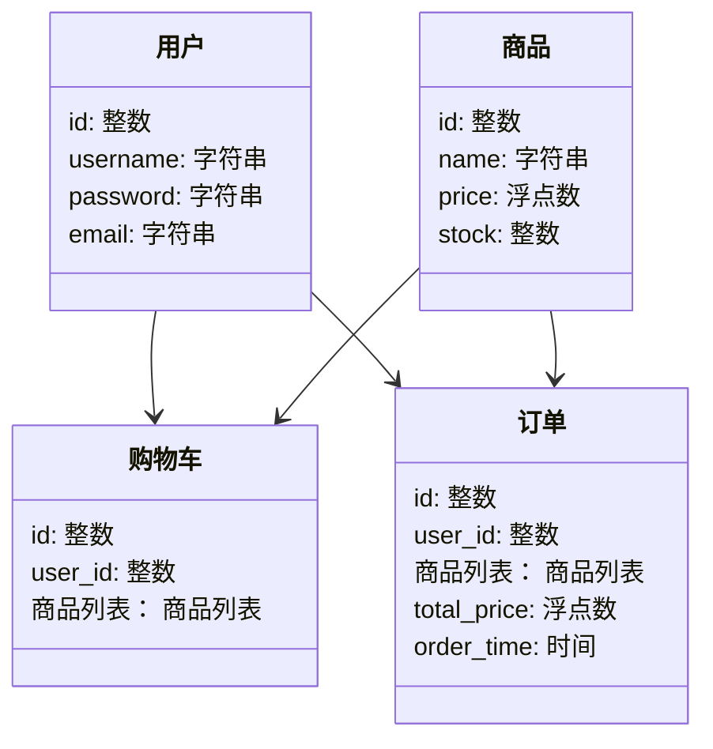
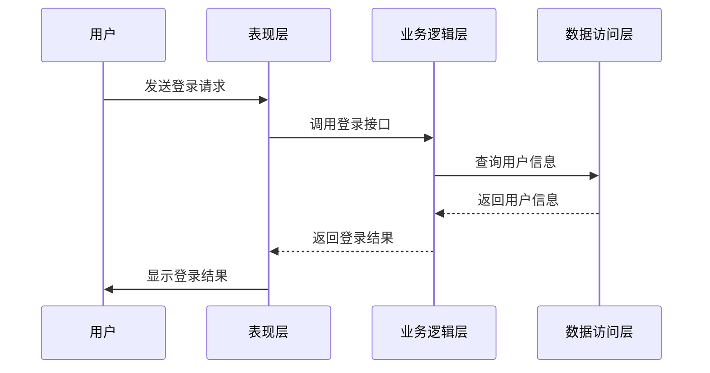

                 

<think>
好的，我需要按照用户的要求，撰写一篇关于“思维链在复杂问题解决中的应用”的技术博客文章。首先，我得仔细理解用户的需求，确保每个部分都符合要求。

首先，用户希望文章结构清晰，按照目录大纲来写，包括背景介绍、核心概念与联系、算法原理、系统分析与架构设计、项目实战、最佳实践与拓展阅读等部分。每个部分都有具体的子标题，我需要确保每个子标题下都有足够的内容。

接下来，关键词和摘要部分要简明扼要，突出文章的核心内容。关键词包括复杂问题、思维链、问题解决、算法原理、系统架构、项目实战等。摘要部分要概括整篇文章的主旨，说明思维链如何帮助解决复杂问题，涵盖从理论到实践的内容。

然后，进入背景介绍部分。这里需要详细描述复杂问题解决的需求，解释思维链的概念和重要性，以及它在各个领域的应用。接着，定义复杂问题，指出解决这类问题的挑战。然后，比较传统方法和思维链的应用，最后明确思维链的应用边界和其他方法的关系，以及其核心要素。

核心概念部分，我需要解释思维链的基本原理和特点，与传统和现代方法的对比，可能需要制作一个对比表格。然后，通过ER实体关系图展示思维链的结构，使用Mermaid语法来绘制。

算法原理部分，要详细讲解思维链的算法步骤，建立数学模型，并用Python代码实现。这部分需要提供代码示例和解读，可能还需要用Mermaid绘制算法流程图。数学模型部分，推导公式并用LaTeX表示，确保格式正确。

系统分析与架构设计部分，需要描述问题场景，设计系统功能、架构、接口和交互。使用Mermaid绘制类图、架构图和序列图，这部分可能需要一定的图形设计能力。

项目实战部分，要指导读者安装环境，提供核心代码实现，并进行案例分析。详细解释代码和案例，最后总结项目经验。

最后，最佳实践部分，给出一些实用的建议，总结全文，提醒注意事项，并推荐拓展阅读材料。

在写作过程中，我需要确保语言专业且易懂，每个部分都要详细具体，符合10000到12000字的要求。同时，注意使用markdown格式，正确嵌入Mermaid图表和LaTeX公式，确保文章结构完整，内容丰富。

现在，我需要按照这些步骤一步步撰写，确保每个部分都符合用户的要求，内容详实，结构清晰。
</think>

# 思维链在复杂问题解决中的应用

## 关键词：复杂问题、思维链、问题解决、算法原理、系统架构、项目实战

## 摘要：  
在当今快速发展的信息技术时代，复杂问题的解决需求日益增长。思维链作为一种高效的问题解决方法，通过系统化的分析和链式思考，能够有效应对复杂问题。本文将从思维链的基本概念出发，详细探讨其在复杂问题解决中的应用，包括算法原理、系统架构设计以及实际项目案例。通过本文的阐述，读者将深入了解思维链的核心原理、应用场景及其在实际问题中的具体应用。

---

## 第一部分: 问题背景与核心概念

### 1.1 问题背景

#### 1.1.1 复杂问题解决的需求  
在现代信息技术领域，复杂问题的解决需求日益增加。复杂问题通常具有多维度、高不确定性和强依赖性的特点，传统的单一解决问题方法难以应对。因此，需要一种系统化、结构化的思考方式来应对这些挑战。

#### 1.1.2 思维链的概念与重要性  
思维链是一种通过系统化分析和链式思考来解决问题的方法。它通过将问题分解为多个环节，每个环节之间形成逻辑链条，从而帮助解决者逐步逼近问题的核心。思维链的重要性在于它能够将复杂问题简化为可管理的步骤，提高问题解决的效率和质量。

#### 1.1.3 复杂问题解决的应用领域  
复杂问题解决广泛应用于软件开发、数据分析、人工智能、项目管理等领域。例如，在软件开发中，复杂问题可能涉及需求分析、系统设计、代码实现等多个环节，思维链可以帮助开发人员有条不紊地解决问题。

### 1.2 问题描述

#### 1.2.1 定义复杂问题  
复杂问题是指那些具有多个变量、高度不确定性和相互依赖性的问题。这些问题通常难以用简单的线性思维解决，需要系统化的分析方法。

#### 1.2.2 复杂问题解决面临的挑战  
复杂问题解决的主要挑战包括：  
1. 问题本身的多维度性和不确定性。  
2. 解决过程中的信息过载和决策疲劳。  
3. 各个解决步骤之间的协调和整合。

### 1.3 问题解决

#### 1.3.1 传统问题解决方法  
传统问题解决方法通常包括以下步骤：  
1. 明确问题。  
2. 分析问题。  
3. 制定解决方案。  
4. 实施解决方案。  
5. 验证结果。  
然而，这种方法在面对复杂问题时往往显得力不从心，容易遗漏关键因素。

#### 1.3.2 思维链在问题解决中的应用  
思维链通过将问题分解为多个环节，并建立逻辑链条，帮助解决者逐步深入分析问题。例如，在软件开发中，思维链可以用于需求分析、系统设计、代码实现等环节，确保每个步骤都紧密相连，最终实现目标。

### 1.4 边界与外延

#### 1.4.1 思维链的应用边界  
思维链适用于需要系统化分析的领域，但其应用边界主要集中在逻辑链条的构建和步骤的执行上。对于一些需要创造性思维的问题，思维链可能不如其他方法有效。

#### 1.4.2 思维链与其他问题解决方法的关系  
思维链可以与其他问题解决方法（如敏捷开发、设计思维）结合使用，形成更强大的问题解决能力。例如，敏捷开发中的迭代思维可以与思维链的系统化分析相结合，提升问题解决的效率和质量。

### 1.5 概念结构与核心要素组成

#### 1.5.1 思维链的定义  
思维链是一种通过将问题分解为多个逻辑链条，并逐步分析每个链条，最终解决问题的方法。它强调系统性、结构化和逻辑性。

#### 1.5.2 思维链的核心要素  
1. **问题分解**：将复杂问题分解为多个子问题。  
2. **逻辑链条**：将子问题按照逻辑顺序排列，形成链条。  
3. **逐步分析**：逐步解决每个子问题，确保链条的完整性。  
4. **整合优化**：整合各子问题的解决方案，优化整体流程。  

---

## 第二部分: 核心概念与联系

### 2.1 思维链原理

#### 2.1.1 基本原理  
思维链的基本原理是通过系统化分解和逻辑链条构建，帮助解决者逐步深入分析问题。其核心在于将复杂问题转化为多个简单问题，并通过逻辑链条连接这些简单问题，最终实现整体问题的解决。

#### 2.1.2 特点与应用  
思维链的特点包括：系统性、逻辑性、可操作性。其应用主要集中在复杂问题解决、项目管理、系统设计等领域。

#### 2.1.3 思维链与传统方法对比  
| 对比维度 | 传统方法 | 思维链 |  
|----------|----------|--------|  
| 分析方式 | 线性分析 | 链式分析 |  
| 问题分解 | 单一维度 | 多维度分解 |  
| 解决效率 | 较低 | 较高 |  

### 2.2 思维链属性特征对比

#### 2.2.1 与传统方法的对比  
如上表所示，思维链在问题分解、分析方式等方面与传统方法有显著差异。

#### 2.2.2 与现代问题解决方法的对比  
与现代方法（如敏捷开发）相比，思维链更注重系统化和逻辑性，而敏捷开发更注重迭代和反馈。

### 2.3 ER实体关系图架构

#### 2.3.1 实体定义  
- **问题**：复杂问题的定义和描述。  
- **子问题**：问题分解后的子问题。  
- **逻辑链条**：子问题之间的逻辑连接。  
- **解决方案**：子问题的解决方案。  

#### 2.3.2 关系定义  
```mermaid
erd
    entity 问题 {
        id
        description
    }
    entity 子问题 {
        id
        description
        属于问题
    }
    entity 逻辑链条 {
        id
        连接子问题
    }
    entity 解决方案 {
        id
        对应子问题
    }
    问题 --> 子问题
    子问题 --> 逻辑链条
    子问题 --> 解决方案
```

---

## 第三部分: 算法原理讲解

### 3.1 算法原理

#### 3.1.1 算法基本步骤  
1. **问题分解**：将复杂问题分解为多个子问题。  
2. **逻辑链条构建**：将子问题按逻辑顺序排列。  
3. **逐步分析**：逐一解决每个子问题。  
4. **整合优化**：整合各子问题的解决方案，优化整体流程。  

#### 3.1.2 算法数学模型  
$$ \text{问题分解} = \{ P_1, P_2, ..., P_n \} $$  
其中，$P_i$ 表示第$i$个子问题。  

### 3.2 Python源代码实现

#### 3.2.1 代码示例  
```python
def思维链解决问题(问题):
    子问题列表 = 分解问题(问题)
    逻辑链条 = 构建链条(子问题列表)
    解决方案列表 = []
    for 子问题 in 逻辑链条:
        解决方案 = 解决子问题(子问题)
        解决方案列表.append(解决方案)
    整合优化(解决方案列表)
    返回最终解决方案
```

#### 3.2.2 代码解读  
该代码通过函数`思维链解决问题`，实现了问题分解、逻辑链条构建、逐步分析和整合优化四个步骤。每个步骤的具体实现由辅助函数完成。

### 3.3 数学模型与公式

#### 3.3.1 公式推导  
$$ \text{最终解决方案} = \bigcup_{i=1}^{n} \text{解决方案}_i $$  

#### 3.3.2 数学模型说明  
该公式表示，最终解决方案是所有子问题解决方案的集合，确保每个子问题的解决方案都被整合到最终结果中。

### 3.4 举例说明

#### 3.4.1 例子描述  
假设问题为“设计一个在线购物系统”，分解为以下子问题：  
1. 用户登录与注册。  
2. 商品展示与搜索。  
3. 购物车管理。  
4. 支付与订单确认。  

#### 3.4.2 例子分析  
通过思维链，逐一解决每个子问题，并将解决方案整合到整体系统中，最终实现一个完整的在线购物系统。

---

## 第四部分: 系统分析与架构设计

### 4.1 问题场景介绍

#### 4.1.1 场景描述  
设计一个在线购物系统，涉及用户管理、商品管理、订单管理等多个模块。

### 4.2 系统功能设计

#### 4.2.1 功能描述  
1. 用户管理：注册、登录、个人信息管理。  
2. 商品管理：商品展示、搜索、分类。  
3. 购物车管理：添加商品、删除商品、修改数量。  
4. 订单管理：下单、支付、订单查询。  

#### 4.2.2 类图示例  


### 4.3 系统架构设计

#### 4.3.1 架构描述  
系统采用分层架构，包括表现层、业务逻辑层和数据访问层。  

#### 4.3.2 架构图示例  


### 4.4 系统接口设计

#### 4.4.1 接口描述  
1. 用户登录接口：`POST /login`  
2. 商品搜索接口：`GET /search`  
3. 添加商品到购物车：`POST /cart/add`  
4. 下单支付接口：`POST /order/pay`  

#### 4.4.2 交互流程图示例  


### 4.5 系统交互

#### 4.5.1 交互描述  
用户通过表现层与系统交互，表现层将请求转发到业务逻辑层，业务逻辑层处理后返回结果，最终由表现层反馈给用户。

#### 4.5.2 序列图示例  
同上，用户与系统交互的序列图。

---

## 第五部分: 项目实战

### 5.1 环境安装

#### 5.1.1 安装步骤  
1. 安装Python：`python --version`  
2. 安装Django：`pip install django`  

### 5.2 系统核心实现

#### 5.2.1 源代码展示  
```python
# views.py
from django.shortcuts import render
from .models import 商品, 用户

def 商品列表(request):
    商品列表 = 商品.objects.all()
    return render(request, '商品列表.html', {'商品': 商品列表})
```

#### 5.2.2 代码解析  
该代码展示了如何在Django框架中实现商品列表的视图，通过模型查询商品数据并传递到模板中。

### 5.3 实际案例分析

#### 5.3.1 案例描述  
以在线购物系统为例，分析其设计和实现过程。

#### 5.3.2 案例分析  
通过思维链方法，将系统设计分解为用户管理、商品管理等子问题，逐一解决并整合，最终实现完整系统。

### 5.4 详细讲解剖析  
详细讲解系统设计中的关键点，如模型设计、视图实现、模板渲染等。

### 5.5 项目小结  
总结项目实施的经验和教训，提出改进建议。

---

## 第六部分: 最佳实践与拓展阅读

### 6.1 最佳实践 Tips

#### 6.1.1 实践建议  
1. 在复杂问题解决中，优先使用思维链方法。  
2. 结合敏捷开发等方法，提升问题解决效率。  
3. 定期回顾和优化思维链的应用过程。  

### 6.2 小结  
本文通过详细阐述思维链在复杂问题解决中的应用，帮助读者掌握了其核心原理和实际应用方法。

### 6.3 注意事项  
在实际应用中，要注意思维链的逻辑链条设计，确保每个步骤都紧密相连，避免遗漏关键环节。

### 6.4 拓展阅读  
推荐阅读《系统化思维：复杂问题解决的艺术》、《思维导图与问题解决》等书籍，深入了解思维链的其他应用方法。

---

## 结语  
通过本文的详细阐述，读者可以深入了解思维链在复杂问题解决中的应用，掌握其核心原理和实际操作方法。希望本文能为读者在面对复杂问题时提供新的思路和工具，帮助他们更高效地解决问题。

---

## 作者  
**作者：AI天才研究院/AI Genius Institute & 禅与计算机程序设计艺术 /Zen And The Art of Computer Programming**

