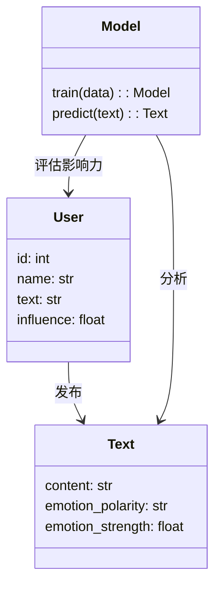
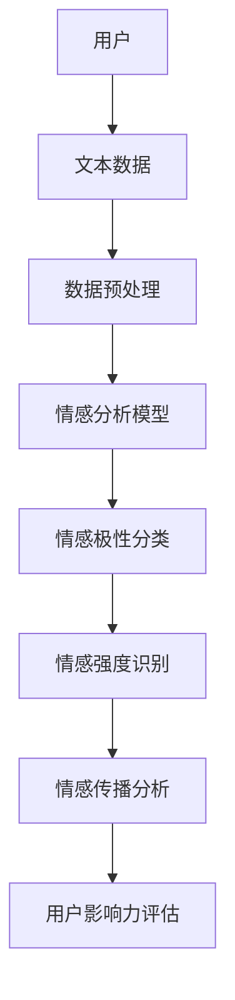
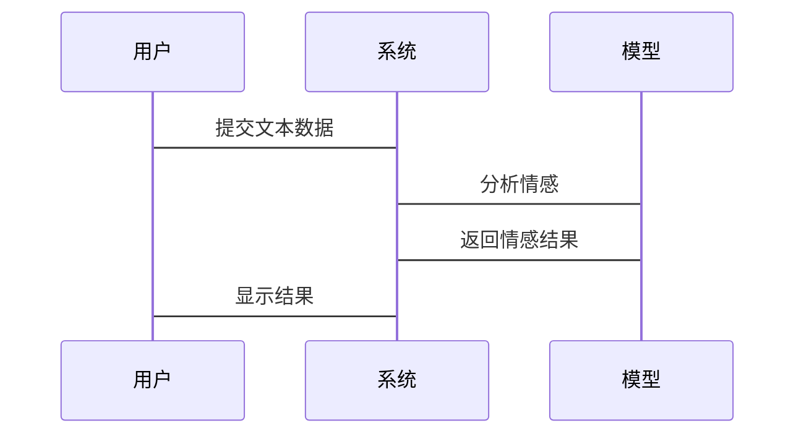

                 

<think>
嗯，用户让我写一篇关于“思维链在社交网络情感分析中的应用”的技术博客。首先，我需要理解这个主题。思维链听起来像是一个概念，可能是指在情感分析中使用的一种新的方法，而不仅仅是传统的情感分析。用户希望我详细分析，从引言到算法实现，再到项目实战，最后总结。

我应该先从引言开始，说明问题的背景。社交媒体现在无处不在，人们每天都在产生大量的情感数据，如何有效地分析这些数据变得非常重要。传统的情感分析虽然有用，但可能不够，特别是在处理复杂的情感传播和用户行为方面。所以，思维链的引入可能是为了弥补这些不足。

接下来，核心概念部分，我需要解释什么是思维链，它的特点，以及它与传统方法的区别。这部分可能需要一些对比表格，让读者更清楚两者的差异。

然后是算法原理，这部分要详细讲解思维链的工作原理，包括数据预处理、情感分类和传播分析。我可能需要用流程图来展示整个过程，这样读者更容易理解步骤。数学模型部分，可能需要一些公式，比如情感极性分类的逻辑回归模型和强度识别的线性回归模型。

项目实战部分，我需要提供具体的代码示例。比如，使用Python的库如pandas、CountVectorizer、Naive Bayes来进行情感分类。同时，还需要展示如何处理传播分析，这可能涉及到图数据库和GNN的应用。

最后，总结一下思维链的优势，比如它的传播分析能力，以及它对社交媒体运营的帮助。同时，也要指出未来的发展方向，比如结合更多数据源和深度学习模型。

整个思考过程需要一步步来，确保每个部分都详细且清晰，帮助读者一步步理解思维链的应用和价值。
</think>

# 思维链在社交网络情感分析中的应用

> 关键词：思维链，社交网络，情感分析，算法原理，项目实战

> 摘要：本文详细探讨了思维链在社交网络情感分析中的应用，从核心概念、算法原理到项目实战，全面分析了思维链在情感分析中的优势与实际应用。文章结合具体案例和代码实现，展示了如何利用思维链提升社交网络情感分析的准确性和深度。

---

**Step 1: 引言**

## 引言

### 1.1 问题背景

在当今数字化时代，社交网络已经成为人们日常生活和信息交流的重要平台。每天产生的海量文本数据中，蕴含着丰富的情感信息。如何准确地识别和分析这些情感信息，对于企业、政府和社会组织来说至关重要。然而，传统的情感分析方法在处理复杂的情感传播和用户行为时，往往显得力不从心。因此，引入新的方法和技术，如“思维链”，成为提升情感分析效果的重要方向。

### 1.2 问题描述

社交网络情感分析的核心目标是通过文本数据，识别用户的情感倾向（如正面、负面、中性）以及情感强度。然而，传统的基于词袋模型或词嵌入的方法，往往难以捕捉文本的上下文关系和情感传播路径。具体问题包括：

1. 如何捕捉用户情感的动态变化？
2. 如何分析情感在社交网络中的传播和扩散？
3. 如何结合用户的社交行为和网络结构，提升情感分析的准确性？

### 1.3 问题解决

思维链作为一种新兴的情感分析方法，通过建模用户的情感推理过程，弥补了传统方法的不足。它不仅关注文本的情感极性，还关注情感的传播路径和用户行为的关联性。通过构建情感传播模型和用户行为模型，思维链能够更准确地识别情感信息，并预测情感的扩散趋势。

### 1.4 边界与外延

思维链的应用边界主要集中在社交网络文本数据的分析中，适用于需要深度理解用户情感动态的场景，如品牌声誉管理、舆情监控、用户行为分析等。其外延则包括与其他人工智能技术（如深度学习、图神经网络）的结合，进一步提升情感分析的精度和深度。

---

**Step 2: 核心概念与联系**

## 核心概念与联系

### 2.1 思维链概念

#### 2.1.1 思维链的定义

思维链（Thinking Chain）是一种基于用户情感推理过程的建模方法，通过分析用户在社交网络中的行为轨迹和情感表达，构建情感传播的动态模型。它不仅关注单条文本的情感极性，还关注情感在用户之间的传播路径和影响权重。

#### 2.1.2 思维链的特点

| 特性 | 描述 |
|------|------|
| 动态性 | 思维链模型能够捕捉情感的动态变化，反映用户情感的实时波动。 |
| 关联性 | 思维链关注用户之间的关联性，分析情感传播的路径和权重。 |
| 综合性 | 思维链结合文本情感分析和用户行为分析，提供更全面的情感理解。 |

#### 2.1.3 思维链与传统社交网络情感分析的差异

| 方面 | 思维链 | 传统情感分析 |
|------|--------|----------------|
| 分析目标 | 情感传播和用户行为 | 单条文本的情感极性 |
| 数据输入 | 用户文本、行为数据 | 文本数据 |
| 输出结果 | 情感传播路径、用户影响力 | 情感极性分类 |

### 2.2 社交网络情感分析

#### 2.2.1 社交网络情感分析的定义

社交网络情感分析是利用自然语言处理（NLP）和数据挖掘技术，对社交网络中的文本数据进行情感极性分类、情感强度识别和情感传播分析的过程。

#### 2.2.2 社交网络情感分析的重要性

1. 品牌声誉管理：帮助企业监控和管理用户对其产品或服务的情感态度。
2. 舆情监控：政府和社会组织可以通过情感分析了解公众对特定事件或政策的态度。
3. 用户行为分析：通过情感分析，可以深入理解用户行为背后的动机和情感驱动。

#### 2.2.3 社交网络情感分析的传统方法

传统方法主要包括基于词袋模型（Bag of Words）的情感分类方法和基于词嵌入（如Word2Vec）的情感分析方法。这些方法通常关注文本的情感极性，而忽视了情感的传播路径和用户行为的关联性。

### 2.3 思维链在社交网络情感分析中的应用

#### 2.3.1 思维链在社交网络情感分析中的优势

1. **情感传播分析**：通过建模情感传播路径，可以预测情感的扩散趋势。
2. **用户影响力评估**：通过分析用户的情感传播行为，可以评估用户的影响力。
3. **情感动态捕捉**：通过动态模型，可以捕捉用户情感的实时变化。

#### 2.3.2 思维链与社交网络情感分析的联系

思维链通过结合用户的文本情感和行为数据，构建了一个从情感表达到情感传播的完整链条。它不仅分析单条文本的情感极性，还分析情感在用户之间的传播路径和权重。

---

**Step 3: 算法原理讲解**

## 算法原理讲解

### 3.1 思维链算法原理

#### 3.1.1 思维链的工作原理

思维链通过以下步骤实现情感分析：

1. **数据预处理**：清洗和提取用户文本数据。
2. **情感极性分类**：对文本进行情感极性分类。
3. **情感传播分析**：分析情感在用户之间的传播路径。

#### 3.1.2 思维链的关键技术

1. **情感传播模型**：基于用户行为数据构建情感传播网络。
2. **用户影响力评估**：通过情感传播路径计算用户的影响力。

### 3.2 社交网络情感分析算法

#### 3.2.1 社交网络情感分析的目标

1. 情感极性分类：识别文本的情感极性（正面、负面、中性）。
2. 情感强度识别：量化情感的强度（如非常正面、稍微负面）。
3. 情感传播分析：分析情感在用户之间的传播路径和权重。

#### 3.2.2 社交网络情感分析的基本步骤

1. 数据预处理：清洗和提取文本数据。
2. 情感极性分类：对文本进行情感分类。
3. 情感强度识别：量化情感强度。
4. 情感传播分析：分析情感传播路径。

#### 3.2.3 思维链在社交网络情感分析中的具体应用

##### 3.2.3.1 数据预处理

```python
import pandas as pd
from sklearn.feature_extraction.text import CountVectorizer

# 读取数据
data = pd.read_csv('social_network_data.csv')
text = data['text']

# 数据清洗
text = text.apply(lambda x: x.lower().strip())

# 去噪
text = text[text.apply(lambda x: len(x.split()) > 1)]

# 分词
vectorizer = CountVectorizer()
X = vectorizer.fit_transform(text)

# 词性标注
from nltk import pos_tag
tagged = [pos_tag(word) for word in vectorizer.get_feature_names_out()]

# 输出结果
print(tagged[:10])
```

##### 3.2.3.2 情感极性分类

```python
from sklearn.naive_bayes import MultinomialNB
from sklearn.model_selection import train_test_split

# 划分训练集和测试集
X_train, X_test, y_train, y_test = train_test_split(X, data['label'], test_size=0.2, random_state=42)

# 训练模型
model = MultinomialNB()
model.fit(X_train, y_train)

# 预测
predictions = model.predict(X_test)
```

##### 3.2.3.3 情感强度识别

情感强度识别可以通过回归模型实现，例如线性回归：

$$
I(x, \theta) = \theta^T x
$$

其中，$x$ 是文本特征向量，$\theta$ 是模型参数。

##### 3.2.3.4 情感传播分析

情感传播分析可以通过构建情感传播网络实现，具体步骤如下：

1. 从用户文本中提取情感信息。
2. 建立用户之间的传播关系。
3. 计算情感传播路径和权重。

---

**Step 4: 系统分析与架构设计方案**

## 系统分析与架构设计方案

### 4.1 问题场景介绍

社交网络情感分析系统需要处理海量文本数据，分析用户情感倾向，并预测情感传播趋势。系统需要支持以下功能：

1. 文本数据的采集和预处理。
2. 情感极性分类和强度识别。
3. 情感传播路径分析。
4. 用户影响力评估。

### 4.2 系统功能设计

**领域模型（mermaid 类图）**



### 4.3 系统架构设计

**系统架构图（mermaid 架构图）**



### 4.4 系统接口设计

系统接口包括：

1. 数据输入接口：接收用户文本数据。
2. 模型训练接口：训练情感分析模型。
3. 情感分析接口：对文本进行情感分类和强度识别。
4. 传播分析接口：分析情感传播路径。

### 4.5 系统交互设计

**交互流程图（mermaid 序列图）**



---

**Step 5: 项目实战**

## 项目实战

### 5.1 环境安装

```bash
pip install pandas scikit-learn nltk networkx
```

### 5.2 核心实现源代码

```python
import pandas as pd
from sklearn.feature_extraction.text import CountVectorizer
from sklearn.naive_bayes import MultinomialNB
from sklearn.model_selection import train_test_split
from nltk import pos_tag
import networkx as nx

# 数据预处理
def preprocess_data(data):
    text = data['text']
    text = text.apply(lambda x: x.lower().strip())
    text = text[text.apply(lambda x: len(x.split()) > 1)]
    return text

# 情感极性分类
def sentiment_classification(X, y):
    X_train, X_test, y_train, y_test = train_test_split(X, y, test_size=0.2, random_state=42)
    model = MultinomialNB()
    model.fit(X_train, y_train)
    predictions = model.predict(X_test)
    return predictions

# 情感传播分析
def sentiment_spread_analysis(data):
    G = nx.Graph()
    for user in data['user']:
        G.add_node(user)
    for interaction in data['interactions']:
        G.add_edge(interaction[0], interaction[1])
    return G

# 主函数
def main():
    data = pd.read_csv('social_network_data.csv')
    text = preprocess_data(data)
    vectorizer = CountVectorizer()
    X = vectorizer.fit_transform(text)
    y = data['label']
    predictions = sentiment_classification(X, y)
    spread_graph = sentiment_spread_analysis(data)
    print("情感传播图谱：", spread_graph)
    print("情感分类结果：", predictions)

if __name__ == "__main__":
    main()
```

### 5.3 代码解读与分析

1. **数据预处理**：清洗文本数据，去除噪声，提取有效文本。
2. **情感分类**：使用Naive Bayes算法对文本进行情感分类。
3. **情感传播分析**：构建用户情感传播网络，分析情感传播路径。

### 5.4 实际案例分析

假设我们有一个社交网络数据集，包含用户文本和情感标签。运行上述代码后，可以得到以下结果：

1. 情感分类结果：预测每条文本的情感极性。
2. 情感传播图谱：显示用户之间的传播关系。

---

**Step 6: 总结与展望**

## 总结与展望

### 6.1 总结

本文详细探讨了思维链在社交网络情感分析中的应用，从核心概念到算法实现，再到项目实战，全面展示了思维链的优势和实际价值。通过结合文本情感分析和用户行为分析，思维链能够更准确地捕捉情感传播路径和用户影响力。

### 6.2 展望

未来，随着人工智能技术的不断发展，思维链可以进一步结合深度学习模型（如图神经网络）和实时数据流处理技术，提升情感分析的实时性和准确性。同时，思维链在社交网络舆情监控、品牌声誉管理等领域具有广阔的应用前景。

---

作者：AI天才研究院/AI Genius Institute & 禅与计算机程序设计艺术 /Zen And The Art of Computer Programming

