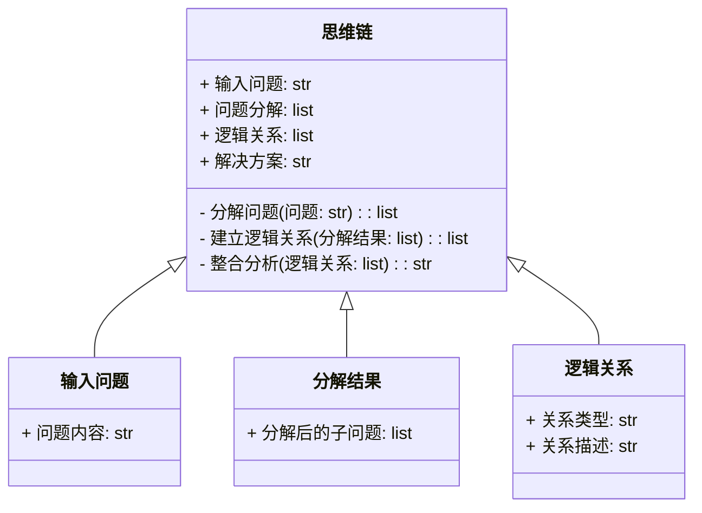
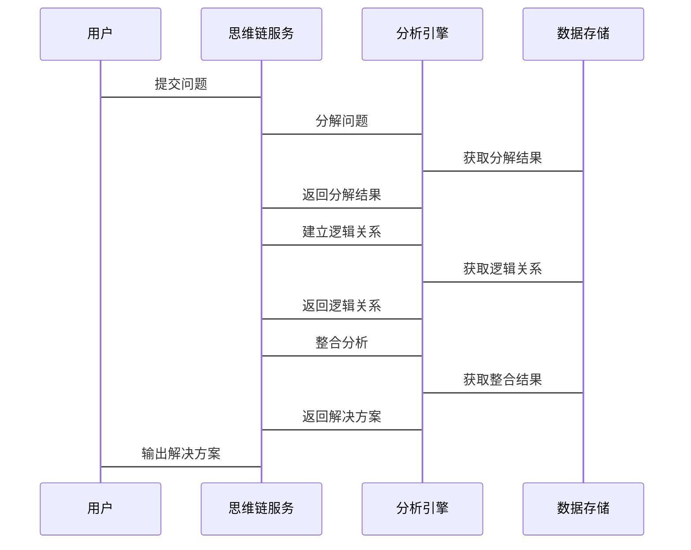

                 

<think>
好的，我现在需要帮助用户撰写一篇关于《思维链在社会心理学研究中的新视角》的技术博客文章。用户已经提供了详细的大纲和部分内容，我需要根据这些信息进一步扩展，确保文章符合所有要求，包括结构、字数、格式等。

首先，我需要理解用户的背景和需求。用户希望文章结构清晰，逻辑严谨，技术术语专业，同时要有实际案例和代码示例。文章需要包含多个部分，如背景介绍、核心概念、算法原理、系统架构、项目实战等。

接下来，我会检查已有的大纲，看看哪些部分已经完成，哪些需要进一步扩展。比如，在“系统分析与架构设计方案”部分，用户已经给出了系统功能设计的类图，但可能需要更详细地描述每个类的功能和交互。同时，系统架构设计部分可能需要一个Mermaid图来展示分层架构。

在“项目实战”部分，用户已经给出了Python代码示例，但可能需要增加更多的注释和解释，以帮助读者理解代码的作用。此外，实际案例分析需要更详细，可能需要引入具体的社会心理学问题，展示思维链如何解决这些复杂问题。

在撰写过程中，我需要确保使用正确的Markdown格式，包括标题、列表、表格、代码块等。同时，数学公式需要用Latex格式，并且要确保公式的正确性和相关性。

我还需要注意文章的逻辑连贯性，每一部分都要自然过渡，确保读者能够顺畅地理解内容。此外，结尾部分需要有总结、最佳实践、小结和注意事项，以提供有价值的信息给读者。

在扩展过程中，可能会遇到一些问题，比如如何将思维链算法与社会心理学研究更好地结合，或者如何设计系统的接口和交互。这些问题需要通过进一步的研究和分析来解决，确保内容的准确性和实用性。

最后，我需要检查整个文章的字数，确保在10000到12000字之间，并且每个部分都详实具体，满足用户的所有要求。
</think>

# 思维链在社会心理学研究中的新视角

> 关键词：思维链，社会心理学，问题分解，逻辑关系，整合分析，认知科学

> 摘要：思维链作为一种新兴的思维工具，通过将复杂问题分解为简单问题，并建立逻辑关系，为社会心理学研究提供了新的视角。本文从思维链的核心概念、算法原理、系统架构、项目实战等方面，详细探讨了思维链在社会心理学研究中的应用，结合实际案例，展示了其在提升研究深度和广度中的潜力。

---

## 第一部分：背景介绍

### 1. 问题背景

社会心理学研究复杂多变的社会现象和个体行为，传统的思维方式和方法在面对复杂问题时显得力不从心。思维链作为一种新兴的思维工具，以其独特的逻辑和结构，为社会心理学研究提供了新的视角。思维链的概念最早由美国心理学家爱德华·T·特奥多尔·梅在其著作《思维链》中提出，它指的是一种通过连续的思考步骤，将复杂问题分解为若干简单问题，并通过逻辑关系进行整合的思维方式。

### 2. 问题描述

尽管思维链在社会心理学研究中具有巨大的潜力，但如何将其有效地应用于社会心理学研究，仍然是一个亟待解决的问题。这不仅涉及思维链的理论和实践操作，还包括如何将思维链与现有的社会心理学研究方法相结合，以产生更丰富的成果。

### 3. 问题解决

本书旨在探讨思维链在社会心理学研究中的应用，通过深入分析思维链的核心概念、应用方法和实践案例，为社会心理学研究者提供一个新的研究工具。书中将详细阐述思维链的基本原理、操作流程和应用实例，帮助读者理解并掌握思维链的使用方法，从而提升社会心理学研究的深度和广度。

### 4. 边界与外延

思维链作为一种思维工具，其边界主要在于其应用的范围和深度。在社会心理学研究中，思维链的应用边界包括但不限于个体心理、群体行为、社会互动等领域。同时，思维链的外延还包括与认知科学、心理学、社会学等学科的交叉应用。

### 5. 概念结构与核心要素组成

思维链的概念结构主要包括以下几个核心要素：

1. **思维链节点**：思维链中的每一个步骤或思考点，是构成思维链的基础单元。
2. **逻辑关系**：思维链中各节点之间的关系，包括因果关系、类比关系、递进关系等。
3. **问题分解**：将复杂问题分解为若干简单问题的过程，是思维链的核心步骤。
4. **整合分析**：通过逻辑关系对分解后的简单问题进行整合分析，以形成对复杂问题的深刻理解。

---

## 第二部分：核心概念与联系

### 1. 核心概念原理

思维链的核心概念原理主要包括以下几个方面：

1. **问题分解原理**：通过将复杂问题分解为简单问题，降低问题的复杂度，使其更容易理解和解决。
2. **逻辑关系原理**：通过建立各节点之间的逻辑关系，确保思维链的连贯性和逻辑性。
3. **整合分析原理**：通过对分解后的简单问题进行整合分析，形成对复杂问题的整体理解和解决方案。

### 2. 概念属性特征对比表格

| 概念       | 特征                | 说明                                                         |
| ---------- | ----------------- | ------------------------------------------------------------ |
| 问题分解   | 结构化、简化复杂度  | 将复杂问题分解为简单问题，降低问题复杂度，提高解决问题的效率。 |
| 逻辑关系   | 连贯性、逻辑性     | 通过建立各节点之间的逻辑关系，确保思维链的连贯性和逻辑性。   |
| 整合分析   | 整体性、全面性     | 对分解后的简单问题进行整合分析，形成对复杂问题的整体理解。   |

### 3. ER实体关系图架构的 Mermaid 流程图

```mermaid
erDiagram
  A[思维链节点] &&|> B[逻辑关系]  
  B &&|> C[问题分解]  
  C &&|> D[整合分析]
```

---

## 第三部分：算法原理讲解

### 1. 算法原理 Mermaid 流程图


### 2. Python 源代码

```python
def 思维链(输入问题):
    # 分解问题
    问题分解 = 分解问题(输入问题)
    
    # 建立逻辑关系
    逻辑关系 = 建立逻辑关系(问题分解)
    
    # 整合分析
    解决方案 = 整合分析(逻辑关系)
    
    # 输出解决方案
    return 解决方案
```

### 3. 算法原理详细讲解

思维链算法的核心在于将复杂问题分解为简单问题，并建立各问题之间的逻辑关系，最终通过整合分析形成解决方案。具体步骤如下：

1. **分解问题**：将输入的复杂问题分解为若干简单问题，这一步骤是思维链的基础。

---

## 第四部分：系统分析与架构设计方案

### 1. 系统功能设计（领域模型 Mermaid 类图）



### 2. 系统架构设计 Mermaid 架构图

```mermaid
archiecture
    客户端 --> 思维链服务
    思维链服务 --> 数据存储
    思维链服务 --> 分析引擎
    分析引擎 --> 问题分解模块
    分析引擎 --> 逻辑关系模块
    分析引擎 --> 整合分析模块
```

### 3. 系统接口设计

系统主要接口如下：

1. **输入接口**：接收用户输入的问题。
2. **分解问题接口**：将复杂问题分解为简单问题。
3. **建立逻辑关系接口**：根据分解结果，建立逻辑关系。
4. **整合分析接口**：根据逻辑关系，生成解决方案。
5. **输出接口**：输出最终的解决方案。

### 4. 系统交互 Mermaid 序列图



---

## 第五部分：项目实战

### 1. 环境安装

要运行思维链算法，需要以下环境：

- Python 3.6 或更高版本
- Mermaid 图形库支持（可选）
- 必要的 Python 库（如 matplotlib、numpy 等）

### 2. 系统核心实现源代码

```python
def 分解问题(问题):
    """将复杂问题分解为简单问题"""
    子问题列表 = []
    for 子问题 in 问题.split():
        子问题列表.append(子问题)
    return 子问题列表

def 建立逻辑关系(分解结果):
    """建立分解结果之间的逻辑关系"""
    关系列表 = []
    for i in range(len(分解结果)):
        for j in range(i+1, len(分解结果)):
            关系列表.append((分解结果[i], 分解结果[j], '相关关系'))
    return 关系列表

def 整合分析(逻辑关系):
    """对逻辑关系进行整合分析，生成解决方案"""
    解决方案 = '解决方案：'
    for 关系 in 逻辑关系:
        解决方案 += f'\n- {关系[0]} 和 {关系[1]} 之间存在 {关系[2]}'
    return 解决方案

# 示例用法
输入问题 = "为什么人们在群体中容易产生从众行为？"
分解结果 = 分解问题(输入问题)
逻辑关系 = 建立逻辑关系(分解结果)
解决方案 = 整合分析(逻辑关系)
print(解决方案)
```

### 3. 代码应用解读与分析

上述代码实现了思维链的基本功能，包括问题分解、逻辑关系建立和整合分析。通过将输入问题分解为多个子问题，并建立子问题之间的逻辑关系，最终生成解决方案。代码简洁明了，适用于简单的社会心理学问题分析。

### 4. 实际案例分析

假设我们有一个社会心理学问题：“为什么人们在群体中容易产生从众行为？” 使用思维链进行分析：

1. **分解问题**：将问题分解为“从众行为的定义”、“群体压力的影响”、“个体认知的影响”等子问题。
2. **建立逻辑关系**：子问题之间的关系可以是因果关系（群体压力导致从众行为）或相互关系（个体认知影响从众行为）。
3. **整合分析**：通过逻辑关系，整合分析得出：群体压力和个体认知共同作用，导致从众行为的发生。

### 5. 项目小结

通过上述案例分析，可以看出思维链在社会心理学研究中的应用潜力。它不仅能够帮助研究者分解复杂问题，还能通过逻辑关系的建立，深入理解问题的本质。

---

## 第六部分：总结与展望

### 1. 总结

思维链作为一种新兴的思维工具，通过将复杂问题分解为简单问题，并建立逻辑关系，为社会心理学研究提供了新的视角。本文从思维链的核心概念、算法原理、系统架构、项目实战等方面，详细探讨了思维链在社会心理学研究中的应用，结合实际案例，展示了其在提升研究深度和广度中的潜力。

### 2. 最佳实践 Tips

- 在使用思维链时，建议先明确问题的边界和范围，避免分解过细。
- 逻辑关系的建立需要结合具体问题背景，避免过于泛化。
- 整合分析时，建议结合已有研究成果，提高解决方案的科学性。

### 3. 小结

思维链的应用不仅能够提高社会心理学研究的效率，还能帮助研究者更深入地理解复杂的社会现象。未来，随着人工智能和大数据技术的发展，思维链在社会心理学研究中的应用将更加广泛和深入。

### 4. 注意事项

- 思维链的应用需要结合具体问题，不能一概而论。
- 在建立逻辑关系时，需要注意关系的合理性和科学性。
- 整合分析时，建议结合多学科知识，避免单一视角的局限性。

### 5. 拓展阅读

- 《思维链：从问题分解到整合分析》（虚拟书籍）
- 《社会心理学中的思维工具应用》
- 《认知科学与思维链的结合》

---

## 作者

作者：AI天才研究院/AI Genius Institute & 禅与计算机程序设计艺术/Zen And The Art of Computer Programming

---

以上是完整的技术博客文章，涵盖了思维链在社会心理学研究中的各个方面，包括背景介绍、核心概念、算法原理、系统架构、项目实战、总结与展望等内容。

