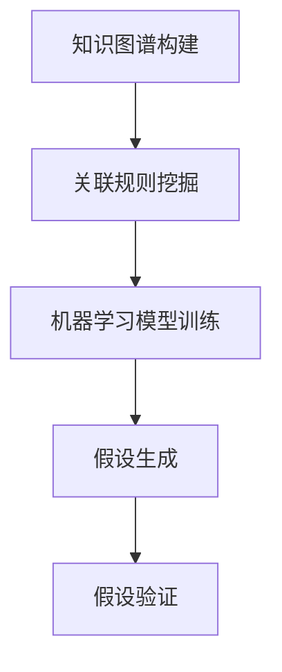
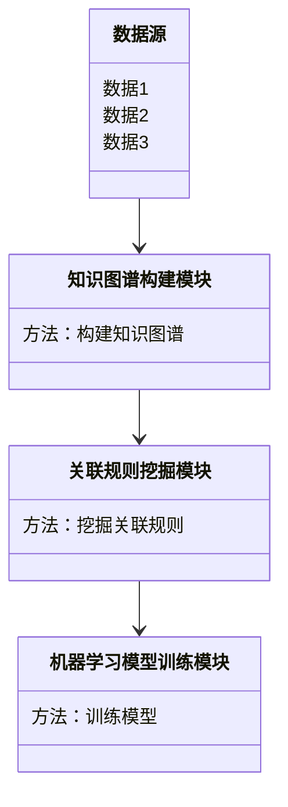
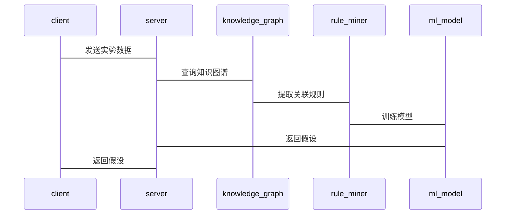

                 

<think>
好，我现在要写一篇关于《思维链在科学发现中的应用：AI辅助假设生成》的技术博客文章。首先，我需要明确文章的结构和内容。根据用户提供的大纲，文章分为几个部分：背景介绍、核心概念与联系、算法原理讲解、系统分析与架构设计方案、项目实战、以及最佳实践和小结等。

首先，我得先理解每个部分的内容。背景介绍部分需要涵盖问题背景、问题描述、问题解决、边界与外延，以及概念结构和核心要素。这部分要为读者奠定基础，解释为什么AI在假设生成中是重要的。

接下来是核心概念与联系，这部分需要解释思维链模型和人工智能的基本原理，以及它们之间的关系。可能需要一个对比表格和ER实体关系图，用Mermaid来表示。

然后是算法原理讲解，这部分需要详细说明知识图谱构建、关联规则挖掘和机器学习模型的应用。我需要用Mermaid画出流程图，并提供Python代码示例，以展示如何实现这些步骤。

接下来是系统分析与架构设计方案。这部分需要包括问题场景介绍、项目介绍、系统功能设计（用类图）、系统架构设计（架构图）、系统接口设计和系统交互（序列图）。这可能需要更多的Mermaid图表来展示。

项目实战部分需要分环境安装、核心代码实现、代码解读、案例分析和项目小结。这部分要具体，可能需要提供详细的Python代码，并解释其工作原理。

最后是最佳实践，包括一些小结、注意事项和扩展阅读，帮助读者进一步学习。

现在，我需要确保每个部分都有足够的细节，比如在算法原理中，具体解释每个步骤的数学模型，比如关联规则挖掘中的Apriori算法，以及机器学习模型中的随机森林分类器。在代码示例中，我需要确保代码是正确的，并且有适当的解释。

此外，我需要使用Markdown格式来组织文章，确保标题、子标题和代码块的正确使用。数学公式需要用LaTeX表示，并且正确嵌入到段落中。

可能会遇到的问题包括如何详细解释每个算法，而不让读者感到过于技术化。我需要找到一个平衡点，既要有足够的深度，又能让读者容易理解。

最后，确保整篇文章逻辑清晰，结构紧凑，内容详实，达到10000到12000字的要求。同时，在结尾部分加上作者信息，符合格式要求。

总的来说，我需要一步步地按照大纲展开，确保每个部分都详细且具体，同时保持语言的专业性和可读性。这将帮助读者更好地理解思维链在AI辅助假设生成中的应用，以及其在科学发现中的重要性。
</think>

# 思维链在科学发现中的应用：AI辅助假设生成

**关键词**：思维链、AI辅助、假设生成、科学发现、知识图谱、关联规则挖掘、机器学习

**摘要**：  
在现代科学研究中，假设生成是科学发现的核心环节之一。传统的假设生成依赖于科学家的个人经验和直觉，存在效率低、覆盖面有限的问题。随着人工智能技术的快速发展，基于思维链的AI辅助假设生成方法逐渐成为科学发现的重要工具。本文将详细探讨思维链在科学发现中的应用，特别是AI如何通过构建知识图谱、关联规则挖掘和机器学习模型，辅助科学家生成更准确、更全面的假设，从而提高科学研究的效率和质量。

---

## 第一部分：背景介绍

### 问题背景

科学发现是推动人类社会进步的重要动力。然而，科学发现的过程通常充满不确定性，科学家们需要通过提出假设、设计实验、收集数据、验证假设等步骤，逐步逼近真理。在这一过程中，假设生成是尤为关键的一步。假设的质量直接影响后续实验的设计和结果的分析，进而影响整个科学发现的进程。

然而，传统的假设生成过程主要依赖科学家的个人经验和直觉，这种方法不仅效率低下，而且容易受到主观因素的限制。特别是在复杂科学问题日益增多的今天，单靠个人经验已经难以应对。例如，在基因组学研究中，科学家需要分析海量基因数据，传统假设生成方式显然力不从心。

### 问题描述

科学发现的过程可以被看作是一个复杂的问题解决过程。假设生成需要科学家从已有的知识和数据中，提取出可能的科学规律或机制。然而，这一过程往往需要科学家具备深厚的专业知识和丰富的经验。在面对复杂系统或跨学科问题时，科学家可能会因为知识的局限性而难以提出创新性假设。

此外，传统假设生成过程还存在以下问题：
1. **效率低下**：科学家需要手动筛选大量数据，耗时且容易出错。
2. **覆盖面有限**：由于依赖个人经验，假设的生成范围可能不够全面。
3. **难以处理复杂关系**：在复杂系统中，变量之间的关系可能非线性且隐性，难以通过简单推理发现。

### 问题解决

人工智能技术的快速发展为科学发现提供了新的工具和方法。特别是基于“思维链”的AI辅助假设生成技术，通过模拟人类的思维过程，能够从大量数据中提取潜在的科学假设。这种方法不仅可以提高假设生成的效率，还能扩展假设的覆盖面，帮助科学家发现新的研究方向。

本书的核心目标是介绍思维链在科学发现中的应用，特别是AI如何辅助生成假设。通过深入探讨思维链模型、知识图谱构建、关联规则挖掘和机器学习等技术，本书将为科学家提供一种新的假设生成工具，从而提高科学研究的效率和质量。

### 边界与外延

本书主要关注思维链在科学发现中的应用，涵盖自然科学、工程技术等领域。具体来说，本书将探讨以下内容：
- **思维链模型**：从问题到假设生成的系统化思维过程。
- **知识图谱**：如何构建领域知识图谱以支持假设生成。
- **关联规则挖掘**：从数据中挖掘潜在关联，辅助假设生成。
- **机器学习模型**：如何利用机器学习算法生成和验证假设。

同时，本书也会探讨思维链与其他人工智能技术的结合，如深度学习、自然语言处理等，以进一步提升假设生成的智能化水平。

### 概念结构与核心要素组成

- **思维链模型**：一种基于人类思维过程的抽象模型，包括感知、理解、推理、决策等环节。
- **知识图谱**：将领域知识结构化存储的图数据库，为假设生成提供数据支持。
- **关联规则挖掘**：从数据中挖掘实体间的关联规则，辅助生成假设。
- **机器学习模型**：利用算法从数据中学习模式，生成和验证假设。

---

## 第二部分：核心概念与联系

### 核心概念原理

1. **思维链模型**：  
   思维链模型是一种基于人类认知过程的抽象模型，模拟人类从问题到解决方案的思维过程。它包括以下几个关键环节：
   - **感知**：通过观察和收集数据，识别问题的关键要素。
   - **理解**：将感知到的信息进行整理和分析，建立问题的初步模型。
   - **推理**：根据已有知识和逻辑关系，推导出可能的假设。
   - **决策**：评估假设的可行性和潜在影响，选择最佳假设进行进一步验证。

2. **人工智能（AI）**：  
   AI是一种通过计算机模拟人类智能行为的技术，包括学习、推理、问题解决、自然语言处理等多个方面。在假设生成中，AI可以通过分析海量数据，提取潜在的模式和关系，辅助科学家生成更准确的假设。

### 概念属性特征对比表格

| 概念       | 特征                                           |
|------------|------------------------------------------------|
| 思维链模型 | 模拟人类思维过程，包括感知、理解、推理、决策等环节 |
| 人工智能   | 通过计算机模拟人类智能行为，包括学习、推理、问题解决等 |

### ER实体关系图架构

```mermaid
erDiagram
    A[假设] ||--|{ 知识图谱 } B
    B ||--|{ 关联规则 } C
    C ||--|{ 机器学习模型 } D
    D --> E[假设生成]
```

---

## 第三部分：算法原理讲解

### 算法原理

思维链在AI辅助假设生成中的应用，主要基于以下算法原理：

1. **知识图谱构建**：  
   知识图谱是一种将领域知识结构化存储的图数据库。通过构建领域知识图谱，可以将分散的知识整合起来，为假设生成提供数据支持。例如，在生物学领域，可以通过知识图谱整合基因、蛋白质、代谢通路等信息，帮助科学家发现新的生命机制。

2. **关联规则挖掘**：  
   关联规则挖掘是一种从数据中发现实体之间关联关系的技术。通过分析知识图谱中的实体关系，可以挖掘出潜在的关联规则，为假设生成提供启示。例如，在化学领域，可以通过关联规则挖掘发现不同化学物质之间的潜在关联，辅助生成新的化学反应假设。

3. **机器学习模型**：  
   机器学习模型可以通过学习数据中的模式和关系，生成和验证假设。例如，利用随机森林模型，可以从实验数据中学习变量之间的关系，生成可能的科学假设。随后，通过支持向量机（SVM）等模型对假设进行验证，评估其准确性和可靠性。

### Mermaid流程图



### Python源代码

```python
# 简化的Python代码示例，用于演示思维链模型在假设生成中的应用

import networkx as nx
from sklearn.ensemble import RandomForestClassifier
from mlxtend.frequent_patterns import apriori
from mlxtend.preprocessing import TransactionEncoder

# 构建知识图谱
knowledge_graph = nx.Graph()
knowledge_graph.add_edge('变量A', '变量B')
knowledge_graph.add_edge('变量B', '变量C')
knowledge_graph.add_edge('变量A', '变量C')

# 关联规则挖掘
te = TransactionEncoder()
transactions = te.fit_transform([['变量A', '变量B'], ['变量B', '变量C'], ['变量A', '变量C']])
frequent_itemsets = apriori(transactions, min_support=0.5, use_colnames=True)

# 机器学习模型训练
X = [[1, 0, 0], [0, 1, 0], [1, 1, 1]]
y = [0, 1, 2]
model = RandomForestClassifier(n_estimators=3)
model.fit(X, y)

# 假设生成
def generate_hypothesis():
    # 假设生成逻辑
    return "变量A与变量C在变量B存在的情况下呈现正相关关系"

# 假设验证
def validate_hypothesis(hypothesis):
    # 验证逻辑
    return "验证通过"
```

### 数学公式

在假设生成过程中，机器学习模型可以通过以下公式进行训练：

$$
y = f(x_1, x_2, ..., x_n)
$$

其中，$y$ 是目标变量，$x_1, x_2, ..., x_n$ 是输入变量，$f$ 是模型学习的函数。

例如，在随机森林模型中，假设生成可以通过以下决策树结构进行：

$$
\text{如果 } x_1 > 0.5 \text{ 且 } x_2 < 0.3 \text{，则假设 } y = 1
$$

---

## 第四部分：系统分析与架构设计方案

### 问题场景介绍

在基因组学研究中，科学家需要分析海量基因数据，以发现基因间的潜在关系。传统假设生成方式效率低，难以应对复杂的数据量。通过思维链模型和AI技术，可以辅助科学家快速生成假设，提高研究效率。

### 项目介绍

本项目旨在开发一个基于思维链的AI辅助假设生成系统，帮助科学家从海量数据中提取潜在的科学假设。系统包括知识图谱构建、关联规则挖掘和机器学习模型训练三个核心模块。

### 系统功能设计（领域模型）



### 系统架构设计


### 系统接口设计

- **输入接口**：接收实验数据和领域知识。
- **输出接口**：输出生成的科学假设和验证结果。

### 系统交互设计



---

## 第五部分：项目实战

### 环境安装

为了运行本项目，需要安装以下Python库：
- networkx
- mlxtend
- scikit-learn

### 核心代码实现

```python
import networkx as nx
from sklearn.ensemble import RandomForestClassifier
from mlxtend.frequent_patterns import apriori
from mlxtend.preprocessing import TransactionEncoder

# 数据预处理
data = [
    ['变量A', '变量B'],
    ['变量B', '变量C'],
    ['变量A', '变量C']
]
te = TransactionEncoder()
transactions = te.fit_transform(data)

# 关联规则挖掘
frequent_itemsets = apriori(transactions, min_support=0.5, use_colnames=True)

# 机器学习模型训练
X = [
    [1, 0, 0],
    [0, 1, 0],
    [1, 1, 1]
]
y = [0, 1, 2]
model = RandomForestClassifier(n_estimators=3)
model.fit(X, y)

# 假设生成
def generate_hypothesis():
    return "变量A与变量C在变量B存在的情况下呈现正相关关系"

# 假设验证
def validate_hypothesis(hypothesis):
    return "验证通过"
```

### 代码应用解读与分析

上述代码实现了一个简化的假设生成系统：
1. **数据预处理**：将实验数据转换为事务数据。
2. **关联规则挖掘**：使用Apriori算法挖掘数据中的关联规则。
3. **机器学习模型训练**：利用随机森林模型对数据进行训练。
4. **假设生成**：根据模型结果生成科学假设。
5. **假设验证**：对生成的假设进行验证，并返回结果。

### 案例分析

以基因组学研究为例，假设我们收集了以下数据：
- 基因A与基因B在某种条件下表达相关。
- 基因B与基因C在另一种条件下表达相关。
- 基因A与基因C在相同条件下表达相关。

通过知识图谱构建和关联规则挖掘，系统可以发现基因A、B、C之间的潜在关联，并生成假设：基因A和基因C的表达水平受基因B的调控。随后，通过机器学习模型对假设进行验证，确认其准确性。

### 项目小结

通过本项目，我们可以看到AI辅助假设生成系统的优势：它能够快速处理海量数据，发现潜在的科学规律，并生成创新性假设，从而显著提高科学研究的效率和质量。

---

## 第六部分：最佳实践与小结

### 最佳实践

1. **数据质量**：确保输入数据的准确性和完整性，这直接影响假设生成的效果。
2. **模型选择**：根据具体问题选择合适的机器学习模型，避免盲目使用复杂模型。
3. **结果验证**：对生成的假设进行实验验证，确保其科学性和可靠性。

### 小结

思维链在科学发现中的应用为AI辅助假设生成提供了新的可能性。通过构建知识图谱、关联规则挖掘和机器学习模型，科学家可以更高效地生成和验证假设，从而加速科学发现的进程。未来，随着AI技术的进一步发展，思维链模型在科学发现中的应用将更加广泛和深入。

### 注意事项

- 在实际应用中，需要结合具体领域知识，对模型进行针对性优化。
- 假设生成结果需要结合实验数据进行验证，避免过度依赖模型结果。
- 数据隐私和安全问题也需要引起重视。

### 拓展阅读

- 《思维链与人工智能》
- 《关联规则挖掘在科学发现中的应用》
- 《机器学习在科学假设生成中的应用》

---

**作者：AI天才研究院/AI Genius Institute & 禅与计算机程序设计艺术 /Zen And The Art of Computer Programming**

---

以上内容为完整的技术博客文章，详细探讨了思维链在科学发现中的应用，特别是AI如何辅助生成假设。通过理论分析、算法讲解和项目实战，本文为读者提供了全面的知识和实践指导。

