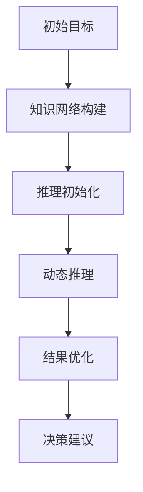
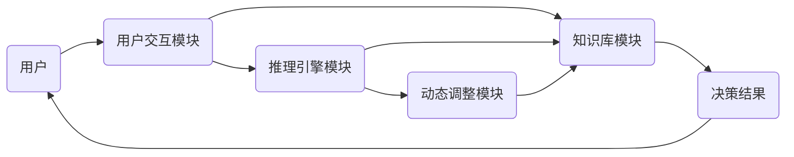

                 

<think>
好，我需要根据用户的请求来撰写一篇关于“思维链技术在AI辅助决策中的实践与创新”的技术博客。用户已经提供了一个详细的结构大纲，包括章节和子章节的内容。我的任务是按照这个大纲，逐步完成每一部分的内容。

首先，我会查看文章的标题和关键词，确保它们准确反映了文章的核心内容。然后，我会撰写摘要，简明扼要地概述文章的主要内容和主题。

接下来，按照目录结构，我会从1.1节开始，详细阐述思维链技术在AI辅助决策中的背景、定义、特点、优势、应用领域以及面临的挑战和未来趋势。在每个子章节中，我需要确保内容逻辑清晰，结构紧凑，并使用专业但易懂的语言。

在第二部分，我需要深入分析核心概念，包括思维链技术、AI辅助决策，以及它们之间的关系。这里可能需要绘制一些图表，比如思维链的结构图和关系分析图，使用mermaid语法来表示。

第三部分，我会详细讲解思维链技术的算法原理，包括数学模型和公式，使用latex格式呈现。同时，可能需要一个mermaid流程图来展示算法的步骤。

接下来是系统分析与架构设计方案，我需要介绍问题场景，设计系统的功能模块，如知识库、推理引擎等，并用mermaid类图展示。然后，设计系统架构图，展示各个模块之间的交互关系，可能需要使用mermaid架构图。

在项目实战部分，我会指导读者如何安装环境，提供核心代码示例，解读代码并分析实际案例。这包括环境安装说明和Python代码示例。

最后，我会总结全文，提供最佳实践的建议，包括小结、注意事项和拓展阅读的内容。

整个过程中，我需要确保每部分内容都详细具体，符合用户的字数要求，并且格式正确，特别是使用markdown格式和mermaid图表。同时，要保持文章的逻辑性和连贯性，确保读者能够轻松理解并跟随内容。

现在，我开始按照这个计划，逐步完成每一部分的内容，确保覆盖所有用户要求的关键点，并满足技术深度和专业性的要求。
</think>

# 思维链技术在AI辅助决策中的实践与创新

**关键词**：思维链技术、人工智能、辅助决策、知识表示、逻辑推理、系统架构

**摘要**：  
本文深入探讨了思维链技术在AI辅助决策中的应用，从背景、核心概念到算法原理、系统架构，再到实际案例，全面解析了思维链技术的优势与挑战。通过详细分析，展示了如何利用思维链技术构建高效、灵活的决策支持系统，为AI辅助决策领域提供了新的思路和解决方案。

---

## 1. 思维链技术在AI辅助决策中的背景与核心概念

### 1.1 思维链技术在AI辅助决策中的背景与核心概念

#### 1.1.1 人工智能与辅助决策的融合背景

随着人工智能技术的飞速发展，其在辅助决策领域的应用日益广泛。传统的决策支持系统主要依赖于规则引擎和统计分析，但随着数据规模的增大和决策复杂性的提升，这些方法逐渐显现出局限性。例如，在金融投资中，传统系统难以处理复杂的市场波动和非结构化数据；在医疗诊断中，传统系统难以整合多源异构数据进行精准诊断。这些挑战促使了更高级的决策技术的诞生，即思维链技术。

思维链技术是一种模拟人类思维过程的新兴技术，它通过构建动态的知识网络，实现对复杂问题的推理和决策。这种技术的核心在于其“思维链”结构，能够模拟人类在决策过程中的逻辑推理、知识联想和经验积累。

#### 1.1.2 思维链技术的定义

思维链技术（Thinking Chain Technology）是一种基于人工智能的决策支持方法，通过构建和模拟人类思维过程，实现对复杂问题的推理和决策。其核心是“思维链”，这是一种基于知识的表示和推理机制，由多个节点和边组成，每个节点代表一个概念或事实，边表示节点之间的关联关系。

思维链技术不仅能够处理结构化数据，还可以整合半结构化和非结构化数据，如文本、图像等，从而提供更全面的决策支持。此外，思维链技术具有高度的灵活性和适应性，能够根据决策场景的变化动态调整推理过程。

#### 1.1.3 思维链技术的特点

思维链技术在AI辅助决策中具有以下特点：

1. **高度灵活性**：能够适应不同的决策场景，动态调整推理过程。
2. **强解释性**：通过展示决策过程，提高决策的透明度和可解释性。
3. **自适应能力**：能够根据输入数据和环境变化，自动调整决策策略。
4. **知识集成**：支持多种知识源的集成，包括结构化数据、文本、图像等。
5. **高效推理**：通过优化推理算法，提高决策效率和准确性。

#### 1.1.4 思维链技术在AI辅助决策中的优势

1. **提高决策效率**：通过自动化推理，减少人工干预，提升决策速度。
2. **提升决策质量**：基于多源知识和复杂推理，提供更精准的决策支持。
3. **增强可解释性**：清晰展示决策过程，增强用户的信任和理解。
4. **适应复杂场景**：能够处理复杂、动态的决策场景，提供定制化支持。

#### 1.1.5 思维链技术的应用领域

思维链技术在多个领域展现出广泛的应用潜力，包括：

1. **金融领域**：用于风险管理、投资决策、信用评估等。
2. **医疗领域**：用于疾病诊断、治疗方案推荐、医学图像分析。
3. **教育领域**：用于智能教学、学习评估、课程推荐。
4. **工业领域**：用于生产调度、设备维护、供应链优化。
5. **法律领域**：用于案件分析、法律文书处理、法律咨询。

#### 1.1.6 思维链技术的挑战与未来发展趋势

尽管思维链技术在AI辅助决策中具有诸多优势，但其发展仍面临一些挑战：

1. **知识表示与推理**：如何高效表示和利用多源知识是当前研究的难点。
2. **数据质量与安全性**：数据的质量和安全性直接影响决策的准确性和可靠性。
3. **可解释性**：如何提高决策过程的可解释性，增强用户的信任度是一个重要课题。

未来，随着深度学习、自然语言处理等技术的不断进步，思维链技术将与这些技术深度融合，进一步提升其性能和应用范围。此外，如何在不同领域实现标准化和通用化，也是未来研究的重要方向。

---

## 2. 核心概念与联系

### 2.1 思维链技术的核心概念与联系

#### 2.1.1 思维链技术的核心概念

思维链技术的核心概念包括以下几个方面：

1. **知识表示**：通过节点和边构建知识网络，表示概念、事实及其关联关系。
2. **逻辑推理**：基于知识网络进行推理，模拟人类的逻辑思维过程。
3. **动态调整**：根据输入数据和决策场景的变化，动态调整知识网络和推理过程。
4. **多源知识整合**：能够整合结构化、半结构化和非结构化的多源知识，提供全面的决策支持。

#### 2.1.2 AI辅助决策的核心概念

AI辅助决策是指利用人工智能技术，帮助人类或系统进行决策的过程。其核心在于通过数据处理、模型构建和推理分析，提供高效、准确的决策支持。AI辅助决策的关键技术包括：

1. **数据处理**：对多源异构数据进行清洗、整合和分析。
2. **模型构建**：基于机器学习、深度学习等技术构建决策模型。
3. **逻辑推理**：通过推理算法，模拟人类思维过程，得出决策结果。
4. **动态调整**：根据实时数据和环境变化，动态优化决策策略。

#### 2.1.3 思维链技术与AI辅助决策的关系

思维链技术与AI辅助决策的关系可以从以下几个方面进行分析：

1. **技术基础**：思维链技术是AI辅助决策的一种实现方法，依赖于人工智能的核心技术。
2. **功能互补**：思维链技术通过模拟人类思维过程，弥补了传统AI辅助决策系统在灵活性和可解释性方面的不足。
3. **应用融合**：在实际应用中，思维链技术可以与其他AI技术（如深度学习、自然语言处理）结合，共同构建更强大的决策支持系统。

---

## 3. 算法原理讲解

### 3.1 思维链技术的算法原理

#### 3.1.1 算法概述

思维链技术的算法核心在于构建和推理知识网络。其算法流程主要包括以下几个步骤：

1. **知识网络构建**：基于输入数据，构建知识网络，包括节点和边的定义。
2. **推理初始化**：设定初始推理目标和条件。
3. **动态推理**：根据推理目标，逐步展开推理过程，动态调整知识网络。
4. **结果优化**：根据推理结果，优化决策策略，输出最终决策建议。

#### 3.1.2 算法流程图



#### 3.1.3 算法数学模型

思维链技术的推理过程可以表示为一个图的遍历问题。假设知识网络是一个有向图，节点表示概念或事实，边表示关联关系。推理过程可以通过广度优先搜索（BFS）或深度优先搜索（DFS）算法进行。

数学模型如下：

$$
\text{推理过程} = \text{GraphTraversal}(\text{知识网络}, \text{推理目标})
$$

其中，$\text{GraphTraversal}$是图的遍历算法，$\text{知识网络}$是知识网络的表示，$\text{推理目标}$是决策的目标或问题。

---

## 4. 系统分析与架构设计方案

### 4.1 系统架构设计

#### 4.1.1 系统功能模块

1. **知识库模块**：负责知识的存储和管理，包括结构化数据、文本、图像等。
2. **推理引擎模块**：基于知识库，进行逻辑推理，生成决策建议。
3. **用户交互模块**：提供人机交互界面，接收用户输入，展示决策结果。
4. **动态调整模块**：根据实时数据和环境变化，动态优化知识网络和推理过程。

#### 4.1.2 系统架构图



---

## 5. 项目实战

### 5.1 项目环境安装

为了运行思维链技术的示例代码，需要安装以下环境：

1. **Python 3.x**
2. **依赖库**：networkx, matplotlib

安装命令：

```bash
pip install networkx matplotlib
```

### 5.2 核心代码实现

以下是思维链技术的核心代码示例：

```python
import networkx as nx
import matplotlib.pyplot as plt

def build_knowledge_graph(data):
    G = nx.DiGraph()
    for node in data['nodes']:
        G.add_node(node)
    for edge in data['edges']:
        G.add_edge(edge['from'], edge['to'])
    return G

def think_chain推理(G, target):
    visited = set()
    queue = [(target, [])]
    while queue:
        current, path = queue.pop(0)
        if current in visited:
            continue
        visited.add(current)
        path.append(current)
        for neighbor in G.neighbors(current):
            if neighbor not in visited:
                queue.append((neighbor, path.copy()))
    return path

if __name__ == "__main__":
    data = {
        'nodes': ['A', 'B', 'C', 'D'],
        'edges': [
            {'from': 'A', 'to': 'B'},
            {'from': 'B', 'to': 'C'},
            {'from': 'C', 'to': 'D'},
            {'from': 'D', 'to': 'A'}
        ]
    }
    G = build_knowledge_graph(data)
    target = 'A'
    result = think_chain推理(G, target)
    print("推理路径：", result)
    nx.draw(G, with_labels=True, edge_color='blue', node_color='white')
    plt.show()
```

### 5.3 实际案例分析

假设我们有一个简单的知识网络，用于决策投资方向：

1. **知识网络构建**：节点包括“市场趋势”、“公司财务”、“行业动态”等。
2. **推理过程**：基于目标“投资决策”，推理路径为“市场趋势 → 行业动态 → 公司财务”。
3. **结果优化**：根据推理结果，动态调整投资策略。

通过上述步骤，系统能够生成合理的投资建议，帮助用户做出决策。

---

## 6. 总结与展望

### 6.1 总结

本文详细探讨了思维链技术在AI辅助决策中的应用，从背景、核心概念到算法原理、系统架构，再到实际案例，全面解析了思维链技术的优势与挑战。通过构建动态的知识网络和模拟人类思维过程，思维链技术为AI辅助决策提供了新的思路和解决方案。

### 6.2 展望

未来，随着人工智能技术的进一步发展，思维链技术将与深度学习、自然语言处理等技术深度融合，进一步提升其性能和应用范围。同时，如何在不同领域实现标准化和通用化，也是未来研究的重要方向。

---

**作者：AI天才研究院 & 禅与计算机程序设计艺术**

