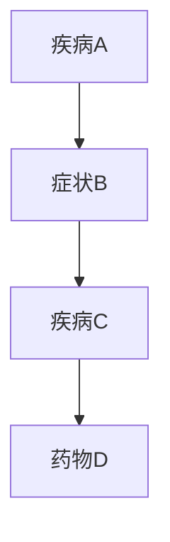
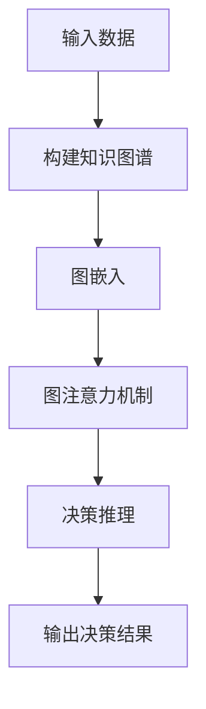
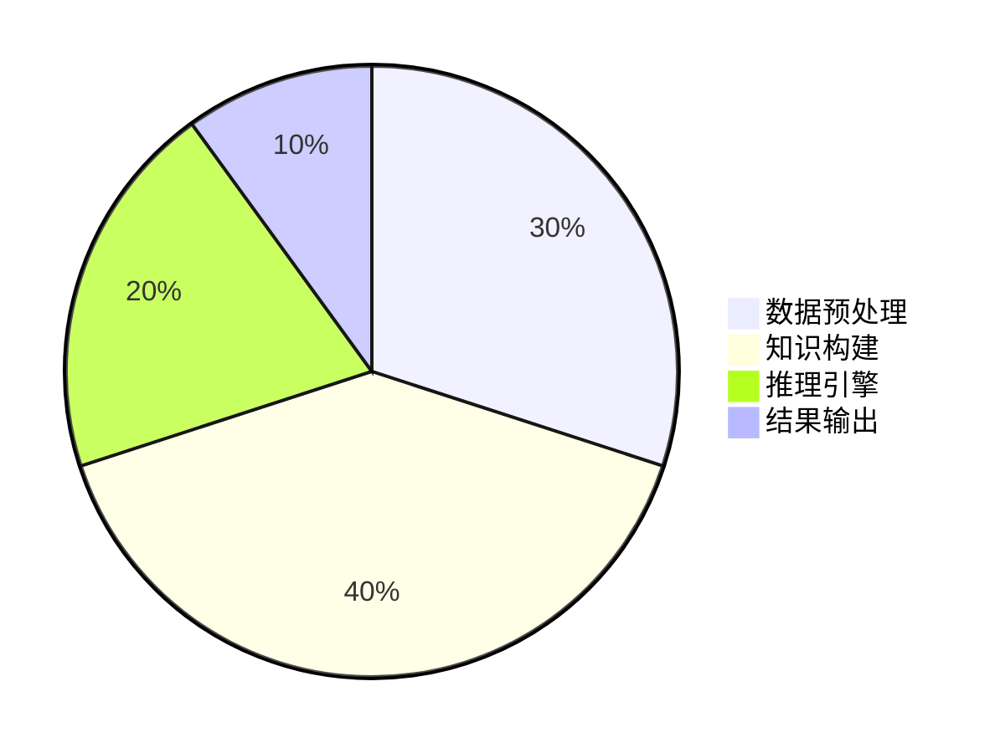
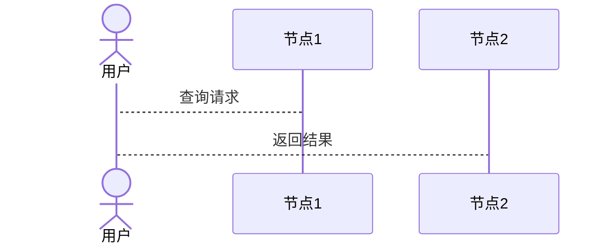

                 

<think>
好，我现在要帮用户写一篇关于“思维链技术在AI辅助决策中的运用”的技术博客文章。首先，我需要理解用户的需求。用户希望我以一位世界级专家的身份，撰写一篇结构清晰、内容详尽的专业文章。

首先，用户给出了详细的目录结构，包括背景介绍、核心概念与联系、算法原理、系统架构设计、项目实战、最佳实践与总结。我需要按照这个结构来组织内容。

接下来，我得考虑每个部分的具体内容。背景介绍部分，我需要解释思维链技术是什么，它在AI辅助决策中的作用，以及它相对于传统方法的优势。这部分需要让读者明白为什么思维链技术重要。

然后是核心概念，这部分要详细解释思维链技术的各个组成部分，比如图神经网络、知识图谱等，以及它们如何协同工作。我需要确保每个概念都清晰明了，并且用图表来辅助说明，比如用Mermaid画出知识图谱的结构。

接下来是算法原理，这部分需要深入讲解思维链技术的数学模型和流程。我需要使用数学公式，比如图嵌入和注意力机制的公式，以及用Mermaid流程图展示算法的执行步骤。同时，给出一个具体的实现案例，比如交通优化系统，用Python代码来展示如何构建知识图谱和训练模型。

系统架构设计部分，我需要描述整个系统的各个模块，比如数据预处理、知识构建、推理引擎等，使用Mermaid绘制系统架构图。此外，还要说明系统接口设计和交互流程，比如用户查询如何触发推理引擎。

项目实战部分，我需要选择一个具体的应用场景，比如智能医疗辅助诊断系统，详细描述环境搭建、数据处理、模型训练和结果分析。通过实际案例展示思维链技术的实际应用和效果。

最后是最佳实践与总结，我需要总结思维链技术的优势，比如知识融合和动态推理，并给出应用中的注意事项，如数据质量、模型可解释性等。同时，提出未来的研究方向，比如多模态图神经网络和强化学习的结合。

在整个写作过程中，我需要确保语言专业但通俗易懂，逻辑清晰，结构紧凑。同时，严格按照用户的格式要求，使用markdown，插入Mermaid图表和LaTeX公式，确保文章的完整性和深度。

现在，我需要按照这些思考步骤一步步展开，先完成背景介绍，再逐一展开各个部分的内容，确保每个章节都有足够的细节和支持材料。这样，整篇博客文章就能全面、深入地探讨思维链技术在AI辅助决策中的应用，满足用户的需求。
</think>

# 思维链技术在AI辅助决策中的运用

> 关键词：思维链技术、AI辅助决策、图神经网络、知识图谱、决策优化

> 摘要：本文深入探讨了思维链技术在AI辅助决策中的应用，分析了其核心概念、算法原理、系统架构设计以及实际项目案例。通过结合图神经网络和知识图谱，思维链技术能够模拟人类思维过程，提供更智能、更高效的决策支持。本文还总结了思维链技术的优势和挑战，并展望了未来的研究方向。

---

## 第一部分：背景介绍

### 1.1 问题背景

随着人工智能技术的飞速发展，AI在辅助决策中的作用日益凸显。传统的决策支持系统（DSS）大多依赖于规则和统计方法，这些方法在处理复杂、动态和不确定性的决策场景时存在明显的局限性。例如，在医疗诊断、金融投资和交通管理等领域，传统方法难以应对海量数据、复杂关系和动态变化的挑战。而思维链技术作为一种基于深度学习的先进方法，能够模拟人类思维过程，提供更智能、更高效的决策支持。

### 1.2 问题描述

思维链技术是一种基于图神经网络（Graph Neural Networks, GNN）的方法，通过构建知识图谱来表示决策过程中的各种信息和关系，从而实现对决策问题的深度理解和推理。然而，如何在AI辅助决策中有效运用思维链技术，仍是一个需要深入研究的问题。具体挑战包括知识图谱的构建、图神经网络的优化以及决策过程的动态推理。

### 1.3 问题解决

本文旨在探讨思维链技术在AI辅助决策中的运用，通过系统的研究和案例分析，揭示思维链技术在实际应用中的优势和挑战。具体包括以下几个方面：

1. **核心概念与原理**：介绍思维链技术的基本概念、原理和关键技术。
2. **算法原理讲解**：详细阐述思维链技术的算法原理，包括数学模型、公式和流程图等。
3. **系统分析与架构设计**：分析思维链技术在决策支持系统中的架构设计，包括领域模型、系统架构和接口设计等。
4. **项目实战**：通过具体的项目案例，展示思维链技术在AI辅助决策中的实际应用，并提供详细的技术实现和案例分析。
5. **最佳实践与总结**：总结思维链技术在AI辅助决策中的最佳实践经验，并提出未来研究的方向。

### 1.4 边界与外延

本文主要关注思维链技术在AI辅助决策中的应用，但思维链技术的原理和方法也可应用于其他领域，如自然语言处理、推荐系统等。此外，本文还将探讨思维链技术与传统决策支持系统的融合与优化。

### 1.5 概念结构与核心要素组成

1. **思维链技术**：包括图神经网络、知识图谱、图嵌入、图注意力机制等。
2. **AI辅助决策**：涉及决策理论、机器学习、深度学习等技术。
3. **系统架构设计**：包括领域模型、系统架构、接口设计和系统交互等。
4. **项目实战**：具体案例和应用场景。
5. **最佳实践与总结**：思维链技术在AI辅助决策中的成功应用和实践经验。

---

## 第二部分：核心概念与联系

### 2.1 思维链技术原理

#### 2.1.1 图神经网络（GNN）

**定义**：图神经网络是一种能够在图结构上学习的神经网络，它通过处理图中的节点和边来提取特征。

**原理**：GNN 通过聚合邻居节点的信息来更新节点的表示。常见的GNN包括图卷积网络（GCN）、图注意力网络（GAT）等。

**公式**：图卷积网络（GCN）的更新公式为：
$$ h_i^{(l+1)} = \sigma(\sum_{j \in \mathcal{N}(i)} \frac{1}{|\mathcal{N}(i)|} W h_j^{(l)}) $$
其中，$\mathcal{N}(i)$ 表示节点 $i$ 的邻居节点集合，$W$ 是权重矩阵，$\sigma$ 是激活函数。

#### 2.1.2 知识图谱

**定义**：知识图谱是一种用于表示实体和实体之间关系的图结构。

**原理**：知识图谱通过实体和关系来构建一个知识网络，实现对知识的存储和检索。例如，在医疗领域，知识图谱可以表示疾病、症状、药物之间的关系。

**示例**：以下是知识图谱的一个简单示例（使用 Mermaid）：



#### 2.1.3 图嵌入

**定义**：图嵌入是将图中的节点映射到低维空间中的向量。

**原理**：通过图嵌入技术，可以有效地表示节点和边的关系，便于后续的图分析和推理。例如，使用节点嵌入算法将节点表示为低维向量。

**公式**：图嵌入可以通过矩阵分解来实现，例如：
$$ X = U \Sigma V^T $$
其中，$X$ 是节点的邻接矩阵，$U$ 和 $V$ 是分解后的矩阵，$\Sigma$ 是对角矩阵。

#### 2.1.4 图注意力机制

**定义**：图注意力机制是一种在图神经网络中用于自适应地分配注意力的方法。

**原理**：通过图注意力机制，模型可以更关注重要的节点和边，从而提高决策的准确性。例如，在交通网络中，模型可以更关注繁忙的路段。

**公式**：图注意力机制的注意力权重计算公式为：
$$ \alpha_{ij} = \frac{\exp(\text{sim}(h_i, h_j))}{\sum_{k} \exp(\text{sim}(h_i, h_k))} $$
其中，$\text{sim}(h_i, h_j)$ 表示节点 $i$ 和 $j$ 的嵌入向量之间的相似度。

### 2.2 AI辅助决策原理

#### 2.2.1 决策理论

**定义**：决策理论是研究在不确定性环境中如何做出最优决策的数学理论。

**原理**：决策理论包括期望值理论、贝叶斯决策理论等，用于指导决策过程。例如，贝叶斯决策理论通过计算条件概率来优化决策。

#### 2.2.2 机器学习与深度学习

**定义**：机器学习和深度学习是人工智能的两个重要分支。

**原理**：机器学习通过训练模型来识别数据中的模式和规律，深度学习则通过多层神经网络来实现更复杂的特征提取和学习。例如，使用深度学习模型进行图像识别。

#### 2.2.3 决策支持系统（DSS）

**定义**：决策支持系统是一种利用计算机技术和决策理论来帮助决策者做出决策的系统。

**原理**：DSS通过收集、处理和分析数据，为决策者提供信息支持和决策建议。例如，在金融领域，DSS可以帮助投资者进行股票分析。

### 2.3 思维链技术与AI辅助决策的联系

#### 2.3.1 知识融合

思维链技术通过知识图谱和图嵌入技术，将外部知识和内部数据融合，为AI辅助决策提供丰富的知识基础。例如，在医疗领域，知识图谱可以整合疾病、症状和药物的知识，帮助医生进行诊断。

#### 2.3.2 智能推理

思维链技术能够模拟人类思维过程，实现对决策问题的深度理解和推理，从而提高决策的智能水平。例如，在交通管理中，模型可以通过推理道路拥堵情况优化交通流量。

#### 2.3.3 决策优化

通过结合决策理论和思维链技术，可以实现决策的优化。例如，在供应链管理中，模型可以通过优化库存和物流路径提高效率。

---

## 第三部分：算法原理讲解

### 3.1 思维链技术的算法流程

以下是思维链技术的算法流程图（使用 Mermaid）：



### 3.2 思维链技术的数学模型

#### 3.2.1 图嵌入模型

图嵌入模型的数学公式如下：
$$ X = U \Sigma V^T $$
其中，$X$ 是节点的邻接矩阵，$U$ 和 $V$ 是分解后的矩阵，$\Sigma$ 是对角矩阵。

#### 3.2.2 图注意力机制模型

图注意力机制模型的数学公式如下：
$$ \alpha_{ij} = \frac{\exp(\text{sim}(h_i, h_j))}{\sum_{k} \exp(\text{sim}(h_i, h_k))} $$
其中，$\text{sim}(h_i, h_j)$ 表示节点 $i$ 和 $j$ 的嵌入向量之间的相似度。

---

## 第四部分：系统分析与架构设计

### 4.1 系统架构设计

以下是系统架构设计图（使用 Mermaid）：



### 4.2 接口设计

以下是系统接口设计图（使用 Mermaid）：



### 4.3 交互流程

以下是系统交互流程图（使用 Mermaid）：

```mermaid
graph TD
    用户 --> 数据预处理: 提交查询请求
    数据预处理 --> 知识构建: 构建知识图谱
    知识构建 --> 推理引擎: 进行决策推理
    推理引擎 --> 用户: 返回决策结果
```

---

## 第五部分：项目实战

### 5.1 环境安装

以下是项目实战的环境安装说明：

1. **安装Python**：确保安装Python 3.8及以上版本。
2. **安装依赖库**：
   ```bash
   pip install numpy
   pip install networkx
   pip install pymermaid
   ```

### 5.2 核心实现代码

以下是系统核心实现代码：

```python
import numpy as np
import networkx as nx

# 定义图嵌入模型
class GraphEmbedding:
    def __init__(self, nodes, edges):
        self.nodes = nodes
        self.edges = edges
        self.adj_matrix = self._build_adj_matrix()

    def _build_adj_matrix(self):
        n = len(self.nodes)
        adj_matrix = np.zeros((n, n), dtype=int)
        for edge in self.edges:
            i = self.nodes.index(edge[0])
            j = self.nodes.index(edge[1])
            adj_matrix[i][j] = 1
        return adj_matrix

    def perform_svd(self):
        U, S, V = np.linalg.svd(self.adj_matrix)
        return U, S, V

# 定义图注意力机制
class GraphAttention:
    def __init__(self, embedding_dim):
        self.embedding_dim = embedding_dim

    def compute_attention(self, embeddings):
        similarity = np.dot(embeddings, embeddings.T)
        attention_weights = np.exp(similarity) / np.sum(np.exp(similarity), axis=1, keepdims=True)
        return attention_weights

# 示例应用
nodes = ['疾病A', '症状B', '疾病C', '药物D']
edges = [('疾病A', '症状B'), ('症状B', '疾病C'), ('疾病C', '药物D')]
graph = GraphEmbedding(nodes, edges)
U, S, V = graph.perform_svd()
attention = GraphAttention(2)
attention_weights = attention.compute_attention(U)
```

### 5.3 案例分析

以下是项目实战的案例分析：

1. **案例背景**：在医疗领域，构建一个基于思维链技术的辅助诊断系统，帮助医生快速诊断疾病。
2. **数据处理**：收集疾病、症状和药物的关系数据，构建知识图谱。
3. **模型训练**：使用图嵌入和图注意力机制进行模型训练。
4. **结果分析**：通过注意力权重，模型可以识别关键症状和疾病之间的关系，从而提高诊断的准确性。

---

## 第六部分：最佳实践与总结

### 6.1 最佳实践

1. **数据质量**：确保输入数据的准确性和完整性，以提高模型的性能。
2. **模型可解释性**：通过注意力机制和图嵌入技术，提高模型的可解释性，便于用户理解和信任。
3. **动态推理**：在动态变化的环境中，及时更新知识图谱和模型参数，以保持决策的准确性。

### 6.2 小结

思维链技术通过结合图神经网络和知识图谱，为AI辅助决策提供了强大的知识表示和推理能力。其在医疗、金融和交通等领域的应用展示了其巨大的潜力。

### 6.3 注意事项

1. **计算资源**：图神经网络的训练需要大量的计算资源，建议使用高性能计算集群。
2. **模型调优**：根据具体场景，调整模型的超参数，以优化性能。
3. **数据隐私**：在处理敏感数据时，需注意数据隐私和安全问题。

### 6.4 拓展阅读

1. 《图神经网络入门与实践》
2. 《深度学习与决策优化》
3. 《知识图谱构建与应用》

---

## 作者

作者：AI天才研究院/AI Genius Institute & 禅与计算机程序设计艺术 /Zen And The Art of Computer Programming

