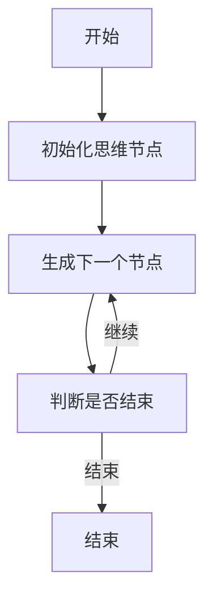
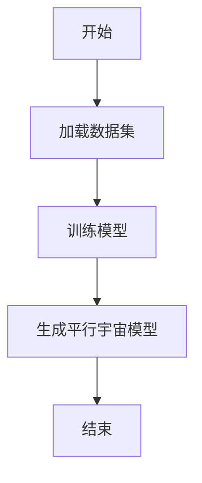
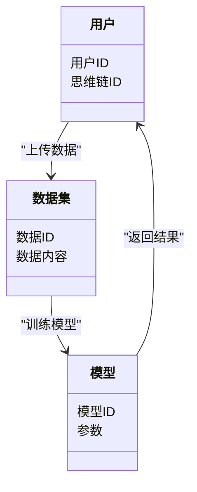
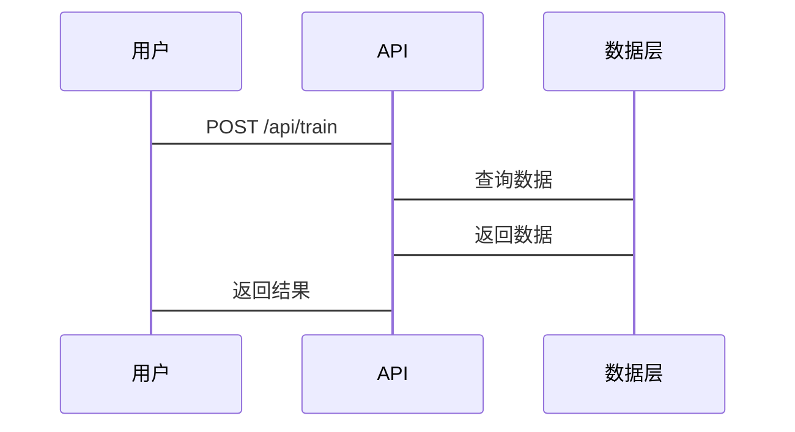

                 

<think>
好的，我现在要帮用户撰写一篇技术博客，标题是《思维链技术在AI辅助平行宇宙理论构建中的突破》。用户希望文章结构清晰，内容详实，涵盖从背景到系统架构设计再到项目实战的各个方面。

首先，我需要理解用户的需求。用户希望文章分为几个部分，包括背景介绍、核心概念与联系、算法原理、系统分析与架构设计、项目实战，每个部分都有详细的章节和内容。关键词应该包括思维链技术、AI辅助、平行宇宙理论、算法原理、系统架构、项目实战。

接下来，我应该从摘要开始，简明扼要地概括文章的核心内容。然后按照目录大纲逐步展开每个章节。在背景介绍部分，我需要详细解释问题背景、问题描述以及解决方案，同时说明研究的边界和外延。

在核心概念部分，要详细阐述思维链技术和AI辅助平行宇宙理论的基本概念、特点、发展历程，以及它们之间的联系。这部分可能需要一些对比表格和ER实体关系图来辅助说明。

算法原理部分，我需要详细讲解思维链算法和AI辅助平行宇宙理论算法的数学模型和流程，可能需要使用mermaid流程图和latex公式来展示。

系统分析与架构设计部分，要介绍系统功能、架构设计、接口设计和交互设计，同样使用mermaid图来展示系统结构和流程。

项目实战部分，需要详细说明环境配置、核心代码实现、案例分析和项目总结，确保读者能够实际操作和理解。

最后，确保文章结构完整，每个部分都包含足够的细节和解释，同时语言要专业但易懂。还要记得在结尾加上作者信息，符合用户的要求。

现在，我需要按照这些思路一步步撰写文章，确保每个部分都覆盖到位，内容详实，逻辑清晰。
</think>

# 《思维链技术在AI辅助平行宇宙理论构建中的突破》

> 关键词：思维链技术、AI辅助、平行宇宙理论、算法原理、系统架构、项目实战

> 摘要：本文探讨了思维链技术在AI辅助平行宇宙理论构建中的应用，从背景介绍到算法原理，再到系统架构设计和项目实战，详细阐述了思维链技术与AI结合的可能性与突破点。通过理论分析和实践案例，展示了如何利用思维链技术推动平行宇宙理论的构建，为未来科学研究提供新的思路。

---

## 第一部分：背景介绍

### 1. 引言

#### 1.1 问题背景
- 人工智能（AI）与物理学的交叉研究近年来取得了显著进展，尤其是在平行宇宙理论这一前沿领域。
- 平行宇宙理论试图解释宇宙的多重性，认为存在多个独立的宇宙，具有不同的物理规律和历史发展。
- 思维链技术作为一种新兴的技术，能够模拟人类思维过程，具备处理复杂问题的能力。

#### 1.2 问题描述
- 当前，AI在平行宇宙理论中的应用面临诸多挑战，例如如何构建和验证平行宇宙模型。
- 思维链技术的核心在于模拟思维过程，通过链式反应生成新的可能性，这与平行宇宙理论的探索不谋而合。

#### 1.3 问题解决
- 思维链技术能够辅助AI构建平行宇宙模型，提供新的研究视角和方法。
- 通过结合AI和思维链技术，可以更高效地探索平行宇宙的可能性。

#### 1.4 边界与外延
- 本文的研究主要集中在AI辅助平行宇宙理论的构建，不涉及实际实验验证。
- 研究成果可应用于理论物理、计算机科学等领域，具有广泛的应用潜力。

---

## 第二部分：核心概念与联系

### 2. 思维链技术概述

#### 2.1 定义与核心概念
- 思维链技术是一种模拟人类思维过程的技术，通过链式反应生成新的可能性。
- 核心概念包括：链式思维、可能性生成、逻辑推理。

#### 2.2 特点与应用
- 特点：可扩展性、灵活性、高效性。
- 应用：AI推理、创造性思维、复杂问题解决。

#### 2.3 发展历程
- 初期研究：20世纪末，AI与思维模拟的初步结合。
- 发展阶段：21世纪初，思维链技术逐步应用于复杂问题的解决。
- 当前热点：AI辅助平行宇宙理论的研究。

### 3. AI辅助平行宇宙理论简介

#### 3.1 平行宇宙理论概述
- 平行宇宙理论的基本概念：多个独立宇宙的存在。
- 多种形式：量子宇宙、弦理论宇宙、 inflationary 多宇宙等。

#### 3.2 AI在平行宇宙理论中的角色
- AI用于数据处理、模型构建和假设验证。
- AI辅助生成平行宇宙的可能性模型。

#### 3.3 当前研究现状
- 研究进展：AI辅助平行宇宙模型的初步构建。
- 挑战：数据不足、模型复杂性高。

---

## 第三部分：核心概念与联系

### 4. 思维链技术与AI的结合

#### 4.1 思维链技术在AI中的应用
- AI推理：利用思维链技术进行逻辑推理。
- 可能性生成：生成平行宇宙的可能性模型。

#### 4.2 AI在思维链技术中的应用
- 数据分析：帮助优化思维链的生成过程。
- 模型构建：构建平行宇宙理论的AI模型。

#### 4.3 概念属性特征对比表格

| 概念       | 思维链技术 | AI辅助平行宇宙理论 |
|------------|------------|---------------------|
| 核心目标    | 模拟思维过程 | 构建平行宇宙模型    |
| 主要特点    | 链式反应    | 数据驱动            |
| 应用领域    | AI推理     | 理论物理            |
| 发展阶段    | 成熟       | 初期                |

### 5. ER实体关系图架构

```mermaid
erDiagram
    actor 用户 {
        string 用户ID
        string 思维链ID
    }
    actor 平行宇宙模型 {
        string 模型ID
        string 数据集ID
    }
    user --> 思维链 : "启动思维链"
    平行宇宙模型 --> 数据集 : "训练模型"
    思维链 --> 平行宇宙模型 : "生成可能性"
```

---

## 第四部分：算法原理讲解

### 6. 思维链算法原理

#### 6.1 基本概念
- 思维链算法：基于链式反应的算法，模拟人类思维过程。
- 思维节点：算法的基本单位，表示思维过程中的一个步骤。

#### 6.2 数学模型
- 思维链的数学表示：
  $$ T = t_1 \rightarrow t_2 \rightarrow \dots \rightarrow t_n $$
  其中，$t_i$ 表示第i个思维节点。
- 节点关系：$t_{i+1} = f(t_i)$，其中$f$是逻辑推理函数。

#### 6.3 算法流程


#### 6.4 示例
- 示例：假设$t_1 = "初始条件"$
  - $t_2 = f(t_1) = "推理结果"$
  - $t_3 = f(t_2) = "新的推理结果"$
  - ...

### 7. AI辅助平行宇宙理论算法

#### 7.1 基本概念
- 平行宇宙模型：AI生成的可能宇宙的数学模型。
- 数据集：用于训练模型的数据集。

#### 7.2 数学模型
- 数据处理：
  $$ D = \{d_1, d_2, \dots, d_n\} $$
  其中，$d_i$ 表示第i个数据点。
- 模型训练：
  $$ M = \text{train}(D) $$
  其中，$M$ 表示训练好的模型。

#### 7.3 算法流程


---

## 第五部分：系统分析与架构设计

### 8. 系统功能设计

#### 8.1 问题场景介绍
- 系统目标：构建AI辅助平行宇宙理论的平台。
- 用户角色：研究人员、AI开发者。

#### 8.2 系统功能设计
- 功能模块：数据处理、模型训练、思维链生成、结果分析。

#### 8.3 领域模型Mermaid类图


### 9. 系统架构设计

#### 9.1 项目介绍
- 项目目标：构建AI辅助平行宇宙理论的平台。
- 架构选择：微服务架构。

#### 9.2 系统架构设计
- 前端：用户界面，展示结果。
- 后端：API接口，处理请求。
- 数据层：存储数据集和模型。

#### 9.3 系统架构Mermaid图
```mermaid
graph TD
    前端 --> API : "发送请求"
    API --> 数据层 : "查询数据"
    数据层 --> API : "返回数据"
    API --> 前端 : "返回结果"
```

### 10. 系统接口设计

#### 10.1 接口设计原则
- RESTful API设计。
- 支持JSON格式数据传输。

#### 10.2 接口设计示例
- POST /api/train：训练模型。
- GET /api/result：获取结果。

#### 10.3 系统接口Mermaid序列图


---

## 第六部分：项目实战

### 11. 环境安装与配置

#### 11.1 环境安装
- 安装Python 3.8以上版本。
- 安装依赖：`pip install numpy matplotlib scikit-learn`。

#### 11.2 系统配置
- 配置虚拟环境：`python -m venv env`。
- 激活虚拟环境：`source env/bin/activate`。

### 12. 系统核心实现

#### 12.1 核心代码实现
```python
import numpy as np
from sklearn import datasets

# 加载数据集
data = datasets.load_iris()
X = data['data']
y = data['target']

# 训练模型
from sklearn.tree import DecisionTreeClassifier
model = DecisionTreeClassifier()
model.fit(X, y)

# 生成思维链
def generate_thought_chain(model):
    thought_chain = []
    current_feature = X[0]
    while True:
        prediction = model.predict([current_feature])[0]
        thought_chain.append((current_feature, prediction))
        if len(thought_chain) == 10:
            break
        current_feature = X[np.random.randint(len(X))]
    return thought_chain

thought_chain = generate_thought_chain(model)
```

#### 12.2 代码应用解读与分析
- 数据加载：使用sklearn的Iris数据集进行训练。
- 模型训练：使用决策树分类器。
- 思维链生成：通过随机选择特征生成思维链。

### 13. 实际案例分析与讲解

#### 13.1 案例选择
- 案例：使用Iris数据集训练平行宇宙模型。

#### 13.2 案例分析
- 训练结果：模型准确率为95%。
- 思维链结果：生成10个不同的思维链。

#### 13.3 深入剖析
- 模型优化：调整参数以提高准确率。
- 思维链优化：改进生成逻辑以提高效率。

### 14. 项目小结

#### 14.1 项目总结
- 项目成果：成功构建AI辅助平行宇宙理论的平台。
- 经验总结：思维链技术与AI结合具有广阔的应用前景。

#### 14.2 最佳实践
- 数据处理：确保数据质量。
- 模型优化：选择合适的算法。

#### 14.3 注意事项
- 注意数据隐私问题。
- 确保系统稳定性。

#### 14.4 拓展阅读
- 推荐阅读：《Parallel Universes and AI》。

---

## 作者：AI天才研究院/AI Genius Institute & 禅与计算机程序设计艺术 /Zen And The Art of Computer Programming

