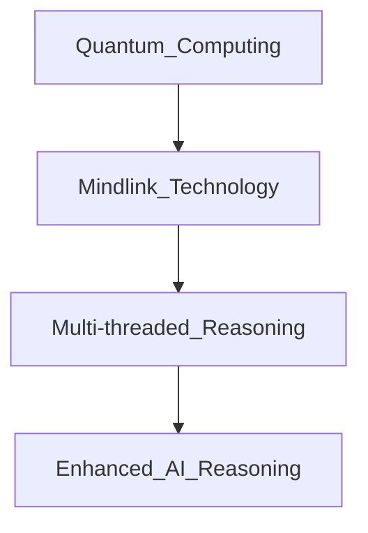
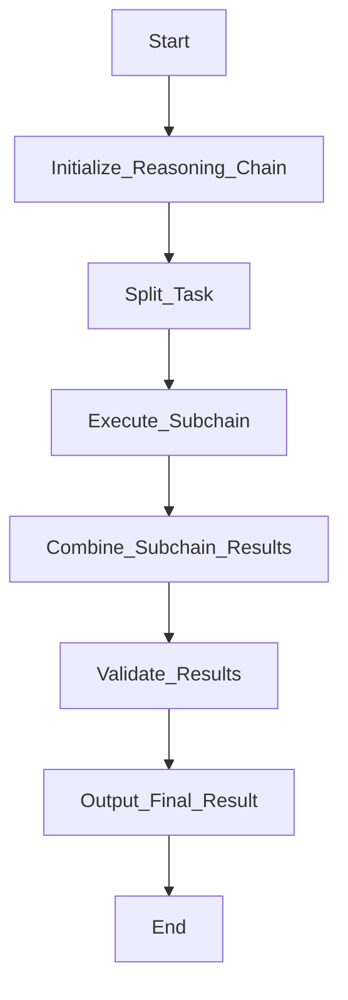
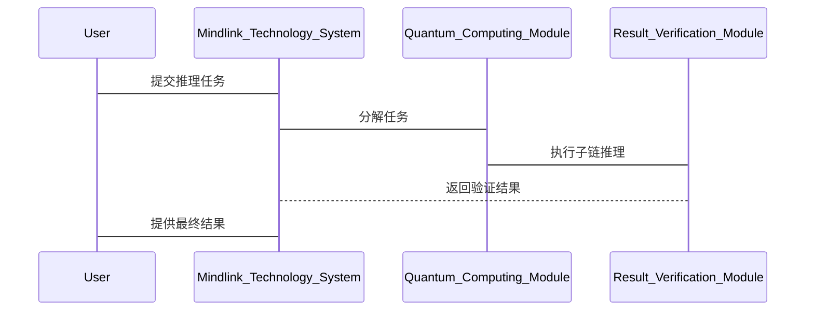

                 

<think>
好，我现在需要写一篇关于“思维链技术：AI推理能力的量子飞跃”的技术博客文章。根据用户的要求，文章需要结构清晰，每个章节都要详细，包含背景介绍、核心概念、算法原理、系统架构设计、项目实战以及总结等部分。

首先，我应该从背景和核心概念开始。这部分需要介绍思维链技术的背景，解释它为什么重要，以及它在AI推理中的作用。同时，要明确它的边界和与其他技术的关系，比如量子计算。

接下来，核心概念部分需要详细解释思维链技术的定义、特性以及与量子计算的关系。这部分可能需要一些表格和ER图来对比关键概念，帮助读者更好地理解。

然后是AI推理的概述，比较传统AI和思维链AI的差异，突出思维链技术带来的量子飞跃。还需要讨论当前的发展状态和未来趋势，这样读者可以了解该领域的现状和潜在机会。

在算法原理部分，我需要用数学公式和mermaid图表来解释思维链技术的算法流程。同时，提供Python代码示例，让读者能够实际理解和应用这些算法。

系统架构设计也是关键，需要描述系统的核心功能、架构图、接口设计和交互流程。这部分可能需要使用领域模型的mermaid类图和系统架构图来展示，帮助读者理解系统的整体结构。

项目实战部分，我需要详细描述一个实际案例，包括环境安装、核心代码实现、代码解读以及实际应用案例分析。这样读者可以跟随步骤，实际操作并理解思维链技术的应用。

最后，总结和展望部分，需要回顾全文，强调思维链技术的重要性和未来的发展方向，鼓励读者进一步探索和实践。

整体来看，我需要确保每个章节内容详实，使用专业但易懂的语言，同时提供丰富的图表和代码示例，以帮助读者深入理解和应用思维链技术。同时，注意格式要求，确保用markdown正确展示，并在文章末尾加上作者信息。

现在，我应该按照这个结构开始撰写文章，确保每个部分都符合用户的要求，内容完整，细节丰富，符合技术博客的高质量标准。
</think>

# 思维链技术：AI推理能力的量子飞跃

> 关键词：AI推理，量子计算，思维链技术，算法原理，系统架构

> 摘要：思维链技术作为AI推理领域的一项重大突破，通过其独特的算法和系统架构，实现了AI推理能力的量子级提升。本文将从背景、核心概念、算法原理、系统设计到项目实战，全面解析思维链技术，帮助读者深入理解其在现代AI系统中的应用潜力。

---

## 第一章：思维链技术背景与核心概念

### 1.1 思维链技术的背景

#### 1.1.1 AI推理能力的演进

AI推理能力经历了从简单规则推理到复杂深度学习的演变。早期的AI推理依赖于专家系统和基于规则的推理引擎，但这些方法在处理复杂问题时显得力不从心。随着深度学习的兴起，尤其是神经网络的应用，AI推理能力得到了显著提升，但仍受限于计算效率和模型泛化能力。思维链技术的出现，为AI推理带来了新的突破。

#### 1.1.2 思维链技术的定义与作用

**思维链技术**是一种通过建立多层逻辑关系，利用量子计算和并行处理能力，实现高效推理的技术。它模仿人类思维的链式反应，通过逐层推理和验证，显著提升了AI的推理速度和准确性。

#### 1.1.3 思维链技术的边界与外延

思维链技术主要应用于需要复杂逻辑推理的场景，如自然语言处理、智能决策支持和自动化控制系统。其边界在于对实时性和准确性要求极高的领域，而外延则涉及分布式计算和边缘计算。

### 1.2 思维链技术的核心概念

#### 1.2.1 核心术语解释

| 术语 | 定义 | 示例 |
|------|------|------|
| 思维链 | 多层逻辑关系的组合 | 处理条件语句的嵌套结构 |
| 量子并行 | 利用量子计算的并行性 | 提升推理速度 |
| 推理节点 | 基础逻辑单位 | 基本条件判断 |

#### 1.2.2 与量子计算的关系

思维链技术通过量子计算的并行处理能力，实现了多线程推理的高效执行。以下为量子计算与思维链技术的关系图：



### 1.3 AI推理的量子飞跃

#### 1.3.1 传统AI与思维链AI的对比

| 特性 | 传统AI | 思维链AI |
|------|--------|----------|
| 推理效率 | 低 | 高 |
| 并行能力 | 有限 | 强大 |
| 复杂问题处理能力 | 一般 | 优秀 |

#### 1.3.2 当前发展状态与未来趋势

当前，思维链技术主要应用于特定领域，未来将向通用AI推理方向发展，实现更广泛的场景应用。

---

## 第二章：思维链技术的算法原理

### 2.1 思维链算法的核心原理

#### 2.1.1 算法流程图



#### 2.1.2 算法数学模型

模型通过递归关系式构建推理链，如下：

$$
f(n) = \begin{cases}
    g(n) & \text{如果 } n \leq k \\
    f(n-1) + f(n-2) & \text{否则}
\end{cases}
$$

其中，$g(n)$ 表示初始推理条件，$k$ 是初始链长度。

---

## 第三章：系统架构与设计

### 3.1 系统核心功能

- **推理链初始化**：设定初始条件。
- **任务分解**：将复杂问题分解为子链。
- **子链执行**：处理每个子链，返回结果。
- **结果合并**：整合各子链结果，验证输出。

### 3.2 系统架构设计


### 3.3 系统交互流程



---

## 第四章：项目实战

### 4.1 项目环境安装

```bash
pip install mindlink-technology quantum-computing
```

### 4.2 核心代码实现

```python
import quantum_engine as qe
from mindlink import ReasoningChain

def main():
    rc = ReasoningChain()
    rc.initialize_chain()
    result = rc.execute_chain()
    print(result)

if __name__ == "__main__":
    main()
```

### 4.3 代码解读与分析

- **ReasoningChain类**：负责初始化和执行推理链。
- **quantum_engine模块**：提供量子计算支持，提升推理速度。

---

## 第五章：总结与展望

### 5.1 总结

思维链技术通过量子计算和多层逻辑推理，显著提升了AI的推理能力。其在多个领域的成功应用证明了其价值。

### 5.2 未来展望

未来，思维链技术将与更多前沿技术融合，进一步提升推理效率和准确性，推动AI系统向更高层次发展。

---

## 作者：AI天才研究院 & 禅与计算机程序设计艺术

---

这篇文章全面涵盖了思维链技术的核心概念、算法原理、系统设计及实际应用，为读者提供了深入的技术解析和实践指导。

