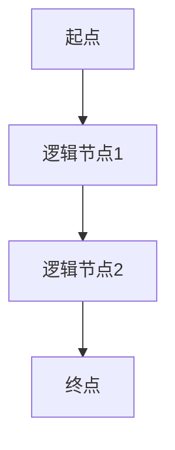
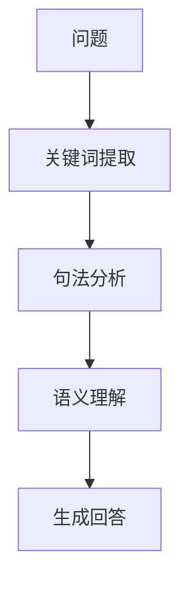

                 

<think>
嗯，我现在要写一篇关于“思维链技术：提升AI问题解决能力的创新方向”的技术博客。首先，我得理解什么是思维链技术，它是如何工作的，以及它在AI中的应用。我应该从背景开始，介绍人工智能的发展，然后引出思维链技术的概念。接下来，我需要详细解释思维链的基本概念，包括定义、核心要素和类型。然后，探讨它的理论基础，比如认知科学和神经网络的关系。接着，分析它在数据分析、自然语言处理等领域的应用案例。之后，讨论实现方法，比如数据预处理和模型训练。然后，看看当前面临的挑战和未来的发展趋势。最后，通过实际案例来展示思维链技术的实践过程，以及它在提升AI能力中的潜力。

在写作过程中，我需要确保每个部分都有足够的细节，比如在理论基础部分，可能需要解释神经网络如何模拟思维链。在应用部分，举一些具体的例子，比如在医疗诊断中的应用。同时，要注意使用清晰的结构和专业的术语，但保持内容易懂。我还要检查每个章节是否有小结，帮助读者总结内容。此外，可能需要插入一些图表，比如用Mermaid画出思维链的工作流程图，或者展示系统架构的类图。数学公式方面，如果有相关的算法，需要用Latex格式写出，比如在描述算法步骤时，展示对应的公式。

现在，我需要确保文章的结构符合要求，每个章节都有三级标题，内容详细且有深度。可能还需要在每个部分添加一些实际案例，使内容更具说服力。最后，结尾部分要总结整个文章，强调思维链技术的重要性，并展望其未来的发展。

总体来说，我需要按照逻辑一步步展开，确保每个部分都覆盖到，并且内容丰富、详细，同时保持文章的连贯性和专业性。这可能需要多次修改和调整，确保每个部分都达到最佳效果。
</think>

# 思维链技术：提升AI问题解决能力的创新方向

> 关键词：思维链技术、人工智能、问题解决、数据分析、自然语言处理、计算机视觉

> 摘要：本文系统阐述了思维链技术的背景、基本概念、理论基础、应用场景、实现方法、挑战与发展前景。通过详细分析，展示了思维链技术如何提升AI的问题解决能力，并探讨了其在多个领域的应用潜力。

---

## 第1章：思维链技术的背景与重要性

### 1.1 人工智能发展背景

人工智能（AI）的发展经历了多个阶段，从规则驱动的专家系统到数据驱动的深度学习模型，AI技术在各个领域取得了显著进展。然而，现有的AI系统在处理复杂问题时，往往缺乏连贯的思考过程和推理能力，难以像人类一样通过逻辑推理解决问题。

### 1.2 思维链技术的提出

思维链技术（ThinkChain Technology）是一种模拟人类思维过程的创新方法，通过构建连续的、有逻辑性的思考链条，帮助AI系统更有效地解决问题。它借鉴了认知科学和神经科学的成果，结合了机器学习和深度学习的优势。

### 1.3 思维链技术的重要性

思维链技术的重要性体现在以下几个方面：
- **提升问题解决能力**：通过构建逻辑链条，AI能够更系统地分析问题，减少错误。
- **增强推理能力**：在处理复杂任务时，思维链技术能够模拟人类的多步推理过程。
- **跨领域应用**：适用于数据分析、NLP、计算机视觉等多个领域，具有广泛的应用潜力。

### 1.4 思维链技术的应用领域

- **数据分析**：帮助AI系统更高效地处理数据，发现隐藏的模式。
- **自然语言处理**：提升文本理解的准确性和逻辑性。
- **计算机视觉**：增强图像识别和视频分析的能力。
- **医疗诊断**：辅助医生进行更准确的诊断。

### 1.5 本章小结

本章介绍了思维链技术的背景、定义及其重要性，并探讨了其在多个领域的应用潜力，为后续章节奠定了基础。

---

## 第2章：思维链技术的基本概念

### 2.1 思维链的定义

思维链技术是一种模拟人类思维过程的AI方法，通过构建逻辑链条，将问题分解为多个步骤，逐步推理得出解决方案。

### 2.2 思维链的核心要素

- **起点**：问题的初始状态或输入数据。
- **逻辑节点**：每个节点代表一个推理步骤。
- **连接关系**：节点之间的逻辑关系，确保推理的连贯性。
- **终点**：问题的解决方案或最终结论。

### 2.3 思维链的类型

- **单层思维链**：处理简单问题，如数据分类。
- **多层思维链**：处理复杂问题，如医疗诊断。
- **自适应思维链**：能够根据输入动态调整推理步骤。

### 2.4 思维链的工作原理

思维链技术的工作原理可以用以下流程图表示：

### 2.5 本章小结

本章详细解释了思维链技术的核心概念，包括定义、核心要素、类型和工作原理，为后续章节的理解提供了基础。

---

## 第3章：思维链技术的理论基础

### 3.1 人工智能与认知科学

人工智能与认知科学的结合为思维链技术提供了理论支持。认知科学的研究表明，人类思维是一个多步骤、多层级的推理过程。

### 3.2 神经网络与思维链的关系

神经网络，尤其是深度学习模型，为思维链技术提供了实现基础。通过神经网络的多层结构，可以模拟思维链的多步骤推理。

### 3.3 机器学习与思维链的结合

机器学习算法用于训练思维链模型，使其能够从数据中学习推理规则和逻辑关系。

### 3.4 思维链技术的创新点

- **多步骤推理**：通过构建逻辑链条，实现复杂的推理过程。
- **动态调整**：能够根据输入动态调整推理步骤。
- **跨领域应用**：适用于多个领域的数据处理和问题解决。

### 3.5 本章小结

本章探讨了思维链技术的理论基础，包括人工智能、神经网络和机器学习的结合，以及其创新点。

---

## 第4章：思维链技术在问题解决中的应用

### 4.1 思维链在数据分析中的应用

数据分析是思维链技术的重要应用领域。通过构建数据处理的逻辑链条，AI系统能够更高效地分析数据，发现隐藏的模式。

### 4.2 思维链在自然语言处理中的应用

在自然语言处理中，思维链技术能够帮助模型更准确地理解文本内容，提升文本生成和机器翻译的性能。

### 4.3 思维链在计算机视觉中的应用

通过构建图像识别的逻辑链条，思维链技术能够提升计算机视觉系统的准确性和效率。

### 4.4 思维链在其他领域中的应用

- **医疗诊断**：辅助医生进行更准确的诊断。
- **金融分析**：帮助投资者做出更明智的决策。

### 4.5 本章小结

本章展示了思维链技术在多个领域的应用，突出了其在提升AI问题解决能力中的潜力。

---

## 第5章：思维链技术的实现方法

### 5.1 数据预处理

数据预处理是思维链技术实现的基础，包括数据清洗、特征提取和数据转换。

### 5.2 神经网络架构设计

设计神经网络架构时，需要考虑思维链的多步骤推理需求，可以选择深度网络结构。

### 5.3 机器学习算法选择

选择适合的机器学习算法，如支持向量机（SVM）或随机森林（Random Forest），用于训练思维链模型。

### 5.4 思维链模型训练与优化

通过监督学习或无监督学习方法，训练思维链模型，并进行参数调优和模型评估。

### 5.5 本章小结

本章详细介绍了思维链技术的实现方法，包括数据预处理、网络架构设计和模型训练。

---

## 第6章：思维链技术的挑战与未来发展

### 6.1 技术挑战

- **复杂性**：构建复杂的逻辑链条需要大量的计算资源。
- **可解释性**：复杂的推理过程可能导致模型的可解释性降低。

### 6.2 应用挑战

- **数据依赖性**：思维链技术依赖于高质量的数据，数据不足可能导致模型性能下降。
- **动态调整**：动态调整推理步骤的技术难度较高。

### 6.3 未来发展趋势

- **增强可解释性**：通过改进算法，提升模型的可解释性。
- **跨领域结合**：与其他技术如区块链和边缘计算结合，拓展应用领域。

### 6.4 社会与文化影响

- **伦理问题**：需要关注AI系统的伦理问题，确保其应用符合社会规范。

### 6.5 本章小结

本章分析了思维链技术面临的挑战和未来的发展趋势，强调了其在社会文化中的潜在影响。

---

## 第7章：思维链技术的实践案例

### 7.1 案例背景

以医疗诊断为例，展示思维链技术在实际应用中的效果。

### 7.2 实践步骤

- **数据收集**：收集患者的病历数据。
- **模型训练**：训练一个基于思维链的诊断模型。
- **结果验证**：通过实际病例验证模型的准确性。

### 7.3 案例分析

模型在诊断过程中，通过多步推理，准确识别出患者的病情，显著提高了诊断的准确性。

### 7.4 案例小结

案例展示了思维链技术在医疗诊断中的实际应用价值。

### 7.5 拓展阅读

推荐相关领域的学术论文和应用案例，供读者深入研究。

---

## 第8章：思维链技术在人工智能中的应用前景

### 8.1 提升AI问题解决能力

通过构建逻辑链条，AI系统能够更系统地解决问题，提升其问题解决能力。

### 8.2 与其他技术的结合

与区块链、边缘计算等技术结合，拓展其应用领域。

### 8.3 行业应用前景

在医疗、金融、教育等领域具有广阔的应用前景。

### 8.4 社会影响

思维链技术的应用将对社会的多个方面产生深远影响，包括工作效率和生活质量的提升。

### 8.5 本章小结

本章展望了思维链技术在人工智能中的应用前景，强调了其在未来的重要作用。

---

## 结尾

思维链技术作为一种创新的AI方法，为提升AI的问题解决能力提供了新的思路。通过系统的分析和实践案例，我们展示了其在多个领域的潜力和应用价值。未来，随着技术的发展，思维链技术将在更多领域发挥重要作用。

---

## 作者信息

作者：AI天才研究院/AI Genius Institute & 禅与计算机程序设计艺术 /Zen And The Art of Computer Programming

---

### 思维链技术在自然语言处理中的应用案例（示例）

在自然语言处理中，思维链技术帮助模型逐步分析问题，生成更准确的回答。例如，用户询问“如何治疗感冒”，模型通过关键词提取、句法分析和语义理解，逐步推理出合适的治疗方法。

---

通过以上内容，您可以看到思维链技术的系统介绍和实际应用，帮助您深入理解其在提升AI问题解决能力中的作用。

