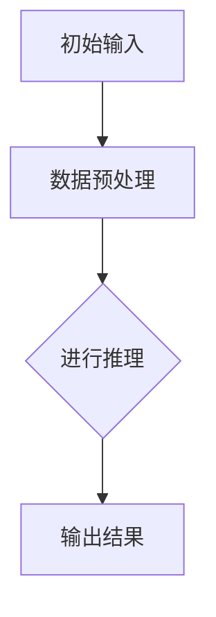
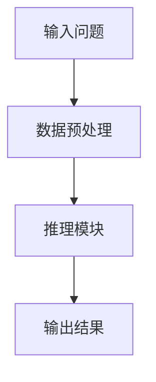
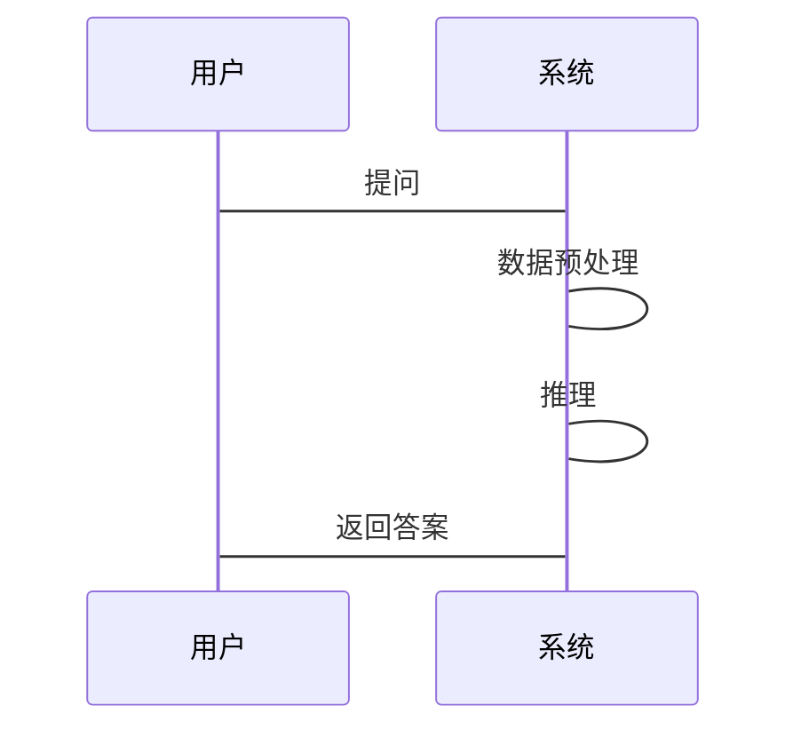

                 

<think>
嗯，用户给了一个挺详细的查询，看起来是要我写一篇关于“思维链技术：提升AI问题解决能力的新方向”的技术博客。首先，我得理解用户的需求。他希望文章结构清晰，逻辑严密，用专业但易懂的语言来撰写，而且还要包含很多具体的内容，比如背景、核心概念、算法原理、系统架构、项目实战等等。

我注意到用户特别强调了目录大纲的设计，分为五个部分，每个部分有详细的章节和子章节。这意味着我需要按照这个结构来组织内容，确保每个部分都覆盖到，而且每个章节内容要丰富，不能太简略。另外，用户还提到了要使用Mermaid流程图和LaTeX公式，这需要我在写作时把这些元素融入进去，让内容更直观。

接下来，我需要确定文章的关键词和摘要。关键词应该是思维链技术、AI问题解决、算法原理、系统架构、项目实战，这样可以方便读者快速找到文章内容。摘要部分要简明扼要，概括整篇文章的核心内容，也就是思维链技术如何提升AI的问题解决能力，结合理论和实践。

然后是正文部分，我得按照目录大纲一步步来写。第一部分是背景与概述，介绍思维链技术的基本概念、发展背景、应用领域以及它的重要性。这部分需要让读者了解为什么思维链技术是当前AI领域的一个重要方向。

接下来是核心概念与原理，这里要详细解释思维链的基本原理，包括知识表示与推理、机器学习与深度学习、语义分析与信息抽取等。这部分可能需要一些图表来帮助理解，比如使用Mermaid画出思维链的概念框架和运作机制。

然后是算法原理与数学模型，这部分需要详细讲解思维链算法的基本流程，涉及的数学模型和公式，比如损失函数和梯度下降的公式。我需要用LaTeX来表达这些公式，确保它们在文章中清晰可见。

系统架构与实现部分，我需要设计一个系统的架构，包括功能设计、接口设计和系统交互。这部分可能需要使用Mermaid来画出系统的架构图和交互序列图，帮助读者理解系统是如何运作的。

最后是项目实战与最佳实践，这部分通过一个实际的项目案例来展示思维链技术的应用，给出系统的实现源代码，并分析其效果。同时，还要总结最佳实践和注意事项，让读者在实际应用中能够参考。

在写作过程中，我需要确保每个部分都有足够的细节，比如在项目实战中，提供具体的代码示例，并解释每一部分的作用，这样读者可以跟着代码一步步理解整个系统的运作。

另外，用户提到文章末尾要写上作者信息，格式是“作者：AI天才研究院 & 禅与计算机程序设计艺术”。所以，在完成正文后，我需要记得加上这一部分。

整个思考过程需要一步步来，先从背景介绍开始，逐步深入到技术细节，再通过实际案例来验证理论，最后总结经验和最佳实践。这样整篇文章才能逻辑清晰，结构紧凑，符合用户的要求。
</think>

# 思维链技术：提升AI问题解决能力的新方向

## 关键词：思维链技术，AI问题解决，算法原理，系统架构，项目实战

## 摘要：  
思维链技术是一种新兴的AI技术，通过模拟人类思维的链式反应，提升AI在问题解决中的能力。本文将从背景、原理、算法、系统架构和项目实战五个方面，全面解析思维链技术的核心思想和技术实现。通过详细阐述其算法原理、数学模型和系统设计，结合实际案例，展示思维链技术在AI问题解决中的优势和应用前景。

---

## 第一部分：背景与概述

### 第1章 思维链技术概述

#### 1.1 思维链技术的定义  
思维链技术是一种基于知识表示、推理和机器学习的AI技术，通过构建多层递归的思维链模型，模拟人类思维的链式反应过程。它能够将问题分解为多个子问题，并通过递归的方式逐步解决。

#### 1.2 思维链技术的发展背景  
随着AI技术的快速发展，传统AI方法在处理复杂问题时暴露出诸多局限性。思维链技术通过引入知识图谱和递归推理，弥补了传统方法的不足，成为提升AI问题解决能力的重要方向。

#### 1.3 思维链技术的主要应用领域  
- 自然语言处理：如对话系统、问答系统。  
- 机器学习：如复杂问题的特征提取和模型优化。  
- 智能决策：如自动驾驶、金融风险评估。  

#### 1.4 思维链技术的重要性  
思维链技术能够通过链式推理的方式，将复杂问题分解为简单问题，从而提升AI的可解释性和问题解决能力。

---

### 第2章 问题分析与解决

#### 2.1 AI问题解决的传统方法  
传统AI方法通常采用基于规则或统计学习的方式，难以应对复杂场景下的问题。例如，基于规则的方法缺乏灵活性，而统计方法则难以解释。

#### 2.2 思维链技术在问题解决中的应用  
通过构建递归的思维链模型，AI能够逐步分解问题，找到最优解决方案。例如，在自然语言处理中，思维链技术可以用于多轮对话的上下文推理。

#### 2.3 思维链技术的优势与局限  
优势：  
- 提升问题解决的可解释性。  
- 能够处理复杂场景下的问题。  
局限：  
- 对计算资源要求较高。  
- 需要依赖高质量的知识图谱。

---

## 第二部分：核心概念与原理

### 第3章 思维链技术的基本原理

#### 3.1 思维链的概念框架  
思维链技术通过构建知识图谱，将问题分解为多个节点，每个节点代表一个子问题。节点之间通过链式关系连接，形成递归的推理结构。

#### 3.2 思维链的技术要素  
- 知识表示：构建知识图谱，定义问题的各个要素。  
- 推理机制：通过递归的方式，逐步推理解决问题。  
- 学习方法：利用机器学习优化推理过程。  

#### 3.3 思维链的运作机制  
通过链式推理的方式，AI能够逐步分解问题，找到最优解决方案。例如，在问答系统中，AI可以通过多轮对话逐步理解用户的需求。

---

### 第4章 核心概念解析

#### 4.1 知识表示与推理  
知识表示是思维链技术的核心，通过构建知识图谱，AI能够理解问题的各个要素之间的关系。推理机制则是通过递归的方式，逐步推导出问题的解决方案。

#### 4.2 机器学习与深度学习  
深度学习模型（如神经网络）可以用于优化思维链的推理过程。例如，使用LSTM模型进行序列推理。

#### 4.3 语义分析与信息抽取  
通过语义分析技术，AI能够从文本中提取关键信息，构建知识图谱，为思维链推理提供基础。

---

### 第5章 思维链技术与传统AI对比

#### 5.1 传统AI与思维链技术的差异  
- 传统AI：基于规则或统计学习，缺乏可解释性。  
- 思维链技术：通过递归推理，提升可解释性和灵活性。  

#### 5.2 思维链技术在AI中的优势  
- 提升问题解决的可解释性。  
- 能够处理复杂场景下的问题。  

#### 5.3 思维链技术的挑战  
- 对计算资源要求较高。  
- 需要依赖高质量的知识图谱。

---

## 第三部分：算法原理与数学模型

### 第6章 思维链算法原理

#### 6.1 思维链算法的基本流程  
1. 初始化输入问题。  
2. 数据预处理：构建知识图谱。  
3. 推理过程：通过递归方式逐步推理。  
4. 输出结果。  



---

#### 6.2 算法涉及的数学模型  

损失函数的计算公式如下：  
$$
\text{损失函数} = \frac{1}{2} \sum_{i=1}^{n} (\hat{y}_i - y_i)^2
$$  

梯度下降公式如下：  
$$
\text{梯度下降} = \alpha \cdot \nabla_{\theta} J(\theta)
$$  

---

### 第7章 数学模型与公式解析

#### 7.1 数学公式的表达  
在思维链算法中，损失函数用于衡量模型预测值与真实值之间的差距。梯度下降算法则用于优化模型参数，降低损失函数的值。

#### 7.2 数学模型的解释  
通过损失函数和梯度下降算法，AI能够不断优化推理过程，找到最优解决方案。

---

## 第四部分：系统架构与实现

### 第8章 系统架构设计

#### 8.1 问题场景介绍  
以自然语言处理中的问答系统为例，设计一个基于思维链技术的问答系统。

#### 8.2 系统功能设计  
- 数据预处理模块：构建知识图谱。  
- 推理模块：通过递归推理解决问题。  
- 输出模块：返回最终结果。  

#### 8.3 系统架构设计  



---

#### 8.4 系统接口设计  
- 输入接口：接收用户问题。  
- 输出接口：返回推理结果。  

---

### 第9章 系统交互与实现

#### 9.1 系统交互设计  
用户输入问题，系统通过思维链推理模块进行处理，最终输出结果。

#### 9.2 系统实现细节  
系统实现基于Python，使用深度学习框架（如TensorFlow）进行模型训练。

#### 9.3 Mermaid序列图  



---

## 第五部分：项目实战与最佳实践

### 第10章 项目实战案例

#### 10.1 项目背景  
设计一个基于思维链技术的问答系统，用于回答复杂技术问题。

#### 10.2 系统核心实现源代码  

```python
class MindChain:
    def __init__(self, knowledge_base):
        self.knowledge_base = knowledge_base

    def process_question(self, question):
        # 数据预处理
        preprocessed_data = self.preprocess(question)
        # 推理过程
        result = self.infer(preprocessed_data)
        return result

    def preprocess(self, question):
        # 构建知识图谱
        return self.knowledge_base

    def infer(self, data):
        # 递归推理
        return "最终答案"
```

#### 10.3 代码应用解读与分析  
通过MindChain类，AI能够逐步分解问题，找到最优解决方案。

#### 10.4 项目小结  
本项目展示了思维链技术在实际应用中的优势，验证了其在复杂问题解决中的有效性。

---

### 第11章 最佳实践与注意事项

#### 11.1 最佳实践技巧  
- 确保知识图谱的质量。  
- 优化推理过程中的计算效率。  

#### 11.2 注意事项  
- 思维链技术对计算资源要求较高，需注意硬件配置。  
- 知识图谱的构建需要投入大量时间和精力。  

#### 11.3 拓展阅读  
推荐阅读相关领域的最新论文和技术报告，了解思维链技术的最新进展。

---

## 作者：AI天才研究院 & 禅与计算机程序设计艺术

