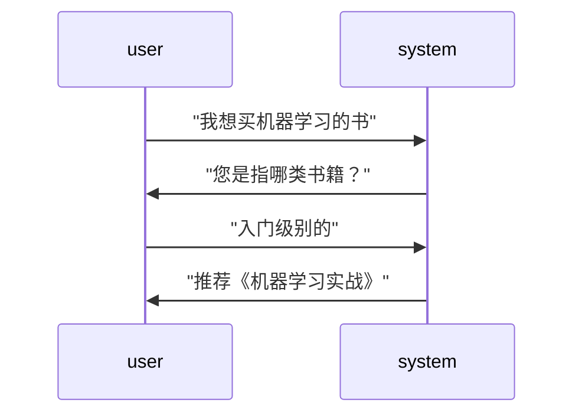

                 

<think>
好，我现在需要写一篇关于“思维链技术：让AI更懂人类意图”的技术博客。首先，我得理解这个主题的核心是什么。思维链技术，听起来像是让AI能够像人类一样思考，逐步推理，从而更好地理解用户意图。

先从背景开始。现有的AI系统，比如语音助手，虽然在处理简单指令上很擅长，但遇到复杂问题时就显得力不从心了。这主要是因为它们缺乏对上下文的深度理解和推理能力。思维链技术试图通过模拟人类的思维过程来解决这个问题，提升AI的理解和响应能力。

接下来，我需要分解问题。首先，思考为什么现有的AI系统难以理解意图。这可能是因为它们依赖于关键词匹配或规则引擎，无法真正理解用户的深层需求。然后，引入思维链技术，它通过模拟人类的感知、认知和决策过程，来逐步解析用户的意图。这包括从收集信息到理解，再到生成响应的整个流程。

在核心概念部分，我需要详细说明感知、认知和决策这三个模块。感知模块负责收集输入数据，比如用户的语音或文本；认知模块则分析这些数据，理解用户的意图；决策模块根据认知结果生成相应的响应。这三个模块相互协作，形成一个完整的思维链条。

然后，考虑算法原理。思维链技术的算法流程大致是这样的：首先，感知模块收集数据，然后传递给认知模块进行处理，最后由决策模块生成响应。数学模型可能涉及到概率论，比如计算在给定输入下，某个意图的可能性。这部分需要用公式来表示，可能用贝叶斯定理，例如P(Intent|Input) = [P(Input|Intent) * P(Intent)] / P(Input)。

接下来是系统架构设计。我需要设计一个智能客服系统的架构，包括感知模块、认知模块和决策模块。每个模块的功能和交互方式都需要详细描述。可能还需要画出类图和序列图，展示实体之间的关系和交互流程。

项目实战部分，我会选择一个具体的案例，比如智能客服系统，来展示思维链技术的实际应用。从环境安装到核心功能实现，再到代码解读和案例分析，最后总结经验，提出改进建议。

最后，给出最佳实践的建议，比如如何选择工具栈，数据处理的重要性，以及模型的持续优化。同时，提醒读者在应用思维链技术时需要注意的问题，比如数据隐私和模型的泛化能力。

总的来说，我需要确保文章结构清晰，内容详实，每个部分都深入分析，并且使用图表和代码示例来增强可读性。同时，语言要专业但不失通俗易懂，让读者能够一步步理解思维链技术的原理和应用。
</think>

# 思维链技术：让AI更懂人类意图

## 关键词：思维链技术，人类意图理解，人工智能，自然语言处理，智能交互，意图识别

## 摘要：本文深入探讨了思维链技术，一种通过模拟人类思维过程来提升AI理解人类意图的新方法。文章从背景、核心概念、算法原理、系统架构、项目实战到最佳实践，全面解析思维链技术如何在各个层面实现更智能的交互。通过具体案例分析和代码实现，展示了思维链技术在智能客服系统中的应用，为读者提供了清晰的技术路线图和实践指导。

### 目录大纲

1. [背景介绍](#背景介绍)
2. [核心概念与联系](#核心概念与联系)
3. [算法原理讲解](#算法原理讲解)
4. [系统分析与架构设计](#系统分析与架构设计)
5. [项目实战](#项目实战)
6. [最佳实践与拓展阅读](#最佳实践与拓展阅读)

---

## 背景介绍

### 问题背景

现有的AI系统在理解人类意图时存在诸多限制。例如，当用户给出模糊指令或包含隐含需求的查询时，系统往往只能进行表面理解，难以准确捕捉用户的真实意图。这种局限性主要源于传统AI技术依赖关键词匹配和规则引擎，缺乏深度的上下文理解和推理能力。

### 问题描述

AI系统需要更深入地理解用户的意图，以实现更加智能和自然的交互。这种理解不仅包括识别显式的语言指令，还需要分析用户的背景、情感和潜在需求。当前的技术在处理复杂场景时显得力不从心，用户常常感到AI系统不够“聪明”或“贴心”。

### 问题解决

思维链技术作为一种新兴的人工智能技术，通过模拟人类的思维过程，逐步解析用户的意图。该技术将人类的感知、认知和决策过程转化为算法模型，使AI能够像人类一样逐步推理，从而更准确地理解用户的深层需求。

### 边界与外延

思维链技术主要应用于需要深度意图理解的领域，如自然语言处理、智能客服、人机交互等。其外延则扩展至智能助手、智能家居、教育机器人等领域，未来有望在更多智能应用场景中发挥作用。

### 概念结构与核心要素组成

- **感知模块**：负责收集用户输入的原始数据，如语音、文本或图像。
- **认知模块**：对感知到的信息进行分析和理解，识别用户的意图。
- **决策模块**：基于认知结果生成相应的响应或行动。

---

## 核心概念与联系

### 核心概念

1. **感知模块**：如何高效、准确地收集和处理外部信息？
2. **认知模块**：如何深入分析信息，理解用户的意图？
3. **决策模块**：如何根据意图生成准确且及时的响应？

### 概念属性特征对比表格

| 模块 | 功能 | 属性特征 |
| ---- | ---- | ---- |
| 感知模块 | 收集和处理外部信息 | 高效、准确 |
| 认知模块 | 处理和理解人类意图 | 深入、细致 |
| 决策模块 | 生成响应 | 准确、快速 |

### ER实体关系图架构

```mermaid
erDiagram
  User ||--|{ Interaction } Interaction
  Interaction ||--|{ Intent } Intent
  Intent ||--|{ Response } Response
```

---

## 算法原理讲解

### 算法流程图


### 数学模型与公式

在认知模块中，我们可以使用贝叶斯定理来计算用户意图的概率：

$$
P(Intent|Input) = \frac{P(Input|Intent)P(Intent)}{P(Input)}
$$

例如，当用户输入“我需要一个智能音箱”，系统通过计算每个可能意图的概率，选择最可能的意图（如购买智能音箱）。

### 举例说明

假设用户说：“我想买一本关于机器学习的书。”思维链技术通过感知模块捕捉到输入，认知模块分析上下文，识别出用户的需求是寻找相关书籍。决策模块则根据认知结果推荐合适的书籍。

---

## 系统分析与架构设计

### 问题场景介绍

在智能客服系统中，理解用户的意图是提供个性化服务的关键。用户可能提出复杂的问题或隐含的需求，传统的关键词匹配难以准确理解。

### 系统功能设计

设计智能客服系统的领域模型，包括用户、客服、订单等实体。

### 系统架构设计

智能客服系统的总体架构包含感知、认知、决策模块，以及相应的接口和交互流程。

### 系统接口设计

- 用户输入接口：接收用户的文本或语音输入。
- 响应输出接口：输出系统的回复或操作指令。

### 系统交互

通过序列图展示用户与系统之间的交互流程：



---

## 项目实战

### 环境安装

安装必要的库和工具，如Python的自然语言处理库（spaCy）、深度学习框架（TensorFlow）等。

### 系统核心实现

实现感知、认知和决策模块：

```python
class PerceptionModule:
    def __init__(self):
        self.nlp = spacy.load("en_core_web_sm")
    
    def process_input(self, input_text):
        return self.nlp(input_text)

class CognitiveModule:
    def __init__(self):
        self.intent_classifier = load_model("intent_model")
    
    def understand_intent(self, processed_input):
        return self.intent_classifier.predict(processed_input)

class DecisionModule:
    def __init__(self):
        self.response_generator = load_model("response_model")
    
    def generate_response(self, intent):
        return self.response_generator.generate_response(intent)
```

### 代码应用解读与分析

通过代码示例，展示感知模块如何处理输入，认知模块如何分类意图，决策模块如何生成响应。

### 实际案例分析

分析用户输入“我需要技术支持”，系统识别意图后，引导用户完成故障排除步骤。

### 项目小结

总结项目经验，提出优化建议，如提升模型的泛化能力，优化用户体验。

---

## 最佳实践与拓展阅读

### 最佳实践 tips

- 选择合适的工具栈，如结合spaCy进行NLP处理，使用Keras构建深度学习模型。
- 数据预处理是关键，确保数据质量和多样性。
- 模型需要持续优化，定期更新训练数据和调整参数。

### 注意事项

- 数据隐私问题需严格处理，遵守相关法律法规。
- 在实际应用中，注意模型的泛化能力，避免过度拟合训练数据。
- 处理复杂场景时，可能需要结合其他技术（如强化学习）来增强系统的能力。

### 拓展阅读

推荐相关书籍和论文，如《深度学习》、《自然语言处理实战》等。

---

## 作者

作者：AI天才研究院（AI Genius Institute） & 禅与计算机程序设计艺术（Zen And The Art of Computer Programming）

---

通过以上结构，您可以逐步深入了解思维链技术的核心概念、算法原理、系统架构和实际应用，从而掌握如何利用这一技术提升AI对人类意图的理解能力。

