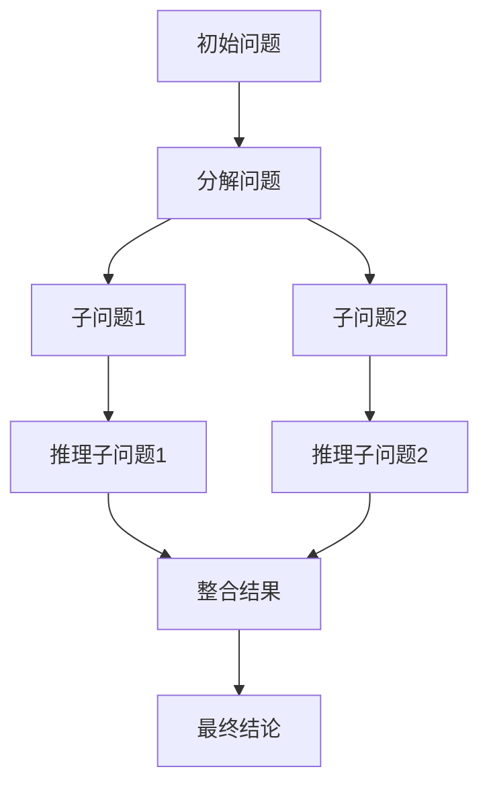
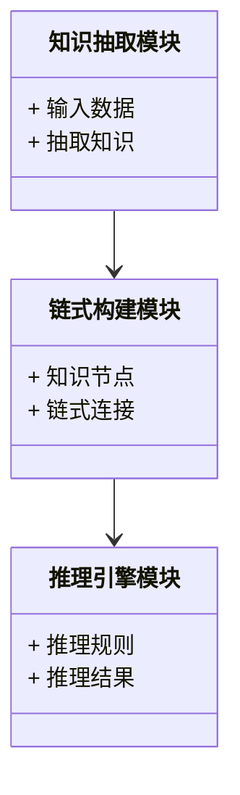

                 

<think>
嗯，好的，我需要帮助用户生成一篇关于“思维链技术：让AI更接近人类思维模式的探索”的技术博客文章。首先，我得仔细理解用户的需求，他希望文章结构清晰，章节详细，内容专业，涵盖背景、原理、应用和未来展望等多个方面。同时，用户还特别强调要符合一定的格式和内容要求，比如使用markdown，包含关键词、摘要，以及每个章节下要有具体的子章节和内容。

首先，我会从文章标题开始，确定关键词和摘要。标题已经给出，我需要选择5-7个核心关键词，如“思维链技术”、“人工智能”、“认知模拟”等。摘要部分要简洁地概括文章的核心内容，说明思维链技术如何让AI更接近人类思维模式。

接下来，根据用户提供的目录大纲，我需要逐步展开每个章节的内容。第一部分是背景与核心概念，包括问题背景和核心概念。问题背景部分，我需要解释当前人工智能的局限性，比如缺乏推理能力，难以处理复杂问题，这些都可以引出思维链技术的必要性。核心概念部分，我需要详细定义思维链技术，解释其工作原理，并与其他AI技术进行比较。

然后是思维链技术的原理，这部分包括基本原理、算法原理和数学模型。基本原理部分要说明思维链的构建和运行机制，可能涉及节点和链的结构。算法部分，我需要选择一种适合的算法，比如分层推理算法，并用mermaid流程图展示流程。数学模型部分，可能需要一些公式，比如节点间的关系或权重计算，这部分要用latex公式表示。

第三部分是实践应用，包括应用场景和项目实战。应用场景可以列举企业决策、教育和医疗诊断等领域。项目实战部分，我需要设计一个具体的项目，比如医疗诊断系统，详细描述系统设计、实现和测试过程，可能还要用mermaid图展示系统架构和交互流程。

最后是未来展望与挑战，这部分要讨论技术的发展趋势，面临的挑战，如数据安全、伦理问题，并提出应对策略。可能还需要一些表格或图表来辅助说明。

在写作过程中，我需要确保每个章节内容丰富，具体详细，比如在核心概念中，用对比表格说明思维链与其他AI技术的区别；在算法部分，用代码示例和流程图详细讲解。同时，要满足用户的格式要求，使用markdown，确保结构清晰，公式正确，图表使用mermaid或类似工具展示。

可能遇到的困难是如何将复杂的理论和技术用简单易懂的语言表达出来，特别是在数学模型和算法部分，需要找到合适的例子和解释方式。另外，系统架构设计部分可能需要更多的技术细节，确保读者能够理解如何实现。

总结一下，我的步骤是：先确定结构，再填充内容，确保每个部分都符合用户的要求，同时保持逻辑连贯，语言专业但不失清晰。最后，检查格式，确保所有要求都满足，比如关键词、摘要、各章节内容，以及结尾的作者信息。
</think>

# 思维链技术：让AI更接近人类思维模式的探索

> **关键词**：思维链技术、人工智能、认知模拟、推理机制、系统架构、算法原理  
> **摘要**：本文深入探讨了思维链技术如何让AI更接近人类思维模式。从问题背景到核心概念，从算法原理到系统架构，再到实践应用和未来展望，全面解析了思维链技术的原理、优势及应用场景，展示了其在推动人工智能发展的潜力。

---

## 第1章: 问题背景与核心概念

### 1.1 问题背景

#### 1.1.1 人工智能与思维链技术
人工智能（AI）近年来取得了显著进展，但在某些关键领域仍存在局限性，如推理能力、复杂问题处理和知识关联性。思维链技术作为一种新兴的技术，旨在通过模拟人类思维的链式结构，弥补这些不足。

#### 1.1.2 当前人工智能的局限性
传统的AI技术在处理需要多步骤推理、知识关联和动态决策的问题时表现不佳。例如，自然语言处理（NLP）模型在理解上下文关系时仍需依赖大量训练数据，缺乏逻辑推理能力。

#### 1.1.3 思维链技术的提出
思维链技术通过构建“链式”知识结构，模拟人类思维的递进过程，使AI能够更好地处理复杂问题，实现更自然的推理和决策。

### 1.2 核心概念

#### 1.2.1 思维链技术的定义
思维链技术是一种基于知识图谱和逻辑推理的AI技术，通过构建链式结构的知识关联，模拟人类思维的递进过程。

#### 1.2.2 思维链技术的工作原理
思维链技术的核心在于将问题分解为多个步骤，并通过链式结构将这些步骤连接起来。每个节点代表一个知识或事实，链式结构则表示这些知识之间的逻辑关系。

#### 1.2.3 思维链技术与其他AI技术的比较
| 技术类型         | 知识表示 | 推理能力 | 动态适应性 |
|------------------|----------|----------|------------|
| 传统NLP          | 分散式    | 弱        | 低          |
| 传统机器学习     | 特征向量  | 有限      | 中          |
| 思维链技术        | 链式结构  | 强        | 高          |

---

## 第2章: 思维链技术原理解析

### 2.1 基本原理

#### 2.1.1 思维链的核心构成
思维链由多个“节点”组成，每个节点代表一个知识或事实。节点之间的关系通过链式结构连接，形成一个完整的知识链条。

#### 2.1.2 思维链的构建与运行
构建思维链的过程包括知识抽取、链式连接和逻辑推理。运行时，AI通过遍历链式结构，逐步推理得出结论。

#### 2.1.3 思维链的扩展与适应性
思维链的扩展性使其能够处理复杂问题。通过动态调整链式结构，AI能够适应新的知识和变化的环境。

### 2.2 算法原理

#### 2.2.1 分层推理算法
分层推理算法是思维链技术的核心算法之一。其流程如下：

1. 输入初始问题。
2. 分解问题为子问题。
3. 对每个子问题进行推理。
4. 将推理结果整合，得出最终结论。

#### 2.2.2 分层推理算法的mermaid流程图

#### 2.2.3 算法性能分析
分层推理算法的时间复杂度主要取决于问题分解的层次深度。在最优情况下，算法复杂度为O(n)，其中n为问题分解的层次数。

### 2.3 数学模型

#### 2.3.1 链式结构的数学表示
链式结构可以表示为一个图，其中节点表示知识，边表示节点之间的关系。具体公式为：
$$
E = \{ (v_i, v_j) \mid v_i, v_j \in V \}
$$
其中，$V$ 表示节点集合，$E$ 表示边集合。

#### 2.3.2 逻辑推理的数学模型
基于一阶逻辑的推理模型可以表示为：
$$
\forall x, P(x) \rightarrow Q(x)
$$
其中，$P(x)$ 表示前提条件，$Q(x)$ 表示结论。

---

## 第3章: 思维链技术实践应用

### 3.1 应用场景

#### 3.1.1 企业决策支持系统
通过构建企业内部的知识链条，帮助管理层进行更高效的战略决策。

#### 3.1.2 教育与培训系统
在教育领域，思维链技术可以用于个性化学习路径的设计和优化。

#### 3.1.3 医疗诊断系统
在医疗领域，思维链技术可以帮助医生进行更准确的诊断和治疗方案制定。

### 3.2 项目实践

#### 3.2.1 项目概述
以医疗诊断系统为例，项目目标是利用思维链技术提高诊断的准确性和效率。

#### 3.2.2 系统设计与实现
系统架构包括知识抽取模块、链式构建模块和推理引擎模块。系统功能模块的类图如下：

#### 3.2.3 系统测试与优化
通过实际案例测试，验证系统在不同场景下的性能和准确性，并根据测试结果进行优化。

---

## 第4章: 思维链技术的发展展望与挑战

### 4.1 发展趋势

#### 4.1.1 技术创新
未来，思维链技术将朝着更复杂和动态化的方向发展，例如自适应链式结构和多模态推理。

#### 4.1.2 行业应用
在金融、教育、医疗等领域，思维链技术将得到更广泛的应用。

### 4.2 挑战与问题

#### 4.2.1 技术实现
如何高效构建和维护链式结构是当前面临的主要技术挑战。

#### 4.2.2 数据安全
链式结构涉及大量知识和数据，如何保护这些数据的安全性是一个重要问题。

### 4.3 应对策略

#### 4.3.1 技术发展
建议加大对思维链技术的研发投入，推动技术创新。

#### 4.3.2 政策建议
制定相关法律法规，确保数据安全和隐私保护。

---

## 结语

思维链技术为人工智能的发展提供了新的思路，通过模拟人类思维的链式结构，使其更接近人类的思维方式。未来，随着技术的不断进步，思维链技术将在更多领域发挥重要作用。

---

**作者：AI天才研究院/AI Genius Institute & 禅与计算机程序设计艺术 /Zen And The Art of Computer Programming**

