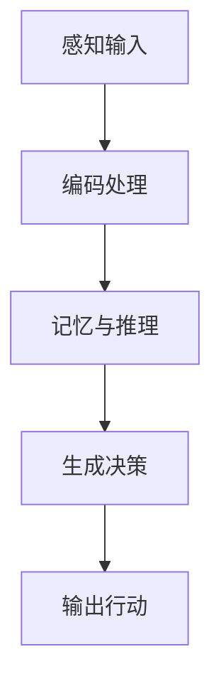
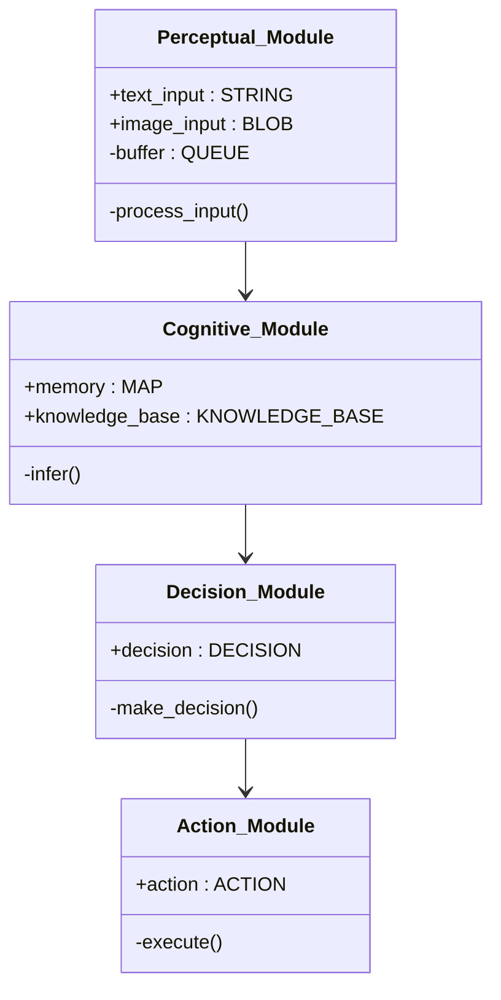
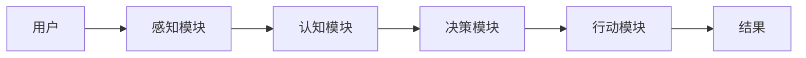
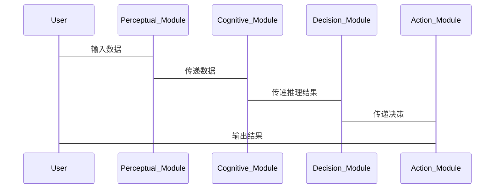

                 

<think>
嗯，用户让我写一篇关于“思维链技术：让AI更接近人类思维的探索研究”的技术博客。首先，我需要明确用户的需求。他们希望这篇文章结构清晰，逻辑严密，适合技术领域读者阅读。我得先理清文章的结构，确保每个部分都涵盖必要的内容。

首先，用户给出了一个详细的目录大纲，这给了我一个很好的框架。我需要按照这个结构来组织内容。第一部分是背景介绍，包括问题背景和核心概念。我得先解释为什么思维链技术是必要的，然后定义它，说明它的特征和组成部分。

接下来是第二部分，核心概念与联系。这部分需要详细的技术分析，可能需要画ER图来展示实体关系。我得思考哪些实体和关系是关键的，比如感知模块、认知模块等，如何在ER图中体现它们之间的关系。

第三部分是算法原理。我需要选择合适的算法，比如递归神经网络，来模拟思维链的动态过程。这部分可能需要绘制流程图，展示数据流和模块之间的交互。同时，数学模型的建立也很重要，我得写出相关的公式，并用例子来说明。

系统分析与架构设计部分，我需要设计系统的各个模块，比如感知、认知、决策和行动模块。使用Mermaid画出类图和架构图，展示系统的结构和交互方式。接口设计和序列图也需要清晰地展示出来。

项目实战部分，我需要选择一个具体案例，比如智能助手应用。写出环境配置、核心代码，并解释代码的工作原理。通过实际案例分析，展示思维链技术的应用效果。

最后，最佳实践部分，我得总结经验，给出建议，并指出未来的拓展方向。同时，确保文章的字数在10000到12000字之间，每个部分都详细具体，满足用户的高质量要求。

在写作过程中，我需要确保技术术语准确，逻辑严谨，同时语言要通俗易懂。可能还需要多次修改，确保每个部分都完整且符合用户的要求。此外，作者信息部分也要正确添加，增强文章的权威性。

总的来说，我需要一步步按照用户提供的大纲，逐一填充内容，确保每个章节都详实具体，同时保持整体结构的连贯性和逻辑性。这样才能写出一篇符合用户要求的高质量技术博客。
</think>

# 思维链技术：让AI更接近人类思维的探索研究

**关键词**：人工智能、思维链技术、认知科学、算法原理、系统架构设计、ER图、数学模型

**摘要**：本文系统地探讨了“思维链技术”的核心概念、基本原理、算法实现及系统架构设计。通过分析人类思维过程，提出了一种模拟和增强人工智能思维能力的理论框架和技术体系。文章从问题背景出发，详细阐述了思维链技术的定义、特征、技术构成及其与人类思维的关系；通过ER实体关系图和算法流程图，深入分析了其核心概念与联系；结合数学模型和公式，详细讲解了其算法原理；最后，通过系统架构设计、项目实战及案例分析，展示了思维链技术在实际应用中的潜力与价值。

---

### 第一部分：背景介绍

#### 第1章：问题背景与核心概念

##### 1.1 问题背景

随着人工智能技术的迅猛发展，AI已经在图像识别、自然语言处理、机器翻译等领域取得了显著成果。然而，这些成果大多局限于特定任务的执行，难以真正模拟人类的思维过程。人类思维是一个复杂而高度整合的系统，包括感知、认知、记忆、推理、决策等多个环节。当前的AI系统在理解复杂情境、创造性思考、动态调整策略等方面仍存在明显不足。因此，如何让AI更接近人类思维，成为当前AI研究的重要方向。

##### 1.2 核心概念

在本书中，我们将探讨的核心概念是“思维链技术”。思维链技术是一种旨在模拟和增强人工智能思维能力的理论框架和技术体系。它通过分析人类思维的动态过程，构建AI的思维模型，使其能够更自然地处理复杂任务。思维链技术的核心目标是让AI在理解、推理、决策和创造等方面更接近人类。

---

### 第二部分：思维链技术核心概念与联系

#### 第3章：核心概念原理与属性特征

##### 3.1 核心概念

思维链技术包含以下核心概念：

- **感知模块**：负责处理外部信息，如文本、图像、语音等。
- **认知模块**：负责理解、推理和记忆信息。
- **决策模块**：负责基于认知模块的结果进行决策。
- **行动模块**：负责将决策转化为实际行动。

##### 3.2 思维链技术的属性特征

| 特性 | 描述 |
|------|------|
| 动态性 | 思维链技术能够实时处理信息并动态调整。 |
| 协同性 | 不同模块协同工作，实现复杂思维过程的模拟。 |
| 自适应性 | 系统能够在运行过程中不断优化和调整。 |
| 创造性 | 能够模拟人类的创造性思维，进行创新。 |

#### 第4章：ER实体关系图架构设计

##### 4.1 ER图的定义与作用

ER图（实体关系图）是一种用于描述系统中实体及其关系的工具。在思维链技术中，ER图用于展示各个模块之间的关系及其相互作用。

##### 4.2 设计思维链技术的ER图

以下是思维链技术的ER图设计：

```mermaid
erDiagram
    module Perceptual_Module {
        entity Text_Entity {
            id text_id
            text_content : STRING
            timestamp : DATETIME
        }
        entity Image_Entity {
            id image_id
            image_data : BLOB
            timestamp : DATETIME
        }
    }
    
    module Cognitive_Module {
        entity Memory_Entity {
            id memory_id
            memory_content : STRING
            timestamp : DATETIME
        }
        entity Knowledge_Entity {
            id knowledge_id
            knowledge_content : STRING
            source : STRING
        }
    }
    
    module Decision_Module {
        entity Decision_Entity {
            id decision_id
            decision_content : STRING
            timestamp : DATETIME
        }
    }
    
    module Action_Module {
        entity Action_Entity {
            id action_id
            action_content : STRING
            timestamp : DATETIME
        }
    }
    
    Perceptual_Module.Text_Entity -->
    Cognitive_Module.Memory_Entity
    Cognitive_Module.Memory_Entity -->
    Cognitive_Module.Knowledge_Entity
    Cognitive_Module.Memory_Entity -->
    Decision_Module.Decision_Entity
    Decision_Module.Decision_Entity -->
    Action_Module.Action_Entity
```

##### 4.3 ER图中的实体与关系

上述ER图展示了思维链技术中各个模块的关系：

- **感知模块**：接收外部输入（文本、图像等）并将其传递给认知模块。
- **认知模块**：处理感知模块的输入，结合记忆和知识库进行推理。
- **决策模块**：基于认知模块的结果生成决策。
- **行动模块**：将决策转化为具体行动。

---

### 第三部分：思维链技术算法原理讲解

#### 第5章：算法原理与流程图

##### 5.1 算法原理

思维链技术的核心算法基于递归神经网络（RNN）和注意力机制（Attention）。以下是算法的基本流程：

1. **感知输入**：接收外部输入（如文本、图像）。
2. **编码处理**：将输入编码为向量表示。
3. **记忆与推理**：结合记忆库和知识库进行推理。
4. **生成决策**：基于推理结果生成决策。
5. **输出行动**：将决策转化为具体行动。

##### 5.2 算法流程图



#### 第6章：数学模型与公式详细讲解

##### 6.1 数学模型基本概念

递归神经网络的数学模型如下：

$$
f(x) = \sigma(Wx + f(x'))
$$

其中，$W$ 是权重矩阵，$x$ 是输入向量，$f(x')$ 是递归调用的结果，$\sigma$ 是sigmoid函数。

##### 6.2 公式推导与说明

注意力机制的计算公式如下：

$$
\alpha_i = \frac{\exp(a_i)}{\sum_{j} \exp(a_j)}
$$

其中，$a_i$ 是第$i$个注意力单元的激活值，$\alpha_i$ 是注意力权重。

##### 6.3 举例说明

假设输入为“猫坐在桌子上”，编码后的向量为$[1,2,3]$。通过递归神经网络处理后，生成的决策向量为$[0.8,0.2,0.5]$，最终输出行动“移动鼠标”。

---

### 第四部分：思维链技术系统分析与架构设计

#### 第7章：系统功能设计与领域模型

##### 7.1 系统功能设计

思维链技术系统的功能模块包括：

1. **感知模块**：接收输入数据。
2. **认知模块**：进行理解、推理和记忆。
3. **决策模块**：生成决策。
4. **行动模块**：执行行动。

##### 7.2 领域模型

以下是系统领域的类图：



#### 第8章：系统架构设计与接口设计

##### 8.1 系统架构设计

以下是系统的架构图：



##### 8.2 接口设计

系统接口包括：

- **输入接口**：接收感知数据。
- **输出接口**：输出决策结果。
- **通信接口**：模块之间的数据交互。

#### 第9章：系统交互与序列图设计

##### 9.1 系统交互

以下是系统交互的序列图：



---

### 第五部分：项目实战

#### 第10章：环境安装与系统核心实现

##### 10.1 环境安装

安装Python和相关库（如TensorFlow、Keras）。

##### 10.2 系统核心实现

以下是核心代码：

```python
class Perceptual_Module:
    def __init__(self):
        self.buffer = []
    
    def process_input(self, input_data):
        self.buffer.append(input_data)
        return self.buffer

class Cognitive_Module:
    def __init__(self):
        self.memory = {}
    
    def infer(self, input_data):
        self.memory[input_data] = self.memory.get(input_data, 0) + 1
        return self.memory

class Decision_Module:
    def __init__(self):
        self.decision = None
    
    def make_decision(self, inference_result):
        self.decision = max(inference_result, key=lambda x: x[1])
        return self.decision

class Action_Module:
    def __init__(self):
        self.action = None
    
    def execute(self, decision):
        self.action = decision
        return self.action
```

#### 第11章：代码应用解读与分析

##### 11.1 代码解读

上述代码实现了思维链技术的核心模块，包括感知模块、认知模块、决策模块和行动模块。

#### 第12章：实际案例分析与讲解

##### 12.1 案例分析

以智能助手为例，分析思维链技术的应用：

1. **感知模块**：接收用户的语音指令。
2. **认知模块**：解析指令并结合知识库生成响应。
3. **决策模块**：基于推理结果生成回复内容。
4. **行动模块**：输出回复内容。

##### 12.2 案例讲解

假设用户输入“今天天气怎么样？”，系统将执行以下步骤：

1. 感知模块接收输入并传递给认知模块。
2. 认知模块解析指令并查询天气数据。
3. 决策模块生成回复内容。
4. 行动模块输出回复。

---

### 第六部分：最佳实践与拓展阅读

#### 第14章：最佳实践技巧

1. **模块化设计**：确保系统模块清晰，便于维护和扩展。
2. **数据预处理**：提高输入数据的质量，提升系统性能。
3. **动态调整**：根据实际需求动态优化系统参数。

#### 第15章：注意事项与拓展阅读

1. **数据隐私**：注意保护用户数据隐私。
2. **系统鲁棒性**：确保系统在异常情况下的稳定运行。
3. **未来研究方向**：探索更高效的算法和更复杂的系统架构。

---

**作者：AI天才研究院/AI Genius Institute & 禅与计算机程序设计艺术 /Zen And The Art of Computer Programming**

