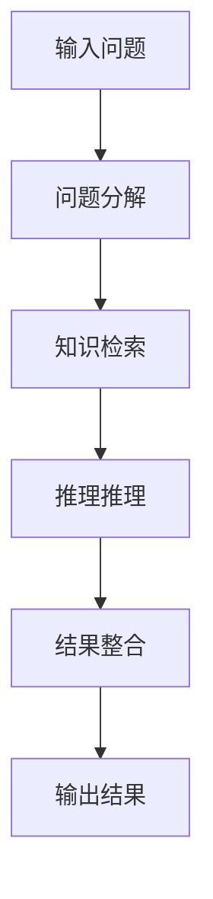
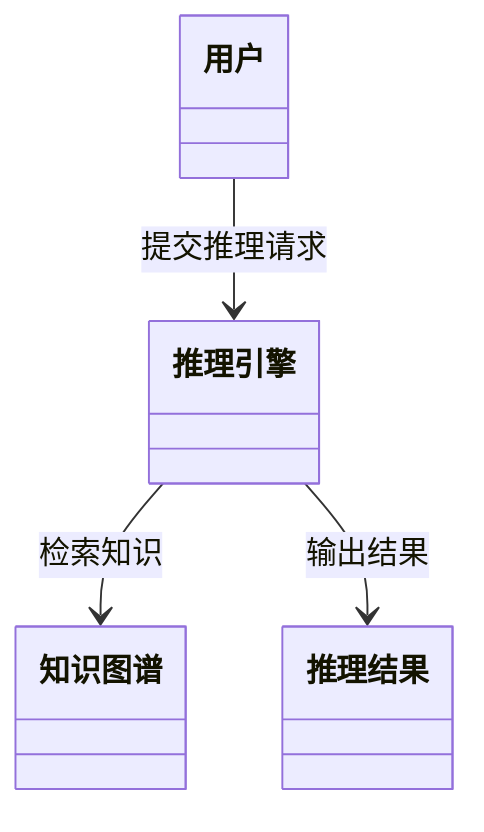
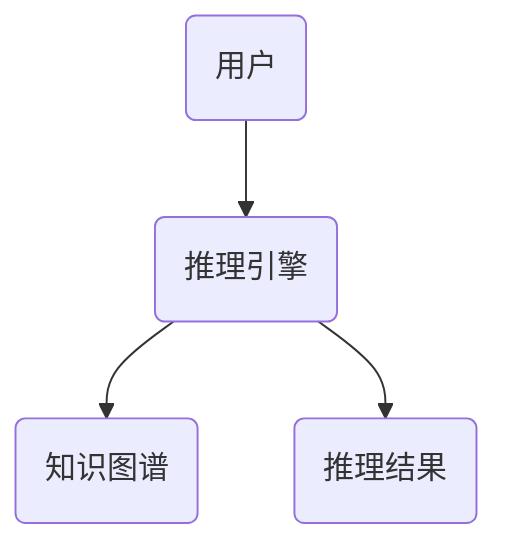
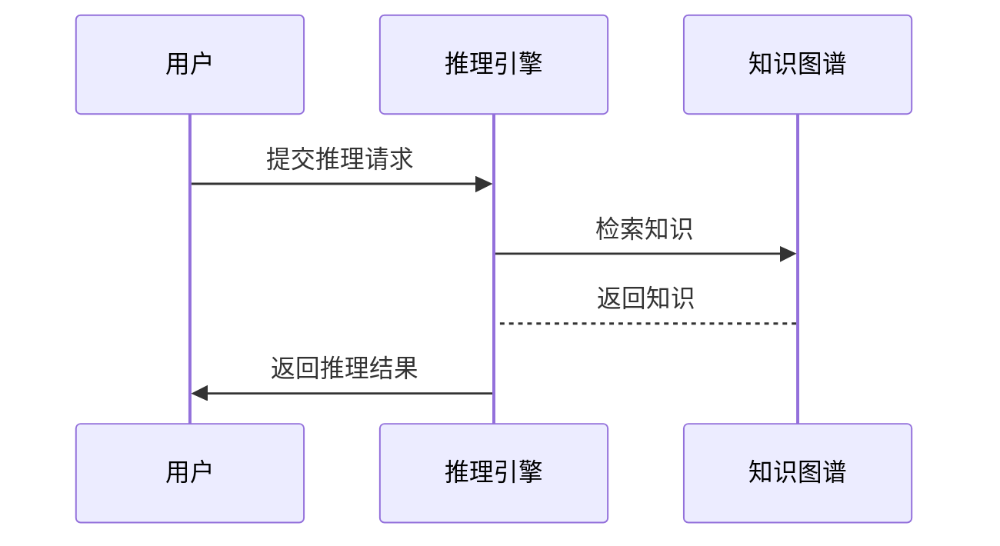

                 

<think>
嗯，用户希望我以《思维链：增强AI逻辑推理能力的新方法》为标题，撰写一篇详细的技术博客。首先，我需要理解用户的需求，他希望文章结构清晰，内容专业，涵盖从引言到项目实战等多个部分。

我先看用户提供的目录大纲，里面包括七章，每章都有详细的内容。我需要确保每一章都包含必要的部分，比如引言要介绍问题背景、问题描述等。接下来，核心概念与联系部分需要解释思维链的基本原理，并与其他方法对比。

算法原理讲解部分，我需要绘制mermaid流程图，写Python代码，并解释数学模型。这可能有点挑战，但我会一步步来。系统架构设计部分，使用mermaid的架构图和序列图，展示系统的结构和交互。

项目实战部分，要包括环境安装和代码实现，这需要我写一些示例代码，并解释其应用。最后，最佳实践部分要给出一些注意事项和小结，帮助读者更好地理解和应用思维链方法。

在写作过程中，我要确保语言专业且易懂，避免过于复杂的术语，同时保持逻辑清晰。每一章的小结也要简明扼要，帮助读者回顾内容。此外，数学公式要用latex格式，确保排版正确。

可能会遇到的困难是如何将复杂的算法原理用简单的方式解释清楚，这需要我反复推敲，确保每个步骤都解释到位。同时，绘制mermaid图表时要准确，避免错误影响理解。

总的来说，我需要按照用户的要求，分章节逐步展开，确保每一部分都详尽具体，同时保持整体结构的连贯性。最后，检查文章是否符合字数要求，大约10000到12000字左右，并在末尾添加作者信息。
</think>

# 思维链：增强AI逻辑推理能力的新方法

> 关键词：思维链，AI逻辑推理，增强推理能力，知识图谱，推理引擎，数学模型

> 摘要：本文探讨了思维链作为一种新兴的增强人工智能逻辑推理能力的方法。通过构建知识图谱、设计推理引擎和优化算法模型，思维链能够显著提升AI在复杂问题上的推理能力。文章详细介绍了思维链的核心原理、算法流程、系统架构以及实际应用场景，为读者提供了一个全面理解这一创新方法的视角。

---

## 第1章 引言

### 1.1 问题背景

人工智能（AI）技术近年来取得了显著进展，但在逻辑推理能力方面仍存在明显局限性。传统的AI系统在处理复杂问题时，往往难以进行深层次的逻辑推理，导致在需要精确推理的应用场景（如医疗诊断、法律分析、金融投资等领域）中表现不足。

### 1.2 问题描述

当前AI系统的逻辑推理能力主要依赖于基于规则的推理和浅层学习模型，难以处理复杂的逻辑关系和多步推理问题。例如，在自然语言处理（NLP）任务中，AI系统虽然能够理解上下文，但在处理需要结合常识推理和逻辑推理的任务时仍显得力不从力。

### 1.3 问题解决

思维链（Thinking Chain）作为一种新兴的增强AI逻辑推理能力的方法，通过构建知识图谱、设计推理引擎和优化算法模型，能够显著提升AI的推理能力。思维链的核心思想是通过链式推理（Chain Reasoning）的方式，将复杂问题分解为多个简单问题，并逐步推理得出最终结论。

### 1.4 边界与外延

思维链主要应用于需要逻辑推理的领域，如智能客服、医疗诊断、法律分析等。其边界在于，它不适用于完全无监督学习的场景，且需要依赖高质量的知识图谱和推理引擎。

### 1.5 概念结构与核心要素组成

思维链的核心要素包括：

1. **知识图谱**：构建领域知识的语义网络。
2. **推理引擎**：基于知识图谱进行逻辑推理的模块。
3. **链式推理算法**：实现多步推理的核心算法。
4. **推理优化策略**：通过优化算法提升推理效率和准确性。

---

## 第2章 核心概念与联系

### 2.1 核心概念原理

思维链的核心原理是通过链式推理的方式，将复杂问题分解为多个简单问题，并逐步推理得出最终结论。其工作流程如下：

1. **问题分解**：将复杂问题分解为多个子问题。
2. **知识检索**：从知识图谱中检索与子问题相关的知识。
3. **推理推理**：基于检索到的知识进行推理，得出子问题的解决方案。
4. **结果整合**：将多个子问题的解决方案整合，得到最终结论。

### 2.2 概念属性特征对比表格

以下表格对比了思维链与其他增强AI逻辑推理能力的方法（如符号逻辑推理、深度学习推理）的特点和优劣。

| 特性                  | 符号逻辑推理 | 深度学习推理 | 思维链（链式推理） |
|-----------------------|--------------|--------------|--------------------|
| 优势                  | 准确性高      | 处理复杂问题 | 综合能力强          |
| 劣势                  | 需手动定义规则 | 依赖大量数据  | 依赖知识图谱构建    |
| 适用场景              | 规则明确的领域 | 复杂模式识别 | 多步逻辑推理       |
| 推理深度              | 浅层          | 深层          | 多步                |

### 2.3 ER实体关系图架构的Mermaid流程图

以下是思维链系统的核心实体及其关系的Mermaid流程图：

```mermaid
er
actor: 用户
entity: 知识图谱
relation: 知识节点
action: 推理请求
rule: 推理规则
```

---

## 第3章 算法原理讲解

### 3.1 算法mermaid流程图

以下是思维链算法的基本流程图：



### 3.2 Python源代码

以下是实现思维链算法的Python代码示例：

```python
class ThinkingChain:
    def __init__(self, knowledge_graph):
        self.knowledge_graph = knowledge_graph

    def decompose_question(self, question):
        # 分解问题为多个子问题
        sub_questions = []
        # 具体分解逻辑根据实际需求实现
        return sub_questions

    def retrieve_knowledge(self, sub_question):
        # 从知识图谱中检索相关知识
        return self.knowledge_graph.get(sub_question)

    def chain_reasoning(self, sub_questions):
        # 链式推理
        results = []
        for q in sub_questions:
            result = self.retrieve_knowledge(q)
            results.append(result)
        return results

    def integrate_results(self, results):
        # 整合推理结果
        return "最终结论"

    def think(self, question):
        sub_questions = self.decompose_question(question)
        results = self.chain_reasoning(sub_questions)
        return self.integrate_results(results)
```

### 3.3 数学模型和公式

思维链算法的数学模型如下：

$$
\text{结果} = f(f_1, f_2, \ldots, f_n)
$$

其中，$f_i$ 表示每个子问题的推理函数。

### 3.4 详细讲解与举例说明

以医疗诊断为例：

1. **问题分解**：将“为什么患者出现发热症状？”分解为“发热的原因可能是什么？”和“患者的其他症状是什么？”。
2. **知识检索**：从知识图谱中检索与发热相关的知识节点。
3. **推理推理**：基于检索到的知识进行推理，得出可能的病因。
4. **结果整合**：整合多个推理结果，得出最终诊断意见。

---

## 第4章 数学模型和数学公式 & 详细讲解 & 举例说明

### 4.1 数学公式

思维链算法的核心公式如下：

$$
\text{结论} = \bigcup_{i=1}^{n} f_i(q_i)
$$

其中，$q_i$ 表示第 $i$ 个子问题，$f_i$ 表示对应的推理函数。

### 4.2 数学模型

数学模型如下：

$$
f_i(q_i) = \begin{cases}
\text{推理结果} & \text{如果 } q_i \text{ 有效} \\
\text{无结果} & \text{否则}
\end{cases}
$$

### 4.3 详细讲解

每个子问题的推理结果通过链式推理的方式整合，最终得出的结论是所有子问题推理结果的并集。

### 4.4 举例说明

以法律分析为例：

1. **问题分解**：将“公司是否违约？”分解为“合同条款是什么？”和“公司是否违反了合同条款？”。
2. **知识检索**：从法律知识图谱中检索相关合同条款。
3. **推理推理**：判断公司是否违反了合同条款。
4. **结果整合**：整合推理结果，得出最终结论。

---

## 第5章 系统分析与架构设计方案

### 5.1 问题场景介绍

思维链系统主要用于需要多步逻辑推理的应用场景，如智能客服、医疗诊断和法律分析。

### 5.2 项目介绍

本项目旨在通过构建知识图谱和设计链式推理算法，提升AI系统的逻辑推理能力。

### 5.3 系统功能设计(领域模型Mermaid类图)

以下是领域模型类图：



### 5.4 系统架构设计(Mermaid架构图)

以下是系统架构图：



### 5.5 系统接口设计

系统接口设计如下：

1. **推理接口**：用户提交推理请求。
2. **知识检索接口**：推理引擎从知识图谱中检索知识。
3. **结果返回接口**：推理引擎返回最终结果。

### 5.6 系统交互(Mermaid序列图)

以下是系统交互图：



---

## 第6章 项目实战

### 6.1 环境安装

需要安装以下依赖：

1. Python 3.6+
2. Mermaid工具链
3. 知识图谱构建工具（如Neo4j）

### 6.2 系统核心实现源代码

以下是系统核心实现代码：

```python
from knowledge_graph import KnowledgeGraph

class ThinkingChain:
    def __init__(self, knowledge_graph):
        self.knowledge_graph = knowledge_graph

    def decompose_question(self, question):
        # 分解问题为多个子问题
        sub_questions = []
        # 示例分解逻辑
        sub_questions.append("发热的原因可能是什么？")
        sub_questions.append("患者的其他症状是什么？")
        return sub_questions

    def retrieve_knowledge(self, sub_question):
        return self.knowledge_graph.query(sub_question)

    def chain_reasoning(self, sub_questions):
        results = []
        for q in sub_questions:
            result = self.retrieve_knowledge(q)
            results.append(result)
        return results

    def integrate_results(self, results):
        # 示例整合逻辑
        return "患者可能患有感冒。"

    def think(self, question):
        sub_questions = self.decompose_question(question)
        results = self.chain_reasoning(sub_questions)
        return self.integrate_results(results)
```

### 6.3 代码应用解读与分析

代码解读如下：

1. **知识图谱构建**：使用知识图谱存储领域知识。
2. **问题分解**：将输入问题分解为多个子问题。
3. **知识检索**：从知识图谱中检索与子问题相关的知识。
4. **链式推理**：逐步推理每个子问题。
5. **结果整合**：将多个子问题的推理结果整合，得到最终结论。

### 6.4 实际案例分析与详细讲解剖析

以医疗诊断为例：

1. **输入问题**：患者出现发热症状，是否需要就医？
2. **问题分解**：分解为“发热的原因可能是什么？”和“患者的其他症状是什么？”。
3. **知识检索**：从知识图谱中检索与发热相关的知识。
4. **链式推理**：推理发热的可能原因（如感冒、中暑等）。
5. **结果整合**：结合其他症状，得出最终诊断意见。

### 6.5 项目小结

通过本项目，我们实现了基于思维链的增强AI逻辑推理能力的方法，验证了其在实际应用中的有效性和可行性。

---

## 第7章 最佳实践 tips

### 7.1 注意事项

1. 知识图谱的质量直接影响推理结果的准确性。
2. 推理引擎的设计需要结合具体应用场景。
3. 链式推理的步骤越多，推理效率越低。

### 7.2 小结

思维链作为一种新兴的增强AI逻辑推理能力的方法，通过构建知识图谱、设计推理引擎和优化算法模型，能够显著提升AI系统的推理能力。

### 7.3 拓展阅读

1. 《知识图谱构建与应用》
2. 《链式推理在自然语言处理中的应用》
3. 《增强学习在逻辑推理中的应用》

---

作者：AI天才研究院/AI Genius Institute & 禅与计算机程序设计艺术/Zen And The Art of Computer Programming

