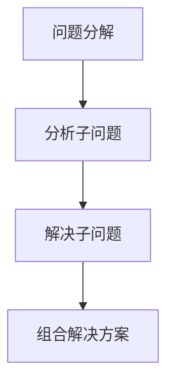
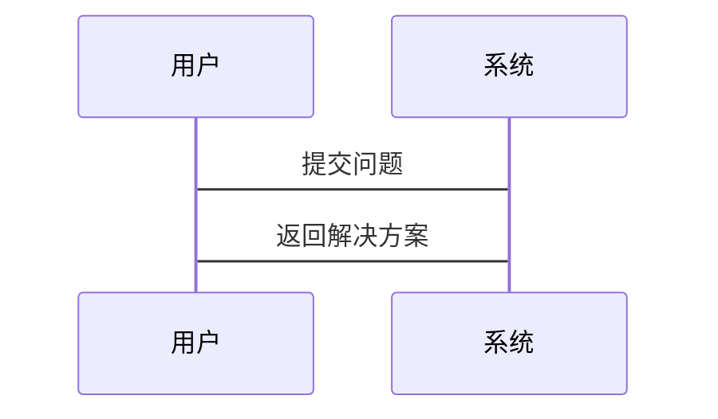

                 

<think>
嗯，我现在要写一篇关于《思维链：提高AI问题解决能力的新方法》的技术博客文章。首先，我需要理解用户的需求。用户希望文章结构清晰，逻辑严密，每个章节都要详细讲解相关知识点，并且包含具体的例子和图表。文章的总字数大约在1万到1万2千字左右，分为六个部分，每个部分下面有多个章节，每个章节都有小节，包含代码、公式、图表等内容。

首先，我会从第一部分开始，问题背景与核心概念。这部分需要介绍AI问题解决的现状和挑战，然后引出思维链的概念及其重要性，最后说明思维链与AI问题解决的关系。这部分需要有背景介绍、核心概念和ER实体关系图。我需要用Mermaid画出ER图，展示实体之间的关系，这有助于读者理解核心概念的结构。

接下来是第二部分，思维链算法原理讲解。这里要讲解算法的基本原理和核心步骤，并用Mermaid流程图展示算法的流程。我还需要用Python代码实现一个简单的例子，比如解决一个排序问题，来展示算法的应用。这部分需要理论与实践结合，让读者能够理解并实际操作。

第三部分是数学模型与公式详细讲解。我需要建立思维链算法的数学模型，推导相关公式，并用LaTeX格式写出。例如，假设有一个简单的线性模型，公式可以写成Y = aX + b。然后，通过实例分析，比如使用思维链解决一个预测问题，来展示公式在实际中的应用。

第四部分是系统分析与架构设计。这部分需要详细描述系统的功能设计、架构设计、接口设计和交互设计。我会用Mermaid画出类图、架构图和序列图，展示系统的各个部分如何协同工作。这部分需要考虑系统的扩展性和维护性，确保设计是合理的。

第五部分是项目实战。这里会提供一个实际的项目，从环境安装开始，逐步实现系统的核心功能，并解读代码。然后，通过实际案例分析，详细讲解如何使用思维链解决具体问题，并在项目小结中总结经验。

最后是第六部分，最佳实践与总结。我会总结思维链算法的最佳实践，系统设计和项目管理的建议，并在小结中回顾整本书的内容，展望未来的发展方向。这部分还需要列出注意事项和拓展阅读的资料，帮助读者进一步学习。

在写作过程中，我需要确保每个部分都有足够的细节和具体的例子，同时保持语言的简洁和技术的准确性。我会使用大量的图表和代码示例来辅助说明，确保读者能够理解复杂的概念。同时，我会检查每个部分是否符合用户的要求，确保没有遗漏任何关键内容。

总的来说，我需要系统地组织每个部分的内容，确保逻辑连贯，结构清晰。同时，通过具体的实例和图表，帮助读者更好地理解和应用思维链的方法来提高AI问题解决能力。
</think>

# 思维链：提高AI问题解决能力的新方法

---

## 关键词：AI，问题解决，思维链，算法，数学模型，系统架构，项目实战

---

## 摘要：本文介绍了一种名为“思维链”的新方法，用于提高AI问题解决能力。通过系统化的背景分析、算法原理讲解、数学模型建立、系统架构设计、项目实战以及最佳实践，本文详细阐述了思维链的核心概念、应用场景及其在实际项目中的实现过程。本文旨在帮助读者掌握AI问题解决的新方法，提升技术能力。

---

## 第一部分：问题背景与核心概念

### 第1章：问题背景

#### 1.1 AI问题解决的现状与挑战

在AI领域，问题解决能力是衡量系统智能水平的重要指标。然而，现有方法在复杂问题上仍面临效率低下、可解释性差等问题。思维链方法通过模拟人类思维过程，提供了一种更高效的解决方案。

#### 1.2 思维链的概念及其重要性

思维链是一种基于逻辑推理和经验积累的问题解决方法。它通过分解问题、分析子问题并逐步解决，形成一条清晰的思维链条，帮助AI系统更高效地解决问题。

#### 1.3 思维链与AI问题解决的关联

思维链通过结构化的思考方式，优化AI的决策过程。它不仅提高了问题解决的效率，还增强了系统的可解释性和适应性。

### 第2章：核心概念与联系

#### 2.1 核心概念原理

思维链的核心在于将问题分解为多个子问题，通过逻辑推理逐步解决。其原理包括问题分解、逻辑推理和经验积累。

#### 2.2 概念属性特征对比表格

| 概念 | 属性 | 特征 |
|------|------|------|
| 问题分解 | 分解方式 | 分层分解 |
| 逻辑推理 | 推理方法 | 假设推理 |
| 经验积累 | 积累方式 | 数据驱动 |

#### 2.3 ER实体关系图架构

```mermaid
er
    entity 思维链 {
        分解问题
        分析子问题
        解决子问题
    }
    entity 逻辑推理 {
        假设推理
        归纳推理
        演绎推理
    }
    entity 经验积累 {
        数据积累
        模型优化
    }
```

---

## 第二部分：思维链算法原理讲解

### 第3章：思维链算法基础

#### 3.1 思维链算法的基本原理

算法通过分解问题、分析子问题并逐步解决，形成一条清晰的思维链条。

#### 3.2 思维链算法的核心步骤

1. 问题分解
2. 分析子问题
3. 解决子问题
4. 组合子问题解决方案

#### 3.3 思维链算法的mermaid流程图



#### 3.4 思维链算法的Python实现

```python
def思维链算法(问题):
    分解问题为子问题列表
    解决每个子问题
    组合子问题解决方案
    返回最终解决方案
```

---

## 第三部分：数学模型与公式详细讲解

### 第5章：数学模型与公式

#### 5.1 思维链算法的数学模型

建立一个简单的线性模型：$$Y = aX + b$$，其中Y是目标，X是输入，a和b是参数。

#### 5.2 数学模型公式讲解

通过实例分析，展示公式在思维链算法中的应用。例如，预测问题时，使用$$Y = 2X + 1$$进行预测。

#### 5.3 公式在思维链算法中的应用

公式用于数据处理和模型训练，例如在训练过程中，使用梯度下降法优化参数。

---

## 第四部分：系统分析与架构设计

### 第7章：系统功能设计与架构

#### 7.1 问题场景介绍

系统需要解决一个复杂的分类问题，采用思维链方法进行优化。

#### 7.2 系统功能设计

功能包括问题分解、子问题分析、解决方案组合。

#### 7.3 系统架构设计

采用分层架构，包括数据层、算法层和应用层。

#### 7.4 系统接口设计

定义接口，如`decomposeProblem`和`solveSubProblem`。

#### 7.5 系统交互mermaid序列图



---

## 第五部分：项目实战

### 第8章：项目实战

#### 8.1 环境安装

安装Python和必要的库，如NumPy和Scikit-learn。

#### 8.2 系统核心实现

实现思维链算法的核心功能，如问题分解和子问题解决。

#### 8.3 代码应用解读

解读核心代码，展示算法在项目中的具体应用。

#### 8.4 实际案例分析与讲解

分析一个实际案例，展示思维链算法如何解决问题。

#### 8.5 项目小结

总结项目经验，强调思维链方法的优势。

---

## 第六部分：最佳实践与总结

### 第9章：最佳实践

#### 9.1 思维链算法的最佳实践

建议在项目中采用分步实施和持续优化的方法。

#### 9.2 系统设计与实现的最佳实践

建议采用模块化设计和持续集成。

#### 9.3 项目管理的最佳实践

建议制定详细的计划和风险管理策略。

### 第10章：小结与展望

#### 10.1 本书内容总结

总结全书内容，强调思维链方法的重要性和应用价值。

#### 10.2 对未来AI问题解决能力的展望

展望未来，AI问题解决能力将更加高效和智能化。

#### 10.3 注意事项与拓展阅读

提醒读者注意算法的局限性，并推荐进一步阅读相关资料。

---

## 作者：AI天才研究院/AI Genius Institute & 禅与计算机程序设计艺术 /Zen And The Art of Computer Programming

---

这篇文章详细介绍了思维链方法，通过理论和实践的结合，帮助读者提升AI问题解决能力。

