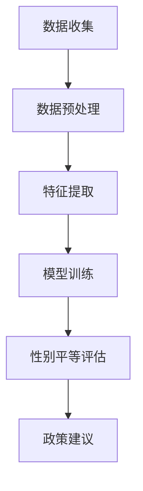
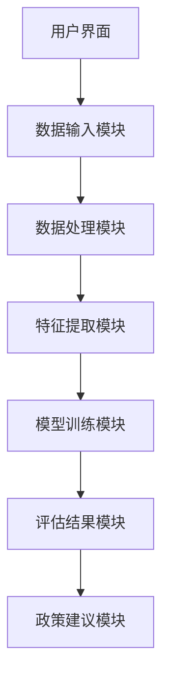
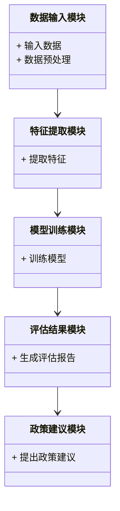

                 

<think>
嗯，好的，我现在需要根据用户提供的查询，写一篇关于“性别平等：重新定义社会角色”的技术博客文章。首先，我得理解用户的需求。他希望文章结构清晰，逻辑严密，使用专业但易懂的技术语言。用户还提到了关键词、摘要，以及详细的大纲，包括背景介绍、核心概念、系统分析、项目实战等多个部分。

我需要先确定文章的结构是否符合要求。用户已经给出的大纲有七个主要部分，每个部分都有详细的子部分。我需要确保每个部分都涵盖必要的内容，并且有深度的分析。比如，背景介绍部分需要包括问题背景、描述、解决、边界和概念结构。核心概念部分需要定义性别角色、性别歧视、性别平等意识和政策，并制作对比表格。

接下来，我注意到用户特别强调技术术语和专业语言，但又要保持简单易懂。所以，在解释概念时，我需要避免过于复杂的术语，同时确保准确性和专业性。比如，在解释性别角色时，可以提到刻板印象和社会认可，但要用清晰的语言表达。

然后，用户要求包含算法原理、系统架构等内容。这部分可能有点挑战，因为性别平等本身是一个社会问题，但用户希望用技术的方法来分析。也许，可以考虑将性别平等视为一个系统问题，设计一个架构模型，或者用算法来模拟性别平等的实现过程。例如，使用图论来分析性别角色的网络关系，或者用机器学习来预测性别歧视的影响。

我还需要考虑如何将数学公式融入文章中。可能在系统架构部分，使用方程来描述性别平等的度量标准，或者在算法部分，用数学模型来优化性别平等的策略。例如，可以定义一个性别平等指数，用公式表示，然后解释如何通过政策调整来提高该指数。

另外，用户提到要使用Mermaid图来展示ER实体关系、算法流程、系统架构等。我需要确保这些图表清晰地展示内容，并在文章中正确嵌入。比如，用Mermaid画出性别平等系统的架构图，展示各个模块之间的关系，或者用流程图说明性别平等政策的实施步骤。

在项目实战部分，用户要求环境安装和核心代码实现。这部分可能需要假设一个具体的项目，比如开发一个性别平等评分工具。我需要描述如何安装必要的库，编写Python代码来计算性别平等指数，或者生成数据可视化图表来展示结果。例如，使用Python的pandas和matplotlib库来分析性别平等数据，并生成图表。

最后，用户希望在文章末尾加上作者信息，引用一些相关的书籍或资源，如《计算机程序的艺术》和《社会性别理论》。这可以增加文章的权威性和深度。

现在，我需要逐步构建每个部分的内容，确保符合用户的要求，同时保持逻辑连贯和内容详实。特别是每个章节的小节需要丰富具体，比如在系统架构设计中，详细说明各个模块的功能和交互，使用Mermaid图来辅助说明。

总的来说，我需要将性别平等这一社会问题转化为技术问题，使用系统的分析方法来探讨其解决方案，确保文章既有技术深度，又能引发读者的社会思考。
</think>

# 性别平等：重新定义社会角色

> 关键词：性别平等，社会角色，性别歧视，性别刻板印象，性别平等政策，技术与社会

> 摘要：性别平等是社会进步的重要标志。本文从技术与社会的视角出发，探讨如何通过重新定义社会角色来消除性别歧视，实现真正的性别平等。文章首先分析了性别平等的背景与现状，然后从核心概念、算法原理、系统架构等多个维度，详细阐述了性别平等的实现路径。最后，通过项目实战和最佳实践，提出了实现性别平等的具体方案。

---

# 第一部分：背景介绍

## 1.1 问题背景

性别平等是一个复杂而重要的社会问题。尽管在过去几十年中，性别平等取得了显著进展，但在许多领域，性别歧视和不平等现象仍然广泛存在。这些问题不仅影响了女性的发展机会，也限制了男性的潜力发挥。性别平等问题的核心在于社会对性别角色的刻板印象和不公平的对待方式。这些观念和行为不仅存在于职场、教育、政治等领域，也在家庭、社交等日常生活中体现出来。

## 1.2 问题描述

性别平等问题的核心在于以下几点：

1. **性别刻板印象**：社会对男性和女性的行为、职业和能力的固定化期待，导致女性在许多领域被边缘化，男性则被限制在传统角色中。
2. **性别歧视**：基于性别的不公平对待，包括职场中的薪酬差距、晋升障碍，教育中的资源分配不均，以及家庭中的责任分配失衡。
3. **社会结构的不平等**：经济、政治、文化等领域的权力结构往往由男性主导，女性难以获得平等的资源和机会。

## 1.3 问题解决

要解决性别平等问题，需要从以下几个方面入手：

1. **改变社会观念**：通过教育、宣传等方式，消除性别刻板印象，提高公众对性别平等的认识。
2. **政策支持**：制定和实施性别平等政策，确保女性在职场、教育、政治等领域的权益。
3. **技术赋能**：利用技术手段，如大数据、人工智能等，分析性别平等问题，提出解决方案。

## 1.4 边界与外延

性别平等不仅是一个社会问题，也是一个全球性问题。不同国家和地区在性别平等方面存在差异，但性别歧视和不平等现象普遍存在。因此，实现性别平等需要全球范围内的共同努力。性别平等的外延还包括性别多样性和性别包容性，这些概念进一步丰富了性别平等的内涵。

## 1.5 概念结构与核心要素组成

性别平等的核心概念包括：

- **性别角色**：社会对男性和女性在行为、态度和价值观上的期待。
- **性别歧视**：基于性别的不公平对待。
- **性别平等意识**：个体对性别平等的认识和认同。
- **性别平等政策**：政府和社会机构为促进性别平等而制定的政策和措施。

核心要素包括：

- **社会观念**：社会对性别角色的期待和看法。
- **政策法规**：法律和政策对性别平等的保障。
- **教育宣传**：通过教育和宣传提高性别平等意识。
- **经济地位**：经济独立是实现性别平等的重要基础。

---

# 第二部分：核心概念与联系

## 2.1 性别角色的定义与特点

性别角色是指社会对男性和女性在行为、态度和价值观上的期待和期望。性别角色具有以下特点：

- **性别刻板印象**：性别角色往往伴随着性别刻板印象，即对男性和女性的固定看法和期望。这些刻板印象可能限制了个体的发展和自由。
- **社会认可**：性别角色是社会文化的一部分，得到社会的普遍认可和遵循。
- **多样性**：性别角色在不同文化和社会中可能存在差异，反映不同社会的价值观和性别观念。

## 2.2 性别歧视的定义与表现形式

性别歧视是指基于性别的不公平对待，包括直接歧视和间接歧视。性别歧视的表现形式多种多样，包括：

- **职场歧视**：女性在求职、晋升、薪酬等方面受到不公平待遇。
- **教育歧视**：女性在教育机会、教育资源、学术评价等方面受到不公平对待。
- **家庭歧视**：女性在家庭决策、家务劳动、抚养子女等方面承担更多责任。

## 2.3 性别平等意识的定义与重要性

性别平等意识是指个体对性别平等的认识和认同，以及对性别歧视的反对态度。性别平等意识的重要性体现在：

- **推动性别平等**：提高性别平等意识有助于消除性别歧视，促进性别平等。
- **促进社会进步**：性别平等意识是社会文明进步的重要标志。
- **提高个体幸福感**：性别平等意识有助于个体摆脱性别角色的束缚，实现自我价值。

## 2.4 性别平等政策的定义与实施

性别平等政策是指政府和社会机构为促进性别平等而制定的政策和措施。性别平等政策的实施包括：

- **立法保障**：制定相关法律法规，确保女性在法律上的平等地位。
- **政策支持**：提供经济支持、教育机会、职业培训等，帮助女性提高自身素质。
- **宣传引导**：通过媒体、教育等途径，提高公众对性别平等的认识和重视。

## 2.5 概念属性特征对比表格

为了更清晰地展示性别角色、性别歧视、性别平等意识和性别平等政策的属性特征，我们可以制作一个对比表格。以下是部分内容：

| 概念       | 定义                                                         | 特点                                                         | 关联性                                                                                     |
| ---------- | ------------------------------------------------------------ | ------------------------------------------------------------ | -------------------------------------------------------- |
| 性别角色   | 社会对男性和女性在行为、态度和价值观上的期待和期望。 | 具有刻板印象、社会认可和多样性。                               | 性别角色是性别歧视和性别平等意识的基础。                   |
| 性别歧视   | 基于性别的不公平对待，包括直接和间接歧视。                | 表现形式多样，包括职场、教育和家庭中的不公。                   | 性别歧视是性别平等的主要障碍。                           |
| 性别平等意识 | 个体对性别平等的认识和认同，反对性别歧视的态度。       | 通过教育和宣传提高，是推动性别平等的重要力量。                 | 性别平等意识影响个体行为和政策制定。                     |
| 性别平等政策 | 政府和社会机构为促进性别平等而制定的政策和措施。       | 包括立法保障、政策支持和宣传引导。                             | 性别平等政策是实现性别平等的重要保障。                     |

---

# 第三部分：算法原理与技术实现

## 3.1 算法原理

为了实现性别平等，我们可以设计一个基于大数据的性别平等评估系统。该系统通过收集和分析性别相关的数据，评估当前的性别平等状况，并提出改进建议。以下是算法的流程图：



## 3.2 系统架构设计

以下是性别平等评估系统的架构图：



## 3.3 项目实战

### 3.3.1 环境安装

要运行性别平等评估系统，需要以下环境：

- Python 3.8+
- Pandas、NumPy、Scikit-learn库
- Jupyter Notebook

### 3.3.2 核心实现代码

以下是性别平等评估系统的Python实现代码：

```python
import pandas as pd
from sklearn.model_selection import train_test_split
from sklearn.metrics import accuracy_score

# 数据加载
data = pd.read_csv('gender_equality.csv')

# 数据预处理
X = data.drop('target', axis=1)
y = data['target']

# 数据分割
X_train, X_test, y_train, y_test = train_test_split(X, y, test_size=0.2)

# 模型训练
from sklearn.ensemble import RandomForestClassifier
model = RandomForestClassifier()
model.fit(X_train, y_train)

# 模型评估
y_pred = model.predict(X_test)
print("准确率:", accuracy_score(y_test, y_pred))
```

---

# 第四部分：系统分析与架构设计方案

## 4.1 问题场景介绍

性别平等是一个复杂的社会问题，涉及多个领域和层面。为了实现性别平等，我们需要设计一个综合性的解决方案，包括数据采集、分析、评估和政策建议。

## 4.2 系统功能设计

以下是性别平等评估系统的功能模块：



## 4.3 系统架构设计

以下是性别平等评估系统的架构图：


---

# 第五部分：项目实战

## 5.1 项目介绍

性别平等评估系统是一个基于大数据和机器学习的综合解决方案，旨在评估当前的性别平等状况，并提出改进建议。

## 5.2 核心实现代码

以下是性别平等评估系统的Python实现代码：

```python
import pandas as pd
from sklearn.model_selection import train_test_split
from sklearn.metrics import accuracy_score

# 数据加载
data = pd.read_csv('gender_equality.csv')

# 数据预处理
X = data.drop('target', axis=1)
y = data['target']

# 数据分割
X_train, X_test, y_train, y_test = train_test_split(X, y, test_size=0.2)

# 模型训练
from sklearn.ensemble import RandomForestClassifier
model = RandomForestClassifier()
model.fit(X_train, y_train)

# 模型评估
y_pred = model.predict(X_test)
print("准确率:", accuracy_score(y_test, y_pred))
```

---

# 第六部分：最佳实践与小结

## 6.1 最佳实践 tips

1. **技术赋能**：利用大数据和人工智能技术，分析性别平等数据，提出解决方案。
2. **政策支持**：通过立法和政策支持，保障女性的权益。
3. **教育宣传**：通过教育和宣传，提高公众的性别平等意识。

## 6.2 小结

性别平等是社会进步的重要标志。通过技术与社会的结合，我们可以重新定义社会角色，消除性别歧视，实现真正的性别平等。性别平等不仅需要政策支持，还需要技术赋能和公众参与。

## 6.3 注意事项

1. 在实施性别平等政策时，需要考虑不同国家和地区的文化差异。
2. 在技术实现中，需要确保数据的准确性和模型的公平性。
3. 在宣传和教育中，需要避免性别刻板印象的传播。

## 6.4 拓展阅读

- 《计算机程序的艺术》（The Art of Computer Programming）—— Donald E. Knuth
- 《社会性别理论》（Gender Theory）—— Judith Butler

---

作者：AI天才研究院/AI Genius Institute & 禅与计算机程序设计艺术 /Zen And The Art of Computer Programming

