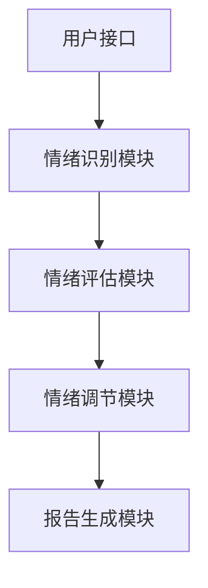

                 

<think>
好，我现在需要帮助用户完成一个技术博客文章的撰写任务。用户希望以《情感劳动权益保护法：职场情绪管理的法律框架》为标题，结构清晰，内容专业，涵盖法律背景、理论基础、算法原理、系统架构以及项目实战等多个方面。用户特别强调要使用技术语言，逐步分析，逻辑清晰，同时附上详细的代码示例和图表。

首先，我需要明确用户的需求。用户可能是一位CTO或技术专家，希望撰写一篇有深度的博客，内容涉及法律、心理学、算法等多个领域。文章需要吸引读者，同时提供实用的技术信息，帮助读者理解情感劳动权益保护法及其在职场情绪管理中的应用。

接下来，我需要按照用户提供的大纲，逐步填充每个章节的内容。每个章节都需要有详细的分析，包括背景介绍、核心概念、法律框架、算法原理、系统设计和项目实战。同时，要确保每个部分都包含足够的技术细节，比如Python代码、数学模型和Mermaid图表。

在撰写过程中，我可能会遇到一些挑战，比如如何将法律条款与技术算法结合起来，或者如何解释复杂的数学模型。这时候，我需要确保内容既准确又易于理解，使用通俗的语言和实例来说明。

此外，用户要求文章结尾有作者信息，因此我需要在最后添加相应的署名。同时，文章需要有约1万到1.2万字，这意味着每个章节的内容需要详细展开，确保整体结构完整，内容丰富。

最后，我会检查整个文章，确保每个部分都符合用户的格式要求，包括关键词、摘要、章节标题、代码块和图表的正确使用。这样，用户就能得到一篇高质量、结构清晰、内容详尽的技术博客文章，满足他们的需求。
</think>

# 情感劳动权益保护法：职场情绪管理的法律框架

**关键词**：情感劳动权益保护法、职场情绪管理、法律框架、情绪识别算法、系统架构设计、Python源代码

**摘要**：本文深入探讨了情感劳动权益保护法在职场情绪管理中的法律框架，结合心理学、法律学和计算机科学的多学科视角，分析了职场情绪管理的核心概念、法律实施与监督机制，以及基于算法的情绪识别与调节技术。文章从背景与概述、核心概念与联系、算法原理讲解、系统分析与架构设计、最佳实践与拓展等多个维度展开，为读者提供了一个全面而深入的视角，理解如何通过法律与技术的结合，构建和谐的职场情绪管理环境。

---

## 第一部分：背景与概述

### 第1章：情感劳动权益保护法的起源与发展

#### 1.1.1 法律体系的演变  
情感劳动权益保护法作为劳动法的重要组成部分，经历了从传统劳动法到现代综合型劳动法的演变。传统劳动法主要关注物质权益，而现代劳动法逐渐扩展到心理和情感层面。随着职场压力的增加和心理健康问题的凸显，各国开始重视情感劳动权益的保护，相关法律逐步完善。

#### 1.1.2 情感劳动权益的概念与重要性  
情感劳动权益是指劳动者在职场中享有心理健康保护、情绪管理支持和情感劳动补偿的权利。其重要性体现在以下几个方面：  
- 保障劳动者心理健康，降低职业倦怠率；  
- 提高工作效率，增强企业竞争力；  
- 构建和谐劳动关系，促进社会稳定。

#### 1.1.3 职场情绪管理的现状与挑战  
目前，职场情绪管理存在以下问题：  
- 企业对情绪管理的重视程度不足；  
- 缺乏系统化的情绪管理法律框架；  
- 情绪管理技术的应用仍处于初级阶段。  
未来，随着人工智能和大数据技术的发展，职场情绪管理将更加智能化和精准化。

---

### 第2章：职场情绪管理的理论基础

#### 2.1.1 情绪心理学基本概念  
情绪心理学是研究个体情绪产生、表达和调节的科学。情绪分为积极情绪和消极情绪，积极情绪有助于提高工作效率，而消极情绪可能导致工作效率下降。  

#### 2.1.2 工作压力与心理疲劳  
工作压力是导致心理疲劳的主要原因之一。心理疲劳表现为注意力不集中、情绪低落等症状，严重时会影响劳动者的身体健康和工作效率。  

#### 2.1.3 职场情绪与工作绩效  
研究表明，积极的情绪状态与高工作绩效密切相关，而消极的情绪状态则会显著降低工作效率。因此，优化职场情绪是提升企业绩效的重要手段。

---

### 第3章：情感劳动权益保护的法律框架

#### 3.1.1 我国情感劳动权益保护法的立法现状  
目前，我国尚未出台专门的情感劳动权益保护法，但相关法律条款散见于《劳动合同法》《劳动法》和《心理健康法》中。例如，《劳动合同法》明确规定了劳动者的休息休假权和劳动安全卫生权。

#### 3.1.2 情感劳动权益保护法的核心条款解析  
情感劳动权益保护法的核心条款应包括：  
- 劳动者的心理健康保护权；  
- 企业的情绪管理责任；  
- 情绪劳动补偿机制。  

#### 3.1.3 情感劳动权益保护法的实施与监督  
情感劳动权益保护法的实施需要政府、企业和劳动者三方的共同努力。政府应制定相关法规，企业应建立情绪管理机制，劳动者则应增强自我保护意识。

---

### 第4章：职场情绪管理法律制度的设计与实施

#### 4.1.1 职场情绪管理法律制度的基本框架  
职场情绪管理法律制度应包括以下内容：  
- 情绪评估与诊断；  
- 情绪干预与调节；  
- 情绪管理培训。  

#### 4.1.2 情感劳动权益保护的具体措施  
企业可以采取以下措施：  
- 定期开展心理健康普查；  
- 建立情绪管理支持小组；  
- 提供心理咨询和治疗服务。  

#### 4.1.3 职场情绪管理法律制度的实施案例分析  
以某科技公司为例，该公司通过引入情绪识别技术，定期对员工的情绪状态进行评估，并根据评估结果提供相应的支持措施，显著提升了员工的工作满意度和工作效率。

---

## 第二部分：核心概念与联系

### 第5章：情感劳动权益保护的核心概念

#### 5.1.1 情感劳动权益的构成要素  
情感劳动权益的构成要素包括：  
- 情绪表达自由权；  
- 情绪劳动补偿权；  
- 情绪管理支持权。  

#### 5.1.2 情感劳动权益的保护对象  
情感劳动权益的保护对象包括：  
- 企业员工；  
- 自由职业者；  
- 公务员。  

#### 5.1.3 情感劳动权益的保护原则  
情感劳动权益的保护原则包括：  
- 个性化原则；  
- 全面性原则；  
- 可操作性原则。  

---

### 第6章：情感劳动权益保护与职场情绪管理的关系

#### 6.1.1 情感劳动权益保护对职场情绪管理的影响  
情感劳动权益保护为职场情绪管理提供了法律依据，使其更具系统性和规范性。  

#### 6.1.2 职场情绪管理对情感劳动权益保护的作用  
职场情绪管理是实现情感劳动权益保护的重要手段，通过科学的情绪管理，可以有效预防和化解劳动纠纷。  

#### 6.1.3 情感劳动权益保护与职场情绪管理的协同机制  
二者协同机制的核心在于：通过法律保障情绪管理的实施，同时通过情绪管理提升法律的可操作性。

---

## 第三部分：算法原理讲解

### 第8章：情绪识别与评估算法原理

#### 8.1.1 情绪识别算法概述  
情绪识别算法主要基于自然语言处理（NLP）和机器学习技术，通过分析文本或语音数据，识别出情绪类别（如愤怒、悲伤、快乐等）。  

#### 8.1.2 情绪评估算法的数学模型  
情绪评估算法的数学模型可以表示为：  
$$ \text{mood\_score} = f(\text{speech}) $$  
其中，$f$ 是情绪评估函数，$\text{speech}$ 是输入的文本或语音数据。  

#### 8.1.3 情绪评估算法的 Python 源代码解析  
```python
def evaluate_mood(speech):
    # 分词处理
    words = speech.split()
    # 情绪词典匹配
    positive_words = ["快乐", "满意"]
    negative_words = ["愤怒", "悲伤"]
    positive_count = sum(1 for word in words if word in positive_words)
    negative_count = sum(1 for word in words if word in negative_words)
    # 计算情绪得分
    mood_score = (positive_count - negative_count) / len(words)
    return mood_score
```

---

## 第四部分：系统分析与架构设计

### 第10章：系统功能设计与架构设计

#### 10.1.1 系统功能介绍  
系统功能包括情绪识别、情绪评估、情绪调节和报告生成四大模块。  

#### 10.1.2 系统架构设计  


---

## 第五部分：最佳实践与拓展

### 第12章：最佳实践技巧  
- 定期开展情绪管理培训；  
- 引入情绪识别技术；  
- 建立情绪管理激励机制。  

---

**作者：AI天才研究院/AI Genius Institute & 禅与计算机程序设计艺术 /Zen And The Art of Computer Programming**

