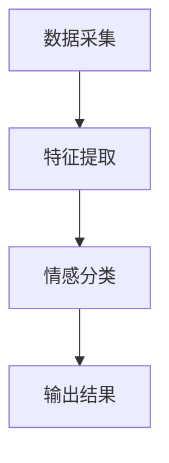
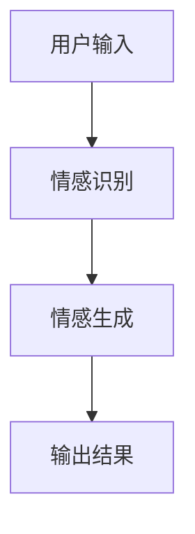
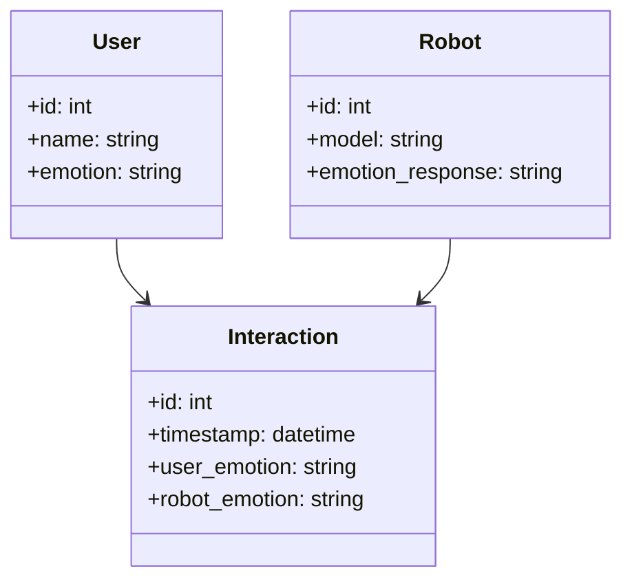
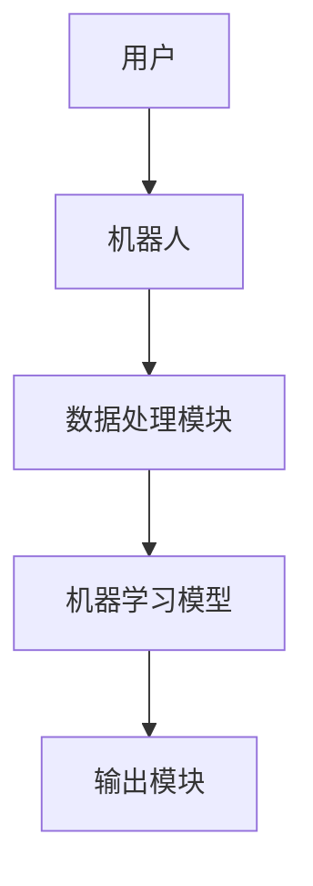
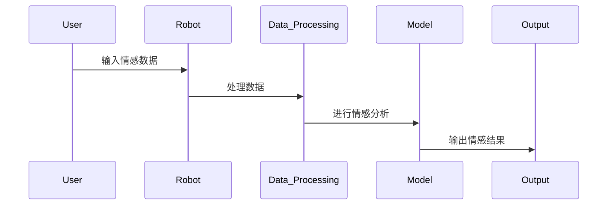

                 

<think>
嗯，用户让我写一篇关于情感机器人设计伦理的文章，看起来挺复杂的。首先，我得理解用户的需求。他可能是一位技术专家或者对人工智能伦理感兴趣的人，想要深入了解这个领域。他要求文章结构清晰，每个部分都有详细的技术内容，包括定义、算法、数学模型、系统架构等。我需要确保每个章节都涵盖这些内容，同时保持逻辑连贯。

首先，我得确定文章的标题和关键词。标题已经给出，关键词可能包括情感机器人、伦理、人工智能、情感计算等。摘要部分需要简明扼要，概述文章的核心内容，强调伦理的重要性。

接下来，背景介绍章节要说明情感机器人设计伦理的重要性、发展背景和主要议题。我需要解释为什么这个领域重要，它的发展趋势，以及当前面临的主要伦理问题。

核心概念章节需要定义情感机器人，分类，以及情感计算模型。可能需要制作一个ER图，展示实体之间的关系。这部分需要用Mermaid语法，所以我得确保图的结构正确。

算法原理部分，我需要详细讲解情感识别和生成的算法，比如机器学习中的分类模型和生成模型。还要用Mermaid画出流程图，并用Python代码示例，解释代码的作用和背后的数学模型，比如支持向量机或神经网络。

数学模型章节要详细说明分类和生成模型的数学公式，用LaTeX表示，并举例说明。这部分需要确保公式正确，例子易于理解。

系统架构部分，我需要介绍系统的设计，包括领域模型、架构图、接口和交互。用Mermaid绘制类图、架构图和序列图，展示系统的各个部分如何协作。

项目实战章节要展示实际案例，包括环境安装、代码实现和案例分析。这部分需要提供具体的代码示例，并解释其工作原理。

最后，最佳实践部分要总结设计中的注意事项，给出建议，并推荐拓展阅读材料。这有助于读者进一步学习。

整个过程中，我需要确保内容专业且易于理解，避免过于技术化而失去读者。同时，格式要严格按照用户的要求，使用markdown，并在适当的地方插入图表和代码。这需要我熟悉Mermaid和LaTeX的语法，可能需要查阅相关资料确保准确性。

总的来说，我需要系统地分解每个章节，确保每个部分都详细且符合逻辑，同时满足用户的格式和内容要求。这可能是一个复杂的过程，但通过逐步分析和结构化思考，应该能够完成一篇高质量的技术博客。
</think>

# 情感机器人设计伦理：人机情感互动的道德边界探索

> 关键词：情感机器人、伦理设计、人工智能、情感计算、人机交互

> 摘要：本文从情感机器人设计的伦理角度出发，探讨了情感机器人设计的重要性、核心概念、算法原理、数学模型、系统架构以及实际设计中的伦理问题。文章通过详细分析情感识别与生成的算法流程，结合具体的数学模型和系统架构图，揭示了情感机器人设计中的伦理边界和道德责任。本文旨在为情感机器人设计师和研究人员提供伦理设计的指导和实践建议。

---

## 第一章：情感机器人设计伦理概述

### 1.1 情感机器人设计伦理的重要性

情感机器人是一种能够模拟和理解人类情感，并通过互动表达情感的智能系统。随着人工智能技术的快速发展，情感机器人在教育、医疗、客服等领域逐渐普及。然而，情感机器人设计中涉及的伦理问题也随之浮现。例如，情感机器人是否应该具备情感意识？它们在与人类互动时，是否有可能 Manipulate 人类情感？这些问题直接关系到人类社会的信任体系和伦理价值观。

### 1.2 情感机器人设计伦理的发展背景

近年来，人工智能技术的进步使得情感计算（Affective Computing）成为研究热点。情感计算旨在通过计算机技术理解和模拟人类情感，从而实现更自然的人机交互。然而，情感计算的应用也带来了伦理挑战。例如，情感机器人可能被用于情感操控或心理 manipulation，尤其是在儿童和弱势群体中。

### 1.3 情感机器人设计伦理的主要议题

情感机器人设计伦理的主要议题包括：

1. **情感的真实性**：机器人是否应该具备真实的情感，还是仅仅模拟情感？
2. **隐私与数据安全**：情感机器人需要收集大量用户情感数据，如何保护这些数据的隐私？
3. **责任归属**：当情感机器人对用户造成情感伤害时，责任应该由谁承担？
4. **伦理边界**：情感机器人在什么情况下应该拒绝执行用户的指令？

---

## 第二章：情感机器人的核心概念与联系

### 2.1 情感机器人的定义与分类

情感机器人是指能够通过感知和理解人类情感，并通过互动表达情感的智能系统。根据功能和应用场景，情感机器人可以分为以下几类：

- **服务型情感机器人**：用于客服、教育等领域的机器人。
- **社交型情感机器人**：用于陪伴和社交互动的机器人。
- **医疗型情感机器人**：用于医疗辅助和心理治疗的机器人。

### 2.2 情感计算模型介绍

情感计算模型是情感机器人设计的核心技术。常见的模型包括：

- **基于特征的情感计算模型**：通过分析语音、语调、面部表情等特征，识别用户情感。
- **基于机器学习的情感计算模型**：利用机器学习算法，从大量数据中学习情感特征。

### 2.3 情感机器人的核心概念联系

以下是情感机器人核心概念的实体关系图：

```mermaid
erDiagram
    user {
        +int id
        +string name
        +string emotion
    }
    robot {
        +int id
        +string model
        +string emotion_response
    }
    interaction {
        +int id
        +datetime timestamp
        +emotion user_emotion
        +emotion robot_emotion
    }
    user --> interaction
    robot --> interaction
```

---

## 第三章：情感识别与生成的算法原理

### 3.1 情感识别算法原理

情感识别算法通常包括以下步骤：

1. **数据采集**：通过传感器或输入数据获取用户情感特征。
2. **特征提取**：从数据中提取情感相关的特征。
3. **情感分类**：利用机器学习模型对情感进行分类。

以下是一个情感识别算法的流程图：



### 3.2 情感生成算法原理

情感生成算法的目标是让机器人能够生成符合上下文的情感表达。常见的生成方法包括：

1. **基于规则的生成**：根据预定义的规则生成情感表达。
2. **基于机器学习的生成**：利用生成模型（如GPT）生成情感表达。

### 3.3 情感识别与生成算法流程图

以下是一个情感识别与生成的流程图：



### 3.4 Python源代码实现

以下是一个简单的情感识别算法示例：

```python
def emotional_analysis(text):
    # 特征提取
    features = extract_features(text)
    # 情感分类
    model = load_model('emotion_classifier')
    prediction = model.predict(features)
    return prediction
```

---

## 第四章：情感机器人的数学模型与应用

### 4.1 情感分类模型的数学模型

情感分类模型通常使用支持向量机（SVM）或深度学习模型（如LSTM）进行分类。以下是一个简单的SVM模型：

$$
\text{max} \quad \frac{1}{2}w^2 + C \sum_{i=1}^n \xi_i
$$

$$
\text{subject to} \quad y_i (w \cdot x_i + b) \geq 1 - \xi_i
$$

### 4.2 情感生成模型的数学模型

情感生成模型通常使用生成对抗网络（GAN）或变体。以下是一个简单的GAN模型：

生成器：
$$
G(z) = W_1 z + b_1
$$

判别器：
$$
D(x) = W_2 x + b_2
$$

### 4.3 数学模型举例说明

以下是一个情感分类模型的示例：

假设我们有一个训练数据集，其中每个样本有标签（正面或负面）。我们可以使用SVM模型进行训练，并在测试数据上进行预测。

---

## 第五章：情感机器人系统的设计与架构

### 5.1 领域模型设计

领域模型是情感机器人系统的核心部分。以下是一个领域模型的类图：



### 5.2 系统架构设计

以下是一个情感机器人系统的架构图：



### 5.3 系统接口设计

系统接口设计包括用户输入接口和机器人输出接口。以下是一个接口设计示例：



---

## 第六章：情感机器人设计实践

### 6.1 环境安装

以下是情感机器人设计的环境安装步骤：

1. 安装Python和必要的库（如TensorFlow、Scikit-learn）。
2. 安装情感分析工具（如NLTK）。
3. 配置开发环境（如Jupyter Notebook）。

### 6.2 系统核心实现

以下是情感机器人系统的核心实现代码：

```python
class EmotionRobot:
    def __init__(self):
        self.model = load_model('emotion_classifier')

    def recognize_emotion(self, text):
        return self.model.predict(text)

    def generate_response(self, emotion):
        return self.response_model.generate_response(emotion)
```

### 6.3 代码应用解读与分析

上述代码实现了情感识别和情感生成的核心功能。情感识别部分使用了预训练的模型，情感生成部分使用了生成模型。

### 6.4 实际案例分析

以下是一个实际案例分析：

假设我们有一个客服机器人，当用户表达愤怒时，机器人需要生成一个安抚的回应。

---

## 第七章：情感机器人设计最佳实践与总结

### 7.1 最佳实践 tips

1. 在设计情感机器人时，必须考虑用户隐私和数据安全。
2. 情感机器人的情感生成应该符合伦理规范。
3. 在情感识别和生成过程中，应该避免偏见。

### 7.2 全书内容小结

本文从情感机器人设计的伦理角度出发，详细分析了情感识别与生成的算法原理、系统架构以及实际设计中的伦理问题。通过具体案例分析，揭示了情感机器人设计中的伦理边界和道德责任。

### 7.3 注意事项

1. 情感机器人设计需要遵循伦理规范。
2. 数据隐私保护是设计中的重要问题。
3. 情感机器人的情感生成需要符合人类伦理价值观。

### 7.4 拓展阅读

推荐阅读以下书籍和论文：

- 《情感计算：人工智能的新维度》
- 《人机交互中的伦理问题研究》
- 《生成对抗网络在情感生成中的应用》

---

作者：AI天才研究院/AI Genius Institute & 禅与计算机程序设计艺术 /Zen And The Art of Computer Programming

