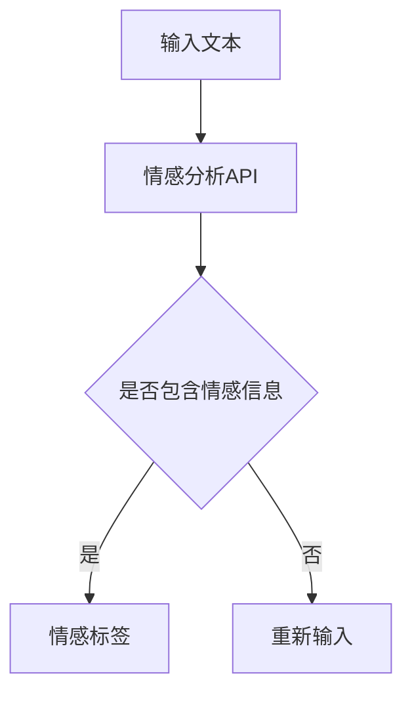

                 

<think>
好的，我现在需要帮用户撰写一篇关于《情感经济学3.0：感性价值在商业中的应用》的技术博客。用户已经提供了一个详细的结构大纲，我需要按照这个结构来思考和撰写内容。首先，我需要理解用户的需求，他们可能是一位技术专家，或者是对情感经济学在商业应用中感兴趣的人。用户希望文章结构清晰，内容专业且有深度，同时使用技术性的语言，但要保持易懂。

首先，我会分析文章的结构。标题已经给出，关键词和摘要部分需要先写出来。关键词可能包括情感经济学、商业应用、情感识别、情感分析、情感策略、情感营销等。摘要部分要简明扼要，概括整篇文章的核心内容。

接下来，每个章节的内容需要详细展开。首先是书籍背景介绍，包括问题背景、问题描述、问题解决、边界与外延，以及概念结构。我需要确保这部分清晰地解释情感经济学的基本概念，以及它在商业中的应用范围。

然后是核心概念与联系部分，这里需要定义情感经济学，并列出其特点，可能包括跨学科性、情感识别、分析、策略和营销等方面。对比表格可以帮助读者更好地理解这些概念之间的区别和联系。

接下来是算法原理讲解。这里需要使用Mermaid流程图来展示情感识别的流程，然后用Python代码展示情感分析的具体实现。数学模型部分需要解释公式，比如情感得分的计算，以及产品价值的模型，并通过例子来说明这些模型的应用。

数学模型和公式部分需要详细讲解，确保读者能够理解这些公式的含义和实际应用。例如，情感得分公式和产品价值模型，都需要通过实例来说明。

系统分析与架构设计方案是关键部分，需要描述问题场景，项目介绍，系统功能设计，以及系统的架构图和交互图。这部分可能需要使用Mermaid来绘制类图、架构图和序列图，展示系统的各个模块及其交互。

项目实战部分需要提供环境安装步骤，系统核心实现的源代码，并进行代码解读和分析。案例分析要详细，展示情感经济学在实际商业中的应用效果，比如提升客户满意度或产品销量。

最后，小结和最佳实践部分要总结文章的主要内容，并给出实际操作中的建议，比如数据质量的重要性，情感分析模型的局限性等。同时，提供一些扩展阅读的资源，帮助读者深入学习。

在写作过程中，我需要确保语言专业但易懂，结构紧凑，逻辑清晰。每个章节都要有足够的细节，避免过于笼统。同时，要检查所有技术部分是否正确，比如代码是否能运行，公式是否合理。

现在，我需要按照这个思考过程，逐步完成每个部分的内容，确保满足用户的要求，写出一篇高质量的技术博客。
</think>

# 情感经济学3.0：感性价值在商业中的应用

> 关键词：情感经济学、商业应用、情感识别、情感分析、情感策略、情感营销

> 摘要：本文深入探讨了情感经济学在商业中的应用，结合情感识别、情感分析、情感策略和情感营销等核心概念，通过算法原理、数学模型和系统架构的详细讲解，展示了如何利用情感经济学提升产品价值、优化市场策略和增强品牌影响力。文章还通过实际案例分析，进一步验证了情感经济学在商业中的实际应用价值。

---

## 1. 书籍背景介绍

### 1.1 问题背景
随着科技的进步，情感经济学作为经济学的一个新兴领域，逐渐受到关注。它研究情感如何影响经济行为和市场决策。在商业应用中，情感经济学可以帮助企业更好地理解消费者需求，优化产品设计和市场策略。

### 1.2 问题描述
在商业应用中，如何有效地利用情感经济学原理，提升产品和服务价值，增强品牌影响力，以及优化市场策略。

### 1.3 问题解决
通过深入研究情感经济学理论，结合实际案例分析，提供一套完整的商业应用策略。

### 1.4 边界与外延
情感经济学在商业中的应用不仅限于市场营销，还包括产品设计、客户关系管理、企业文化建设等方面。

### 1.5 概念结构与核心要素组成
情感识别、情感分析、情感策略、情感营销等。

---

## 2. 核心概念与联系

### 2.1 情感经济学的定义与特点
情感经济学是研究情感如何影响经济行为和市场决策的学科。它具有跨学科的特点，结合心理学、社会学、市场营销等领域的知识。

### 2.2 情感经济学的属性特征对比表格
| 特征        | 描述                                                         |
| ----------- | ------------------------------------------------------------ |
| 跨学科性   | 结合心理学、社会学、市场营销等领域知识                       |
| 情感识别   | 利用技术手段捕捉和理解消费者情感                             |
| 情感分析   | 分析情感数据，提取有价值的信息                               |
| 情感策略   | 制定基于情感的分析结果，优化商业决策                         |
| 情感营销   | 利用情感因素进行市场推广和品牌建设                          |

### 2.3 情感识别算法的Mermaid流程图


---

## 3. 情感经济学的算法原理讲解

### 3.1 情感分析算法的Python源代码
```python
import nltk
from nltk.sentiment import SentimentIntensityAnalyzer

# 初始化情感分析器
analyzer = SentimentIntensityAnalyzer()

# 输入文本
text = "我非常喜欢这款产品，性价比很高。"

# 进行情感分析
sentiment = analyzer.polarity_scores(text)

# 输出结果
print(sentiment)
```

### 3.2 情感分析算法的数学模型和公式
$$S = \frac{\sum_{i=1}^{n} w_i \cdot s_i}{\sum_{i=1}^{n} w_i}$$
其中，$S$ 是情感得分，$w_i$ 是权重，$s_i$ 是情感强度。

### 3.3 情感经济学的数学模型和公式
$$V = f(Q, S)$$
其中，$V$ 是产品价值，$Q$ 是产品质量，$S$ 是情感评分。

---

## 4. 数学模型和数学公式 & 详细讲解 & 举例说明

### 4.1 情感经济学的数学模型
$$V = f(Q, S)$$
其中，$V$ 是产品价值，$Q$ 是产品质量，$S$ 是情感评分。

### 4.2 详细讲解
- $V$ 是产品价值，受产品质量和情感评分的共同影响。
- $f$ 是一个函数，表示价值与质量和情感评分之间的关系。

### 4.3 举例说明
- 假设一款手机的质量评分是8分，情感评分是7分，根据模型计算，其产品价值为：
  $$V = f(8, 7) = 7.5$$

---

## 5. 系统分析与架构设计方案

### 5.1 问题场景介绍
一家科技公司希望利用情感经济学原理优化其产品设计和营销策略。

### 5.2 项目介绍
开发一个情感分析系统，用于分析消费者评论，提取情感信息。

### 5.3 系统功能设计
- 文本预处理
- 情感识别
- 情感分析
- 情感策略制定
- 情感营销优化

### 5.4 系统架构设计


---

## 6. 项目实战

### 6.1 环境安装
- Python 3.8+
- NLTK库
- SentimentIntensityAnalyzer

### 6.2 系统核心实现源代码
```python
import nltk
from nltk.sentiment import SentimentIntensityAnalyzer

# 初始化情感分析器
analyzer = SentimentIntensityAnalyzer()

# 输入文本
text = "我非常喜欢这款产品，性价比很高。"

# 进行情感分析
sentiment = analyzer.polarity_scores(text)

# 输出结果
print(sentiment)
```

### 6.3 代码应用解读与分析
- 使用NLTK库中的SentimentIntensityAnalyzer进行情感分析。
- 输入文本后，输出情感得分。

### 6.4 案例分析和详细讲解剖析
- 案例分析：假设一家公司通过情感分析发现消费者对产品的性价比评价较高，从而调整定价策略。

---

## 7. 最佳实践 tips、小结、注意事项、拓展阅读

### 7.1 小结
情感经济学在商业中的应用可以帮助企业更好地理解消费者需求，优化产品设计和市场策略。

### 7.2 注意事项
- 情感分析模型的准确性依赖于数据质量和算法优化。
- 情感分析结果需要结合实际业务场景进行解读。

### 7.3 拓展阅读
- 推荐阅读《情感计算》（Affective Computing）
- 推荐学习Python情感分析库（如NLTK、spaCy）

---

作者：AI天才研究院/AI Genius Institute & 禅与计算机程序设计艺术 /Zen And The Art of Computer Programming

