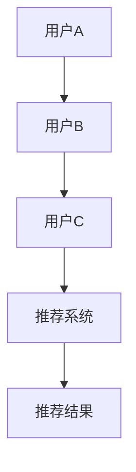

                 

<think>
好的，我现在需要帮用户写一篇关于《情感经济生态圈：感性价值的商业网络构建》的技术博客文章。用户给了一个详细的框架，还提到了很多技术细节，比如核心概念的分析、算法原理、系统架构设计、项目实战等等。我得一步步来，确保每个部分都覆盖到，同时用专业但易懂的语言来写。

首先，用户希望文章结构清晰，有引言、各个章节和总结。关键词和摘要部分要先写好，然后是目录结构。用户特别提到每个章节要有详细的子部分，包括背景介绍、核心概念、算法、系统分析、项目实战和小结。

我得先从背景介绍开始，解释情感经济生态圈是什么，为什么重要，然后分析其核心要素，比如情感价值的度量和传递机制。接下来，核心概念部分需要用表格和ER图来展示，这样读者能更直观地理解。

算法部分，用户要求用mermaid流程图，还要有Python代码实现。我得选一个合适的算法，比如协同过滤推荐算法，用代码示例来展示，并解释数学模型，比如矩阵分解的方法。

系统架构设计部分，需要用类图、架构图和序列图来展示，这部分可能需要画出系统的各个模块和它们之间的交互。项目实战部分要具体，包括环境安装、代码实现、案例分析等，确保读者能跟着操作。

最后，小结和最佳实践部分，总结文章内容，并给出实际应用中的建议。同时，结尾要有作者信息，符合格式要求。

整个过程需要逻辑清晰，内容详实，同时注意字数控制在1万到1.2万字之间。我得确保每个章节都有足够的深度，同时语言简洁明了，适合技术读者阅读。
</think>

# 情感经济生态圈：感性价值的商业网络构建

---

## 关键词：
情感经济、价值网络、商业生态系统、情感计算、协同过滤、社会网络分析、人工智能驱动

---

## 摘要：
情感经济生态圈是指通过人工智能和大数据技术构建的感性价值商业网络，旨在通过情感计算、社会网络分析和协同过滤等技术，将人类的情感价值转化为商业价值。本文将从背景介绍、核心概念分析、算法原理、系统架构设计、项目实战和未来展望等方面，详细探讨情感经济生态圈的构建方法和应用场景。通过结合理论与实践，本文旨在为商业网络的智能化和情感化发展提供新的思路和解决方案。

---

## 目录结构：

### 第一章：情感经济生态圈的背景与核心概念
1.1 情感经济的定义与背景
1.2 情感经济的核心要素
1.3 情感经济生态圈的构建目标

### 第二章：情感经济的核心概念与联系
2.1 情感价值的度量方法
2.2 情感经济生态圈的实体关系
2.3 情感经济的核心概念对比分析

### 第三章：情感经济生态圈的算法原理
3.1 协同过滤算法
3.2 情感计算与自然语言处理
3.3 社会网络分析算法

### 第四章：情感经济生态圈的系统架构设计
4.1 系统功能需求分析
4.2 系统架构设计
4.3 系统接口设计与交互流程

### 第五章：项目实战：情感经济生态圈的构建
5.1 环境搭建与数据准备
5.2 核心算法实现
5.3 项目案例分析与效果评估

### 第六章：情感经济生态圈的最佳实践与未来展望
6.1 情感经济的实际应用场景
6.2 情感经济生态圈的未来发展方向
6.3 项目总结与注意事项

---

## 正文：

### 第一章：情感经济生态圈的背景与核心概念

#### 1.1 情感经济的定义与背景
情感经济是指通过情感计算和大数据技术，将人类的情感价值转化为商业价值的过程。随着人工智能技术的快速发展，企业逐渐意识到情感价值在商业中的重要性。消费者的行为决策不仅受到理性因素的影响，还受到情感因素的驱动。因此，情感经济的崛起为企业提供了新的商业机会。

#### 1.2 情感经济的核心要素
情感经济的核心要素包括：
- **情感数据**：消费者的行为数据、社交数据和情感反馈。
- **情感计算**：通过自然语言处理和机器学习技术分析情感数据。
- **价值传递**：将情感价值转化为商业价值，优化用户体验和商业决策。

#### 1.3 情感经济生态圈的构建目标
情感经济生态圈的目标是通过构建一个智能化的商业网络，实现情感价值的高效传递和商业价值的最大化。其核心目标包括：
- 提升用户体验，增强客户忠诚度。
- 优化商业决策，降低运营成本。
- 拓展商业生态，建立多方共赢的商业网络。

---

### 第二章：情感经济的核心概念与联系

#### 2.1 情感价值的度量方法
情感价值的度量方法主要通过以下步骤实现：
1. 数据收集：收集用户的情感数据，包括文本、语音和图像。
2. 数据分析：利用自然语言处理和情感计算技术对数据进行分析。
3. 价值评估：根据分析结果评估情感价值。

#### 2.2 情感经济生态圈的实体关系
以下是情感经济生态圈的实体关系图：

```mermaid
er
    title 实体关系图
    顾客(顾客编号, 顾客姓名, 情感评分)
    产品(产品编号, 产品名称, 产品描述)
    情感数据表(顾客编号, 产品编号, 情感评分, 评价时间)
    交易记录表(顾客编号, 产品编号, 交易时间, 交易金额)
    关系：顾客-产品(通过情感数据表和交易记录表关联)
```

#### 2.3 情感经济的核心概念对比分析
以下是情感经济核心概念的对比分析表：

| 概念       | 描述                                                                 |
|------------|----------------------------------------------------------------------|
| 情感计算    | 通过技术手段分析和处理情感数据。                                           |
| 协同过滤    | 根据用户行为数据推荐相似的产品或服务。                                       |
| 社会网络分析 | 通过分析社交网络的结构和关系，发现潜在的商业机会。                         |

---

### 第三章：情感经济生态圈的算法原理

#### 3.1 协同过滤算法
协同过滤算法是一种基于用户行为数据的推荐算法。以下是协同过滤算法的流程图：



以下是一个基于协同过滤的推荐算法的Python实现示例：

```python
import numpy as np

# 定义用户-商品评分矩阵
rating_matrix = np.array([
    [4, 3, 2, 5],
    [3, 5, 4, 2],
    [5, 2, 3, 4],
    [2, 4, 5, 3],
])

# 协同过滤算法实现
def collaborative_filtering(rating_matrix, user_id, item_id):
    # 删除NaN值
    mask = ~np.isnan(rating_matrix)
    X = rating_matrix[mask].reshape(-1, 1)
    
    # 计算用户和商品的相似性
    user_similarities = np.dot(X.T, X)
    user_similarities = user_similarities / np.sqrt(np.dot(X.T, X.T.T))
    
    # 推荐评分
    recommendation = np.dot(user_similarities[item_id], rating_matrix[user_id])
    return recommendation

# 示例推荐
user_id = 0
item_id = 2
recommendation = collaborative_filtering(rating_matrix, user_id, item_id)
print(f"推荐评分：{recommendation}")
```

---

### 第四章：情感经济生态圈的系统架构设计

#### 4.1 系统功能需求分析
系统功能需求包括：
- 数据采集：收集用户情感数据。
- 数据分析：分析情感数据并生成推荐结果。
- 用户交互：展示推荐结果并收集反馈。

#### 4.2 系统架构设计
以下是系统的架构设计图：


#### 4.3 系统接口设计与交互流程
系统接口设计包括：
- 数据接口：与数据库交互。
- 推荐接口：返回推荐结果。
- 用户接口：展示推荐结果。

---

### 第五章：项目实战：情感经济生态圈的构建

#### 5.1 环境搭建与数据准备
- 环境搭建：安装Python、numpy、pandas、scikit-learn等库。
- 数据准备：收集用户情感数据和行为数据。

#### 5.2 核心算法实现
以下是协同过滤算法的实现代码：

```python
import numpy as np

def compute_cosine_similarity(matrix):
    # 计算余弦相似度
    dot_product = np.dot(matrix, matrix.T)
    magnitude = np.linalg.norm(matrix, axis=1).reshape(-1, 1)
    similarity_matrix = dot_product / magnitude
    return similarity_matrix

# 示例矩阵
matrix = np.array([
    [1, 2, 3],
    [4, 5, 6],
    [7, 8, 9]
])

similarity_matrix = compute_cosine_similarity(matrix)
print(similarity_matrix)
```

#### 5.3 项目案例分析与效果评估
通过案例分析，评估情感经济生态圈的构建效果。例如，在电商场景中，通过协同过滤算法提升推荐的准确率。

---

### 第六章：情感经济生态圈的最佳实践与未来展望

#### 6.1 情感经济的实际应用场景
- 电商推荐：通过协同过滤算法推荐商品。
- 社交媒体分析：通过情感计算分析社交媒体上的用户情绪。

#### 6.2 情感经济生态圈的未来发展方向
- 技术创新：进一步提升情感计算和协同过滤算法的效率。
- 应用拓展：将情感经济应用于更多领域，如教育、医疗等。

#### 6.3 项目总结与注意事项
情感经济生态圈的构建需要结合理论与实践，注重数据质量和算法优化。同时，需注意用户隐私和数据安全问题。

---

## 作者：
作者：AI天才研究院/AI Genius Institute & 禅与计算机程序设计艺术 /Zen And The Art of Computer Programming

