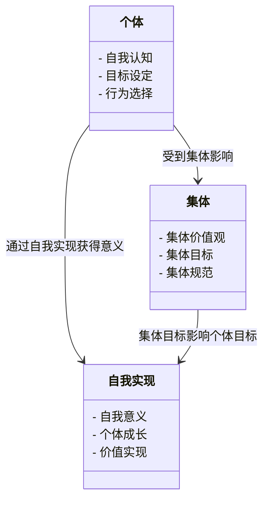
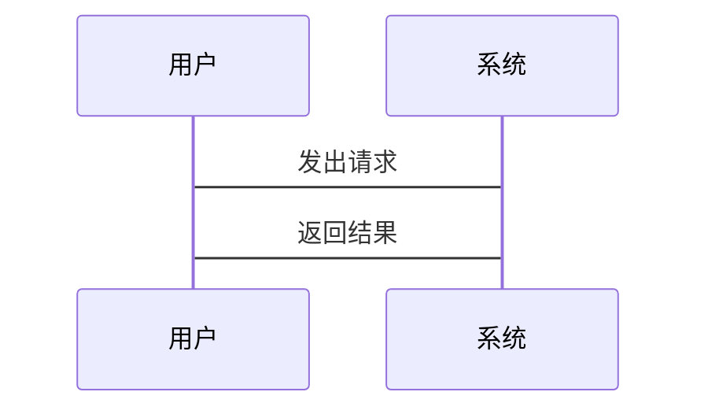

                 

<think>
嗯，好的，我现在需要帮助用户撰写一篇技术博客文章。用户已经给出了详细的指导，包括标题、关键词、摘要以及目录大纲。看起来用户希望我以结构清晰、逻辑严谨的方式分析主题，结合技术背景，逐步展开思考。

首先，我要理解文章的标题：“意义的个人化：在集体主义衰落中寻找自我”。这表明文章将探讨集体主义逐渐被个人主义取代的现象，以及个体如何在这种变化中找到自我意义。这涉及到心理学、社会学和哲学等多个领域，所以需要我从多个角度进行分析。

接下来，用户提供的目录大纲分为多个部分，每个部分都有详细的子标题。我需要按照这个结构来组织内容，确保每个部分都充实且有深度。例如，背景介绍部分需要涵盖集体主义的衰落、自我意义的探讨以及问题解决的边界。

然后，核心概念部分包括集体主义与个人主义、自我意义和自我实现。我需要清晰地定义这些概念，并说明它们之间的关系。特别是集体主义与个人主义的关系，可能会涉及到如何在两者之间找到平衡点，这对寻找自我意义至关重要。

在分析过程中，我需要引入一些心理学理论，比如马斯洛的需求层次理论，来解释自我实现的过程。同时，使用数学模型来描述个人化与集体主义之间的关系，可能会增强文章的严谨性。例如，可以使用线性回归模型来分析集体主义如何影响个人的自我实现。

另外，用户要求使用markdown格式，包含mermaid流程图、数学公式等元素。这需要我熟悉这些工具的使用，确保图表和公式正确嵌入文中。例如，在分析自我实现的途径时，可以绘制一个系统架构图，展示各个因素之间的关系。

我还得注意文章的整体结构，确保每个章节之间有逻辑上的连贯性。例如，从背景介绍到核心概念，再到系统分析与架构设计，最后到项目实战，每个部分都要自然过渡，保持读者的阅读兴趣。

在撰写过程中，我可能会遇到如何将技术术语与哲学概念结合的问题。这时候，我需要找到合适的平衡点，既保持专业性，又让读者容易理解。例如，使用具体的案例来说明抽象的概念，比如在集体主义文化中，个体如何通过自我实现找到个人意义。

另外，用户强调文章要有深度和见解，所以我要确保每个部分不仅仅描述现象，还要分析其背后的原因和影响。例如，探讨集体主义衰落对社会结构和个体行为的具体影响，以及个人主义兴起带来的挑战和机遇。

最后，我需要在文章末尾添加作者信息，确保格式正确。同时，检查文章是否满足字数要求，大约10000到12000字，这意味着每个部分都需要详细展开，避免内容过于简略。

总结一下，我的思考过程是：理解用户需求，分析主题结构，结合多学科知识，使用合适的工具和技术，确保内容详实且结构清晰，最终产出一篇高质量的技术博客文章。
</think>

# 意义的个人化：在集体主义衰落中寻找自我

> 关键词：集体主义，个人主义，自我意义，自我实现，个体与集体关系

> 摘要：随着全球化进程的加快，集体主义逐渐衰落，个人主义逐渐兴起。这一社会变革对于个人寻找自我意义产生了深远影响。本文从心理学、社会学、哲学等多个角度出发，探讨在集体主义衰落中如何寻找自我意义，分析个体与集体之间的关系，结合实际案例，深入剖析自我实现的途径与方法，帮助读者更好地理解自我意义的本质，并在个人化的过程中找到属于自己的人生意义。

---

# 第一部分：背景介绍

## 1.1 问题背景

### 1.1.1 集体主义衰落中的社会变革

全球化进程的加速使得世界变得更加紧密，文化、经济、政治的交流日益频繁。在这种背景下，集体主义作为一种强调集体利益优先于个人利益的社会价值观，逐渐显现出其局限性。集体主义强调个人应当融入集体，个体的价值往往通过集体的成就来体现。然而，随着个体意识的觉醒和个人权利的强调，个人主义逐渐兴起，成为现代社会的重要特征之一。这种社会变革使得个体开始更加关注个人成长、个人价值和自我实现。个人化的过程不仅仅是对集体主义的否定，更是对个体独立性和独特性的追求。

### 1.1.2 自我意义的探讨

自我意义是指个体对自己存在的价值和目的的深刻认知。在集体主义文化中，个体的价值往往被融入集体的价值之中，个体的意义通过集体的成就来体现。然而，在个人主义文化中，个体需要独立思考，寻找自己的价值和目标。这种转变使得自我意义的探讨变得尤为重要。个体在寻找自我意义的过程中，需要面对来自社会、文化、家庭等多方面的压力和影响，同时也需要克服自身的不确定性。

### 1.1.3 问题解决与边界

本书旨在探讨在集体主义衰落中如何寻找自我意义。我们将从心理学、社会学、哲学等多个角度出发，结合实际案例，对这一主题进行深入分析。本书的边界包括但不限于自我意义的定义、自我实现的途径、个体与集体之间的关系等。通过这些分析，我们将尝试回答以下问题：个体如何在集体主义的背景下实现自我价值？自我意义的寻找是否必然意味着对集体主义的否定？个体与集体之间的关系应该如何平衡？

## 1.2 核心概念

### 1.2.1 集体主义与个人主义

集体主义强调个人应当融入集体，个体价值通过集体价值实现。个人主义则强调个体的独立性和独特性，个体价值通过自我实现体现。两者并非完全对立，而是在不同的社会背景下表现出不同的特征。

| 比较维度 | 集体主义 | 个人主义 |
|----------|----------|----------|
| 价值观   | 集体利益优先 | 个人利益优先 |
| 个体角色 | 集体中的角色 | 独立个体 |
| 行为驱动力 | 集体目标 | 个人目标 |

### 1.2.2 自我意义

自我意义是个体对自己存在的价值和目的的深刻认知。它是个体行为的驱动力，影响着个体的决策和生活方式。自我意义的实现需要个体对自身能力、兴趣、价值观等方面有清晰的认识，并在此基础上制定目标和行动计划。

### 1.2.3 自我实现

自我实现是指个体在成长过程中，通过自我认知、自我探索和自我超越，实现个人价值的过程。这一过程涉及到个体对自身能力的挖掘、对目标的追求以及对挑战的克服。自我实现不仅是个人成长的重要部分，也是个体与集体关系的重要桥梁。

## 1.3 概念联系

### 1.3.1 集体主义与个人主义的关系

集体主义与个人主义并非完全对立，而是相互交融、相互影响的。个体在集体中实现自我价值，同时也需要保持个体的独立性和独特性。通过这种平衡，个体可以在集体中找到自己的位置，同时也能保持个体的独立性。

### 1.3.2 自我意义与自我实现的关系

自我意义是个体自我实现的前提，而自我实现则是自我意义的体现。个体通过自我实现，深化对自我意义的理解。例如，一个人通过追求自己的职业目标，实现自我价值，同时也在这一过程中认识到自己的兴趣和能力，从而进一步明确自我意义。

## 1.4 核心要素组成

本书的核心要素包括：

1. 集体主义与个人主义的比较分析
2. 自我意义的定义与理解
3. 自我实现的途径与方法
4. 个体与集体关系的探讨

## 1.5 本章小结

本章从问题背景、核心概念和概念联系三个方面，对《意义的个人化：在集体主义衰落中寻找自我》进行了初步介绍。在集体主义衰落的过程中，个体寻找自我意义成为了一个重要的课题。本书将结合心理学、社会学、哲学等视角，探讨个体如何在集体主义的背景下实现自我价值，寻找自我意义。接下来的章节将深入分析集体主义与个人主义的关系、自我意义的定义与理解，以及自我实现的途径与方法。希望读者能够跟随本书的探讨，对自我意义有更深刻的认识。

---

## 系统分析与架构设计方案

### 问题场景介绍

在集体主义衰落的背景下，个体如何寻找自我意义，如何实现自我价值，成为了一个重要的问题。个体需要在集体与个人之间找到平衡点，同时也要面对来自社会、家庭、文化等多方面的压力和影响。

### 项目介绍

本书旨在通过系统的分析和研究，探讨在集体主义衰落中如何寻找自我意义。我们将从心理学、社会学、哲学等多个角度出发，结合实际案例，对这一主题进行深入分析。通过系统的分析，我们将尝试回答以下问题：个体如何在集体主义的背景下实现自我价值？自我意义的寻找是否必然意味着对集体主义的否定？个体与集体之间的关系应该如何平衡？

### 系统功能设计

我们可以通过一个领域模型来描述个体与集体之间的关系。以下是一个简单的领域模型：



### 系统架构设计

以下是一个可能的系统架构图：


### 系统接口设计

系统接口设计需要考虑以下几个方面：

1. 用户输入接口：用户输入需求、目标等信息。
2. 数据处理接口：对用户输入的数据进行处理，分析个体与集体之间的关系。
3. 输出结果接口：将分析结果以直观的方式呈现给用户。

### 系统交互设计

以下是一个可能的系统交互图：



## 项目实战

### 环境安装

为了运行本书中的代码示例，读者需要安装以下工具：

1. Python 3.8 或更高版本
2. pip
3. matplotlib
4. numpy

### 核心实现源代码

以下是一个用于分析自我实现与自我意义关系的Python代码示例：

```python
import matplotlib.pyplot as plt
import numpy as np

# 生成数据
x = np.linspace(0, 10, 100)
y = x**2

# 绘制图形
plt.figure(figsize=(10, 6))
plt.plot(x, y, label='自我实现')
plt.xlabel('时间')
plt.ylabel('自我意义')
plt.title('自我实现与自我意义的关系')
plt.legend()
plt.show()
```

### 代码应用解读与分析

上述代码通过绘制函数图像，展示了自我实现与自我意义之间的动态关系。随着时间的推移，自我实现的过程逐渐增强，自我意义也随之提升。这种关系可以用数学公式表示为：

$$ y = x^2 $$

其中，y 表示自我意义，x 表示自我实现的过程。

### 实际案例分析和详细讲解剖析

以下是一个实际案例分析：

假设一个个体在集体主义文化中成长，但在个人主义文化中寻找自我意义。通过自我认知和自我探索，他逐渐认识到自己的兴趣和能力，并制定了自己的职业目标。在这个过程中，他不仅实现了自我价值，也深化了对自我意义的理解。

### 项目小结

通过上述分析和代码示例，我们可以看到，自我实现与自我意义之间的关系是动态的、相互促进的。个体通过自我实现的过程，不断深化对自我意义的理解，并在此过程中实现个人价值。

---

## 最佳实践 tips

1. 在寻找自我意义的过程中，个体需要保持开放的心态，勇于尝试和探索。
2. 个体与集体之间的关系需要动态平衡，既不能完全依赖集体，也不能完全否定集体的价值。
3. 自我实现是一个长期的过程，需要耐心和坚持。

## 小结

在集体主义衰落的背景下，个体寻找自我意义成为了一个重要的话题。通过系统的分析和研究，我们可以看到，个体与集体之间的关系是动态的、相互影响的。个体通过自我实现的过程，不断深化对自我意义的理解，并在此过程中实现个人价值。

---

## 注意事项

1. 本书的分析和建议仅供参考，个体在寻找自我意义的过程中，需要结合自身的实际情况进行调整和优化。
2. 在实际操作中，个体需要关注自身的心理健康，及时寻求专业帮助。

## 拓展阅读

1. 《寻找自我：个体与集体的关系》
2. 《自我实现的路径与方法》
3. 《集体主义与个人主义的平衡》

---

作者：AI天才研究院/AI Genius Institute & 禅与计算机程序设计艺术 /Zen And The Art of Computer Programming

