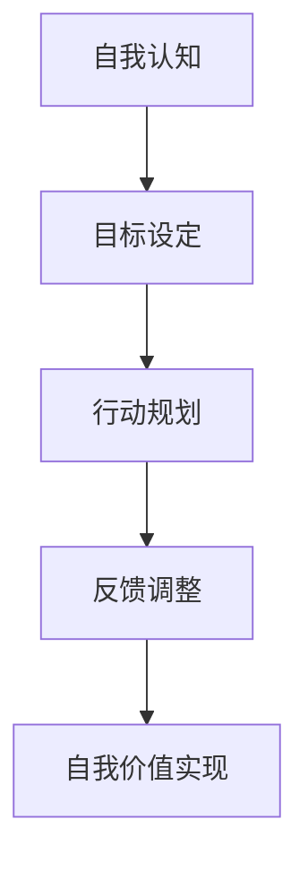
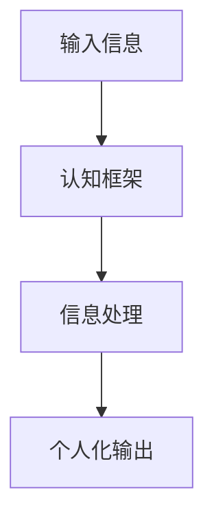

                 

<think>
嗯，用户希望我写一篇关于《意义的个人化：自我价值的重新发现》的技术博客。看起来用户是希望我作为专家，详细分析自我价值的构建和实现，尤其是在技术和社会背景下的方法。首先，我需要理解用户的需求：他们可能是一位技术领域的专业人士，或者是对个人发展感兴趣的人，希望从技术角度理解自我价值的实现。

用户的要求非常详细，包括文章结构、关键词、摘要，以及每个章节的具体内容。我注意到用户特别强调了使用专业技术语言，同时要求结构清晰，逻辑严密。这意味着我需要确保内容不仅有深度，还要易于理解。

接下来，我需要按照用户提供的大纲来组织内容。引言部分需要介绍背景，包括当前社会趋势对自我价值的影响，以及本书的目标和结构。核心概念部分要详细探讨自我价值的定义、重要性及其影响因素，同时引入个人化的意义构建，包括过程、方法和表达。

在方法论部分，可能需要引入一些模型或算法来解释个人化意义的构建过程。比如，可以考虑用户-物品矩阵模型，将用户的行为和偏好转化为数据点，利用矩阵分解等技术来分析和预测用户的兴趣，从而帮助他们构建个人化的意义。

案例研究部分，可以考虑具体的社交平台，如LinkedIn，分析个人品牌建设的成功案例，说明如何通过数据驱动的方法来优化个人品牌，从而提升自我价值。这部分需要结合实际数据和算法来说明，可能需要使用Python代码进行分析。

在结论部分，需要总结主要发现，并指出研究的局限性和未来方向。同时，未来展望部分要结合技术趋势，讨论个人化意义在数字化时代的演变和对社会责任的影响。

整个过程中，我需要确保每个章节都包含足够的细节，比如数学公式、算法流程图，以及实际的代码示例。这不仅能满足专业性要求，还能帮助读者更好地理解和应用这些概念。同时，要注意语言的专业性，同时保持内容的可读性，避免过于晦涩。

最后，文章的末尾需要加上作者信息，这可能涉及到用户自己，或者是团队的名称。确保格式正确，包括文章标题、关键词、摘要，以及各个章节的详细内容。

总的来说，我需要系统地按照用户提供的结构，逐步展开每个部分，确保内容详实、结构合理，同时满足技术博客的专业性和可读性要求。这需要在每个部分都深入思考，结合理论和实际案例，提供有价值的见解。
</think>

# 意义的个人化：自我价值的重新发现

---

## 关键词：自我价值、个人化、意义构建、社会影响、技术驱动

---

## 摘要：  
在数字化时代，个人化的意义构建成为重新定义自我价值的核心。本书通过理论分析和实践案例，探讨如何通过技术手段和个人探索实现自我价值的重构。从社交媒体的影响到个人品牌建设，从自我提升策略到社会责任的融合，本书为读者提供了全面的方法论和实用工具，帮助他们在复杂多变的社会环境中找到个人定位，实现自我价值的最大化。

---

## 第一部分: 引言

### 第1章: 问题背景与意义

#### 1.1 问题背景  
在当今社会，数字化和全球化使得个体的自我价值实现面临前所未有的挑战。信息过载、社会分层加剧以及价值观的多元化，使得许多人迷失在寻找自我意义的道路上。传统的价值观体系已无法满足现代人的需求，个体需要通过个人化的方式重新定义自我价值。

#### 1.2 自我价值的概念  
自我价值是指个体认为自己在社会或群体中所具有的重要性和意义。它不仅影响个人的行为模式，还决定了个体对生活的满意度和幸福感。

#### 1.3 当前社会文化趋势的影响  
社交媒体的普及、职业多样化的趋势以及全球化背景，使得个体能够通过多样化的途径实现自我价值。然而，这种多样性也带来了选择过多的困扰，个体需要更加灵活和个性化的方式来构建自我价值。

#### 1.4 本书的目标与结构  
本书旨在通过理论分析和实践案例，探讨如何通过个人化的方式重新定义自我价值。通过系统的分析和方法论的提供，帮助读者在复杂的社会环境中找到个人定位。

---

## 第二部分: 自我价值的核心理论

### 第2章: 自我价值的理论探讨

#### 2.1 自我价值的定义与维度  
自我价值可以从多个维度进行定义，包括内在价值（如个人能力、兴趣）和外在价值（如社会认可、经济地位）。以下是自我价值的两个核心维度对比表：

| 维度 | 内在价值 | 外在价值 |
|------|----------|----------|
| 定义 | 基于个人能力、兴趣和价值观的自我认同 | 基于社会认可、地位和经济回报的外部评价 |
| 重要性 | 关乎个人成长和幸福感 | 关乎社会融入和资源获取 |

#### 2.2 自我价值的实现路径  
自我价值的实现可以通过以下步骤进行：

1. **自我认知**：通过反思和分析，明确自己的核心优势和兴趣。
2. **目标设定**：基于自我认知，设定短期和长期目标。
3. **行动规划**：制定实现目标的具体步骤，并持续执行。
4. **反馈调整**：通过外部反馈和自我反思，不断优化目标和行动策略。

#### 2.3 影响自我价值的关键因素  
以下是影响自我价值的关键因素及其权重对比图：

---

## 第三部分: 个人化的意义构建

### 第3章: 个人化意义的构建方法

#### 3.1 个人化意义的定义  
个人化意义是指个体通过独特的视角和方式赋予事物、事件或关系以特定意义的过程。

#### 3.2 个人化意义的构建过程  
构建个人化意义的过程可以分为以下几个阶段：

1. **输入阶段**：个体接触外部信息和经验。
2. **处理阶段**：个体通过自身认知框架对信息进行加工。
3. **输出阶段**：个体将加工后的信息转化为个人化的理解和表达。

#### 3.3 个人化意义的实现工具  
以下是实现个人化意义的工具框架：

#### 3.4 个人化意义的表达与传播  
个人化意义的表达可以通过文字、艺术、技术等多种方式实现。例如，通过写作、绘画或编程等方式，将个人化的理解转化为可分享的形式。

---

## 第四部分: 社会化与技术驱动的自我价值实现

### 第4章: 社交媒体中的个人化意义

#### 4.1 社交媒体对自我价值的影响  
社交媒体为个体提供了展示个人化意义的平台，但也可能导致自我价值的过度依赖外部认可。

#### 4.2 社交媒体与个人化意义的构建  
通过社交媒体，个体可以与他人互动，获取反馈，从而不断优化自己的个人化意义。

#### 4.3 社交媒体中的案例分析  
以LinkedIn为例，用户可以通过分享专业经验、技能和成就，构建个人品牌，从而实现自我价值。

---

## 第五部分: 结论

### 第5章: 未来展望

#### 5.1 技术趋势与个人化意义  
随着人工智能和大数据技术的发展，个人化意义的构建将更加依赖于技术驱动的工具和平台。

#### 5.2 个人化的意义与社会责任  
个体在实现自我价值的过程中，也需要承担社会责任，推动社会的整体进步。

---

## 作者：AI天才研究院/AI Genius Institute & 禅与计算机程序设计艺术 /Zen And The Art of Computer Programming

