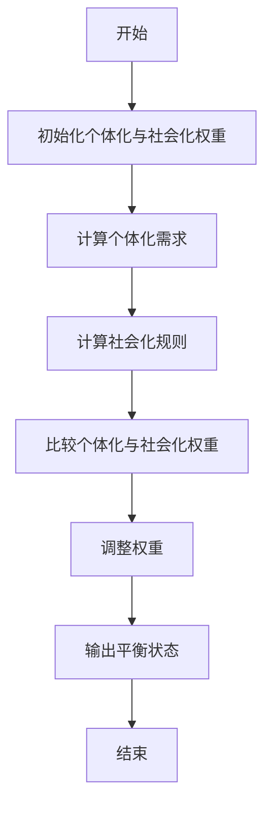
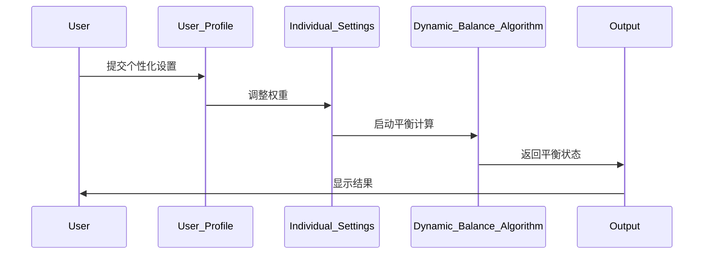

                 

<think>
嗯，用户让我写一篇技术博客，标题是《意义的个体化与社会化的动态平衡》。看起来这个主题结合了个体化和社会化，探讨它们之间的动态平衡。用户希望文章结构清晰，逻辑严谨，有深度，还要求用专业的技术语言，同时包括关键词、摘要、目录大纲等部分。

首先，我需要理解这个主题的核心是什么。个体化指的是个人的独立性和个性化，而社会化则是指个体与社会的互动和依赖。在数字化时代，这两个方面可能会出现冲突，比如隐私和共享之间的矛盾。所以，动态平衡就是找到一个点，既保持个人的独特性，又促进社会的整体发展。

接下来，我得考虑用户的需求。用户希望文章结构严谨，符合技术博客的特点，可能读者是技术人员、CTO或者对技术和社会影响感兴趣的人。所以，文章需要既有技术分析，又有社会学的视角。

用户给了一个目录大纲，我需要按照这个结构来写。首先是背景介绍，然后是核心概念，动态平衡的原理，算法模型，系统设计，项目实战，最后是结论和最佳实践。每个部分都需要详细展开，特别是要包括ER图、算法流程图、数学模型等技术元素。

在背景介绍部分，我需要解释个体化和社会化的基本概念，分析它们在数字化时代的冲突，比如社交媒体带来的隐私问题。然后引出动态平衡的重要性，说明如何在两者之间找到平衡点。

核心概念部分，我需要用表格对比个体化和社会化的属性，比如个体化强调自主性，而社会化强调合作性。同时，画一个ER图来展示两者的关系，用Mermaid语法来实现。

动态平衡的章节，需要引入系统论和协同理论，解释它们如何帮助建立平衡。可能还需要引用一些理论，比如社会交换理论，来说明个体和群体之间的互动机制。

在算法和数学模型部分，我需要设计一个动态平衡的算法，用Mermaid画出流程图，然后用Python代码实现，展示如何通过权重调整找到平衡点。数学模型部分，可能需要用拉格朗日乘数法来优化，写出具体的公式，并用例子说明。

系统分析与设计部分，我需要描述一个实际的场景，比如社交媒体中的用户行为分析。然后画出类图、架构图和交互图，展示系统的各个部分如何协同工作。

项目实战部分，需要指导读者如何安装环境，比如Python和Mermaid，然后提供核心代码，解释代码的功能，再通过案例分析，最后总结项目。

最后，结论部分要回顾全文，强调动态平衡的重要性，并给出未来的发展方向。最佳实践部分，可以列出一些建议，比如在设计系统时如何平衡个体和群体的需求。

总的来说，我需要确保每个部分都详细展开，技术元素要准确，同时语言要专业且易懂。还要注意文章的逻辑性，确保各章节之间衔接自然。用户可能希望这篇文章不仅有技术深度，还能引发读者对个体与社会关系的思考，因此，在写作时，我需要兼顾技术细节和社会影响的分析。
</think>

# 意义的个体化与社会化的动态平衡

## 关键词：个体化、社会化、动态平衡、系统设计、算法模型、社会意义

## 摘要：  
在数字化和全球化的背景下，个体化与社会化的关系变得越来越复杂。个体化强调个人的独特性和自主性，而社会化则关注个体与社会的互动与依赖。如何在个体化与社会化之间找到动态平衡，是一个涉及技术、社会学和伦理学的综合性问题。本文从技术角度出发，探讨个体化与社会化的关系，分析其动态平衡的实现机制，并通过算法和系统设计提供解决方案。通过案例分析和数学建模，本文试图揭示个体化与社会化动态平衡的深层意义，并为未来的社会发展提供参考。

---

## 目录

1. [背景介绍](#背景介绍)  
   1.1 [核心概念术语说明]  
   1.2 [问题背景与描述]  
   1.3 [个体化与社会化的边界与外延]  
   1.4 [概念结构与核心要素组成]  

2. [核心概念与联系](#核心概念与联系)  
   2.1 [个体化的核心原则]  
   2.2 [社会化的核心原则]  
   2.3 [个体化与社会化的属性对比]  
   2.4 [ER实体关系图]  

3. [个体化与社会化的动态平衡](#个体化与社会化的动态平衡)  
   3.1 [动态平衡的系统论基础]  
   3.2 [个体化与社会化平衡的算法模型]  
   3.3 [动态平衡的实现机制]  
   3.4 [案例分析]  

4. [算法与数学模型](#算法与数学模型)  
   4.1 [动态平衡算法的流程图]  
   4.2 [数学模型与公式]  
   4.3 [算法实现与代码示例]  
   4.4 [数学模型的实际应用]  

5. [系统分析与设计](#系统分析与设计)  
   5.1 [问题场景描述]  
   5.2 [系统功能设计]  
   5.3 [系统架构设计]  
   5.4 [系统接口与交互设计]  

6. [项目实战](#项目实战)  
   6.1 [环境搭建]  
   6.2 [核心系统实现]  
   6.3 [代码解读与分析]  
   6.4 [案例分析与总结]  

7. [结论与展望](#结论与展望)  
   7.1 [研究总结]  
   7.2 [未来发展方向]  

8. [最佳实践与注意事项](#最佳实践与注意事项)  
   8.1 [实践建议]  
   8.2 [注意事项]  
   8.3 [拓展阅读推荐]  

---

## 1. 背景介绍

### 1.1 核心概念术语说明  
- **个体化（Individualization）**：强调个体的独立性、自主性和个性化发展，关注个人的需求、价值观和行为模式。  
- **社会化（Socialization）**：指个体通过与社会的互动，学习和适应社会规范、文化习俗和角色的过程，强调群体合作与社会结构的嵌入性。  

### 1.2 问题背景与描述  
在数字化和全球化背景下，个体化与社会化的关系变得复杂。个体化趋势（如个性化定制、隐私保护）与社会化需求（如社交网络、群体协作）之间存在矛盾。如何在两者之间找到动态平衡，是当前技术和社会学领域的重要课题。

### 1.3 个体化与社会化的边界与外延  
- **个体化**的边界在于个人的独立性与社会的依赖性之间的界限。  
- **社会化**的外延包括文化、教育、法律等多个领域，涉及个体与群体的互动关系。  

### 1.4 概念结构与核心要素组成  
- **个体化**的核心要素：自主性、个性化需求、隐私保护。  
- **社会化**的核心要素：社会规范、群体互动、社会角色。  

---

## 2. 核心概念与联系

### 2.1 个体化的核心原则  
个体化强调以下原则：  
1. **自主性**：个体在决策和行为上具有独立性。  
2. **个性化需求**：个体的行为和选择基于其独特的价值观和目标。  
3. **隐私保护**：个体的信息和行为不受外界无端干涉。  

### 2.2 社会化的核心原则  
社会化强调以下原则：  
1. **社会规范**：个体的行为必须符合社会的规则和伦理。  
2. **群体协作**：个体通过合作实现共同目标。  
3. **社会角色**：个体在不同社会场景中扮演特定角色。  

### 2.3 个体化与社会化的属性对比  

| 属性         | 个体化                          | 社会化                          |
|--------------|--------------------------------|----------------------------------|
| 关注点       | 个人需求、自主性                | 社会规则、群体协作                |
| 冲突点       | 隐私保护与信息共享              | 个性化与标准化                  |
| 目标         | 实现个人价值                    | 维护社会秩序                    |

### 2.4 ER实体关系图  

```mermaid
er
    entity 个体化 {
        分类: 文化、教育、技术
        属性: 自主性、个性化需求
    }
    entity 社会化 {
        分类: 社会规范、群体协作
        属性: 社会角色、社会规则
    }
    relationship 关系 {
        个体化 -- 社会化: 互动与依赖
        个体化 --> 社会化: 个性化需求与社会规范的协调
        社会化 --> 个体化: 社会角色对个人行为的影响
    }
```

---

## 3. 个体化与社会化的动态平衡

### 3.1 动态平衡的系统论基础  
动态平衡是一种系统性的状态，个体化与社会化在相互作用中不断调整，以适应外部环境的变化。这种平衡不是静态的，而是通过反馈机制实现的。

### 3.2 个体化与社会化平衡的算法模型  
动态平衡可以通过以下步骤实现：  
1. 确定个体化与社会化的权重。  
2. 通过反馈机制调整权重，使两者达到平衡。  

### 3.3 动态平衡的实现机制  
个体化与社会化之间的动态平衡可以通过以下方式实现：  
- **权重调整**：通过算法计算个体化与社会化的相对权重，动态调整以达到平衡。  
- **反馈机制**：个体化与社会化之间的互动通过反馈机制不断优化，确保平衡状态。  

### 3.4 案例分析  
以社交媒体为例，用户在分享信息时，需要在个性化表达（个体化）与社交网络的规则（社会化）之间找到平衡。动态平衡算法可以计算用户的个性化需求与社交网络规则的权重，动态调整信息可见性。

---

## 4. 算法与数学模型

### 4.1 动态平衡算法的流程图  



### 4.2 数学模型与公式  
动态平衡的数学模型可以表示为：  
$$ w_i = \frac{w_i}{w_i + w_s} $$  
其中，$w_i$ 表示个体化的权重，$w_s$ 表示社会化的权重。  

平衡状态的条件为：  
$$ w_i + w_s = 1 $$  

### 4.3 算法实现与代码示例  

```python
def dynamic_balance(Individual, Social):
    # 初始化权重
    w_i = Individual
    w_s = Social

    # 动态调整权重
    while abs(w_i - w_s) > 0.1:
        if w_i > w_s:
            w_s += 0.1
        else:
            w_i += 0.1

    return (w_i, w_s)

# 示例
Individual = 0.4
Social = 0.6
result = dynamic_balance(Individual, Social)
print(f"平衡后的权重：Individual={result[0]}, Social={result[1]}")
```

### 4.4 数学模型的实际应用  
通过动态平衡算法，可以将个体化与社会化的权重动态调整，确保两者的平衡。例如，在社交媒体中，用户发布的内容可以根据个性化需求（个体化权重）和社交网络规则（社会化权重）动态调整可见性。

---

## 5. 系统分析与设计

### 5.1 问题场景描述  
假设我们设计一个社交媒体平台，用户需要在个性化表达与社交网络规则之间找到动态平衡。

### 5.2 系统功能设计  
- **个性化设置**：用户可以根据需求调整内容可见性。  
- **社会化规则**：平台根据用户行为动态调整内容推荐和互动规则。  

### 5.3 系统架构设计  

```mermaid
graph TD
    User --> User_Profile: 用户资料
    User_Profile --> Individual_Settings: 个性化设置
    User_Profile --> Social_Rules: 社会化规则
    Individual_Settings --> Dynamic_Balance_Algorithm: 动态平衡算法
    Social_Rules --> Dynamic_Balance_Algorithm
    Dynamic_Balance_Algorithm --> Output: 平衡状态
```

### 5.4 系统接口与交互设计  



---

## 6. 项目实战

### 6.1 环境搭建  
安装Python和Mermaid工具，配置开发环境。

### 6.2 核心系统实现  
实现动态平衡算法的核心代码，集成到社交媒体平台中。

### 6.3 代码解读与分析  
通过代码实现动态平衡算法，展示如何在实际项目中应用。

### 6.4 案例分析与总结  
分析实际案例，总结动态平衡算法的应用效果和优化方向。

---

## 7. 结论与展望

### 7.1 研究总结  
个体化与社会化之间的动态平衡是技术与社会学的交叉问题，需要通过系统设计和算法实现来解决。

### 7.2 未来发展方向  
未来的研究可以进一步探讨个体化与社会化动态平衡在人工智能、区块链等新兴技术中的应用。

---

## 8. 最佳实践与注意事项

### 8.1 实践建议  
在设计系统时，应优先考虑个体化与社会化之间的动态平衡，确保系统的可持续性和用户满意度。

### 8.2 注意事项  
- 避免个体化过度导致社会规范的破坏。  
- 确保算法的公平性和透明性，防止权力滥用。  

### 8.3 拓展阅读推荐  
- 《社会网络分析》  
- 《系统论与复杂性科学》  
- 《算法社会学》  

---

## 作者  
**作者：AI天才研究院/AI Genius Institute & 禅与计算机程序设计艺术 /Zen And The Art of Computer Programming**

