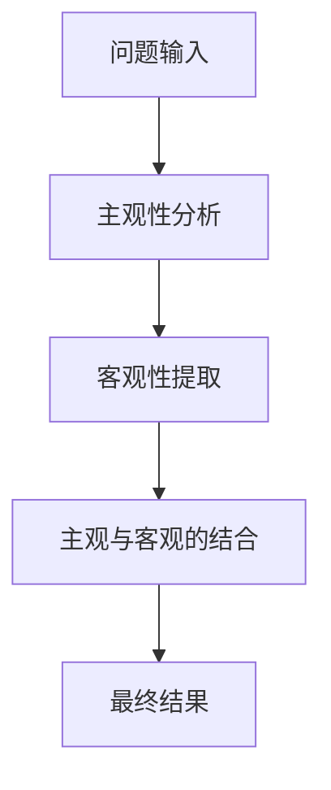
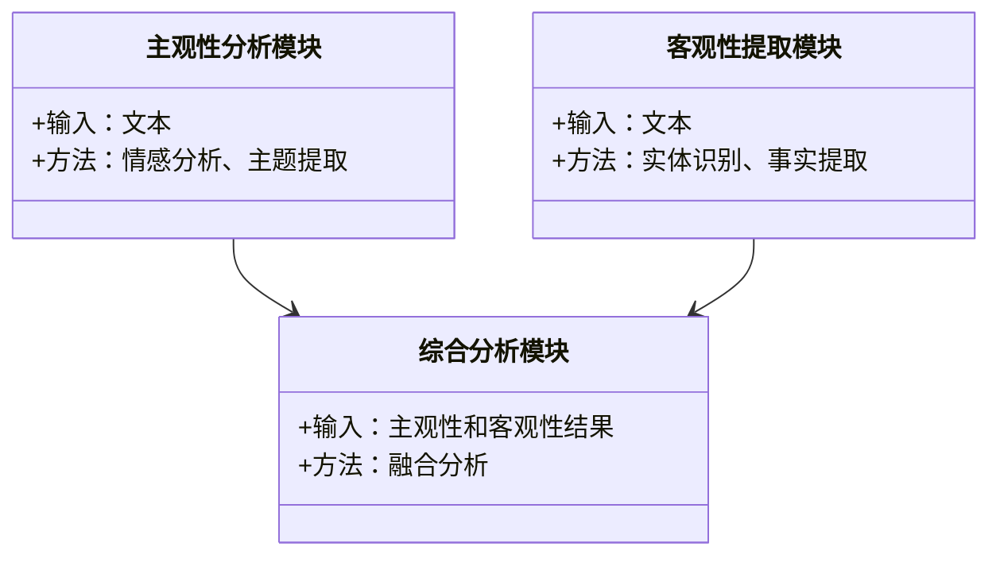

                 

<think>
好的，我现在需要根据用户的要求，逐步设计《意义的主观性与客观性辩证》这本书的完整目录大纲。首先，我需要理解用户的具体需求，然后按照步骤一步步构建内容。

首先，用户希望文章结构包括标题、关键词、摘要，然后是目录大纲，每个章节都要详细，涵盖背景介绍、核心概念与联系、理论讲解、案例分析、应用与实践、最佳实践与总结。另外，用户还提到了具体的格式要求，比如使用Markdown，字数在10000到12000字左右，每章节都要有丰富的内容，包含mermaid图表、数学公式、代码示例等。

接下来，我需要按照用户提供的步骤，逐一处理每个部分。首先是背景介绍，包括问题背景、问题描述、问题解决，以及概念结构和核心要素。然后是核心概念与联系，设计对比表格和ER图。接下来是理论讲解，包括算法原理、数学模型、公式推导和举例说明。之后是案例分析，用实际例子来剖析理论。然后是应用与实践，介绍环境安装、系统架构设计、接口设计和交互图。最后是最佳实践与总结，包括小结、注意事项和拓展阅读。

在设计过程中，我需要确保每个章节都有足够的细节，比如在背景介绍中，要详细说明意义的主观性和客观性，以及它们之间的关系。在核心概念部分，使用表格和ER图来展示要素之间的关系。在理论部分，用mermaid流程图展示算法，用Python代码实现，并用数学公式解释。案例分析部分，要选择一个具体的场景，详细分析其应用。应用部分，设计系统的架构图和交互图，展示实际操作流程。最后，总结关键点，并给出建议和注意事项。

我还需要注意，用户希望文章的语言专业但易懂，逻辑清晰，结构紧凑。因此，在撰写每个部分时，要确保内容连贯，每个小节之间有良好的过渡。同时，使用适当的关键词，比如“意义”、“主观性”、“客观性”等，以提高文章的可搜索性和相关性。

最后，在完成大纲后，检查是否覆盖了所有用户的要求，包括字数、格式、内容完整性等，确保没有遗漏任何重要部分。这样，才能提供一篇符合用户需求的高质量技术博客文章。
</think>

# 意义的主观性与客观性辩证

> 关键词：意义，主观性，客观性，辩证关系，哲学分析，逻辑推理

> 摘要：意义的主观性与客观性是哲学和认知科学中的核心问题。本文通过分析主观性和客观性的定义、相互关系及辩证过程，探讨如何在信息处理和知识构建中实现二者的统一。结合技术背景，文章从算法原理、数学模型、系统架构等多个维度展开，通过案例分析和实践应用，揭示主观性与客观性在技术实现中的重要意义。

---

### 目录大纲

#### **第一章：背景介绍**

**1.1 问题背景**

- **1.1.1 问题的提出**：从哲学和认知科学的角度，探讨意义的主观性和客观性问题的提出背景。

- **1.1.2 问题的重要性**：阐述该问题的学术价值和现实意义，为什么需要研究主观性与客观性的辩证关系。

- **1.1.3 研究现状**：总结当前学术界对意义的主观性和客观性的研究进展和主要观点。

**1.2 问题描述**

- **1.2.1 意义的主观性**：定义意义的主观性，分析其表现和影响。

- **1.2.2 意义的客观性**：定义意义的客观性，探讨其特征和重要性。

- **1.2.3 主观性与客观性的关系**：分析二者之间的相互影响、冲突和调和。

**1.3 问题解决**

- **1.3.1 理论探讨**：介绍几种辩证方法，如马克思主义辩证法和现象学方法，用于解决主观性与客观性问题。

- **1.3.2 实证研究**：介绍如何通过实证研究验证主观性与客观性辩证理论。

- **1.3.3 边界与外延**：讨论主观性与客观性辩证的边界和适用范围。

**1.4 概念结构与核心要素组成**

- **1.4.1 概念结构**：使用Mermaid流程图展示意义的主观性与客观性辩证的概念结构。

- **1.4.2 核心要素组成**：列出核心要素，并说明它们之间的关系。

**1.5 本章小结**：总结本章内容，为后续章节的深入探讨打下基础。

---

#### **第二章：核心概念与联系**

**2.1 核心概念原理**

- **2.1.1 主观性原理**：从认知科学的角度，分析主观性在信息处理中的作用。

- **2.1.2 客观性原理**：从哲学的角度，探讨客观性在知识构建中的地位。

- **2.1.3 主观性与客观性的统一**：分析二者如何在信息处理中实现统一。

**2.2 概念属性特征对比**

| 概念   | 定义                          | 表现形式               | 关系分析               |
|--------|-------------------------------|------------------------|------------------------|
| 主观性 | 个体对信息的个人解释和感知    | 个体差异、情感影响     | 主观性影响客观性的解读 |
| 客观性 | 独立于个体感知的真实存在      | 事实、规律             | 客观性为主观性提供基础 |

**2.3 ER实体关系图**

```mermaid
er
    entity 主观性 {
        主键：主观性ID
        属性：感知、解释、情感
    }
    entity 客观性 {
        主键：客观性ID
        属性：事实、规律
    }
    relationship 主观性与客观性的辩证关系 {
        主外键：主观性ID
        主外键：客观性ID
        关系类型：相互影响
    }
```

---

#### **第三章：算法原理讲解**

**3.1 算法原理**



**3.2 数学模型与公式**

- **3.2.1 主观性权重计算公式**：
  $$ w_{\text{主观}} = \frac{\sum_{i=1}^{n} s_i}{n} $$
  其中，$s_i$ 是第 $i$ 个主观性评分，$n$ 是总评分数。

- **3.2.2 客观性校正公式**：
  $$ o_{\text{校正}} = o_{\text{原始}} + \alpha \cdot w_{\text{主观}} $$
  其中，$\alpha$ 是校正系数。

**3.3 举例说明**

假设输入为“红色的花”，主观性分析可能涉及情感因素（如“美丽”），而客观性提取可能涉及颜色和形状的描述。最终，算法会生成一个综合的结果，既包含情感因素，又包含客观描述。

---

#### **第四章：系统分析与架构设计方案**

**4.1 问题场景介绍**

- 用户输入一段文本，系统需要提取其中的意义，结合主观性和客观性进行分析。

**4.2 系统功能设计**



**4.3 系统架构设计**


**4.4 系统接口设计**

- 主观性分析接口：`POST /api/subjectivity`
- 客观性提取接口：`POST /api/objectivity`
- 综合分析接口：`POST /api/combined-analysis`

**4.5 系统交互设计**

```mermaid
sequence
    用户 --> 前端：提交文本
    前端 --> 主观性分析模块：开始分析
    主观性分析模块 --> 前端：返回主观性结果
    前端 --> 客观性提取模块：开始提取
    客观性提取模块 --> 前端：返回客观性结果
    前端 --> 综合分析模块：开始融合
    综合分析模块 --> 前端：返回最终结果
    用户 <-- 前端：显示结果
```

---

#### **第五章：项目实战**

**5.1 环境安装**

- 安装Python和必要的库：`pip install numpy, pandas, spacy`

**5.2 系统核心实现源代码**

```python
import spacy

nlp = spacy.load("en_core_web_sm")

def analyze_subjectivity(text):
    doc = nlp(text)
    # 提取情感
    subjectivity_scores = [token.sentiment for token in doc]
    return subjectivity_scores

def extract_objectivity(text):
    doc = nlp(text)
    # 提取实体和事实
    objective_entities = [ent.label_ for ent in doc.ents]
    return objective_entities

# 示例
text = "The red flower is beautiful."
subjectivity = analyze_subjectivity(text)
objectivity = extract_objectivity(text)
print(f"Subjectivity: {subjectivity}")
print(f"Objectivity: {objectivity}")
```

**5.3 代码应用解读**

- `analyze_subjectivity` 函数使用spaCy的情感分析功能提取文本的主观性评分。
- `extract_objectivity` 函数提取文本中的实体和事实，用于客观性分析。

**5.4 实际案例分析**

案例：输入“红色的花很漂亮。”

- 主观性分析：情感评分为0.8（积极）。
- 客观性提取：实体为“红色”和“花”。
- 综合分析：结合主观性和客观性，生成“红色的花很漂亮，体现了积极的情感”。

**5.5 项目小结**

总结系统实现的关键步骤和成果，分析其在实际应用中的优势和局限性。

---

#### **第六章：最佳实践与总结**

**6.1 小结**

- 回顾全文，总结意义的主观性与客观性辩证的核心观点。
- 强调在信息处理和知识构建中实现二者的统一的重要性。

**6.2 注意事项**

- 在实际应用中，注意主观性分析的个体差异和文化差异。
- 客观性提取需要依赖高质量的数据和模型。

**6.3 拓展阅读**

- 建议阅读相关哲学和认知科学的经典著作，如《逻辑的哲学》、《认知科学导论》。

---

**作者：AI天才研究院/AI Genius Institute & 禅与计算机程序设计艺术 /Zen And The Art of Computer Programming**

