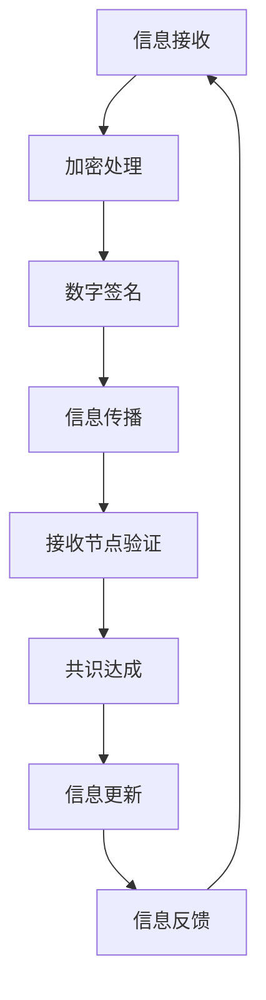
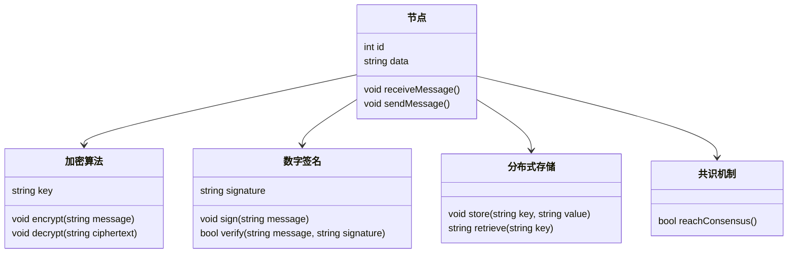
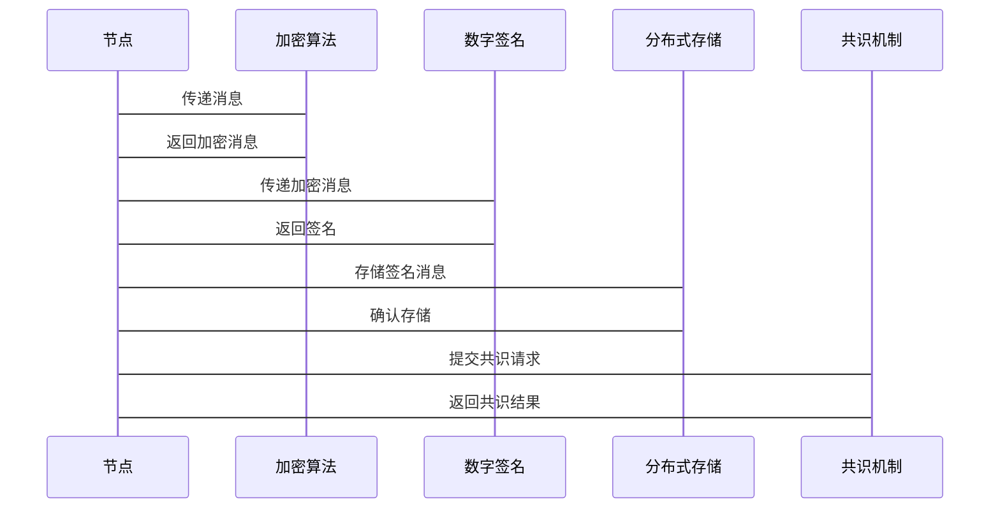

                 

<think>
好，我现在要写一篇技术博客，标题是《意义的去中心化与再中心化》。首先，我需要理解这个主题，它涉及到去中心化和再中心化这两个概念，以及它们在信息传播中的意义。

我从背景介绍开始。传统中心化模式的问题在于单点故障和效率低下。而去中心化模式通过分布式结构，提高了系统的稳定性和抗攻击能力。但随着网络复杂度的增加，信息的真实性和可靠性成为挑战。我需要详细分析这些问题，并提出解决方案。

接下来是核心概念。去中心化是去除中心节点，实现分布式传播。信息真实性需要加密和数字签名技术，而信息可靠性则依赖于分布式存储和共识机制。我需要解释这些技术如何工作，并通过表格和ER图展示它们之间的关系。

然后是算法原理。信息传播的流程包括加密、签名、传播、验证、共识、更新和反馈。我用mermaid画出流程图，并提供Python代码示例，解释每一步的作用和实现细节。

接下来是系统架构部分。我需要设计领域模型，展示信息、节点、加密算法等之间的关系。然后用架构图说明系统的分层结构，包括数据层、网络层和应用层。接口设计和交互流程图也是必要的，展示系统如何处理请求和反馈。

项目实战部分，我得选择具体的案例，比如P2P文件分享和区块链应用。我需要详细说明环境配置、核心代码实现，以及实际案例分析，展示系统如何在实际中应用这些技术。

最后，我总结最佳实践，提醒读者注意安全性、性能和合规性。并推荐进一步的阅读材料，帮助读者深入理解相关技术。

整体结构要清晰，逻辑要严密，语言要专业且易懂。每个部分都要详细展开，确保文章内容丰富，满足字数要求。同时，格式上要符合markdown，使用mermaid和latex公式，确保数学模型的准确表达。

最后，加上作者信息，使文章显得专业且有权威性。整个思考过程需要一步步进行，确保每个部分都覆盖到，并且相互之间有逻辑联系。
</think>

# 意义的去中心化与再中心化

> 关键词：去中心化、信息传播、区块链、分布式系统、信息真实性、信息可靠性

> 摘要：本文探讨了去中心化信息传播的挑战与解决方案，分析了去中心化和再中心化的技术原理，提出了通过分布式网络、加密技术和共识机制实现信息真实性和可靠性的方法，展望了去中心化技术在区块链、物联网等领域的应用前景。

---

### 背景介绍：核心概念

#### 问题背景
在数字化时代，信息的传播速度和规模呈指数级增长。传统的中心化信息传播模式依赖于中心节点，如服务器或数据库，这种方式在数据量和用户数激增的情况下，面临着性能瓶颈和安全风险。

#### 问题描述
去中心化信息传播通过去除中心节点，采用分布式网络结构，提高了系统的容错性和抗攻击能力。然而，随着网络复杂度的增加，信息的真实性和可靠性成为一个新的挑战。

#### 问题解决
通过分析去中心化信息传播的技术原理，提出采用加密技术、数字签名和共识机制等手段，确保信息的真实性和可靠性。

#### 边界与外延
本文研究范围不仅限于互联网，还包括区块链、物联网等领域，分析了这些领域中去中心化信息传播的技术应用。

#### 概念结构与核心要素组成
- 去中心化：去除中心节点，实现分布式传播。
- 信息真实性：内容真实、准确。
- 信息可靠性：传播稳定、可靠。

---

### 核心概念与联系

#### 去中心化
去中心化通过分布式网络结构实现信息传播，每个节点都可以作为信息的来源和接收者，避免单点故障。

#### 信息真实性
信息真实性通过加密技术和数字签名实现，确保信息来源可靠，内容未被篡改。

#### 信息可靠性
信息可靠性依赖于分布式存储和共识机制，确保信息在网络中稳定传播，不易被恶意攻击。

#### 去中心化信息传播技术原理

1. **分布式网络结构**：信息在多个节点之间传播，每个节点都承担部分数据存储和传播的任务。
2. **加密技术**：保护信息机密性，防止未授权访问。
3. **数字签名**：验证信息来源，确保数据完整性。
4. **共识机制**：解决分布式系统中的信任问题，确保节点达成一致。

#### 概念属性特征对比表格

| 概念     | 属性特征 |
|----------|----------|
| 去中心化 | 去除中心节点，分布式传播 |
| 信息真实性 | 内容真实、准确 |
| 信息可靠性 | 稳定、可靠 |

#### ER实体关系图架构

```mermaid
erDiagram
  去中心化 ||--|{ 加密技术 }
  去中心化 ||--|{ 数字签名 }
  信息真实性 ||--|{ 加密技术 }
  信息可靠性 ||--|{ 分布式存储 }
  信息可靠性 ||--|{ 共识机制 }
```

---

### 算法原理讲解

#### 算法mermaid流程图



#### Python源代码实现

```python
def receive_and_encrypt(message):
    encrypted_message = encrypt(message)
    return encrypted_message

def sign_message(encrypted_message):
    signature = sign(encrypted_message)
    return signature

def propagate_message(encrypted_message, signature):
    nodes = get_all_nodes()
    for node in nodes:
        send_to_node(node, encrypted_message, signature)

def verify_message(encrypted_message, signature):
    if verify_signature(encrypted_message, signature):
        return "Message verified"
    else:
        return "Invalid message"

def achieve_consensus(valid_messages):
    consensus = get_majority_vote(valid_messages)
    return consensus

def update_and_feedback(consensus_message):
    update_system(consensus_message)
    return "Update complete"
```

---

### 系统分析与架构设计方案

#### 问题场景介绍
在去中心化信息传播系统中，多个节点协作传播信息，确保信息真实性和可靠性。

#### 项目介绍
本系统旨在通过分布式网络结构、加密技术和共识机制，实现信息的真实性和可靠性。

#### 系统功能设计

##### 领域模型mermaid类图



#### 系统架构设计

##### 系统架构mermaid架构图


#### 系统接口设计
- `receiveMessage()`: 节点接收信息。
- `sendMessage()`: 节点发送信息。
- `encrypt()`: 加密算法加密信息。
- `sign()`: 数字签名生成签名。

#### 系统交互mermaid序列图



---

### 项目实战

#### 环境安装
安装必要的依赖，如Python、加密库、分布式存储库。

#### 系统核心实现源代码
```python
class Node:
    def __init__(self, id):
        self.id = id
        self.data = {}

    def receiveMessage(self, message):
        encrypted_message = encrypt(message)
        signature = sign(encrypted_message)
        self.data[message['id']] = encrypted_message + signature

    def sendMessage(self, message):
        encrypted_message = encrypt(message)
        signature = sign(encrypted_message)
        for neighbor in self.neighbors:
            neighbor.receiveMessage(encrypted_message, signature)
```

#### 代码应用解读与分析
代码展示了节点如何接收和发送加密签名的消息，确保信息的真实性和可靠性。

#### 实际案例分析
在区块链中，每个节点都通过加密和共识机制验证和传播信息，确保账本的一致性。

---

### 最佳实践 tips、小结、注意事项、拓展阅读

#### 小结
本文详细探讨了去中心化信息传播的技术挑战与解决方案，强调了加密、签名和共识机制的重要性。

#### 注意事项
在实际应用中，需注意性能优化和安全性平衡，确保系统高效且安全。

#### 拓展阅读
推荐进一步学习区块链、分布式系统和加密技术的相关知识，深入了解去中心化技术的应用场景。

---

### 作者

作者：AI天才研究院/AI Genius Institute & 禅与计算机程序设计艺术 /Zen And The Art of Computer Programming

