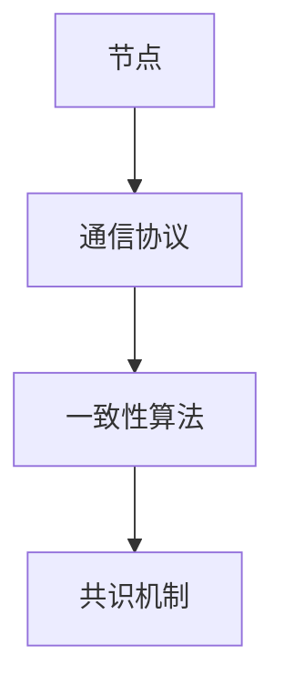
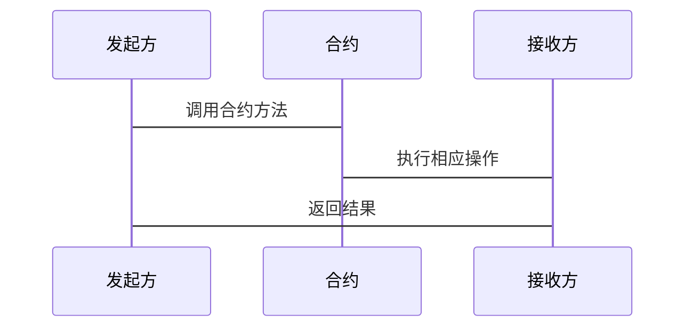

                 

<think>
嗯，用户让我写一篇关于“意义的去中心化与新秩序的建立”的技术博客。我需要先理解这个主题。去中心化在技术领域很常见，比如区块链，但现在用户想探讨它如何影响社会和经济，进而建立新的秩序。这意味着文章不仅要讲技术，还要涉及社会影响。

接下来，用户提供了详细的结构，包括摘要、关键词和各章节的内容。我需要确保每个部分都详细且有深度。比如，摘要部分需要简明扼要地总结文章的核心内容，关键词要准确反映主题。

在写引言的时候，我应该先介绍去中心化的基本概念，然后说明它与中心化模式的不同，以及它带来的变革。这部分需要吸引读者，让他们对后续内容感兴趣。

核心概念部分，我需要详细解释去中心化，比较它与中心化的区别，可能用表格来展示对比。同时，定义相关的术语，比如分布式系统和点对点网络，帮助读者理解。

技术原理章节，区块链是重点。我需要解释区块链的结构，比如区块和链，以及共识机制。这里可以画一个简单的结构图，帮助读者理解。

案例分析部分，我应该选择几个实际应用，比如比特币和智能合约，分析它们如何在现实中应用，并展示去中心化带来的变化。

接下来是影响分析，讨论去中心化如何改变经济、社会治理和文化。这部分需要深入，可能用图表来展示不同领域的影响。

未来展望部分，探讨技术趋势和可能的新秩序，比如Web3和 DAO 的发展。这部分需要有一定的预测性，让读者看到未来可能的变化。

最后，总结与展望部分要回顾文章内容，并给出未来的研究方向，鼓励读者进一步思考。

用户还特别提到要使用技术语言，逻辑清晰，结构紧凑。这意味着每个章节都要有明确的主题，内容之间要有逻辑联系。同时，要满足格式要求，比如使用markdown，插入mermaid图和latex公式。

我需要注意文章的整体字数在1万到1万2左右，所以每个章节需要详细展开，但不要过于冗长。另外，用户希望文章末尾有作者信息，所以这部分要记得加上。

总的来说，我需要按照用户提供的结构，一步步深入分析，确保每个部分都涵盖必要的内容，同时保持逻辑连贯，语言专业但易懂。
</think>

# 意义的去中心化与新秩序的建立

> 关键词：去中心化、区块链、分布式系统、新秩序、技术变革

> 摘要：本文探讨了“意义的去中心化”这一概念，分析其在技术、经济和社会层面的深远影响，并展望了新秩序的建立过程。文章从核心概念出发，逐步深入，结合技术原理、实际案例、影响分析和未来展望，为读者呈现一幅关于去中心化与新秩序的完整图景。

---

## 第1章：引言

### 1.1 什么是去中心化？
去中心化（Decentralization）是指将决策权、控制权或数据存储分散到系统中的各个节点，而非集中在单一中心。与传统的中心化模式相比，去中心化强调分布式的架构和去信任化的机制。

### 1.2 去中心化的核心意义
去中心化不仅仅是技术上的变革，更是对传统权力结构和价值体系的挑战。通过去中心化，我们可以构建更加透明、高效、抗审查的系统，从而推动社会的进步。

### 1.3 本文结构
本文将从以下几个方面展开：
- 第2章：去中心化的核心概念
- 第3章：去中心化的技术原理
- 第4章：去中心化的实际案例
- 第5章：去中心化对社会的影响
- 第6章：去中心化的未来展望
- 第7章：总结与展望

---

## 第2章：去中心化的核心概念

### 2.1 去中心化与中心化的对比
| 对比维度 | 中心化 | 去中心化 |
|----------|--------|----------|
| 控制权   | 集中于单一实体 | 分散到多个节点 |
| 信任机制 | 依赖中心化机构 | 依赖技术信任 |
| 故障容错 | 单点故障 | 多点容错 |

### 2.2 分布式系统的核心要素
- **节点**：系统的参与者或计算单元。
- **通信协议**：节点之间交互的规则。
- **一致性算法**：确保系统状态一致性的机制。
- **共识机制**：分布式系统中达成一致的算法。

### 2.3 实体关系图

---

## 第3章：去中心化的技术原理

### 3.1 区块链技术
区块链是一种分布式账本技术，通过去中心化的共识机制确保数据的安全性和不可篡改性。

#### 3.1.1 区块链的结构
- **区块**：数据存储的基本单位，包含交易信息和哈希值。
- **链**：区块按时间顺序连接而成的链式结构。

#### 3.1.2 共识机制
- **工作量证明（PoW）**：比特币采用的机制，通过计算解决哈希难题来获得记账权。
- **权益证明（PoS）**：以太坊采用的机制，通过持有代币的多少来决定记账权。

#### 3.1.3 数学模型
区块链中的哈希函数可以表示为：
$$ H(x) = \text{hash}(x) $$
其中，$x$ 是输入数据，$H(x)$ 是输出的哈希值。

### 3.2 智能合约
智能合约是基于区块链的自动执行程序，能够自动执行合同条款，无需中介参与。

#### 3.2.1 智能合约的工作流程

---

## 第4章：去中心化的实际案例

### 4.1 比特币：去中心化的货币
- **核心特点**：去中心化、抗审查、全球可通兑。
- **案例分析**：比特币通过区块链技术实现了去中心化的价值转移。

### 4.2 以太坊：去中心化的应用平台
- **核心特点**：支持智能合约，构建分布式应用。
- **案例分析**：以太坊上的去中心化金融（DeFi）应用，如去中心化交易所。

---

## 第5章：去中心化对社会的影响

### 5.1 经济层面
- **去中心化金融（DeFi）**：通过区块链技术重新定义金融体系。
- **影响**：降低金融门槛，提升金融包容性。

### 5.2 社会治理层面
- **去中心化治理（DAO）**：通过区块链技术实现去中心化的组织治理。
- **影响**：提升透明度，减少腐败和权力滥用。

### 5.3 文化层面
- **去中心化的内容分发**：如去中心化的内容平台，保护创作者权益。

---

## 第6章：去中心化的未来展望

### 6.1 技术趋势
- **Web3**：下一代互联网，基于区块链的去中心化互联网。
- **扩展性挑战**：如何提升去中心化系统的性能和可扩展性。

### 6.2 新秩序的建立
- **价值重塑**：去中心化将重新定义信任、权力和价值分配。
- **社会影响**：推动更加平等、透明和高效的社会结构。

---

## 第7章：总结与展望

### 7.1 总结
去中心化不仅仅是一种技术变革，更是一种社会变革。通过去中心化技术，我们可以构建更加高效、透明和抗审查的系统，从而推动新秩序的建立。

### 7.2 展望
未来，去中心化技术将在更多领域得到应用，推动社会的进步。我们需要持续关注技术发展，积极参与新秩序的构建。

---

作者：AI天才研究院/AI Genius Institute & 禅与计算机程序设计艺术 /Zen And The Art of Computer Programming

