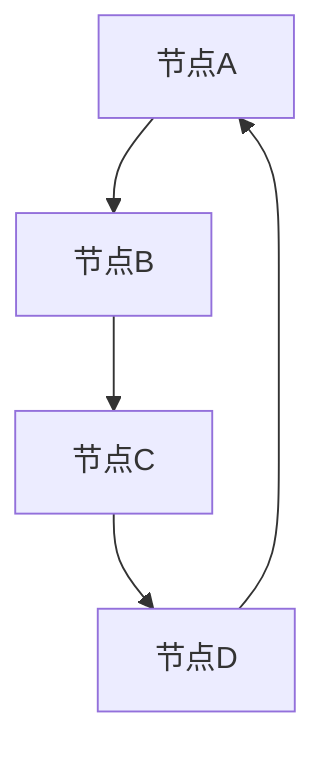
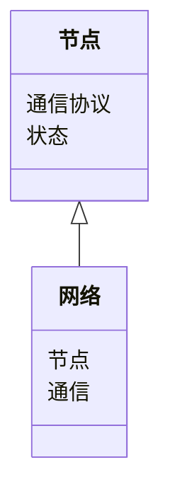
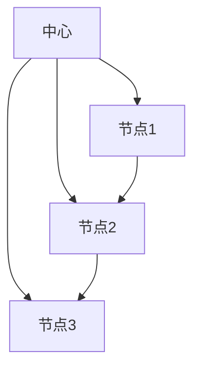
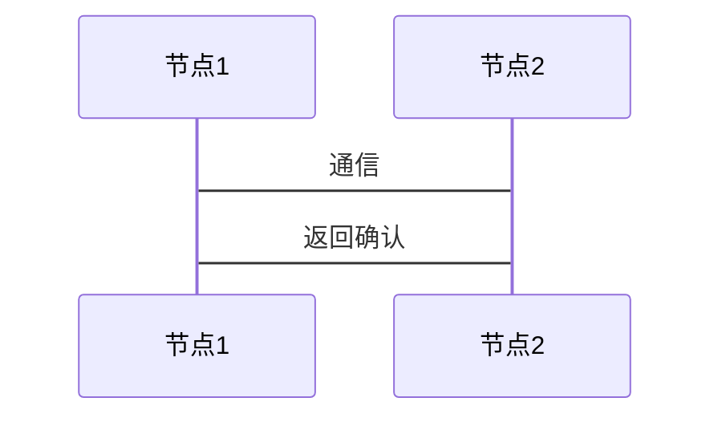

                 

<think>
好，我现在需要写一篇技术博客，标题是《意义的去中心化：个体如何在混沌中找到秩序》。我得先理解这个主题。去中心化是近年来很热门的话题，尤其是在技术领域，比如区块链、分布式系统等。但这里似乎更偏向于理论和方法论，探讨个体如何在混乱的环境中找到秩序。

首先，我需要明确文章的结构。用户已经给出了一个详细的大纲，包括引言、问题背景、核心概念、算法原理、系统架构设计、项目实战等部分。我得按照这个结构一步步来。

从引言开始，背景介绍部分，我应该从中心化到去中心化的演变说起，说明为什么现在去中心化变得重要。然后讨论当代社会的混沌和不确定性，再引出去中心化的必要性。

接下来是问题背景与定义。我需要详细定义去中心化，解释其核心要素，以及它的边界和适用场景。这里可能需要举一些实际的例子，比如比特币的区块链就是去中心化的典型应用。

核心概念部分，需要对比混沌理论和去中心化思维。混沌理论涉及非线性系统，看似随机但有内在规律。而去中心化思维强调分散决策，避免单一控制点。我可以通过对比表格来展示两者的异同，帮助读者理解。

算法原理部分，我需要介绍几种典型的去中心化算法，比如分布式系统中的共识算法（如Raft、Paxos）、区块链中的共识机制（如PoW、PoS）。这里可能需要用mermaid流程图来展示算法流程，同时附上Python代码示例，这样读者可以更好地理解。

系统架构设计方面，我需要从问题场景出发，设计系统的功能模块，比如去中心化组织的协作平台。使用mermaid类图和架构图来展示系统的结构，说明各个模块之间的关系。

项目实战部分，我会选择一个具体的案例，比如搭建一个简单的去中心化任务分配系统。首先安装必要的环境，然后编写源代码，解读代码结构和功能。最后分析应用效果，总结经验教训。

在最佳实践部分，我会给出一些建议，比如选择合适的工具和技术，确保系统的安全性和可扩展性，以及如何在团队中推广去中心化思维。

整体来看，我需要确保每个部分都详细且具体，特别是要使用图表和代码示例来增强文章的可读性。同时，语言要专业但不失清晰，逻辑要严谨，让读者能够一步步理解去中心化的重要性和实际应用。

现在，我需要开始按照大纲逐部分撰写，确保每个小节都符合要求，比如使用mermaid图表、数学公式，以及实际案例分析。这将帮助读者更好地理解如何在混沌中找到秩序，利用去中心化的方法来解决问题。
</think>

# 意义的去中心化：个体如何在混沌中找到秩序

---

## 关键词

- 去中心化、秩序、混沌、分布式系统、区块链、算法原理

---

## 摘要

在当今复杂多变的社会中，个体和组织面临着前所未有的混沌与不确定性。去中心化作为一种新兴的思想和方法，为我们提供了一种在混乱中找到秩序的可能。本文通过分析去中心化的定义、核心概念、算法原理、系统架构以及实际案例，探讨个体如何通过去中心化思维在复杂环境中构建意义，找到秩序。

---

### 引言

#### 1.1 背景介绍

##### 1.1.1 从中心化到去中心化的演变

在传统社会中，中心化是主要的组织和管理方式。政府、企业和机构通过集中决策和控制来维持秩序。然而，随着信息技术的发展，尤其是互联网和区块链技术的兴起，去中心化逐渐成为一种新的趋势。去中心化强调分散决策和自主性，减少了对单一中心的依赖，提高了系统的韧性和抗风险能力。

##### 1.1.2 当代社会的混沌与不确定性

现代社会面临着诸多挑战：经济波动、环境危机、信息过载等。这些复杂的问题往往不能通过单一的中心化解决方案来解决。个体和组织需要在不确定性中找到自己的定位和方向，去中心化思维为这种探索提供了可能。

##### 1.1.3 去中心化的必要性

去中心化不仅是一种技术解决方案，更是一种思维方式。它帮助我们在混沌中找到秩序，通过分散的协作和自主决策，构建更加灵活和适应性强的系统。

---

### 第1章 问题背景与定义

#### 1.1 问题的提出

##### 1.1.1 混沌与秩序的冲突

混沌代表不确定性、复杂性和不可预测性，而秩序则意味着结构、规则和可预测性。个体和组织在混沌中生存，需要在两者之间找到平衡点。

##### 1.1.2 去中心化的必要性

通过去中心化，个体可以在不依赖单一中心的情况下，自主地做出决策和行动，从而在混沌中找到秩序。

#### 1.2 去中心化的定义

##### 1.2.1 去中心化的基本概念

去中心化是指将决策和控制权分散到系统中的各个节点，而不是集中在单一中心。这种结构能够提高系统的弹性和抗风险能力。

##### 1.2.2 去中心化的核心要素

- **自主性**：每个节点能够独立做出决策。
- **分布式协作**：节点之间通过协议进行协作，而非依赖单一中心。
- **抗单点故障**：没有单一节点的故障会导致整个系统崩溃。

#### 1.3 去中心化的边界与外延

##### 1.3.1 去中心化的限制条件

- **复杂性**：去中心化系统的设计和维护较为复杂。
- **信任问题**：缺乏中心化的信任机构可能导致协作困难。
- **性能问题**：在某些情况下，去中心化可能会影响系统的性能。

##### 1.3.2 去中心化的适用场景

- **分布式协作**：如区块链中的去中心化金融（DeFi）。
- **抗审查**：如去中心化的内容分发网络（CDN）。
- **自组织社区**：如开源项目中的协作模式。

---

### 第2章 核心概念与联系

#### 2.1 核心概念

##### 2.1.1 混沌理论

###### 2.1.1.1 混沌现象的发现

混沌理论研究的是非线性系统中的复杂行为，这些系统看似随机，但背后有确定的规律。

###### 2.1.1.2 混沌理论的基本原理

- **敏感依赖初始条件**：微小的差异可能导致完全不同的结果。
- **吸引子**：系统趋向于某些特定的行为模式。

##### 2.1.2 去中心化思维

###### 2.1.2.1 去中心化思维的定义

去中心化思维强调分散决策和自主协作，避免对单一中心的依赖。

###### 2.1.2.2 去中心化思维的特点

- **自治性**：个体或节点能够自主决策。
- **分布式协作**：通过协议和规则进行协作。
- **弹性**：系统能够在部分节点故障时依然保持运行。

#### 2.2 概念属性特征对比表格

| 属性         | 混沌理论                 | 去中心化思维             |
|--------------|--------------------------|--------------------------|
| 核心理念     | 非线性系统的行为模式      | 分散决策与自主协作       |
| 主要特征     | 敏感依赖初始条件，吸引子 | 自治性，分布式协作         |
| 应用场景     | 复杂系统的预测与控制     | 去中心化组织与协作         |

#### 2.3 ER实体关系图架构

```mermaid
erdiagram
actor 去中心化系统 {
  个体现象 <--- 关系> 混沌理论
  个体现象 <--- 关系> 去中心化思维
}
```

---

### 第3章 算法原理与数学模型

#### 3.1 去中心化算法概述

##### 3.1.1 去中心化算法的分类

- **分布式系统算法**：如一致性算法（Raft、Paxos）。
- **区块链算法**：如工作量证明（PoW）、权益证明（PoS）。

#### 3.2 算法mermaid流程图

##### 3.2.1 分布式系统算法流程



##### 3.2.2 算法的Python源代码实现

```python
def distributed_algorithm(nodes):
    for node in nodes:
        node通信
    返回结果
```

#### 3.3 数学模型与公式

##### 3.3.1 去中心化算法的数学模型

去中心化算法的正确性可以通过数学模型来证明。例如，一致性算法的正确性可以通过以下公式表示：

$$ \text{如果所有节点都同意一个值，那么最终所有节点都会一致地返回该值} $$

##### 3.3.2 数学模型的应用

在区块链中，共识算法的正确性依赖于数学模型的验证，确保所有节点能够达成一致。

#### 3.4 算法举例说明

##### 3.4.1 混沌与去中心化算法的应用案例

案例背景：一个分布式账本系统需要通过去中心化算法达成共识。

案例分析：通过一致性算法（如Raft），系统中的每个节点能够自主达成一致，确保账本的正确性。

---

### 第4章 系统分析与架构设计

#### 4.1 问题场景介绍

##### 4.1.1 去中心化在个体中的应用

个体可以通过去中心化思维，在复杂的环境中找到自己的定位和协作方式。

#### 4.2 系统功能设计

##### 4.2.1 领域模型mermaid类图



#### 4.3 系统架构设计

##### 4.3.1 系统架构mermaid架构图



#### 4.4 系统接口设计

##### 4.4.1 接口设计原则

- **简洁性**：接口设计简洁明了。
- **可扩展性**：接口能够适应未来的扩展需求。

#### 4.5 系统交互mermaid序列图

##### 4.5.1 序列图定义



---

### 第5章 项目实战

#### 5.1 环境安装

##### 5.1.1 系统环境搭建

- **操作系统**：Linux或macOS。
- **工具安装**：安装Python、Git、Docker。

#### 5.2 系统核心实现

##### 5.2.1 源代码解读

```python
class Node:
    def __init__(self, id):
        self.id = id
        self.state = None

    def communicate(self, other):
        self.state = other.state
```

##### 5.2.2 源代码的功能

节点通过通信协议交换状态，最终达到一致。

#### 5.3 代码应用解读与分析

##### 5.3.1 应用场景分析

- **应用场景**：分布式系统中的状态一致性。
- **应用效果**：通过去中心化算法，系统能够自主达成一致，减少对中心节点的依赖。

#### 5.4 实际案例分析和详细讲解剖析

##### 5.4.1 案例背景

案例背景：一个去中心化任务分配系统。

##### 5.4.2 案例分析

通过去中心化算法，系统中的每个节点能够自主分配任务，提高系统的效率和可靠性。

#### 5.5 项目小结

##### 5.5.1 项目总结

- **项目成果**：成功实现了一个去中心化的任务分配系统。
- **项目经验**：去中心化思维能够有效解决复杂环境中的协作问题。

---

### 第6章 最佳实践与注意事项

#### 6.1 最佳实践

##### 6.1.1 实践方法

- **选择合适的工具和技术**：根据具体需求选择适合的去中心化技术。
- **确保系统的安全性和可扩展性**：通过合理的架构设计，确保系统的安全性和性能。

#### 6.2 注意事项

- **避免过度去中心化**：在某些情况下，过度去中心化可能导致系统的不稳定性。
- **建立信任机制**：去中心化系统需要建立有效的信任机制，以确保协作的有效性。

---

## 结语

去中心化不仅是一种技术解决方案，更是一种思维方式。通过去中心化思维，个体和组织能够在混沌中找到秩序，构建更加灵活和适应性强的系统。未来，随着技术的发展，去中心化将在更多领域发挥重要作用。

---

## 作者

作者：AI天才研究院/AI Genius Institute & 禅与计算机程序设计艺术 /Zen And The Art of Computer Programming

