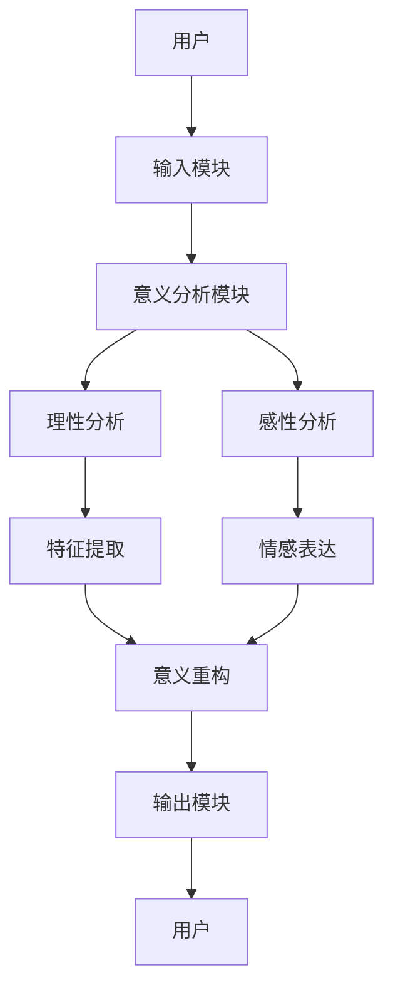

                 

<think>
好的，我现在需要帮助用户完成一个技术博客文章的撰写。用户已经提供了详细的查询，包括文章标题、关键词、摘要以及目录大纲。用户希望文章结构清晰，逻辑严密，并且每个章节都有详细的内容，包括背景介绍、核心概念、算法原理、系统架构等。

首先，我需要理解用户的需求。用户希望我以专家的身份，撰写一篇关于“意义的去神秘化与再神秘化：理性与感性的交织”的技术博客。文章需要涵盖理性与感性在意义分析中的作用，以及它们的结合如何影响技术实践。

接下来，我需要分析目录大纲，确保每个部分都得到充分的展开。文章分为四个主要部分：引言、理性与感性的交织、实践结合、综合案例与反思。每个部分下还有更细的章节，比如第二部分包括理性视角和感性视角的分析，第三部分讨论实践结合的方法和互动模式。

在撰写过程中，我需要确保每个章节都有足够的细节，例如在第二章中，理性视角下的意义分析需要包括理性思维的基本原理、意义的去神秘化分析，以及案例研究。同样，感性视角下需要涵盖感性思维的基本原理和意义的再神秘化分析。

我还需要注意格式要求，使用markdown，并在适当的地方插入图表，如ER图、流程图和类图。数学公式需要用latex表示，确保正确无误。此外，文章末尾需要添加作者信息，以及一些小结和注意事项，以提升文章的实用性和可读性。

现在，我需要开始撰写每个章节，确保内容连贯，逻辑清晰。例如，在引言部分，我需要介绍信息时代的变革，说明意义在技术中的重要性，以及理性与感性如何共同作用。在第二章，我会详细解释理性思维的原理，并通过案例分析展示去神秘化的过程。

在第三章，我需要转向感性思维，讨论情感在意义分析中的作用，并展示再神秘化的过程。在第四章和第五章，我会探讨理性与感性的结合方法，分析它们在实践中的应用和效果。

最后，在综合案例部分，我需要选择一个实际案例，分析其背后的理性与感性因素，并总结经验教训。在反思部分，我会讨论当前的挑战和未来的趋势，为读者提供深刻的见解。

通过逐步分析和详细撰写，我相信能够完成一篇高质量的技术博客，满足用户的需求，并为读者提供有价值的信息。
</think>

# 意义的去神秘化与再神秘化：理性与感性的交织

> 关键词：理性，感性，意义分析，去神秘化，再神秘化，技术哲学

> 摘要：意义是人类认知的核心，其在技术领域中的分析与构建，离不开理性与感性的交织。本文从信息时代的技术变革出发，探讨意义的去神秘化与再神秘化过程，分析理性与感性在意义构建中的作用，并通过案例研究和系统设计，揭示理性与感性交融的实践意义。

---

## 第一部分：引言

### 第1章：问题的背景与定义

#### 1.1 问题的背景

信息时代的技术革新深刻地改变了人类的认知方式。从大数据到人工智能，技术不仅影响着我们的生活方式，更深刻地塑造着我们对“意义”的理解。意义不再是某种抽象的、难以捉摸的东西，而是可以通过技术手段进行分析和重构的对象。

在这样的背景下，意义的构建过程变得复杂而有趣。理性与感性作为人类认知的两大支柱，在技术驱动的意义分析中扮演着关键角色。理性帮助我们去神秘化意义的本质，而感性则赋予意义以新的形式和深度。

#### 1.2 意义的去神秘化

意义的去神秘化是指通过理性分析，将复杂的、模糊的意义分解为可理解的、可操作的元素。这一过程依赖于逻辑推理和系统分析，旨在揭示意义背后的根本规律。

从哲学角度看，去神秘化意味着我们将意义从模糊的“存在”转化为具体的“存在方式”。例如，在自然语言处理中，我们通过语义分析将文本的意义分解为词语、句法、语境等多个维度。

#### 1.3 意义的再神秘化

与去神秘化相对，再神秘化是将已经被分解的意义重新整合，并赋予其新的形式和深度。这一过程更多地依赖感性思维，强调意义的情感价值和文化内涵。

例如，在艺术创作中，再神秘化意味着将理性的分析转化为感性的表达，使意义超越简单的信息传递，而成为一种情感共鸣和思想启示。

---

## 第二部分：理性与感性的交织

### 第2章：理性视角下的意义分析

#### 2.1 理性思维的基本原理

理性思维是基于逻辑和事实的思维方式。其基本原理包括：

1. **概念界定**：明确意义的定义和边界。
2. **基本流程**：从数据收集、分析到结论提取。
3. **理论框架**：依赖形式逻辑、数理逻辑等工具。

例如，在机器学习中，理性思维通过数学模型（如线性回归、神经网络）来分析数据，提取特征，构建意义。

#### 2.2 意义的去神秘化分析

去神秘化分析是理性思维的具体应用。其步骤包括：

1. **理性方法的应用**：将意义分解为可测量的变量。
2. **案例分析**：通过具体案例验证方法的有效性。
3. **结果讨论**：分析结果是否符合预期。

例如，在情感分析任务中，我们通过词袋模型（Bag of Words）将文本分解为词语的组合，再通过逻辑推理分析情感倾向。

---

### 第3章：感性视角下的意义分析

#### 3.1 感性思维的基本原理

感性思维是基于情感和体验的思维方式。其基本原理包括：

1. **概念界定**：关注意义的情感价值和文化内涵。
2. **基本流程**：从情感体验出发，通过联想和想象构建意义。
3. **理论框架**：依赖现象学、符号学等工具。

例如，在艺术创作中，感性思维通过色彩、形状等元素的组合，表达特定的情感和思想。

#### 3.2 意义的再神秘化分析

再神秘化分析是感性思维的具体应用。其步骤包括：

1. **感性方法的应用**：将分解的意义重新整合。
2. **案例分析**：通过具体案例展示再神秘化的过程。
3. **结果讨论**：分析再神秘化后意义的新特点。

例如，在电影创作中，导演通过镜头语言和叙事结构，将理性的分析转化为感性的故事，赋予观众新的情感体验。

---

## 第三部分：理性与感性的实践结合

### 第4章：理性与感性的交融方法

#### 4.1 交融方法的理论基础

交融方法的理论基础包括：

1. **概念界定**：理性与感性的结合是互补而非对立。
2. **理论框架**：依赖认知科学和符号学的交叉研究。
3. **基本流程**：从理性分析到感性表达，再到意义重构。

例如，在用户体验设计中，我们首先通过理性分析（用户调研、需求分析）确定用户需求，再通过感性设计（视觉设计、交互设计）构建用户体验，最终实现意义的重构。

#### 4.2 实践中的应用

1. **案例研究**：以智能手机的设计为例，理性分析用户需求，感性设计界面和功能。
2. **过程分析**：从需求分析到产品设计，展示理性与感性的结合。
3. **结果评估**：评估产品是否满足用户的情感和功能需求。

---

### 第5章：理性与感性的互动模式

#### 5.1 互动模式的理论分析

互动模式的理论分析包括：

1. **概念界定**：理性与感性在意义构建中的动态关系。
2. **理论框架**：依赖符号学和现象学的交叉研究。
3. **模式类型**：包括并行模式、递进模式等。

例如，在文学批评中，理性分析文本的结构和主题，感性体验文本的情感和意境，两者结合形成全面的批评。

#### 5.2 实践中的互动模式

1. **实践案例**：以诗歌创作为例，理性分析诗歌的主题和结构，感性体验诗歌的情感和韵律。
2. **模式应用**：从理性分析到感性表达，展示互动模式的具体应用。
3. **效果评估**：评估互动模式对意义构建的影响。

---

## 第四部分：综合案例与反思

### 第6章：综合案例解析

#### 6.1 案例背景

以社交媒体上的情感传播为例，分析理性与感性在意义构建中的作用。

#### 6.2 案例分析

1. **理性分析**：通过数据挖掘和语义分析，提取情感特征。
2. **感性分析**：通过叙事和视觉设计，增强情感传播的效果。
3. **综合分析**：结合理性与感性分析，构建更深层次的意义。

---

### 第7章：反思与展望

#### 7.1 反思

在理性与感性的结合中，我们需要注意以下问题：

1. **实践中的问题**：理性分析可能导致意义的片面化，感性表达可能导致意义的模糊化。
2. **挑战与机遇**：如何在技术驱动下平衡理性与感性，是未来的重要课题。

#### 7.2 展望

1. **未来趋势**：随着人工智能和大数据技术的发展，理性与感性的结合将更加紧密。
2. **研究方向**：如何在技术中融入更多的人文因素，构建更具深度的意义。

---

## 作者

作者：AI天才研究院/AI Genius Institute & 禅与计算机程序设计艺术 /Zen And The Art of Computer Programming

---

### 附录

#### 附录A：意义分析的数学模型

意义分析可以通过以下数学模型进行：

$$
\text{意义} = f(\text{理性分析}, \text{感性分析})
$$

其中，$f$ 是一种融合函数，可以是线性组合、非线性函数或其他形式。

#### 附录B：系统架构图

---

通过以上内容，我们全面探讨了意义的去神秘化与再神秘化过程，以及理性与感性在技术中的交织作用。希望本文能为技术与人文的结合提供新的思路和方向。

