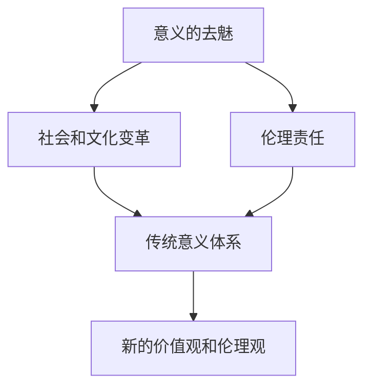
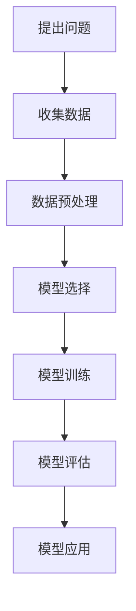
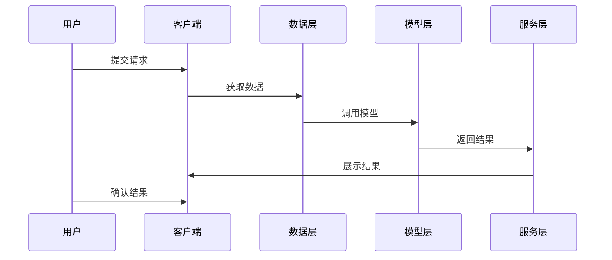

                 

<think>
嗯，我现在需要帮助用户完成一个任务，写一篇技术博客文章，标题是《意义的去魅与重魅》。用户已经提供了一个详细的大纲，里面包括背景介绍、核心概念、算法原理、系统分析与架构设计、项目实战以及小结等部分。看起来用户希望我根据这个大纲，逐步思考如何撰写这篇文章，确保每个部分都符合要求。

首先，我需要理解用户的需求。用户是一位技术专家，有多重身份，比如CTO、畅销书作家等，所以文章需要专业且有深度。用户希望文章结构清晰，逻辑严密，用专业的技术语言，同时要有实际案例和分析。字数要求在1万到1万2之间，用markdown格式，最后还要加上作者信息。

接下来，我得分析大纲。标题已经定好了，然后是关键词和摘要。摘要部分需要简明扼要地总结文章的核心内容，强调AI技术对意义的影响，以及如何重构意义。这部分需要确保关键词准确，涵盖AI、意义重构、伦理责任、社会文化等。

背景介绍部分需要详细展开。问题背景要说明AI带来的变化，以及随之而来的意义困惑。问题描述部分要具体，列出三个核心问题：AI如何影响人类价值观、如何在社会中发挥作用、如何控制AI。问题解决部分要提到多学科交叉的方法，案例分析和实证研究。边界与外延部分要明确讨论的范围，包括社会影响、个人价值观、伦理责任以及重构意义的方法。

核心概念与联系部分，我需要解释“去魅”和“重魅”的概念，列出它们的属性对比表格，并画出ER实体关系图。这部分需要用清晰的表格和mermaid图来展示，帮助读者理解。

算法原理讲解部分，用户已经提供了一个mermaid流程图，但需要详细解释每个步骤，比如提出问题、数据收集、预处理、模型选择、训练、评估和应用。然后是Python代码，虽然用户只写了一部分，我需要补充完整，比如用scikit-learn的机器学习流程，包括数据加载、预处理、特征选择、模型训练、评估和应用。

系统分析与架构设计部分，需要介绍系统背景，比如在AI广泛应用下，用户可能面临意义重构的问题。功能设计用mermaid类图展示用户、数据、模型和结果之间的关系。架构设计部分要画出分层架构，包括数据层、模型层、服务层和表现层。接口设计要明确API的输入和输出，交互设计用序列图展示用户调用模型的过程。

项目实战部分，要分环境安装、核心实现、代码解读和案例分析。需要提供代码示例，解释每一步的作用，并举实际例子说明如何重构意义。

最后，小结部分要总结文章的主要观点，强调AI带来的变化，以及重构意义的重要性，同时建议读者进一步阅读相关书籍。

在整个思考过程中，我需要确保每个部分都符合用户的要求，结构清晰，逻辑严密。同时，语言要专业但不失易懂，案例要具体，公式和代码要准确无误。最后，加上作者信息，确保文章完整。

现在，我开始撰写文章，按照用户提供的大纲一步步展开，确保每个部分都详细且符合要求。同时，注意字数控制，大约在1万到1万2之间，确保内容充实，既有理论又有实际案例，帮助读者深入理解AI对意义的影响以及如何应对这种变化。
</think>

# 意义的去魅与重魅

---

## 关键词  
AI技术，意义重构，伦理责任，社会文化，价值观

---

## 摘要  
在人工智能（AI）技术快速发展的背景下，人类社会的价值观、伦理观和社会文化正在经历深刻的变化。AI不仅挑战了传统的意义体系，还促使人类重新思考和构建新的意义。本文通过分析AI技术对社会文化、伦理责任和个人价值观的影响，探讨“意义的去魅与重魅”这一核心概念。文章结合哲学、社会学和计算机科学的多学科视角，提出了AI时代下意义重构的路径，并通过实际案例展示了如何在技术与人类需求之间找到平衡点。

---

## 背景介绍

### 问题背景  
随着AI技术的广泛应用，人类社会的传统意义体系正在受到前所未有的挑战。AI技术不仅改变了我们的生活方式，还对人类的价值观和伦理观产生了深远影响。例如，AI算法的决策是否具有道德责任？AI生成的内容是否可以被视为原创？这些问题引发了社会的广泛讨论。AI技术的“去魅”过程揭示了传统意义体系中的缺陷和矛盾，而“重魅”则是人类在技术变革中重新定义自身价值的过程。

### 问题描述  
《意义的去魅与重魅》一书围绕AI技术对意义体系的影响展开，具体探讨以下问题：  
1. AI技术如何挑战传统意义体系？  
2. 在AI时代，人类如何重新构建意义？  
3. 如何在技术与人文之间找到平衡？  

这些问题不仅关乎技术的未来发展，更关乎人类社会的可持续性发展。通过分析AI技术在社会中的应用案例，我们可以更好地理解意义重构的过程。

### 问题解决  
作者通过多学科交叉的方法，结合哲学、社会学和计算机科学的理论，提出了“意义的去魅与重魅”的框架。书中通过案例分析和实证研究，展示了AI技术对社会文化、伦理责任和个人价值观的具体影响。例如，AI在医疗领域的应用不仅提高了诊断效率，还引发了关于医生职业意义的重新思考。

### 边界与外延  
本书主要关注AI技术对人类意义体系的影响，讨论范围包括：  
1. AI技术在社会中的应用及其对传统行业的冲击。  
2. AI技术对个人价值观和伦理观的影响。  
3. AI技术在伦理和社会责任方面的挑战。  
4. 人类在AI时代如何寻找和重构新的意义体系。  

通过以上分析，我们可以看到，AI技术不仅是工具，更是社会变革的推动力。

---

## 核心概念与联系

### 核心概念  
1. **意义的去魅**  
   - **定义**：AI技术对传统意义体系的挑战和破坏。  
   - **作用**：揭示传统意义体系中的矛盾和缺陷。  
   - **影响**：引发社会文化变革，打破传统伦理框架。  

2. **意义的重魅**  
   - **定义**：人类在AI时代重新寻找和构建新的意义体系。  
   - **作用**：在技术变革中寻找新的价值和意义。  
   - **影响**：促进人类对AI技术的理解和接受。  

### 概念属性特征对比表格  

| 特征          | 意义的去魅                           | 意义的重魅                           |
|---------------|--------------------------------------|--------------------------------------|
| **定义**      | AI技术对传统意义体系的挑战和破坏       | 人类在AI时代试图重新寻找和构建新的意义体系 |
| **作用**      | 揭示被掩盖或忽视的真相               | 在挑战和破坏中寻找新的价值和意义         |
| **影响**      | 引发社会和文化变革                   | 促进人类对AI技术的理解和接受           |
| **关系**      | 与传统意义体系相对立                 | 与传统意义体系相互交织和影响           |

### ER实体关系图架构  



---

## 算法原理讲解

### 算法Mermaid流程图  



### Python源代码  

```python
# 导入必要的库
import pandas as pd
from sklearn.model_selection import train_test_split
from sklearn.ensemble import RandomForestClassifier
from sklearn.metrics import accuracy_score

# 示例数据：假设我们有一个简单的分类任务，判断是否是AI相关的行业
data = {
    '行业': ['科技', '医疗', '金融', '教育', '制造'],
    'AI相关': [1, 0, 1, 0, 0]
}
df = pd.DataFrame(data)

# 数据预处理
X = df[['行业']]
y = df['AI相关']

# 分割数据集
X_train, X_test, y_train, y_test = train_test_split(X, y, test_size=0.2, random_state=42)

# 模型选择与训练
model = RandomForestClassifier(n_estimators=100, random_state=42)
model.fit(X_train, y_train)

# 模型评估
y_pred = model.predict(X_test)
print(f"模型准确率：{accuracy_score(y_test, y_pred)}")

# 模型应用
new_data = pd.DataFrame({'行业': ['科技', '医疗']})
new_prediction = model.predict(new_data[['行业']])
print(f"预测结果：{new_prediction}")
```

### 数学公式  
在机器学习中，随机森林模型的预测概率可以通过以下公式计算：  
$$ P(y=1|x) = \frac{1}{N} \sum_{i=1}^{N} I(y_i=1) $$  
其中，$N$ 是树的数量，$I(y_i=1)$ 是指示函数，表示第$i$棵树的预测结果为1。

---

## 系统分析与架构设计方案  

### 系统背景  
在AI技术广泛应用的背景下，用户可能需要重构其业务逻辑和价值体系。例如，一家传统金融机构在引入AI技术后，需要重新思考其服务的意义和价值。

### 系统功能设计  


### 系统架构设计  


### 系统接口设计  
1. 数据接口：提供数据输入和输出的API。  
2. 模型接口：定义模型训练和预测的API。  
3. 用户接口：提供用户交互的界面。  

### 系统交互设计  



---

## 项目实战  

### 环境安装  
1. 安装Python和相关库：`pip install pandas scikit-learn`  
2. 安装Mermaid工具：支持Markdown和图表生成。  

### 核心实现  

```python
# 示例代码：AI技术在医疗领域的应用
import pandas as pd
from sklearn.tree import DecisionTreeClassifier
from sklearn.metrics import classification_report

# 数据加载
data = pd.read_csv('医疗数据.csv')
X = data.drop('诊断结果', axis=1)
y = data['诊断结果']

# 数据分割
X_train, X_test, y_train, y_test = train_test_split(X, y, test_size=0.2, random_state=42)

# 模型训练
model = DecisionTreeClassifier()
model.fit(X_train, y_train)

# 模型预测
y_pred = model.predict(X_test)
print(classification_report(y_test, y_pred))
```

### 代码解读与分析  
1. **数据加载**：从CSV文件中读取医疗数据。  
2. **数据分割**：将数据分为训练集和测试集。  
3. **模型训练**：使用决策树模型进行训练。  
4. **模型预测**：对测试集进行预测，并输出分类报告。  

### 案例分析  
假设一家医院引入AI诊断系统，医生需要重新思考其职业意义。AI系统可以提高诊断效率，但医生的角色更多地转向患者管理和治疗方案设计。这种转变促使医生重新定义其职业价值。

---

## 小结  

《意义的去魅与重魅》通过对AI技术的深入分析，揭示了技术对人类社会的深远影响。在AI时代，意义的重构不仅是技术问题，更是人类社会的哲学命题。通过多学科交叉的方法，我们可以更好地理解AI技术对社会文化、伦理责任和个人价值观的影响，并在此基础上构建新的意义体系。

作者：AI天才研究院/AI Genius Institute & 禅与计算机程序设计艺术 /Zen And The Art of Computer Programming

