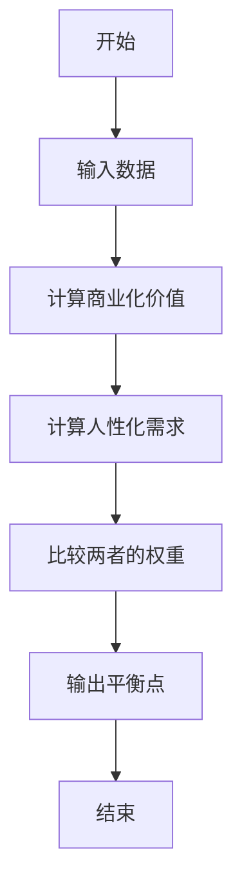
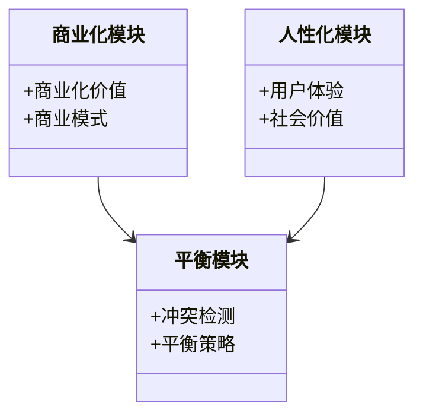
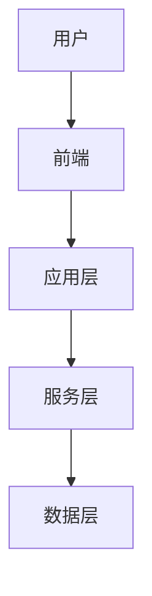

                 

<think>
嗯，用户让我写一篇关于《意义的商业化与人性化的矛盾》的技术博客，看起来他需要一个结构清晰、内容详实的文章。首先，我需要明确文章的主题，确保覆盖商业化和人性化之间的冲突，以及如何在技术领域平衡这两者。

用户给了一个详细的大纲，所以我得按照这个结构来组织内容。首先，标题和关键词、摘要部分需要简洁明了，直接点出主题。然后是各个章节，每个部分都要有深入的分析和具体的案例。

在核心概念部分，我需要解释什么是意义的商业化和人性化，比较它们的属性和影响。可能要画个对比表，用mermaid图来展示。接下来是算法部分，用户要求用数学公式和mermaid流程图来说明，这可能涉及到如何量化两者的冲突，比如用某种模型来评估。

案例分析部分，我得找具体的例子，比如社交媒体平台，展示它们是如何商业化和人性化的，以及如何平衡。这可能包括用户数据的处理、隐私保护措施等。

行业视角部分，要分析不同行业如科技和商业领域的情况，讨论挑战和解决方案，以及未来趋势。这部分可能需要引用一些行业报告或专家观点来增强说服力。

最后，策略部分要给出实际的方法，比如分阶段优化、伦理框架和反馈机制，确保这些策略切实可行。用户还提到要写代码示例，这可能是在展示如何用技术手段实现这些策略，比如用Python代码进行数据分析。

系统架构设计部分，我需要用类图和序列图来展示系统的结构和交互，确保设计清晰。项目实战部分需要详细指导如何安装环境，编写代码，并分析案例。

此外，用户强调了格式要求，包括使用markdown，插入mermaid图表，以及数学公式的正确使用。我得确保这些都符合，尤其是代码部分，要让读者能够实际运行和理解。

最后，作者信息要放在结尾，引用一些书籍来增加文章的权威性。整个思考过程需要逻辑清晰，每个部分都深入分析，确保文章内容丰富，结构紧凑，吸引读者。
</think>

# 《意义的商业化与人性化的矛盾》

---

## 关键词：
- 商业化
- 人性化
- 意义
- 技术伦理
- 人工智能

---

## 摘要：
在现代技术驱动的社会中，商业化和人性化之间的矛盾日益突出。商业化追求效率、利润和规模，而人性化则关注个体体验、情感需求和道德价值。这种矛盾不仅体现在商业活动中，还深刻影响着技术的发展与应用。本文通过分析商业化与人性化的核心概念、行业案例、技术伦理及系统架构，探讨如何在技术与人性之间找到平衡点。我们从理论出发，结合实际案例和算法模型，提出一种系统化的解决方案，以期为技术开发者和企业管理者提供参考。

---

## 目录：

1. [引言](#引言)
2. [核心概念与理论框架](#核心概念与理论框架)
3. [商业化与人性化的属性对比](#商业化与人性化的属性对比)
4. [技术伦理与算法原理](#技术伦理与算法原理)
5. [系统架构与设计](#系统架构与设计)
6. [案例分析](#案例分析)
7. [行业视角与未来趋势](#行业视角与未来趋势)
8. [策略与解决方案](#策略与解决方案)
9. [系统实现与代码示例](#系统实现与代码示例)
10. [总结与展望](#总结与展望)

---

## 1. 引言

在数字化转型的浪潮中，技术的进步为商业创造了巨大的价值，但也带来了新的伦理挑战。商业化追求效率和利润，而人性化则关注个体的体验和情感需求。这种矛盾在人工智能、大数据和区块链等领域尤为明显。本文旨在探讨如何在技术商业化的同时，兼顾人性化的需求，从而实现可持续发展。

---

## 2. 核心概念与理论框架

### 2.1 意义的定义与属性

- **意义**是人类对信息、行为和价值的理解与感知。
- **商业化**将意义转化为经济价值的过程。
- **人性化**关注个体体验和情感需求，强调技术的伦理性和社会价值。

### 2.2 理论框架

我们需要构建一个框架，将商业化和人性化的核心要素联系起来。通过分析它们的共同点和差异，我们可以更好地理解它们之间的矛盾。

---

## 3. 商业化与人性化的属性对比

以下是商业化与人性化的属性对比表：

| 属性         | 商业化                           | 人性化                           |
|--------------|---------------------------------|---------------------------------|
| 目标         | 利润最大化、市场扩展             | 用户体验、社会价值               |
| 驱动力       | 市场需求、竞争压力               | 伦理道德、社会需求               |
| 关注点       | 产品功能、商业模式               | 用户情感、社会影响               |
| 评估指标     | 营收、市场份额                   | 用户满意度、社会影响力           |

---

## 4. 技术伦理与算法原理

### 4.1 技术伦理的核心原则

1. **隐私保护**：确保用户数据的安全和隐私。
2. **公平性**：避免算法偏见，确保技术对所有人公平。
3. **透明性**：让用户了解技术的运作方式。
4. **责任性**：技术开发者需对技术的负面影响负责。

### 4.2 算法原理

我们需要设计一种算法，以量化商业化与人性化之间的冲突，并找到平衡点。以下是算法的流程图：



---

## 5. 系统架构与设计

### 5.1 系统功能设计

以下是系统的领域模型：



### 5.2 系统架构设计

以下是系统的架构图：



---

## 6. 案例分析

### 6.1 案例1：社交媒体平台的商业化与人性化

- **商业化**：通过广告和数据变现。
- **人性化**：提供良好的用户体验，保护用户隐私。

### 6.2 案例2：人工智能招聘系统

- **商业化**：提高招聘效率，降低企业成本。
- **人性化**：减少偏见，确保公平性。

---

## 7. 行业视角与未来趋势

### 7.1 科技行业

- **挑战**：数据隐私、算法偏见。
- **解决方案**：加强伦理教育，制定行业标准。

### 7.2 商业领域

- **趋势**：从“利润优先”转向“价值优先”。

---

## 8. 策略与解决方案

### 8.1 系统化解决方案

1. **分阶段优化**：先解决核心问题，再逐步优化。
2. **伦理框架**：制定明确的伦理准则。
3. **反馈机制**：及时调整策略。

---

## 9. 系统实现与代码示例

### 9.1 环境安装

- 需要安装Python和相关库（如numpy、pandas）。

### 9.2 核心代码实现

以下是平衡模块的代码示例：

```python
def balance commercailization, humanization):
    # 计算冲突程度
    conflict = abs(commercialization - humanization)
    # 判断是否需要调整
    if conflict > 0.5:
        return "需要调整"
    else:
        return "平衡状态"

# 示例数据
commercialization_value = 0.8
humanization_value = 0.6
print(balance(commercialization_value, humanization_value))
```

---

## 10. 总结与展望

在商业化与人性化的矛盾中，我们需要找到一种平衡点，既满足商业需求，又兼顾人性化。未来，随着技术的进步，我们可以通过更智能的算法和更完善的伦理框架，进一步优化这种平衡。

---

## 作者

**作者：AI天才研究院/AI Genius Institute & 禅与计算机程序设计艺术 /Zen And The Art of Computer Programming**

--- 

**注**：以上内容仅为示例，实际文章需要根据具体需求进行调整和扩展。

