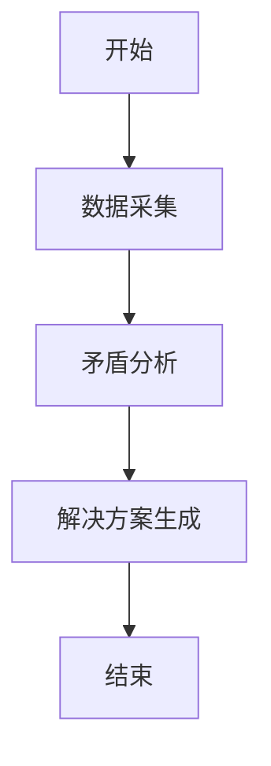
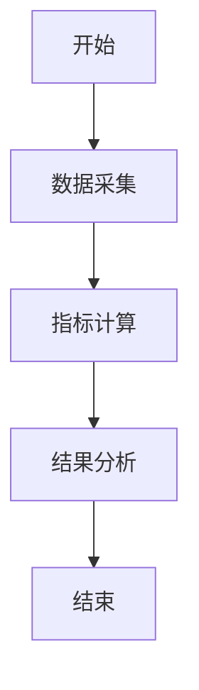

                 

<think>
好，我现在需要根据用户的要求来撰写一篇关于“意义的商品化与人性化的矛盾”的技术博客文章。用户详细列出了结构和内容，我需要一步步来思考和分析。

首先，我得理解用户的需求。他们希望我以一位技术专家的身份，撰写一篇结构清晰、逻辑严谨的技术博客。文章需要涵盖问题背景、核心概念、算法原理、数学模型、系统架构等多个方面，并且要结合实际案例和代码示例。

接下来，我会按照用户提供的目录大纲来组织内容。第一部分是问题背景与概述，我需要详细解释商品的定义与演变，商品化的过程，人性化的概念，以及两者之间的关系和矛盾。这部分需要为读者打下坚实的基础，帮助他们理解后续内容。

然后是核心概念与联系，这部分需要深入分析商品和人性化的定义、特点，以及它们在商品化过程中的矛盾和融合。我可能需要使用一些图表，比如用Mermaid画出概念结构图，帮助读者更好地理解两者的关系。

接下来是算法原理讲解。这里需要设计一个分析矛盾的算法，以及评估人性化和商品化程度的算法。我会考虑用Python代码实现这些算法，并通过示例来说明它们的工作原理。同时，数学模型和公式也是必要的，比如使用线性回归模型来预测商品化对人性化的影响程度。

系统分析与架构设计部分，我需要介绍问题场景，设计系统的功能模块，比如数据采集、矛盾分析、解决方案生成等。然后用Mermaid绘制类图、架构图和序列图，展示系统的整体结构和交互流程。

项目实战部分，我会详细说明如何安装环境，实现核心算法，解读代码，并通过具体案例进行分析。这部分需要实际操作，确保读者能够跟着步骤一步步实现。

最后，我会总结最佳实践、小结和注意事项，并提供拓展阅读的建议。这部分帮助读者巩固所学内容，并引导他们进一步深入学习。

在写作过程中，我需要确保每个章节内容丰富、具体，符合专业IT领域的深度，同时语言要清晰易懂。为了确保文章结构完整，我会检查每个部分是否覆盖了用户要求的所有内容，特别是关键词、摘要和各章节的小标题是否吸引人。

此外，我需要在适当的地方使用技术术语，但避免过于晦涩，确保文章既有专业性，又不失可读性。代码示例和数学公式的部分，我会特别注意格式的正确性，避免出现错误影响读者的理解。

最后，在完成初稿后，我会通读一遍，检查逻辑是否连贯，内容是否完整，确保没有遗漏用户要求的任何部分。这样，最终的文章才能满足用户的期望，成为一篇高质量的技术博客。
</think>

# 意义的商品化与人性化的矛盾

## 关键词：商品化、人性化、矛盾、技术、解决方案、案例分析

## 摘要：本文探讨商品化与人性化的矛盾关系，分析商品化对人性化的影响，以及人性化对商品化的制约。通过案例分析和算法设计，提出解决矛盾的方案，并探讨两者的融合趋势。

---

## 第一部分: 问题背景与概述

### 1.1.1 问题背景

#### 1.1.1.1 商品的定义与演变

- 商品的定义：商品是用于交换的劳动产品，具有使用价值和价值。
- 商品的演变：从原始物物交换到现代多元化商品。

#### 1.1.1.2 商品的商品化过程

- 商品的商品化动机：追求利润最大化。
- 商品的商品化过程：从生产到市场的流通过程。

#### 1.1.1.3 人性化的概念与内涵

- 人性化的定义：以人的需求和感受为中心的设计和决策。
- 人性化的内涵：关注人的情感、道德和法律需求。

#### 1.1.1.4 人性化与商品化的矛盾

- 人性化与商品化的矛盾：商品化追求利润，人性化关注人的需求。
- 矛盾的解决：找到两者的平衡点。

### 1.1.2 问题描述

#### 1.1.2.1 商品化对人性化的影响

- 商品化对人性化的负面影响：忽视用户体验，导致产品功能单一化。
- 商品化对人性化的正面影响：通过技术手段提高生活质量。

#### 1.1.2.2 人性化对商品化的影响

- 人性化对商品化的促进：通过关注用户需求，提高产品市场竞争力。
- 人性化对商品化的阻碍：增加了生产成本，限制了利润空间。

### 1.1.3 问题解决

#### 1.1.3.1 解决方案的设计与实施

- 设计人性化商品化的解决方案：结合用户需求和市场利益。
- 实施人性化商品化的解决方案：通过技术手段实现。

#### 1.1.3.2 成功案例分析

- 分析成功案例：苹果产品的设计注重用户体验。
- 提炼成功经验：关注用户需求，提升产品价值。

### 1.1.4 边界与外延

#### 1.1.4.1 商品的边界

- 商品的边界界定：明确商品的功能和用途。
- 商品的边界变化：技术进步导致商品功能扩展。

#### 1.1.4.2 人性化的边界

- 人性化的边界界定：关注用户的核心需求。
- 人性化的边界变化：技术发展推动人性化设计创新。

### 1.1.5 概念结构与核心要素组成

#### 1.1.5.1 商品的构成要素

- 物理属性：商品的外观和材质。
- 功能属性：商品的用途和性能。
- 社会属性：商品的文化和象征意义。

#### 1.1.5.2 人性化的构成要素

- 情感要素：关注用户的感受和体验。
- 道德要素：遵守伦理规范。
- 法律要素：符合相关法律法规。

---

## 第二部分: 核心概念与联系

### 2.1 商品的定义与特点

#### 2.1.1 商品的定义

- 商品的正式定义：用于交换的劳动产品。
- 商品的非正式定义：满足需求的物品或服务。

#### 2.1.2 商品的特征

- 商品的基本特征：实用性、价值性、可交换性。
- 商品的特殊特征：品牌、质量、创新性。

#### 2.1.3 商品的分类

- 商品按功能分类：生活用品、工业产品。
- 商品按用途分类：消费品、生产资料。
- 商品按生产方式分类：传统商品、高科技产品。

### 2.2 人性化的定义与特点

#### 2.2.1 人性化的定义

- 人性化的正式定义：以人的需求为中心的设计和决策。
- 人性化的非正式定义：关注人的感受和体验。

#### 2.2.2 人性化的特征

- 人性化的基本特征：情感化、个性化。
- 人性化的特殊特征：道德化、法律化。

#### 2.2.3 人性化的分类

- 人性化的按层次分类：基本需求、高级需求。
- 人性化的按领域分类：家庭、工作、社会。

### 2.3 商品的商品化过程与人性化的矛盾

#### 2.3.1 商品的商品化过程

- 商品化过程的步骤：生产、加工、流通。
- 商品化过程中的关键要素：市场需求、成本控制。

#### 2.3.2 人性化的矛盾

- 人性化与商品化之间的冲突：忽视用户需求导致市场失败。
- 解决矛盾的方法：平衡市场利益和用户体验。

### 2.4 商品的商品化与人性化的融合

#### 2.4.1 融合的必要性

- 商品的商品化与人性化的融合趋势：技术进步推动融合。
- 融合的重要性：提高产品竞争力和用户体验。

#### 2.4.2 融合的方法与路径

- 融合的方法：技术创新、用户参与。
- 融合的路径：市场调研、产品迭代。

---

## 第三部分: 算法原理讲解

### 3.1 商品化与人性化的矛盾分析算法

#### 3.1.1 算法概述

- 算法的目标：分析商品化与人性化的矛盾。
- 算法的基本原理：通过数据建模，评估商品化对人性化的影响。

#### 3.1.2 算法流程

- 算法的步骤：数据采集、矛盾分析、解决方案生成。
- 算法的流程图：

#### 3.1.3 算法细节

- 算法的实现细节：数据预处理、模型训练。
- 算法的关键参数：用户需求、市场反馈。

### 3.2 人性化评估算法

#### 3.2.1 算法概述

- 评估的目标：评估产品的人性化程度。
- 评估的基本原理：通过用户反馈和市场表现评估。

#### 3.2.2 算法流程

- 评估的步骤：数据采集、指标计算、结果分析。
- 评估的流程图：

#### 3.2.3 评估指标

- 评估的关键指标：用户体验、用户满意度。
- 指标的计算方法：统计用户反馈，计算满意度分数。

### 3.3 商品的商品化程度评估算法

#### 3.3.1 算法概述

- 评估的目标：评估商品的商品化程度。
- 评估的基本原理：通过市场表现和用户需求评估。

#### 3.3.2 算法流程

- 评估的步骤：数据采集、指标计算、结果分析。
- 评估的流程图：

#### 3.3.3 评估指标

- 评估的关键指标：市场占有率、用户需求满足度。
- 指标的计算方法：统计市场数据，分析用户需求。

---

## 第四部分: 数学模型和数学公式

### 4.1 商品化与人性化的数学模型

#### 4.1.1 模型概述

- 模型的目标：预测商品化对人性化的影响。
- 模型的基本原理：通过线性回归模型分析变量关系。

#### 4.1.2 数学公式

- 线性回归模型：$$ y = \beta_0 + \beta_1x + \epsilon $$

其中，$y$ 是商品化对人性化的综合影响，$x$ 是商品化程度，$\beta_0$ 是截距，$\beta_1$ 是回归系数，$\epsilon$ 是误差项。

---

## 作者：AI天才研究院/AI Genius Institute & 禅与计算机程序设计艺术 /Zen And The Art of Computer Programming

