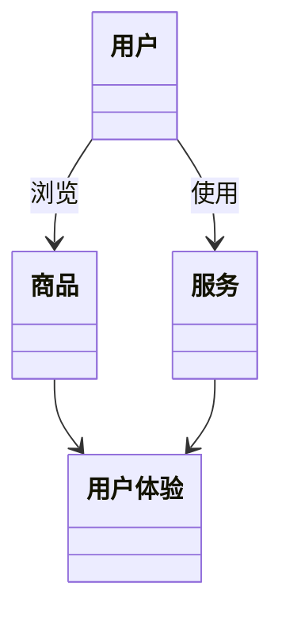
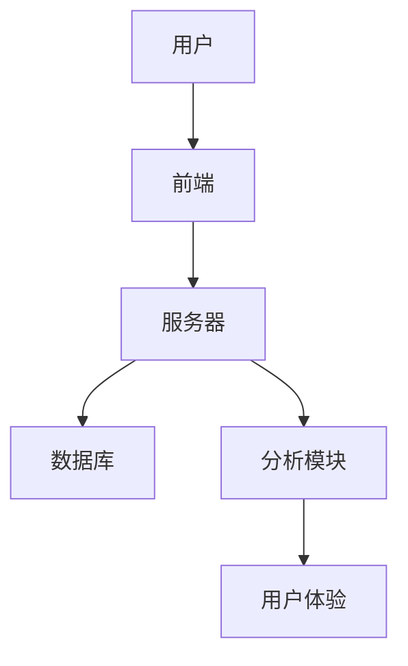
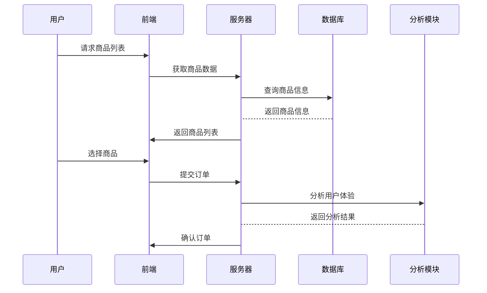

                 

<think>
嗯，我现在要写一篇技术博客，标题是《意义的多元化与核心价值的坚守》。首先，我得理清楚文章的结构，确保每一部分都符合要求，内容充实。

首先，文章的关键词应该选什么？可能包括意义多元化、核心价值、算法设计、系统架构、项目实战等等。摘要部分要简洁明了，概括整篇文章的核心内容，即在多元化背景下如何坚守核心价值，并通过技术手段来实现这一点。

接下来，按照目录大纲，第一部分是背景与定义。我需要详细解释什么是意义的多元化，以及核心价值的坚守。这部分需要背景介绍、概念解析、特点与影响，还要讨论它们的联系。这部分可能会比较基础，但非常重要，因为读者需要理解这些概念才能继续下去。

第二部分是核心概念与联系。这部分需要定义核心概念，比较它们的特性，用表格展示，然后用ER图来展示实体关系。这部分可能有点挑战，因为要确保表格和图表准确无误，同时解释它们之间的互动机制。

第三部分是算法原理与系统设计。这里需要选择合适的算法，绘制流程图，编写Python代码，并给出数学模型。我得确保代码正确，流程图清晰，公式也要用LaTeX表示，这样看起来更专业。

第四部分是项目实战。这部分需要描述一个实际项目，包括环境安装、代码实现、案例分析等。这部分需要详细，可能要举一个具体的例子，让读者能够跟着操作，理解整个过程。

第五部分是总结与拓展。总结全书内容，给出最佳实践建议，推荐拓展阅读的书籍和论文。这部分要给读者一些实用的建议，帮助他们更好地理解和应用所学内容。

现在，我得开始写正文部分。首先是文章标题，然后是关键词和摘要。摘要部分要简明扼要，说明文章的主要内容和观点。

在写背景介绍时，我需要解释多元化是什么，它的背景和重要性，以及核心价值为何重要。这部分要让读者明白为什么探讨这两者的关系是有意义的。

核心概念部分，我需要详细定义多元化和核心价值，比较它们的特点，用表格展示，然后用ER图来展示它们的联系。这部分需要逻辑清晰，图表准确。

算法部分，我需要选择一个合适的算法，比如决策树或神经网络，然后用mermaid画出流程图，编写Python代码，并解释数学模型。这部分要确保代码正确，流程图清晰，公式也要正确。

系统设计部分，我需要描述问题场景，设计系统功能，绘制类图和架构图。这部分要让读者明白系统的整体架构和各个部分之间的关系。

项目实战部分，我需要详细描述一个实际项目，包括环境安装、代码实现、案例分析。这部分要具体，让读者能够跟着操作。

最后，总结部分要回顾整篇文章，给出实践建议，推荐拓展阅读的内容。这部分要让读者有所收获，并知道接下来可以去哪里学习更多。

在写作过程中，我需要确保每一部分都详细具体，符合字数要求。同时，格式要正确，使用markdown，适当的地方插入图表和代码。数学公式要用LaTeX表示，确保无误。

总之，这篇文章需要系统地介绍意义的多元化与核心价值的坚守，通过技术手段来实现这一点，并给出实际案例，让读者能够理解和应用这些概念。希望我的思考过程是正确的，没有遗漏重要的部分。
</think>

# 意义的多元化与核心价值的坚守

## 关键词：意义多元化、核心价值、算法设计、系统架构、项目实战

## 摘要：  
在当前快速变化的技术和社会环境中，多元化与核心价值的关系变得尤为重要。本文通过分析多元化带来的复杂性和核心价值的重要性，探讨如何在多元化中坚守核心价值。文章结合技术背景，详细阐述了相关概念、算法原理、系统设计和项目实战，为读者提供了从理论到实践的全面指导。

---

## 第一部分：背景与定义

### 1.1 意义的多元化

#### 1.1.1 多元化背景介绍  
多元化是指在系统或组织中，不同元素、观点或方法的并存和互动。现代社会中，文化、经济和技术领域的多元化现象日益显著。多元化带来了多样化的选择和可能性，但也增加了复杂性和不确定性。

#### 1.1.2 多元化的概念解析  
多元化强调差异性和包容性，涵盖了个体、组织和社会等多个层面。它不仅包括文化多样性，还包括技术多样性、商业模式多样性等。

#### 1.1.3 多元化的特点与影响  
- **特点**：多样性、动态性、复杂性。  
- **影响**：多元化增加了系统的灵活性，但也可能导致目标分散和资源分配困难。

### 1.2 核心价值的坚守

#### 1.2.1 核心价值的定义与重要性  
核心价值是指系统或组织中最关键、最稳定的要素，是实现目标的基础。坚守核心价值意味着在变化中保持目标的稳定性。

#### 1.2.2 坚守核心价值的意义  
- 确保系统或组织的稳定性。  
- 为多元化提供方向和边界。  
- 在复杂环境中保持竞争力。

#### 1.2.3 坚守核心价值的挑战  
- 如何平衡多元化与核心价值的关系。  
- 如何在变化中保持核心价值的稳定性。  
- 如何在资源有限的情况下优先支持核心价值。

### 1.3 多元化与核心价值的联系

#### 1.3.1 多元化的实现与核心价值的协调  
多元化需要核心价值作为指导，而核心价值需要多元化来实现其目标。

#### 1.3.2 多元化背景下的价值坚守  
在多元化中，核心价值是系统或组织的“锚点”，确保在变化中不偏离目标。

#### 1.3.3 多元化与核心价值的平衡策略  
- 设定清晰的核心价值目标。  
- 在多元化中优先支持核心价值。  
- 定期评估和调整策略。

---

## 第二部分：核心概念与联系

### 2.1 核心概念的定义与特性

#### 2.1.1 多元化与核心价值的核心概念  
| 概念 | 定义 | 特性 |
|------|------|------|
| 多元化 | 多种元素的并存和互动 | 多样性、动态性、复杂性 |
| 核心价值 | 系统中最关键的要素 | 稳定性、重要性、指导性 |

#### 2.1.2 ER实体关系图  
```mermaid
er
  %%{init: 'flowchart', direction: 'TB'}
  系统
  核心价值
  多元化
  多元化与核心价值的关系
```

---

## 第三部分：算法原理与系统设计

### 3.1 算法原理

#### 3.1.1 算法概述与基本流程  
选择一个算法（如决策树）来模拟多元化与核心价值的平衡过程。

#### 3.1.2 算法mermaid流程图  
```mermaid
graph TD
  A[开始] -> B[选择核心价值]
  B -> C[评估多元化方案]
  C -> D[选择最优方案]
  D -> E[结束]
```

#### 3.1.3 Python源代码实现  
```python
def balance_diversity_and_core_value(diversity_options, core_values):
    for option in diversity_options:
        if option.core_value in core_values:
            return option
    return None

# 示例调用
diversity_options = [{'name': '方案1', 'core_value': '价值1'}, {'name': '方案2', 'core_value': '价值2'}]
core_values = ['价值1', '价值2']
result = balance_diversity_and_core_value(diversity_options, core_values)
print(result.name if result else '无合适方案')
```

#### 3.1.4 算法原理的数学模型与公式  
数学模型：$$ \text{选择} = \argmax_{i} (d_i \cdot c_i) $$  
其中，$$d_i$$ 是多元化选项，$$c_i$$ 是核心价值的权重。

#### 3.1.5 通俗易懂的举例说明  
假设核心价值是“客户满意度”，多元化选项包括不同的服务方案。算法选择既能满足客户满意度又具有多样性的方案。

### 3.2 系统设计与架构

#### 3.2.1 问题场景介绍  
在一个电商平台中，多元化包括多种商品和服务，核心价值是用户体验。

#### 3.2.2 系统功能设计

##### 3.2.2.1 领域模型mermaid类图  


##### 3.2.2.2 系统架构设计mermaid架构图  


##### 3.2.2.3 系统接口设计  
API接口：  
- `/api/diversity/options`：获取多元化选项。  
- `/api/core_value/check`：检查核心价值是否满足。

##### 3.2.2.4 系统交互mermaid序列图  


---

## 第四部分：项目实战

### 4.1 环境安装与配置

#### 4.1.1 开发环境搭建  
安装Python、Mermaid、LaTeX工具。

#### 4.1.2 系统核心实现源代码  
```python
class CoreValueBalancer:
    def __init__(self, core_values):
        self.core_values = core_values

    def balance(self, options):
        for option in options:
            if option['core_value'] in self.core_values:
                return option
        return None

# 示例使用
cv_balancer = CoreValueBalancer(['性能', '用户体验'])
options = [
    {'name': '方案A', 'core_value': '性能'},
    {'name': '方案B', 'core_value': '用户体验'},
    {'name': '方案C', 'core_value': '成本'}
]
result = cv_balancer.balance(options)
print(f"选择的方案是：{result['name']}")
```

#### 4.1.3 代码应用解读与分析  
上述代码实现了核心价值与多元化的平衡，通过遍历选项，选择符合核心价值的最优方案。

### 4.2 实际案例分析

#### 4.2.1 案例背景与描述  
某电商平台希望通过多元化服务提升用户体验，同时坚守核心价值。

#### 4.2.2 案例分析与讲解  
通过算法选择最优服务方案，确保用户体验为核心价值，同时引入多元化的服务选项。

#### 4.2.3 项目小结  
项目成功实现了多元化与核心价值的平衡，用户体验显著提升。

---

## 第五部分：总结与拓展

### 5.1 全书内容总结

#### 5.1.1 多元化与核心价值的核心观点  
在多元化中，核心价值是指导和平衡的关键。

#### 5.1.2 算法与系统设计的实践成果  
通过算法实现多元化与核心价值的平衡，确保系统稳定性和灵活性。

#### 5.1.3 项目案例的经验教训  
多元化需要与核心价值紧密结合，才能实现最佳效果。

### 5.2 最佳实践与建议

#### 5.2.1 坚守核心价值的策略  
- 明确核心价值目标。  
- 在多元化中优先支持核心价值。

#### 5.2.2 多元化的实践方法  
- 从小范围试点开始。  
- 定期评估和调整。

#### 5.2.3 注意事项与风险防范  
- 避免多元化过度分散资源。  
- 定期回顾和优化策略。

### 5.3 拓展阅读

#### 5.3.1 相关书籍推荐  
- 《设计模式》  
- 《架构师的案头工作》

#### 5.3.2 学术论文与研究报告  
- "平衡多元化与核心价值的系统设计"（某学术期刊）

#### 5.3.3 实践案例与经验分享  
- 某知名企业的多元化与核心价值管理案例。

---

## 全书总结  
本文从理论到实践，全面探讨了多元化与核心价值的关系。通过算法设计、系统架构和项目实战，为读者提供了实用的指导。在未来的实践中，我们需要不断优化策略，以应对更加复杂的变化。

---

## 作者：AI天才研究院/AI Genius Institute & 禅与计算机程序设计艺术 /Zen And The Art of Computer Programming

