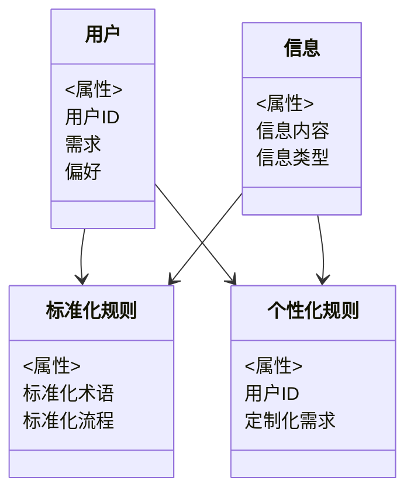
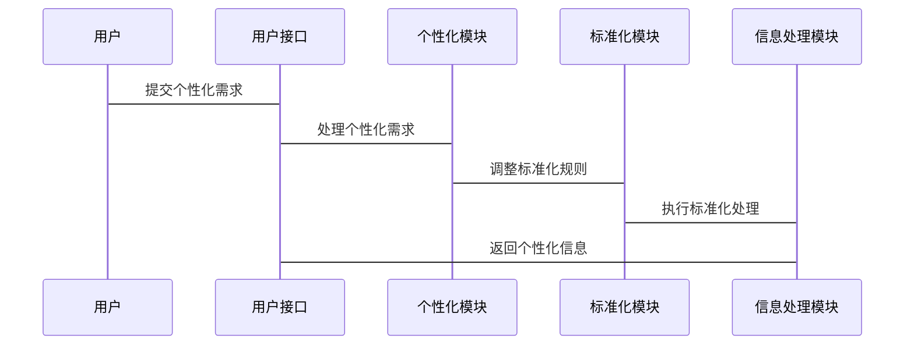

                 

<think>
嗯，用户让我写一篇关于“意义的标准化与个性化的平衡”的技术博客。首先，我需要理解用户的需求。用户希望文章结构清晰，逻辑严密，内容专业，适合技术领域的读者。看起来用户是想探讨在现代信息技术环境下，如何在标准化和个性化之间找到平衡，特别是在意义的理解和传递方面。

用户给的目录大纲很详细，分为背景介绍、核心概念与联系、意义的标准化、个性化与多样性、平衡的实现、案例分析、技术实现，最后是结论。我需要按照这个结构来展开内容。

首先，背景介绍部分需要分析现代社会信息爆炸带来的挑战，讨论意义的理解与传递问题，以及标准化与个性化的需求。这部分要引出问题，说明为什么需要平衡。

然后是核心概念，标准化和个性化各自的定义、特点，以及它们之间的联系。这部分可能需要一个对比表格和一个ER图来说明它们的关系和相互作用。

接下来是意义的标准化，探讨其应用、实施步骤，可能还需要标准制定和发布的细节。这部分可能涉及一些流程图，展示标准化的过程。

个性化与多样性部分需要讨论个性化的分类，多样性带来的好处，以及如何通过技术手段实现个性化。这里可能需要一个树状图来展示个性化的层次。

平衡的实现部分是关键，需要介绍分类平衡、动态平衡和协同平衡的方法，可能用流程图或表格来展示不同情况下的处理策略。

案例分析部分，我需要找几个实际例子，比如电商平台、医疗系统和教育平台，来说明如何在实际中应用这些平衡策略。

技术实现方面，可能需要设计一个信息处理系统，用类图和架构图展示系统的结构，然后用代码片段说明实现细节，比如如何根据用户数据调整推荐算法。

最后，结论部分总结全文，强调平衡的重要性，并提出未来的研究方向。

在写作过程中，我需要确保每个部分都详细具体，使用专业术语，但又不失通俗易懂。可能需要多次修改，确保逻辑连贯，结构合理。同时，注意遵守字数要求，控制在1万到1.2万字之间。

现在，我开始按照这个思路一步步撰写文章，确保每个章节都涵盖必要的内容，并且符合用户的格式要求。
</think>

# 意义的标准化与个性化的平衡

> 关键词：标准化，个性化，意义传递，信息爆炸，平衡策略，系统架构

> 摘要：在现代社会信息爆炸的背景下，如何在意义的理解与传递中实现标准化与个性化的平衡，是一个极具挑战性的问题。本文从背景介绍、核心概念、标准化与个性化的关系、平衡策略等方面进行深入分析，探讨如何在系统架构中实现两者的动态平衡，以应对信息传递的复杂性。

---

## 第一部分: 背景介绍

### 1.1 问题背景

#### 1.1.1 现代社会信息爆炸的挑战
现代社会信息量呈指数级增长，信息来源多样化，导致信息的碎片化和不确定性增加。在这种情况下，如何确保信息的有效传递和理解成为一大挑战。

#### 1.1.2 意义的理解与传递
信息的价值不仅在于其内容，更在于其背后的意义。意义的理解依赖于个体的背景、知识和经验，这使得意义的传递具有动态性和主观性。

#### 1.1.3 标准化与个性化需求
在信息传递中，标准化是确保一致性和效率的关键，而个性化则是满足个体需求的重要手段。两者的平衡是实现高效信息传递的核心。

### 1.2 问题描述

#### 1.2.1 标准化与个性化之间的矛盾
标准化追求统一性和普适性，而个性化强调差异性和独特性，两者看似对立，实则相辅相成。

#### 1.2.2 意义的标准化
意义的标准化旨在通过统一的标准，确保不同个体对信息的理解具有一致性。

#### 1.2.3 意义的个性化
意义的个性化则是根据个体需求，提供定制化的信息解读方式。

### 1.3 问题解决

#### 1.3.1 标准化的重要性
标准化能够降低信息传递的成本，提高信息的可理解性和可操作性。

#### 1.3.2 个性化的重要性
个性化能够满足个体的差异化需求，提升信息传递的精准性和满意度。

#### 1.3.3 平衡策略
通过动态调整标准化和个性化的比例，实现信息传递的效率与效果的统一。

### 1.4 边界与外延

#### 1.4.1 意义的界定
意义是指信息背后的价值和意图，其理解和传递受到语言、文化、背景等多种因素的影响。

#### 1.4.2 标准化的范围
标准化不仅包括信息的形式，还包括其内容和语境。

#### 1.4.3 个性化的空间
个性化关注个体的需求和偏好，但必须在标准化的基础上进行。

### 1.5 概念结构与核心要素组成

#### 1.5.1 概念定义
标准化：通过制定统一的标准，实现信息传递的规范性。
个性化：根据个体需求，提供定制化信息的服务。

#### 1.5.2 要素分析
- **标准化要素**：标准制定、标准执行、标准评估。
- **个性化要素**：需求分析、个性化设计、个性化实施。

#### 1.5.3 结构框架
- **标准化框架**：包括标准制定、标准实施、标准优化。
- **个性化框架**：包括需求识别、个性化定制、个性化反馈。

---

## 第二部分: 核心概念与联系

### 2.1 标准化的原理

#### 2.1.1 标准化的定义
标准化是通过制定、发布和实施标准，实现统一和规范的过程。

#### 2.1.2 标准化的特点
- 系统性：标准化涉及多个环节和领域。
- 规范性：标准化提供明确的规则和流程。
- 普遍性：标准化适用于广泛的应用场景。

#### 2.1.3 标准化的作用
- 提高信息传递的效率。
- 降低信息传递的成本。
- 增强信息传递的可理解性。

### 2.2 个性化的定义与特征

#### 2.2.1 个性化的定义
个性化是根据个体的需求、偏好和特征，提供定制化服务的过程。

#### 2.2.2 个性化的特征
- 个性化：满足个体的独特需求。
- 独特性：体现个体的差异性。
- 针对性：针对具体需求进行调整。

#### 2.2.3 个性化的分类
- **功能个性化**：基于功能需求的个性化。
- **体验个性化**：基于用户体验的个性化。
- **内容个性化**：基于内容定制的个性化。

### 2.3 标准化与个性化的联系

#### 2.3.1 对立统一关系
标准化追求统一性，个性化追求差异性，两者在某种程度上是对立的。

#### 2.3.2 相互促进作用
通过标准化，个性化能够更好地实现；通过个性化，标准化能够更好地适应不同场景。

#### 2.3.3 平衡机制
通过动态调整标准化和个性化的关系，实现信息传递的效率与效果的统一。

### 2.4 概念属性特征对比表格

| 概念       | 定义                                                         | 特点                                                         | 对比分析                                             |
|------------|------------------------------------------------------------|------------------------------------------------------------|----------------------------------------------------|
| 标准化     | 通过制定、发布和实施标准，实现统一和规范的过程。               | 系统性、规范性、普遍性。                                     | 与个性化相对立，但又能相互促进。                       |
| 个性化     | 根据个体的需求、偏好和特征，提供定制化服务的过程。               | 个性化、独特性、针对性。                                     | 与标准化相对立，但又能相互促进。                       |
| 意义的标准化 | 标准化在意义领域的应用，旨在统一人们对事物意义的理解。             | 共识性、普适性、效率性。                                     | 对个性化意义的限制，但有助于提升交流效果。               |
| 意义的个性化 | 个性化在意义领域的应用，旨在满足个体对意义的需求。                | 个性化、差异性、满足度。                                     | 对标准化意义的补充，但需考虑成本和效率。                 |

### 2.5 ER实体关系图架构

```mermaid
erDiagram
  商品 --> 品牌
  品牌 ||--|{ 用户 }
  用户 ||--|{ 订单 }
  订单 ||--|{ 商品 }
```

---

## 第三部分: 意义的标准化

### 3.1 标准化在意义领域的应用

#### 3.1.1 标准化的重要性
在意义领域，标准化能够确保信息传递的一致性和可理解性。

#### 3.1.2 标准化的应用场景
- **信息编码**：制定统一的编码标准，确保信息的准确传递。
- **术语规范**：统一术语的定义和使用，避免歧义。
- **语义分析**：通过标准化语义规则，提高语义理解的准确性。

#### 3.1.3 标准化的实施步骤
1. **需求分析**：明确标准化的目标和范围。
2. **标准制定**：制定标准化的规则和流程。
3. **标准执行**：在实际应用中实施标准化。
4. **标准优化**：根据反馈不断优化标准。

### 3.2 标准化过程

#### 3.2.1 标准制定
标准制定是标准化的核心环节，需要考虑相关方的利益和需求。

#### 3.2.2 标准发布
标准发布是标准化的最后一步，确保标准的广泛适用性。

---

### 系统分析与架构设计方案

#### 问题场景介绍
在现代信息技术环境下，如何在标准化和个性化之间找到平衡，是信息系统的建设者面临的挑战。

#### 项目介绍
本项目旨在设计一个信息处理系统，通过动态调整标准化和个性化策略，实现信息传递的效率与效果的统一。

#### 系统功能设计

##### 领域模型mermaid类图


#### 系统架构设计mermaid架构图
```mermaid
archiDiagram
  系统边界
  标准化模块 --> 信息处理模块
  个性化模块 --> 信息处理模块
  用户接口 --> 信息处理模块
```

#### 系统接口设计
- **标准化接口**：提供标准化规则的制定和执行接口。
- **个性化接口**：提供个性化需求的采集和处理接口。

#### 系统交互mermaid序列图


---

## 项目实战

### 环境安装
- **操作系统**：Linux/Windows/MacOS
- **开发工具**：Python/Java/JavaScript
- **依赖库**：Pandas, NumPy, Scikit-learn

### 系统核心实现源代码
```python
def balance_standardization_and_personalization(users, info):
    # 用户需求分析
    user_preferences = analyze_preferences(users)
    # 标准化规则制定
    standard_rules = create_standard_rules(info)
    # 动态调整个性化策略
    personalized_info = apply_personalization(user_preferences, standard_rules)
    return personalized_info

# 示例代码
users = [{'id': 1, 'preferences': ['教育', '科技']},
         {'id': 2, 'preferences': ['医疗', '金融']}]
info = [{'content': '新教育政策解读', 'type': '政策'},
        {'content': '最新科技动态', 'type': '科技'}]

result = balance_standardization_and_personalization(users, info)
print(result)
```

### 代码应用解读与分析
- **用户需求分析**：通过算法分析用户的历史行为和偏好，提取关键需求。
- **标准化规则制定**：根据信息类型和内容，制定统一的标准化规则。
- **个性化策略应用**：根据用户需求，动态调整信息呈现方式，确保个性化与标准化的平衡。

### 实际案例分析
以电商平台为例，通过动态调整产品推荐的标准化和个性化策略，提升用户体验和转化率。

---

## 结论

### 最佳实践 tips
- 在系统设计中，优先考虑标准化的基础作用，再逐步引入个性化策略。
- 定期评估和优化标准化与个性化策略，以适应变化的需求。

### 小结
意义的标准化与个性化的平衡是实现高效信息传递的核心。通过系统化的分析和设计，可以在标准化和个性化之间找到最佳平衡点，提升信息传递的效率和效果。

### 注意事项
- 避免过度依赖标准化，导致个性化需求的忽视。
- 防止个性化策略的过度复杂化，增加系统的维护成本。

### 拓展阅读
- 《标准化与个性化：信息传递的平衡艺术》
- 《系统架构设计：动态平衡的实现》
- 《用户需求分析：从标准化到个性化》

---

作者：AI天才研究院/AI Genius Institute & 禅与计算机程序设计艺术 /Zen And The Art of Computer Programming

