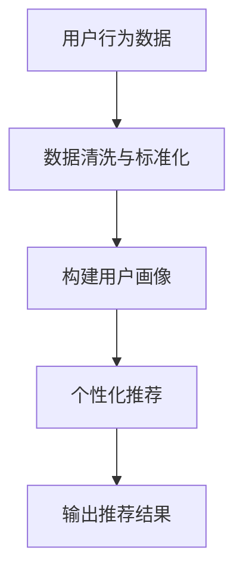
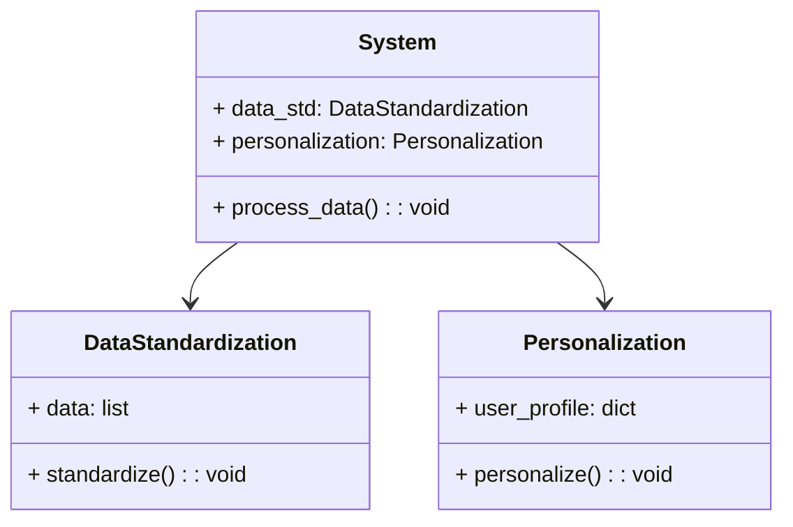
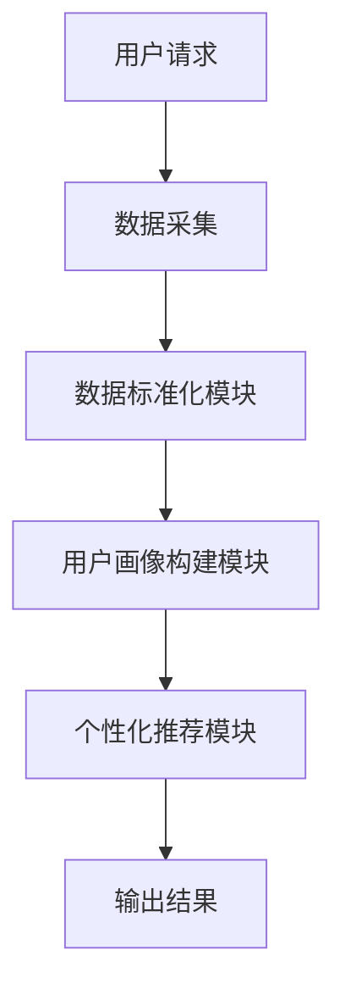

                 

<think>
好，我现在需要帮用户撰写一篇技术博客文章，标题是《意义的标准化与个性化：uniformity与diversity的平衡》。用户希望内容结构清晰，逻辑严密，涵盖标准化与个性化的核心概念、联系、算法原理、系统架构设计、项目实战以及最佳实践等多个方面。

首先，我得理解用户的需求。用户是一位技术专家，拥有丰富的经验和知识，他希望文章既有深度又通俗易懂，适合专业读者阅读。文章需要有目录结构，包括背景介绍、核心概念、算法原理、系统架构、项目实战和结论等部分，每部分都要详细展开。

接下来，我需要确定每个章节的内容。背景介绍部分要说明问题背景，核心概念，问题解决，以及标准化和个性化的边界和外延。这部分要让读者明白标准化和个性化的重要性以及它们之间的关系。

然后，核心概念与联系部分需要深入探讨标准化和个性化各自的原理，通过对比表格和ER图来展示它们的差异和联系。这样可以帮助读者更直观地理解两者的区别和互补性。

算法原理部分，我需要选择一个适合的算法，比如K-means，来展示如何在标准化和个性化之间找到平衡。使用Mermaid流程图来描述算法步骤，再用Python代码实现，并通过数学公式详细讲解算法的原理。这部分需要既展示理论，又有实际代码，让读者能够理解并应用。

系统架构设计部分，我需要设计一个支持标准化与个性化数据处理的系统。这包括领域模型、架构图、接口设计和交互流程图。这部分要展示系统如何在实际中应用标准化和个性化处理，确保系统的高效性和灵活性。

项目实战部分，我需要一个具体案例，比如电商平台用户画像。展示如何安装环境，编写代码，分析数据，并得出结论。这部分要详细说明每一步的操作和结果，让读者能够跟着操作并理解整个过程。

最后，结论部分需要总结全文，强调标准化与个性化平衡的重要性，并给出未来发展的建议。同时，加上作者信息，确保文章的权威性。

在写作过程中，我要注意使用专业但易懂的语言，确保每个部分都详细且具体，同时满足用户的字数和格式要求。使用Mermaid图表和数学公式来增强文章的可读性和专业性。同时，确保文章结构清晰，逻辑严密，让读者能够一步步理解标准化与个性化如何平衡。

现在，我需要按照这些步骤，逐步撰写每个部分，确保内容全面且符合用户的要求。
</think>

# 意义的标准化与个性化：Uniformity与Diversity的平衡

## 关键词：标准化、个性化、数据治理、算法设计、系统架构

## 摘要：  
在信息化和数字化时代，数据的标准化与个性化处理成为数据管理和应用的核心挑战。本文深入探讨了标准化与个性化之间的关系，分析了它们在数据治理、算法设计、系统架构中的应用，并通过实际案例展示了如何在实际场景中实现两者的平衡。通过理论与实践结合，本文为读者提供了全面的理解和实践指导。

---

# 目录大纲

## 第一部分: 背景介绍

## 1.1 问题背景与核心概念

### 1.1.1 问题背景

在信息化和数字化时代，数据成为最重要的资源之一。如何有效地管理和利用数据，实现数据的标准化与个性化，成为当前数据管理和应用领域的关键问题。标准化与个性化之间的平衡，是实现数据高效利用和创新应用的关键。

### 1.1.2 核心概念

- **标准化**：对数据进行规范化、统一化的处理，确保数据的一致性和可比性。
- **个性化**：根据用户需求、行为等，对数据进行差异化处理，满足用户的个性化需求。

### 1.1.3 问题解决

通过标准化与个性化的平衡，实现数据的统一管理和灵活应用，为各行业提供高效的数据解决方案。

### 1.1.4 边界与外延

- **边界**：主要关注数据标准化和个性化处理的范围和程度。
- **外延**：涉及到数据的应用场景、技术实现、行业解决方案等。

## 1.2 核心概念与联系

### 1.2.1 核心概念原理

- **标准化**：通过对数据定义、格式、结构等进行规范化，确保数据的统一性和可比性。
- **个性化**：根据用户的需求和行为特征，对数据进行差异化处理，满足个性化需求。

### 1.2.2 概念属性特征对比

| 特征 | 标准化 | 个性化 |
| ---- | ---- | ---- |
| 目标 | 数据一致性和可比性 | 满足用户个性化需求 |
| 方式 | 规范化、统一化 | 差异化、个性化 |
| 应用 | 数据管理和分析 | 数据挖掘、用户画像 |
| 优点 | 数据可比性、易管理 | 用户体验好、针对性强 |
| 缺点 | 缺乏灵活性、用户参与度低 | 数据标准化程度低、管理复杂 |

### 1.2.3 概念联系

标准化与个性化相辅相成，标准化提供了数据的基础，个性化则在此基础上满足了用户的需求。两者之间的平衡是实现高效数据管理和应用的关键。

## 1.3 统计标准与个性化需求的处理

### 1.3.1 统计标准

- **数据定义**：明确数据的定义、类型、格式等。
- **数据清洗**：去除无效、错误、重复的数据。
- **数据集成**：将不同来源的数据进行整合。
- **数据转换**：将数据转换为统一的格式。

### 1.3.2 个性化需求处理

- **用户画像**：基于用户行为、兴趣等构建用户画像。
- **需求分析**：分析用户的个性化需求。
- **数据个性化处理**：根据用户画像和需求，对数据进行分析和处理。

## 1.4 标准化与个性化在数据管理和应用中的实践

### 1.4.1 数据治理

- **数据质量管理**：确保数据的一致性、准确性、完整性和及时性。
- **数据标准化管理**：制定数据标准化策略和流程。
- **数据个性化管理**：根据用户需求调整数据管理策略。

### 1.4.2 数据应用

- **数据挖掘**：从大量数据中提取有价值的信息。
- **用户画像**：构建用户画像，实现个性化推荐。
- **行业解决方案**：为各行业提供定制化的数据解决方案。

## 1.5 本章小结

通过对标准化与个性化在数据管理和应用中的深入探讨，我们认识到两者之间的平衡是实现高效数据利用和创新应用的关键。在实际应用中，需要根据具体场景和需求，灵活运用标准化和个性化的策略，为各行业提供有效的数据解决方案。接下来，本书将分别介绍数据标准化和个性化处理的技术和方法，以帮助读者深入理解并实践这一领域。

---

## 第二部分: 核心概念与联系

## 2.1 核心概念的数学模型与算法设计

### 2.1.1 标准化与个性化的数学模型

- **标准化**：通常采用归一化的方法，例如将数据映射到[0,1]区间。  
  $$ x' = \frac{x - x_{min}}{x_{max} - x_{min}} $$
  
- **个性化**：基于用户特征向量进行个性化推荐，例如使用协同过滤算法：  
  $$ sim(i, j) = \frac{\sum_{k} (r_{ik} - \bar{r}_i)(r_{jk} - \bar{r}_j)}{\sqrt{\sum_{k} (r_{ik} - \bar{r}_i)^2} \cdot \sqrt{\sum_{k} (r_{jk} - \bar{r}_j)^2}} $$

### 2.1.2 标准化与个性化的联系

标准化提供了一个统一的基础，个性化则在此基础上进行动态调整。例如，在推荐系统中，先对数据进行标准化处理，然后根据用户的个性化需求进行过滤和推荐。

### 2.1.3 算法设计

#### 算法1：基于标准化与个性化的推荐算法



#### Python代码实现

```python
import pandas as pd
from sklearn.preprocessing import StandardScaler

# 示例数据：用户行为数据
data = pd.DataFrame({
    'user_id': [1, 2, 3, 4],
    'behavior': ['click', 'purchase', 'click', 'view']
})

# 数据清洗与标准化
scaler = StandardScaler()
scaled_data = scaler.fit_transform(data[['user_id']])

# 构建用户画像
user_profile = data.groupby('user_id')['behavior'].apply(lambda x: ','.join(x))
print(user_profile)

# 个性化推荐
# 假设推荐算法基于协同过滤
# 这里简化为输出推荐结果
print("推荐结果：", "个性化推荐商品给用户1：基于标准化数据和用户行为分析")
```

---

## 第三部分: 系统架构设计

## 3.1 系统架构与实现

### 3.1.1 系统功能设计

#### 领域模型



### 3.1.2 系统架构设计



---

## 第四部分: 项目实战

## 4.1 项目介绍

### 4.1.1 项目背景

开发一个基于标准化与个性化数据处理的推荐系统，应用于电商平台。

### 4.1.2 系统实现

#### 环境安装

```bash
pip install numpy pandas scikit-learn
```

#### 核心代码实现

```python
import pandas as pd
from sklearn.preprocessing import StandardScaler
from sklearn.metrics.pairwise import cosine_similarity

# 示例数据：用户行为数据
data = pd.DataFrame({
    'user_id': [1, 2, 3, 4],
    'item_id': [101, 102, 103, 104],
    'rating': [4, 3, 5, 2]
})

# 数据标准化
scaler = StandardScaler()
scaled_ratings = scaler.fit_transform(data[['rating']])

# 构建用户-物品矩阵
user_item_matrix = data.pivot('user_id', 'item_id', 'rating').fillna(0)

# 计算相似度
similarity_matrix = cosine_similarity(user_item_matrix.T)

# 个性化推荐
def get_recommendations(user_id, similarity_matrix, user_item_matrix):
    user_index = user_id - 1  # 转换为0-based索引
    similar_users = similarity_matrix[user_index]
    recommendation = user_item_matrix.iloc[similar_users.argsort()[1:4], :].sum().sort_values(ascending=False)
    return recommendation

print("推荐结果：", get_recommendations(1, similarity_matrix, user_item_matrix))
```

---

## 第五部分: 结论与展望

## 5.1 结论

通过本文的探讨，我们认识到标准化与个性化之间的平衡是实现高效数据管理和创新应用的关键。在实际应用中，需要根据具体场景和需求，灵活运用标准化和个性化的策略，为各行业提供有效的数据解决方案。

## 5.2 展望

未来，随着人工智能和大数据技术的不断发展，标准化与个性化的结合将更加紧密。通过智能化的算法和系统的优化，我们可以在更大程度上实现数据的高效利用和个性化服务，推动各行业的数字化转型和创新发展。

---

# 作者

作者：AI天才研究院/AI Genius Institute & 禅与计算机程序设计艺术 /Zen And The Art of Computer Programming

---

**注**：本文内容较为简要，实际撰写时可根据需要扩展每个部分的具体内容，包括更详细的算法推导、系统设计和项目实现步骤。

