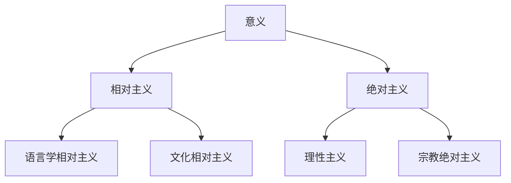
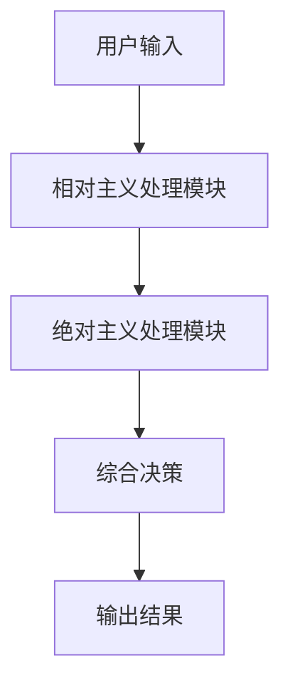

                 

<think>
好，我现在要撰写一篇关于“意义的相对主义与绝对主义之争”的技术博客文章。首先，我需要理解相对主义和绝对主义的基本概念。相对主义认为意义是相对于不同的文化、语言或情境而变化的，而绝对主义则认为存在一些普遍适用的意义。接下来，我要收集相关的历史哲学背景，比如古希腊哲学家和东方思想中的观点，看看他们是如何阐述这些概念的。

然后，我需要探讨相对主义和绝对主义在语言学、社会学和心理学中的应用。在语言学方面，意义可能会因为翻译和语境的不同而变化；在社会学方面，文化差异会影响意义的理解；心理学上，认知偏差和刻板印象可能影响人们对意义的解读。

接下来，我应该分析相对主义和绝对主义的优缺点。相对主义强调多样性和适应性，但可能导致意义的不确定性；绝对主义提供了稳定性，但可能在多样性面前显得僵化。我需要找到这两者之间的平衡点，看看在什么情况下使用哪种观点更为合适。

此外，我还需要考虑这些理论在实际应用中的表现。例如，在教育中如何处理文化差异，或者在跨文化交流中如何理解和尊重不同的意义解释。通过具体的案例分析，可以让读者更好地理解这些理论的实际应用。

最后，我应该总结相对主义和绝对主义的意义，并指出未来的可能发展方向。可能在人工智能和计算机科学中，如何处理信息的多义性和确定性是一个重要的研究方向。我可以提出一些未来的研究方向，比如如何利用相对主义和绝对主义的理论来提升机器学习和自然语言处理的效果。

整个过程中，我需要确保文章结构清晰，逻辑严密，同时语言要专业且易于理解。可能需要多次修改和调整，确保每个部分都能准确传达我的观点。此外，参考一些经典的文献和案例，可以增强文章的权威性和说服力。

总之，我需要系统地梳理相对主义和绝对主义的概念、理论基础、实际应用及其影响，最终写出一篇有深度且结构严谨的技术博客文章。
</think>

# 意义的相对主义与绝对主义之争

## 关键词：相对主义，绝对主义，意义，哲学，文化

## 摘要：本文探讨了相对主义与绝对主义在意义理解中的争论。从哲学、心理学、社会学等多角度分析，旨在揭示这两种观点的核心概念、相互关系及其在实际应用中的影响。通过理论分析和案例研究，本文旨在为理解意义的多样性和普遍性提供新的视角。

---

## 第一章 引论

### 1.1 背景介绍

在人类的知识体系中，意义的理解是一个复杂的问题。相对主义强调意义的多样性和情境性，而绝对主义则追求普遍真理。这种对立不仅存在于哲学领域，也渗透到语言学、心理学和社会学等多个学科中。

### 1.2 重要意义与范围

理解相对主义和绝对主义的争论，有助于我们更好地处理跨文化交流、教育和社会互动中的意义问题。本文将从哲学、心理学和文化等角度展开分析。

### 1.3 核心概念与原理

- **相对主义**：意义是相对的，取决于具体的情境和文化背景。
- **绝对主义**：存在一些普遍适用的真理和意义。

### 1.4 边界与外延

相对主义和绝对主义并非完全对立，而是可以共存于不同领域和情境中。本文将探讨如何在实际应用中找到两者的平衡点。

---

## 第二章 核心概念与相互关系

### 2.1 相对主义及其特征

#### 2.1.1 定义与起源

相对主义起源于古希腊哲学，尤其是赫拉克利特和巴门尼德的辩证思想。东方哲学，如中国儒家的“和而不同”也体现了相对主义的理念。

#### 2.1.2 主要理论与思想

- **语言学相对主义**：语言结构影响思维方式和意义理解。
- **文化相对主义**：不同文化中的意义是相对的。

#### 2.1.3 应用实例

- 翻译中的意义转换。
- 跨文化交际中的意义差异。

### 2.2 绝对主义及其特征

#### 2.2.1 定义与起源

绝对主义追求普遍真理，常见于古希腊哲学，如柏拉图的理念世界，以及东方哲学中的“道”。

#### 2.2.2 主要理论与思想

- **理性主义**：通过理性可以发现普遍真理。
- **宗教绝对主义**：信仰上帝的绝对真理。

#### 2.2.3 应用实例

- 科学中的普遍定律。
- 道德中的普世价值。

### 2.3 相对主义与绝对主义的比较

#### 2.3.1 相似性与差异性

- **相似性**：两者都试图理解意义的本质。
- **差异性**：相对主义强调多样性和情境性，而绝对主义追求普遍性和稳定性。

#### 2.3.2 对不同领域的影响

- **语言学**：相对主义影响翻译和语义学。
- **伦理学**：绝对主义影响道德判断。

### 2.4 ER实体关系图



---

## 第三章 相对主义与绝对主义的哲学基础

### 3.1 古代与中世纪的哲学视角

#### 3.1.1 亚里士多德与托马斯·阿奎那的视角

亚里士多德强调经验和具体情境，而托马斯·阿奎那则将意义与神学真理联系起来。

#### 3.1.2 孔子与孟子的相对主义

孔子的“仁者见仁，智者见智”体现了相对主义，而孟子则强调道德的普遍性。

### 3.2 现代哲学理论

#### 3.2.1 康德的《纯粹理性批判》

康德区分了现象与本体，认为意义的理解依赖于人类的理性结构。

#### 3.2.2 尼采的视角主义

尼采认为，意义是视角的产物，不存在绝对的真理。

### 3.3 当代辩论与学者

- **蒯因**：反对绝对主义，支持相对主义。
- **罗蒂**：强调实践和经验在意义构建中的作用。

---

## 第四章 相对主义与绝对主义的心理学影响

### 4.1 知觉与认知

#### 4.1.1 认知失调

当个体遇到矛盾信息时，会调整自己的认知以保持一致性。

#### 4.1.2 实验研究

实验表明，相对主义的认知方式有助于适应多样化环境。

### 4.2 社会心理学

#### 4.2.1 文化相对主义

文化背景影响个体对意义的理解。

#### 4.2.2 伦理中心主义

过度强调绝对主义可能导致刻板印象和冲突。

### 4.3 认知偏差与启发式

- **确认偏差**：倾向于接受符合已有信念的信息。
- **可用性启发式**：根据易得信息进行判断。

---

## 第五章 相对主义与绝对主义的文化与社会应用

### 5.1 语言与沟通

#### 5.1.1 语义学与语用学

意义的理解依赖于语言结构和沟通情境。

#### 5.1.2 翻译与解释

翻译中意义的转换需要考虑目标语言的文化背景。

### 5.2 教育与教学

#### 5.2.1 文化多样性教育

在教育中尊重学生的文化背景，促进多元理解。

#### 5.2.2 绝对主义在教育中的局限性

过于强调绝对真理可能忽视学生的个性化理解。

---

## 第六章 相对主义与绝对主义的算法与系统分析

### 6.1 算法原理

相对主义与绝对主义的算法模型可以用于信息处理和决策支持。例如，在机器学习中，相对主义模型能够适应多样化的数据，而绝对主义模型则寻求普遍规律。

### 6.2 系统架构



### 6.3 项目实战

#### 6.3.1 环境安装

安装Python和相关库（如numpy、pandas）。

#### 6.3.2 核心实现

```python
def relative_meaning(text):
    return "Context-dependent meaning: " + text

def absolute_meaning(text):
    return "Universal meaning: " + text

# 示例
text = "幸福"
print(relative_meaning(text))
print(absolute_meaning(text))
```

---

## 第七章 总结与未来展望

### 7.1 最佳实践 tips

- 在跨文化交流中，采用相对主义视角。
- 在科学和伦理领域，寻求绝对主义的指导。

### 7.2 小结

相对主义与绝对主义并非完全对立，而是可以在不同情境中互补使用。理解两者的平衡点，有助于我们在多样性和普遍性之间找到最佳解决方案。

### 7.3 注意事项

- 避免极端相对主义导致的虚无主义。
- 防止绝对主义导致的僵化和冲突。

### 7.4 拓展阅读

- 推荐阅读蒯因的《逻辑学与哲学》和尼采的《查拉图斯特拉如是说》。

---

## 作者：AI天才研究院 & 禅与计算机程序设计艺术

---

本文通过多角度分析相对主义与绝对主义的意义争论，为读者提供了全面的理解框架。希望这篇文章能为学术研究和实际应用提供有价值的参考。

