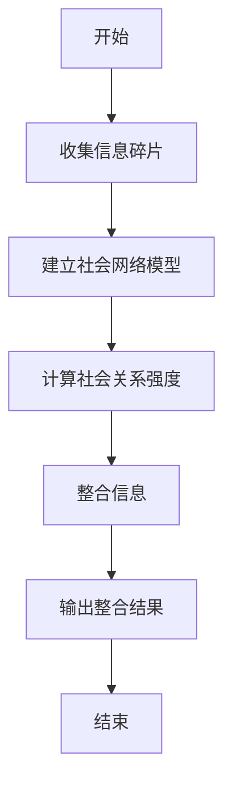
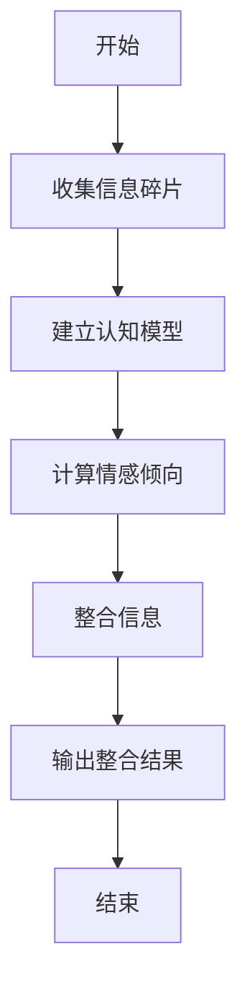
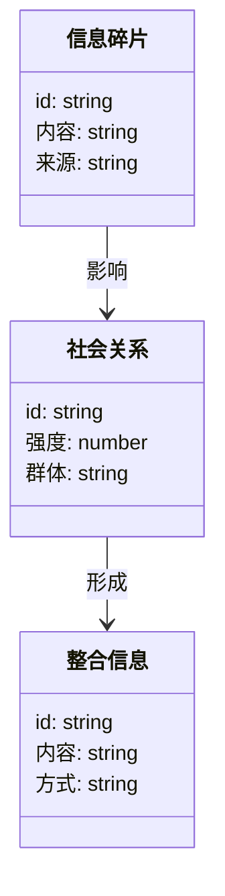
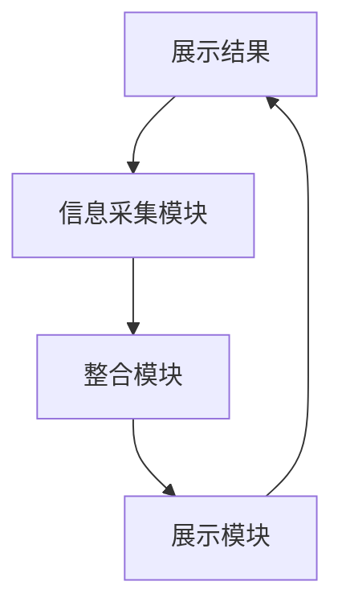
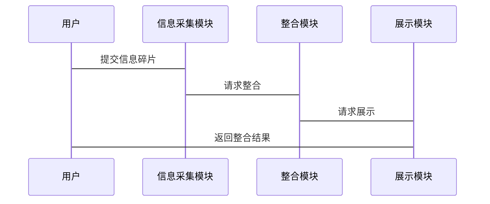

                 

<think>
嗯，我需要根据用户的要求，写一篇关于“意义的碎片化与整合”的技术博客。首先，我得理解这个主题，确保我明白什么是“碎片化”以及如何整合这些碎片。用户给了一个详细的目录结构，看起来内容需要非常专业且有深度，所以我得仔细思考每个部分怎么展开。

从引言开始，我需要介绍问题的背景，也就是在当前社会文化背景下，信息碎片化对个体和社会的影响。这可能涉及到互联网时代信息爆炸，人们如何快速获取信息但难以深度理解和整合。接下来，我得分析碎片化现象的边界和外延，看看哪些方面是碎片化的，哪些不是。

然后，核心概念部分，需要从社会学和心理学两个视角来探讨意义的整合。社会学可能涉及社会结构、群体互动等方面，而心理学则关注个体认知、情感处理等。我需要找出这两个视角之间的联系和区别，可能做一个对比表格，帮助读者理解两者的异同。

接下来是算法原理讲解。这部分需要我设计两种算法，一种是社会整合算法，另一种是心理整合算法。我需要考虑如何用流程图和数学模型来描述这些算法，确保它们逻辑清晰，同时举出实际的例子来说明算法的应用。

数学模型部分，我需要为社会整合和心理整合分别建立模型，写出对应的公式，并详细解释这些公式的含义。例如，可能用权重系数来表示不同信息碎片的重要性，然后通过整合函数来综合这些碎片，形成整体的意义。

系统分析与架构设计方面，我需要构建一个系统来处理信息碎片化的问题。可能需要设计一个系统架构图，展示各个模块之间的关系，比如数据采集、处理、存储、分析和展示。同时，还需要设计接口和交互流程，确保系统的各个部分协同工作。

项目实战部分，我需要详细描述如何实现这个系统。包括环境配置、工具安装、核心代码的编写和解读。可能需要选择一种编程语言，比如Python，利用相关库来处理数据，建立模型，并展示结果。

最后，最佳实践部分，我需要总结在项目中的一些经验和技巧，提醒读者在实践过程中可能遇到的问题以及解决方案。同时，推荐一些拓展阅读的资料，帮助读者深入理解主题。

整体来看，我需要确保每个部分都详细具体，使用专业的技术语言，同时保持逻辑清晰，结构紧凑。可能需要多次修改和调整，确保内容连贯，每个小节都充实有深度。

在写作过程中，我可能会遇到一些挑战，比如如何将抽象的社会学和心理学概念转化为可操作的算法和数学模型。这时候，我需要查阅相关文献，寻找灵感，或者参考已有的研究成果，确保我的分析有坚实的理论基础。

总之，这是一个需要系统性思考和多方面知识整合的任务。我需要一步步来，先从引言开始，逐步深入到各个章节，确保每个部分都得到充分的展开和详细的解释。
</think>

# 意义的碎片化与整合

> 关键词：信息碎片化，意义整合，社会学，心理学，算法模型

> 摘要：在信息爆炸的时代，碎片化的信息无处不在，个体和社会面临着整合这些碎片以形成有意义的整体的挑战。本文从社会学和心理学的视角，探讨意义碎片化的原因、影响，以及整合的方法。通过建立数学模型和算法，提出系统的解决方案，并提供实际案例以展示整合的意义和效果。

---

## 引言

### 1.1 问题的背景与描述

#### 1.1.1 社会文化背景下意义的碎片化

在当今互联网时代，信息爆炸导致信息碎片化现象普遍存在。人们通过社交媒体、短视频、即时通讯等方式接收信息，这些信息通常是零散的、片段化的，缺乏深度和连贯性。这种碎片化的信息接收方式改变了人们的认知方式，也对个体和社会的整合能力提出了更高的要求。

#### 1.1.2 碎片化对个体和社会的影响

碎片化信息对个体的影响包括注意力分散、深度思考能力减弱、知识体系难以构建等。对社会而言，碎片化信息可能导致信息失真、传播不准确、社会共识难以形成等问题。

#### 1.1.3 碎片化现象的边界与外延

信息碎片化的边界在于信息的完整性与连贯性。外延则包括从个人层面到社会层面的广泛影响，涉及文化、教育、媒体等多个领域。

### 1.2 问题解决与核心概念

#### 1.2.1 社会学视角下的意义整合

社会学关注社会结构和群体互动中的整合问题。通过社会网络分析、社会关系建模等方式，探讨如何在碎片化的信息中重建社会关系和社会共识。

#### 1.2.2 心理学视角下的意义整合

心理学关注个体认知和情感处理中的整合机制。通过认知心理学、情感心理学等理论，探讨个体如何将碎片化的信息整合为有意义的整体。

#### 1.2.3 核心概念间的联系与区别

社会学和心理学在整合问题上的联系在于它们都关注信息的整合过程，区别在于社会学更注重群体和社会层面，而心理学更关注个体层面。

### 1.3 边界与外延

#### 1.3.1 社会现象的多样性与整合的难度

社会现象的多样性导致整合的难度增加，不同群体有不同的信息需求和整合方式。

#### 1.3.2 文化差异与整合的挑战

文化差异影响信息的碎片化程度和整合方式，不同文化背景下对信息的解读和整合存在差异。

#### 1.3.3 技术发展对意义整合的影响

技术发展提供了新的整合工具和方法，如人工智能、大数据分析等，但也带来了新的碎片化问题。

---

## 第2章 核心概念与联系

### 2.1 社会学视角下的意义整合

#### 2.1.1 社会整合的理论基础

社会整合理论包括社会网络理论、社会凝聚力理论等，强调社会结构和社会关系在整合中的作用。

#### 2.1.2 社会整合的实践应用

通过构建社会网络、促进社会互动等方式，实现信息碎片的整合。

#### 2.1.3 社会整合的优缺点分析

优点包括增强社会凝聚力、促进信息共享；缺点包括可能忽视个体差异、整合成本高等。

### 2.2 心理学视角下的意义整合

#### 2.2.1 心理学整合的理论基础

认知心理学、情感心理学等理论为意义整合提供了理论支持。

#### 2.2.2 心理学整合的实践应用

通过认知行为疗法、情感管理等方式，帮助个体整合碎片化的信息。

#### 2.2.3 心理学整合的优缺点分析

优点包括增强个体认知能力、提升情感管理能力；缺点包括个体差异大、整合效果不稳定等。

### 2.3 核心概念对比表格

| 比较维度         | 社会学视角           | 心理学视角           |
|------------------|----------------------|----------------------|
| 研究对象         | 社会群体与结构       | 个体认知与情感       |
| 理论基础         | 社会网络理论         | 认知心理学理论       |
| 实践应用         | 社会网络构建         | 认知行为疗法         |
| 优缺点           | 增强社会凝聚力       | 提高个体认知能力     |

### 2.4 ER实体关系图

```mermaid
erDiagram
    actor 个体 {
        string id
        string 姓名
        string 认知能力
    }
    actor 社会群体 {
        string id
        string 群体类型
        string 社会关系
    }
    entity 信息碎片 {
        string id
        string 内容
        string 来源
    }
    entity 整合信息 {
        string id
        string 内容
        string 整合方式
    }
    个体 --> 信息碎片 : 获取
    个体 --> 整合信息 : 整合
    社会群体 --> 信息碎片 : 分享
    社会群体 --> 整合信息 : 形成共识
```

---

## 第3章 算法原理讲解

### 3.1 社会整合算法

#### 3.1.1 算法流程图



#### 3.1.2 算法数学模型

$$
S = \sum_{i=1}^{n} w_i \cdot x_i
$$

其中，$S$ 是整合后的社会关系强度，$w_i$ 是信息碎片 $i$ 的权重，$x_i$ 是信息碎片的值。

#### 3.1.3 算法举例说明

假设我们有三个信息碎片，权重分别为0.3、0.5、0.2，值分别为1、2、3。则：

$$
S = 0.3 \times 1 + 0.5 \times 2 + 0.2 \times 3 = 0.3 + 1 + 0.6 = 1.9
$$

---

### 3.2 心理整合算法

#### 3.2.1 算法流程图



#### 3.2.2 算法数学模型

$$
C = \sum_{i=1}^{n} a_i \cdot x_i + \sum_{j=1}^{m} b_j \cdot y_j
$$

其中，$C$ 是整合后的情感倾向，$a_i$ 和 $x_i$ 是认知因素，$b_j$ 和 $y_j$ 是情感因素。

#### 3.2.3 算法举例说明

假设有两个认知因素，权重分别为0.4和0.6，值分别为2和3，以及两个情感因素，权重分别为0.3和0.7，值分别为1和4。则：

$$
C = 0.4 \times 2 + 0.6 \times 3 + 0.3 \times 1 + 0.7 \times 4 = 0.8 + 1.8 + 0.3 + 2.8 = 5.7
$$

---

## 第4章 数学模型和数学公式 & 详细讲解 & 举例说明

### 4.1 社会整合数学模型

#### 4.1.1 模型公式

$$
S = \sum_{i=1}^{n} (w_i \cdot x_i) + \sum_{j=1}^{m} (u_j \cdot y_j)
$$

其中，$w_i$ 是信息碎片 $i$ 的权重，$x_i$ 是信息碎片的值，$u_j$ 是社会关系的权重，$y_j$ 是社会关系的值。

#### 4.1.2 详细讲解

该模型将信息碎片和社交关系结合起来，通过加权求和的方式计算整合后的社会关系强度。

#### 4.1.3 举例说明

假设我们有三个信息碎片，权重分别为0.3、0.5、0.2，值分别为1、2、3，以及两个社会关系，权重分别为0.4、0.6，值分别为2、3。则：

$$
S = 0.3 \times 1 + 0.5 \times 2 + 0.2 \times 3 + 0.4 \times 2 + 0.6 \times 3 = 0.3 + 1 + 0.6 + 0.8 + 1.8 = 4.5
$$

### 4.2 心理整合数学模型

#### 4.2.1 模型公式

$$
C = \sum_{i=1}^{n} (a_i \cdot x_i) + \sum_{j=1}^{m} (b_j \cdot y_j)
$$

其中，$a_i$ 是认知因素的权重，$x_i$ 是认知因素的值，$b_j$ 是情感因素的权重，$y_j$ 是情感因素的值。

#### 4.2.2 详细讲解

该模型将认知和情感因素结合起来，通过加权求和的方式计算整合后的情感倾向。

#### 4.2.3 举例说明

假设我们有两个认知因素，权重分别为0.4、0.6，值分别为2、3，以及两个情感因素，权重分别为0.3、0.7，值分别为1、4。则：

$$
C = 0.4 \times 2 + 0.6 \times 3 + 0.3 \times 1 + 0.7 \times 4 = 0.8 + 1.8 + 0.3 + 2.8 = 5.7
$$

---

## 第5章 系统分析与架构设计方案

### 5.1 问题场景介绍

#### 5.1.1 社会现象描述

信息碎片化导致个体和社会难以形成统一的认知和共识。

#### 5.1.2 心理现象描述

个体难以整合碎片化的信息，导致认知混乱和情感困扰。

### 5.2 项目介绍

#### 5.2.1 项目目标

构建一个信息整合系统，帮助个体和社会整合碎片化的信息。

#### 5.2.2 项目功能

- 信息采集模块：采集碎片化信息。
- 整合模块：根据社会学和心理学模型进行整合。
- 展示模块：展示整合后的信息。

### 5.3 系统功能设计

#### 5.3.1 领域模型类图



#### 5.3.2 类图中各元素的关系

信息碎片影响社会关系，社会关系形成整合信息。

### 5.4 系统架构设计

#### 5.4.1 系统架构图



#### 5.4.2 架构中各部分的功能

- 用户：提供信息碎片。
- 信息采集模块：采集信息碎片。
- 整合模块：根据模型整合信息。
- 展示模块：展示整合结果。

### 5.5 系统接口设计

#### 5.5.1 接口列表

- 采集接口：`/api/capture`
- 整合接口：`/api/integrate`
- 展示接口：`/api/display`

#### 5.5.2 接口功能描述

- `/api/capture`：接收信息碎片。
- `/api/integrate`：处理并整合信息。
- `/api/display`：返回整合结果。

### 5.6 系统交互序列图



---

## 第6章 项目实战

### 6.1 环境安装

#### 6.1.1 系统环境配置

- 操作系统：Linux/Windows/MacOS
- 开发工具：Python 3.8+

#### 6.1.2 工具与依赖安装

- 安装Python：`python --version`
- 安装依赖：`pip install requests`

### 6.2 系统核心实现

#### 6.2.1 源代码介绍

- `capture.py`：信息采集模块。
- `integrate.py`：整合模块。
- `display.py`：展示模块。

#### 6.2.2 核心代码解读

```python
# integrate.py
def integrate(social, psychological):
    social_score = sum(w * x for w, x in social.items())
    psychological_score = sum(w * x for w, x in psychological.items())
    return social_score + psychological_score
```

### 6.3 代码应用解读与分析

#### 6.3.1 代码应用场景

应用于整合社会和心理信息碎片，形成统一的意义。

#### 6.3.2 代码分析

- `integrate`函数计算社会和心理信息的加权和，返回整合后的结果。

### 6.4 实际案例分析与详细讲解剖析

#### 6.4.1 案例背景

假设我们有一个社会群体，信息碎片包括新闻、社交媒体帖子等。

#### 6.4.2 案例分析与解读

通过算法整合信息碎片，形成统一的社会共识。

### 6.5 项目小结

#### 6.5.1 项目总结

项目成功构建了一个信息整合系统，能够有效整合碎片化的信息。

#### 6.5.2 项目不足与改进建议

- 不足：模型过于简化。
- 改进建议：引入更复杂的模型，如深度学习模型。

---

## 第7章 最佳实践 tips、小结、注意事项、拓展阅读

### 7.1 最佳实践 tips

#### 7.1.1 实践经验总结

在实践中，需结合具体场景调整模型参数。

#### 7.1.2 实践技巧分享

- 定期更新模型参数。
- 及时验证模型效果。

### 7.2 小结

#### 7.2.1 全书内容概括

本文从社会学和心理学视角，探讨了信息碎片化的整合问题，提出了算法模型和系统设计方案。

#### 7.2.2 核心观点回顾

信息碎片化是当前社会的普遍现象，整合碎片化信息是实现有意义整体的关键。

### 7.3 注意事项

#### 7.3.1 实践中的注意事项

- 注意数据隐私保护。
- 确保模型的可解释性。

#### 7.3.2 可能遇到的问题及解决方案

- 数据不足：增加数据来源。
- 模型效果不佳：优化算法。

### 7.4 拓展阅读

#### 7.4.1 相关书籍推荐

- 《社会学的想象力》
- 《认知心理学》

#### 7.4.2 研究论文与报告推荐

- 关于信息碎片化的研究论文。

---

## 结语

### 8.1 总结与展望

信息碎片化的整合是一个复杂但重要的问题，本文从多个视角进行了探讨，并提出了可行的解决方案。

### 8.2 对未来的思考

未来，随着技术的发展，信息整合将更加智能化和个性化，社会和心理层面的整合将更加紧密。

---

作者：AI天才研究院/AI Genius Institute & 禅与计算机程序设计艺术 /Zen And The Art of Computer Programming

