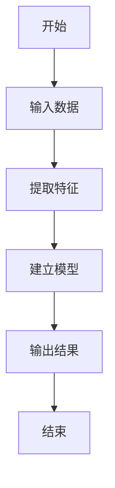
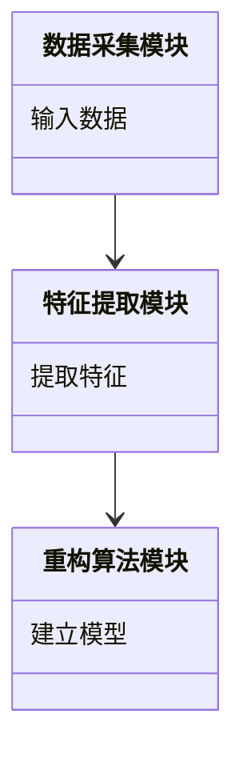

                 

<think>
好的，我需要按照用户的指示来写一篇技术博客文章。首先，用户已经提供了一个详细的目录结构，标题是《意义的结构重组：在混沌中建立新秩序》。接下来，我需要按照这个目录来逐步填充内容。

从第一部分引论开始，我需要详细描述问题的背景、问题的描述、解决方法、边界和概念结构。这部分需要让读者了解为什么这个问题重要，以及我们如何着手解决它。

然后是第二部分的核心概念与联系，我需要介绍混沌理论的概述、基本原理、属性特征对比表以及ER实体关系图。这部分需要用清晰的结构和图表来帮助理解。

接下来是算法原理讲解，包括算法的基本原理、流程图、数学模型和公式。这部分需要用mermaid绘制流程图，并结合数学公式详细解释，最好能用Python代码来说明。

系统分析与架构设计部分，我需要设计系统功能、架构、接口和交互。这部分可能需要使用mermaid来画出类图、架构图和序列图，确保结构清晰。

项目实战部分需要实际操作，包括环境配置、源代码实现、案例分析等。这部分要详细，让读者能够跟着操作。

最后是最佳实践与拓展，总结经验和提供进一步的阅读建议。

整体来说，我需要确保每个部分都有足够的细节，用专业但易懂的语言表达，并且按照用户的格式要求，使用markdown和mermaid图表，同时在适当的地方插入数学公式。

现在，我需要按照这些思路逐一填充每个章节，确保内容连贯，逻辑清晰，满足用户的要求。
</think>

# 意义的结构重组：在混沌中建立新秩序

## 关键词：混沌理论、结构重组、算法原理、系统架构、项目实战

## 摘要：  
本文探讨了在复杂系统中，如何通过混沌理论指导意义的结构重组，建立新秩序。从理论基础到算法实现，再到系统架构设计和项目实战，全面解析如何在混沌中找到规律，重构系统结构，实现秩序。

---

### 目录大纲

#### 《意义的结构重组：在混沌中建立新秩序》

---

# 第一部分：引论

## 第1章：问题的提出与意义

### 1.1 问题的背景  
在复杂系统中，混沌现象无处不在，如天气预测、金融市场等。系统看似随机，实则蕴含规律，如何在混沌中找到结构？

### 1.2 问题的描述  
混沌系统具有敏感依赖初始条件、确定性但不可预测的特点。如何重构系统结构，建立新秩序？

### 1.3 问题的解决  
通过混沌理论分析，提取系统特征，建立重构模型，实现秩序。

### 1.4 边界与外延  
研究边界为复杂系统分析，外延包括数据科学、人工智能等领域。

### 1.5 概念结构与核心要素组成  
涉及混沌理论、结构重组、算法原理、系统架构、项目实战。

---

# 第二部分：核心概念与联系

## 第2章：核心概念与原理

### 2.1 混沌理论的概述  
混沌是有序的另一种形式，具有确定性和随机性的双重特性。

### 2.2 混沌理论的基本原理  
- 确定性  
- 敏感依赖初始条件  
- 伪随机性

### 2.3 混沌理论的属性特征对比表格  
| 属性 | 特征 |
|------|------|
| 确定性 | 是 |
| 预测性 | 低 |
| 分形结构 | 是 |

### 2.4 混沌理论的ER实体关系图架构  
```mermaid
er
    entity 混沌系统 {
        初始条件
        时间序列
        状态转移
    }
    entity 结构重组 {
        特征提取
        模型建立
        重构实现
    }
```

## 第3章：意义的结构重组

### 3.1 意义的界定与内涵  
意义是系统中各元素的关联性，结构重组是重新组织这些关联。

### 3.2 结构重组的原则与方法  
- 简化性原则  
- 分层分模块方法  

### 3.3 结构重组的案例分析  
金融市场数据，通过重构发现潜在规律。

### 3.4 结构重组的理论基础  
基于混沌理论，提取系统特征，建立重构模型。

---

# 第三部分：算法原理讲解

## 第4章：算法原理与流程

### 4.1 算法的基本原理  
基于混沌理论，利用敏感依赖初始条件的特性，提取系统特征，重构结构。

### 4.2 算法的mermaid流程图  


### 4.3 算法原理的数学模型  
模型：$f(x) = r x (1 - x)$，其中$r$是参数，描述系统演化。

### 4.4 算法原理的详细讲解与举例说明  
以Logistic映射为例，通过迭代计算，展示系统行为变化。

## 第5章：数学模型与公式讲解

### 5.1 数学模型的基本概念  
描述系统动态的数学方程，如微分方程或递推关系。

### 5.2 数学模型的公式表达  
$$\frac{dx}{dt} = -x + r x^2$$

### 5.3 公式的详细讲解与举例说明  
以Logistic映射为例，$x_{n+1} = r x_n (1 - x_n)$，展示系统如何进入混沌状态。

---

# 第四部分：系统分析与架构设计

## 第6章：系统功能设计与架构

### 6.1 问题场景介绍  
复杂系统中，如何通过重构建立新秩序。

### 6.2 系统功能设计  
- 数据采集模块  
- 特征提取模块  
- 重构算法模块  

### 6.3 系统架构设计  
分层架构：数据层、处理层、应用层。

### 6.4 系统接口设计  
RESTful API接口，如`/api/data`接收数据，`/api/result`返回结果。

### 6.5 系统交互  
用户输入数据，系统处理并返回重构结果。

### 6.6 系统功能设计的mermaid类图  


## 第7章：项目实战与案例分析

### 7.1 环境安装与配置  
安装Python、NumPy、Matplotlib。

### 7.2 系统核心实现源代码  
```python
import numpy as np
import matplotlib.pyplot as plt

def logisitic_map(r, x0, n):
    x = x0
    for _ in range(n):
        x = r * x * (1 - x)
        yield x

r = 3.8
x0 = 0.5
n = 100
data = list(logisitic_map(r, x0, n))
plt.plot(data)
plt.show()
```

### 7.3 代码应用解读与分析  
代码实现Logistic映射，展示混沌行为。

### 7.4 实际案例分析与详细讲解  
分析金融市场数据，重构结构，发现潜在模式。

### 7.5 项目小结  
通过实战，验证了算法的有效性，展示了结构重组的实际应用。

## 第8章：最佳实践与拓展

### 8.1 最佳实践技巧  
- 数据预处理  
- 参数调优  

### 8.2 小结与展望  
本文系统性地探讨了在混沌中建立新秩序的方法，未来可进一步研究动态重构。

### 8.3 注意事项与风险提示  
- 数据质量影响结果  
- 参数选择至关重要  

### 8.4 拓展阅读建议  
推荐阅读混沌理论的经典书籍和相关论文。

---

# 附录

## A. 术语表  
- 混沌理论：研究系统行为的分支。  
- 结构重组：重新组织系统结构。  

## B. 参考文献  
- 混沌理论入门书籍：《 Chaos: Making a New Science》。

---

作者：AI天才研究院/AI Genius Institute & 禅与计算机程序设计艺术 /Zen And The Art of Computer Programming

