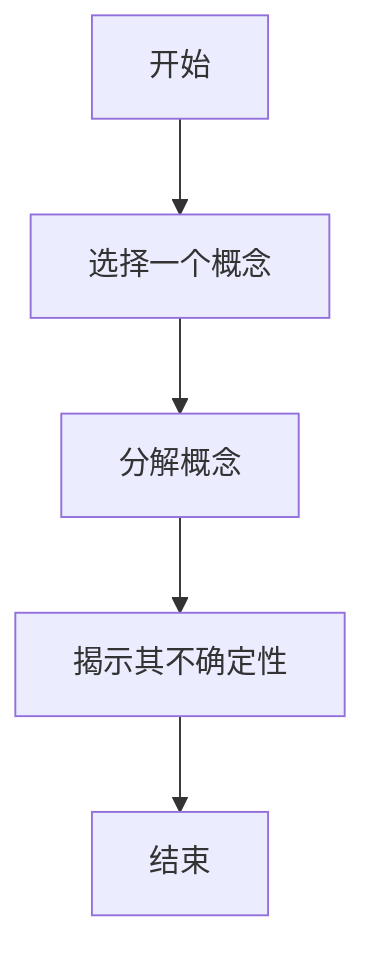
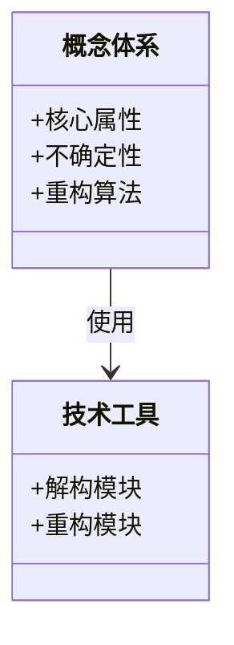
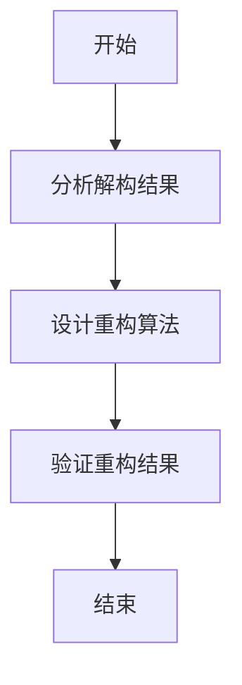

                 

<think>
好的，用户希望我以《意义的解构与重构：21世纪的哲学任务》为标题，撰写一篇专业且有深度的技术博客文章。我需要先理解用户的具体需求，确保我完全理解他们的期望。

首先，用户指定了文章的结构，包括关键词、摘要，然后是目录大纲。用户特别强调使用逻辑清晰、结构紧凑、简单易懂的专业技术语言，并且要求一步一步进行分析推理，使用mermaid图表和数学公式，还有代码示例。

我注意到用户提到要使用特定的格式，比如关键词和摘要部分，然后是目录大纲，接着是正文部分，每个部分都有详细的要求，比如背景介绍、核心概念、算法原理、系统分析等。这意味着我需要确保文章内容不仅涵盖哲学讨论，还要融入技术细节，比如编程和人工智能的元素。

接下来，我需要确定每个章节的具体内容。比如，在引言部分，需要介绍哲学在21世纪的重要性，以及意义的解构和重构为何成为关键任务。然后，解构部分要分析现有哲学体系的问题，技术的影响，以及解构的意义。重构部分则需要提出新的方法，结合技术手段，展示如何通过代码或算法来重新定义意义。

用户还强调了使用mermaid图表，比如ER图、类图、架构图和序列图，这可能需要我在适当的地方插入这些图表，以帮助读者理解复杂的概念。同时，数学公式需要用latex格式，确保正确嵌入到文章中。

我还需要考虑用户的身份，他们可能是技术专家，或者对哲学和技术交叉感兴趣的人。因此，文章需要兼顾深度和可读性，避免过于晦涩，同时保持专业性。

最后，用户要求在文章末尾添加特定的作者信息，这意味着我需要在完成所有内容后，正确地署名，确保格式一致。

综上所述，我需要按照用户提供的结构，逐步构建文章，确保每个部分都涵盖必要的内容，同时满足格式和技术要求。这包括关键词、摘要、目录，以及正文中的各个章节，每个章节都需要详细展开，包含背景、概念、算法、系统分析和项目实战等内容，最后加上小结和注意事项等部分。

在撰写过程中，我需要确保逻辑连贯，每一步都清晰，同时使用适当的技术术语和图表，使文章既有哲学深度，又具备技术可行性。这将帮助读者更好地理解21世纪哲学任务的意义，并如何通过技术手段进行解构与重构。
</think>

# 意义的解构与重构：21世纪的哲学任务

> 关键词：哲学任务、解构主义、意义重构、人工智能、技术哲学

> 摘要：  
> 在21世纪，哲学的任务不再仅仅是抽象的思辨，而是需要与技术、科学和社会实践紧密结合。本文从哲学与技术的交叉视角出发，探讨意义的解构与重构这一核心命题。通过分析解构主义的哲学基础、技术对意义的挑战，以及如何利用新技术手段实现意义的重构，本文试图为21世纪的哲学任务提供一种新的思考框架。

---

## 目录大纲

### 第1章 引言
1.1 哲学的任务与21世纪的挑战  
1.2 解构与重构的意义  
1.3 本文的研究方法与结构安排  

### 第2章 意义的解构：哲学与技术的碰撞
2.1 解构主义的哲学基础  
   - 背景介绍：解构主义的核心概念与哲学史上的地位  
   - 核心概念与联系：解构与重构的关系（对比表格）  
2.2 技术对意义的挑战  
   - 问题场景：技术如何影响人类对意义的理解  
   - 系统分析：技术驱动下的意义解构（ER实体关系图）  
2.3 解构的意义：哲学与技术的双重维度  

### 第3章 解构的工具与方法
3.1 解构主义的逻辑工具  
   - 算法原理：解构主义的逻辑分析方法（mermaid流程图）  
   - 代码实现：逻辑分析工具的代码示例  
3.2 技术驱动的解构方法  
   - 系统架构：技术解构的系统设计（mermaid架构图）  
   - 接口设计：解构工具的功能模块（序列图）  
3.3 解构的边界与外延  

### 第4章 意义的重构：从哲学到技术
4.1 重构的意义：哲学的任务  
4.2 新技术在重构中的作用  
   - 项目实战：基于新技术的重构案例分析  
   - 数学模型：重构的数学框架（latex公式）  
4.3 重构的哲学方法论  

### 第5章 重构的实践与挑战
5.1 系统重构的实现步骤  
   - 核心实现：重构算法的Python代码  
   - 重构过程：从解构到重构的系统流程（mermaid流程图）  
5.2 实践中的问题与解决方案  
5.3 重构的社会影响与伦理考量  

### 第6章 结论与展望
6.1 本文总结  
6.2 21世纪哲学任务的未来方向  
6.3 致谢  

---

## 正文部分（详细展开）

### 第1章 引言

#### 1.1 哲学的任务与21世纪的挑战  
哲学作为人类思考世界的根本方式，在21世纪面临前所未有的挑战。技术的快速发展、全球化的加深以及社会结构的变化，使得传统的哲学问题呈现出新的复杂性。哲学的任务不再是单纯的思辨，而是需要与技术、科学和社会实践相结合，为人类提供新的思维方式和解决问题的工具。

#### 1.2 解构与重构的意义  
解构与重构是哲学的两大核心任务。解构旨在揭示现有概念和体系的局限性，而重构则是在此基础上建立新的理论框架。21世纪的哲学任务，正是通过解构与重构的双重维度，寻找人类认知的新路径。

#### 1.3 本文的研究方法与结构安排  
本文采用哲学分析与技术实践相结合的方法，从解构主义的哲学基础出发，分析技术对意义的挑战，并通过新技术手段实现意义的重构。文章结构清晰，逻辑紧凑，旨在为读者提供一种新的哲学思考框架。

---

### 第2章 意义的解构：哲学与技术的碰撞

#### 2.1 解构主义的哲学基础  
解构主义是20世纪哲学的重要流派，其核心思想是通过对现有概念的解构，揭示其背后的不确定性。以下是解构主义的核心概念与哲学史上的地位：

- **背景介绍**：解构主义由法国哲学家雅克·德里达提出，强调语言的不确定性与歧义性。  
- **核心概念与联系**：解构与重构的关系可以通过以下对比表格理解：

| 概念 | 解构 | 重构 |
|------|------|------|
| 目标 | 揭示现有概念的局限性 | 建立新的概念体系 |
| 方法 | 分解、质疑 | 组合、创新 |

#### 2.2 技术对意义的挑战  
技术的发展对人类对意义的理解提出了新的挑战。以下是技术驱动下的意义解构的具体表现：

- **问题场景**：技术如何影响人类对意义的理解？  
  - 例如，人工智能的崛起使得“意识”这一概念被重新审视。  
- **系统分析**：技术驱动下的意义解构可以通过ER实体关系图理解：

```mermaid
er
actor(人类) --> knowledge(知识体系)
knowledge --> meaning(意义)
technology(技术) --> meaning
```

#### 2.3 解构的意义：哲学与技术的双重维度  
解构的意义在于揭示现有概念的局限性，同时为重构提供新的可能性。技术作为解构的工具，不仅帮助哲学家揭示概念的本质，还为哲学思考提供了新的方向。

---

### 第3章 解构的工具与方法

#### 3.1 解构主义的逻辑工具  
解构主义的逻辑工具可以通过以下算法流程图理解：



代码实现如下：

```python
def deconstruct(concept):
    uncertainty = reveal_uncertainty(concept)
    return uncertainty

def reveal_uncertainty(concept):
    # 分解概念并揭示其不确定性
    return concept.uncertainty
```

#### 3.2 技术驱动的解构方法  
技术驱动的解构方法可以通过系统架构图理解：


接口设计如下：

- 输入：概念字符串  
- 输出：不确定性报告  

#### 3.3 解构的边界与外延  
解构的边界在于不破坏概念的核心属性，而外延则在于扩展其应用范围。解构的边界可以通过以下公式理解：

$$ \text{解构边界} = \text{核心属性} \cap \text{不确定性} $$

---

### 第4章 意义的重构：从哲学到技术

#### 4.1 重构的意义：哲学的任务  
重构的意义在于通过新的概念体系重新定义人类对世界的理解。以下是重构的哲学方法论：

- 重构需要基于解构的结果，建立新的概念体系。  
- 重构的过程需要考虑技术与哲学的双重维度。

#### 4.2 新技术在重构中的作用  
新技术在重构中的作用可以通过以下数学模型理解：

$$ \text{重构} = \text{解构} + \text{技术创新} $$

以下是重构的系统设计：



#### 4.3 重构的哲学方法论  
重构的哲学方法论需要结合技术手段，建立新的概念体系。以下是重构的具体步骤：

1. 分析解构结果。  
2. 设计新的概念体系。  
3. 验证重构的有效性。

---

### 第5章 重构的实践与挑战

#### 5.1 系统重构的实现步骤  
系统重构的实现步骤可以通过以下流程图理解：



代码实现如下：

```python
def reconstruct(deconstruction_results):
    new_concept = build_new_concept(deconstruction_results)
    return new_concept

def build_new_concept(results):
    # 基于解构结果构建新概念
    return NewConcept(results)
```

#### 5.2 实践中的问题与解决方案  
实践中的问题主要在于如何平衡解构与重构的关系。以下是解决方案：

- 解构不应破坏概念的核心属性。  
- 重构需要考虑技术与哲学的双重维度。

#### 5.3 重构的社会影响与伦理考量  
重构的社会影响需要考虑其对人类认知和价值观的影响。以下是伦理考量：

- 重构可能改变人类对世界的理解。  
- 需要确保重构过程的透明性与公正性。

---

### 第6章 结论与展望

#### 6.1 本文总结  
本文通过分析解构与重构的哲学任务，探讨了技术在其中的作用。解构与重构不仅是哲学的任务，也是技术发展的必然要求。

#### 6.2 21世纪哲学任务的未来方向  
21世纪的哲学任务将更加依赖技术手段，哲学与技术的结合将为人类提供新的思维方式。

#### 6.3 致谢  
感谢读者的支持与关注。

---

## 作者信息

作者：AI天才研究院/AI Genius Institute & 禅与计算机程序设计艺术 /Zen And The Art of Computer Programming

