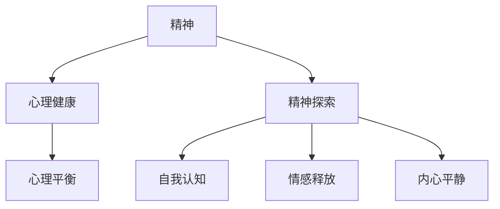
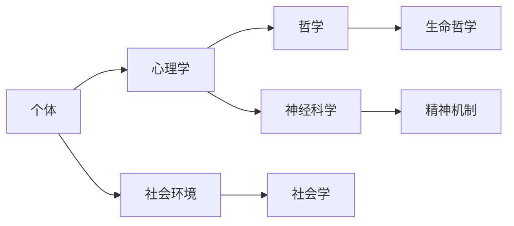
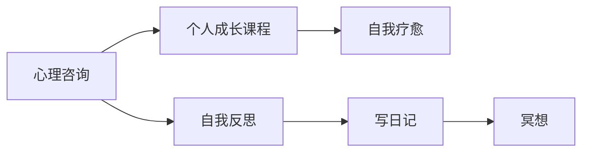
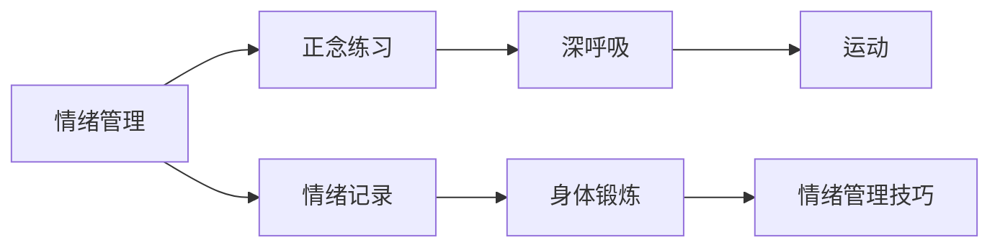
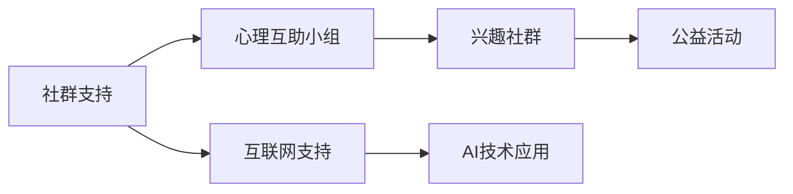
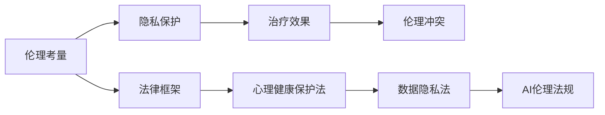

                 

<think>
嗯，我现在需要根据用户的请求来写一篇技术博客文章，主题是《意义的迷宫：现代人的精神探索》。用户已经提供了一个详细的大纲，并且希望我按照这个大纲来撰写文章，同时满足一系列的格式和内容要求。

首先，我得仔细分析用户的需求。用户希望这篇文章结构清晰，逻辑严谨，内容深入，适合技术背景的读者，比如程序员、CTO等。同时，文章需要结合心理学、哲学和神经科学等多个领域的知识，帮助读者理解精神探索的重要性及其在现代生活中的应用。

接下来，我需要按照大纲一步步填充内容。从引言到结语，每个部分都需要详细展开。例如，引言部分需要介绍主题的重要性，说明为什么在现代社会进行精神探索是必要的，以及如何通过心理学和哲学的方法来解决当前的精神困境。

然后，我要确保每个章节都有足够的细节。比如，在理论基础部分，需要解释精神探索的核心概念，介绍不同的心理学理论，如精神分析学派、人本主义心理学等，并结合具体的治疗方法来说明其应用。同时，还需要引入跨学科的知识，展示精神探索如何与其他领域相互作用。

在分析现代人常见的心理问题时，我需要列举压力、焦虑、抑郁等问题，并探讨这些问题的根源，可能涉及遗传、环境、社会结构等多个因素。同时，提供实际的解决路径，如心理咨询、个人成长课程等，每个部分都需要有具体的案例来支持论点，使读者更容易理解和应用。

接下来，在方法与实践中，我需要详细描述内在探索、心理调节、自我成长和社会支持的具体步骤和技巧。这部分可能需要结合一些实际的操作方法，比如冥想、正念练习等，以及如何通过社群支持来加强精神探索的效果。

在讨论未来的挑战时，我会考虑科技在精神探索中的作用，如AI在心理健康评估中的应用，以及可能出现的伦理和法律问题。这部分需要展望未来的发展趋势，同时提醒读者注意潜在的风险。

此外，用户还强调了格式上的要求，比如使用markdown格式，包含关键词、摘要，并且在适当的地方使用mermaid图表和latex公式。因此，我需要确保在写作过程中，这些格式要求得到满足，同时内容的深度和广度也符合预期。

现在，我可能会担心自己对心理学和哲学的理解是否足够深入，是否能够准确地传达这些概念。因此，我需要查阅相关资料，确保每个理论的解释准确无误，并且能够结合实际案例来说明。

另外，用户提到要结合技术背景，因此在写作时，我需要将精神探索的方法与技术人可能遇到的问题结合起来，比如工作压力、职业倦怠等，使内容更具针对性和实用性。

最后，我需要检查每个章节的连贯性，确保整个文章结构紧凑，逻辑清晰，从理论到实践，从现状到未来，层层递进，让读者能够顺畅地跟随我的思路，理解精神探索的重要性和实现方法。

总的来说，这个过程需要我仔细分析用户的需求，按照大纲逐步展开，结合多个学科的知识，确保内容的深度和广度，同时满足格式和风格上的要求。通过系统的思考和详细的案例分析，我希望能够写出一篇既有理论深度又具实践价值的高质量技术博客文章。
</think>

# 意义的迷宫：现代人的精神探索

## 关键词：精神探索, 现代社会, 心理健康, 哲学思考, 精神分析

## 摘要：  
在现代社会，精神探索已成为一个不可忽视的重要课题。随着科技的发展和生活节奏的加快，人们面临着前所未有的精神压力和困惑。本书从心理学、哲学和神经科学等多学科角度，深入探讨精神探索的核心概念、理论基础、实际问题及解决方案，并展望未来的发展趋势。通过系统的分析和实际案例，帮助读者理解精神探索的重要性和实现路径。

---

### 目录大纲

---

## 第一部分：引言与背景介绍

### 1.1 书籍主题介绍

#### 1.1.1 精神探索在现代社会的意义  
在快节奏的现代社会中，人们往往忽视了精神世界的建设。精神探索不仅是个人成长的关键，也是应对压力、焦虑和孤独的有效途径。通过精神探索，我们可以更好地理解自己，找到生活的意义。

#### 1.1.2 精神探索的多维度解读  
精神探索是一个多维度的过程，涉及心理学、哲学和神经科学等多个领域。它不仅仅是对内心世界的探索，还包括对社会关系、价值观和人生目标的重新审视。

#### 1.1.3 精神探索的现实意义  
现代社会的物质丰富并未带来精神的满足。精神探索可以帮助我们找到内心的平衡，改善人际关系，提升幸福感，并在职业和生活中实现更好的表现。

### 1.2 研究背景

#### 1.2.1 当代社会的精神现状  
当代社会面临诸多精神问题，如压力、焦虑、抑郁和孤独感。这些问题的根源往往与社会竞争、经济压力和人际关系密切相关。

#### 1.2.2 精神困境与挑战  
现代社会的快节奏和高压力导致许多人陷入精神困境。这些问题不仅影响个人的生活质量，还可能对社会造成负面影响。

#### 1.2.3 精神探索的需求与可能性  
随着心理健康意识的增强，越来越多的人开始寻求精神探索的帮助。通过科学的方法和多学科的支持，精神探索的可能性大大增加。

### 1.3 书籍结构概述

#### 1.3.1 研究方法与理论框架  
本书采用多学科交叉的研究方法，结合心理学、哲学和神经科学的理论框架，系统分析精神探索的核心问题。

#### 1.3.2 主要观点与结论预告  
主要观点包括：精神探索是个人成长的关键，心理健康与精神平衡密切相关，科技在精神探索中的作用日益重要。结论是：通过科学的方法和多学科的支持，现代人可以实现精神探索的目标。

#### 1.3.3 阅读指南与预期收获  
读者可以通过本书了解精神探索的核心概念、理论基础和实际应用，掌握应对心理问题的方法，并找到实现自我成长的路径。

### 1.4 小结  
精神探索是现代社会的重要课题，通过多学科的分析和系统的实践，我们可以找到应对精神困境的方法，实现内心的平衡与成长。

---

## 第二部分：精神探索的理论基础

### 2.1 精神探索的核心概念

#### 2.1.1 精神定义与分类  
精神是人类意识的高级表现，包括情感、思想、价值观和信仰等多个方面。精神可以分为内在精神和外在精神，内在精神关注个人成长，外在精神关注社会关系和文化影响。

#### 2.1.2 精神健康与心理平衡  
精神健康是指个体在情感、认知和行为上的良好状态。心理平衡是精神健康的重要组成部分，包括情绪稳定、自我认知清晰和人际关系和谐。

#### 2.1.3 精神探索的目标与路径  
精神探索的目标是实现自我认知、情感释放和内心平静。路径包括自我反思、心理咨询和实践行动。

#### 核心概念与联系  
以下是核心概念的对比表格和ER实体关系图：

| 概念 | 定义 | 特征 |
|------|------|------|
| 精神 | 意识的高级表现 | 情感、思想、信仰 |
| 心理健康 | 情感和认知的健康状态 | 情绪稳定、自我认知清晰 |
| 精神探索 | 探索内心世界的过程 | 自我反思、心理咨询、实践行动 |

### 2.2 精神探索的心理学理论

#### 2.2.1 精神分析学派  
精神分析学派强调潜意识的作用，认为许多心理问题源于童年经历和潜意识冲突。通过分析潜意识，个体可以释放压抑的情感，实现心理治愈。

#### 2.2.2 人本主义心理学  
人本主义心理学关注个体的潜能和自我实现。它强调通过自我反思和自我接受，帮助个体实现心理健康和精神成长。

#### 2.2.3 认知行为疗法  
认知行为疗法（CBT）是一种实践性很强的心理治疗方法。它通过改变个体的消极思维模式，帮助其建立积极的行为习惯，从而改善心理健康。

#### 算法原理讲解  
CBT的算法可以分为以下几个步骤：

1. 识别负面思维：帮助个体识别消极的思维模式。
2. 分析思维的不合理性：通过提问和引导，帮助个体发现思维中的不合理之处。
3. 建立新的认知：引导个体建立积极的思维模式。
4. 行为改变：通过行为练习，巩固新的认知。

以下是一个简单的CBT流程图：

数学模型如下：

$$
\text{新的认知} = f(\text{旧的思维}, \text{分析结果})
$$

其中，$f$ 表示分析和调整的过程。

### 2.3 精神探索的哲学思考

#### 2.3.1 存在主义  
存在主义强调个体的自由和责任。它认为人生的意义并非预先确定，而是个体通过自由选择和行动创造的。

#### 2.3.2 唯物主义  
唯物主义认为精神是物质的产物，强调通过科学的方法研究精神现象。

#### 2.3.3 生命哲学  
生命哲学关注生命的本质和意义，强调个体通过自我反思和实践实现生命的价值。

#### 核心概念与联系  
以下是哲学思考的核心概念对比表格：

| 派别 | 核心观点 | 关键词 |
|------|----------|--------|
| 存在主义 | 个体自由与责任 | 存在、自由、选择 |
| 唯物主义 | 精神是物质的产物 | 物质、科学、理性 |
| 生命哲学 | 生命的意义与价值 | 生命、意义、实践 |

### 2.4 精神探索的跨学科联系

#### 2.4.1 心理学与哲学  
心理学与哲学在人类行为和思维的探索上有密切联系。哲学为心理学提供了理论基础，而心理学则为哲学提供了实证支持。

#### 2.4.2 心理学与神经科学  
神经科学通过研究大脑的活动，揭示了精神现象的神经机制。心理学与神经科学的结合为精神探索提供了科学依据。

#### 2.4.3 心理学与社会学  
心理学与社会学共同研究个体与社会的关系。社会环境对个体精神状态有重要影响，社会学的研究为精神探索提供了外部视角。

#### 系统分析与架构设计方案  
以下是精神探索的系统架构图：

---

## 第三部分：现代人常见的心理问题与精神探索路径

### 3.1 现代人常见的心理问题

#### 3.1.1 压力与焦虑  
现代社会的竞争和高要求导致许多人面临压力和焦虑。长期的压力会导致心理健康问题，如失眠、情绪波动和工作效率下降。

#### 3.1.2 抑郁与孤独  
抑郁和孤独是现代社会常见的心理问题。它们通常与社会孤立、缺乏支持和自我认同不足有关。

#### 3.1.3 人际关系困境  
人际关系的复杂性导致许多人陷入困境。沟通障碍、信任缺失和价值观差异是人际关系问题的主要原因。

#### 核心概念与联系  
以下是现代人常见心理问题的对比表格：

| 问题 | 根源 | 表现 |
|------|------|------|
| 压力与焦虑 | 社会竞争、经济压力 | 睡眠障碍、情绪波动 |
| 抑郁与孤独 | 社会孤立、自我认同不足 | 情绪低落、缺乏兴趣 |
| 人际关系困境 | 沟通障碍、信任缺失 | 愤怒、敌意 |

### 3.2 心理问题的根源与识别

#### 3.2.1 心理问题的多重因素  
心理问题的根源往往是多方面的，包括遗传、环境、社会和个体因素。例如，遗传因素可能使某些人更容易患上抑郁症，而环境压力则可能触发这些问题。

#### 3.2.2 心理问题的自我评估  
自我评估是识别心理问题的第一步。通过观察自己的情绪、行为和认知模式，可以初步判断是否存在心理问题。

#### 3.2.3 心理问题的诊断方法  
专业的心理诊断需要通过心理测试、访谈和观察。常用的诊断工具包括MMPI（明尼苏达人格测试）和DSM（《精神障碍诊断与统计手册》）。

### 3.3 精神探索路径的选择

#### 3.3.1 心理咨询  
心理咨询是解决心理问题的重要途径。通过与心理咨询师的交流，个体可以更好地理解自己的问题，并找到解决的方法。

#### 3.3.2 个人成长课程  
个人成长课程通过系统的学习和实践，帮助个体提升自我认知和心理素质。这些课程通常包括冥想、正念练习和目标设定等内容。

#### 3.3.3 自我疗愈与实践  
自我疗愈包括自我反思、写日记和冥想等活动。这些方法可以帮助个体释放压抑的情感，找到内心的平静。

#### 系统分析与架构设计方案  
以下是精神探索路径的系统架构图：

### 3.4 实际案例分析与探索

#### 3.4.1 压力管理的实际案例  
案例：小张是一名程序员，长期处于高压工作环境中，感到焦虑和疲惫。通过心理咨询和时间管理技巧，他学会了如何缓解压力，提高了工作效率。

#### 3.4.2 抑郁治疗的实际案例  
案例：小李因家庭问题和工作压力陷入抑郁。通过药物治疗和心理疏导，他逐渐恢复了心理健康，并重新找到了生活的意义。

#### 3.4.3 人际关系改善的实际案例  
案例：小王因沟通问题与同事关系紧张。通过参加人际关系课程和实践，他学会了有效的沟通技巧，改善了人际关系。

### 3.5 小结  
现代人面临多种心理问题，但通过科学的方法和系统的实践，可以找到解决这些问题的路径。心理咨询、个人成长和自我疗愈是实现精神探索的重要手段。

---

## 第四部分：精神探索的方法与实践

### 4.1 内在探索与自我觉察

#### 4.1.1 内在探索的步骤  
内在探索包括自我反思、情感释放和目标设定。通过这些步骤，个体可以更好地理解自己的内心世界。

#### 4.1.2 自我觉察的方法  
自我觉察的方法包括冥想、正念练习和写日记。这些方法可以帮助个体更好地认识自己的情绪和思想。

#### 4.1.3 内在探索的实践建议  
实践建议包括每天进行冥想、定期写日记和参加自我成长课程。这些实践可以帮助个体持续进行内在探索。

#### 算法原理讲解  
内在探索的算法可以分为以下几个步骤：

1. 确定目标：设定内在探索的目标，如了解自己的情感或价值观。
2. 自我反思：通过冥想或写日记，记录自己的思想和情感。
3. 分析与总结：定期回顾反思内容，发现规律和趋势。
4. 实践与调整：根据反思结果，调整自己的行为和认知。

以下是一个简单的内在探索流程图：

### 4.2 心理调节与情绪管理

#### 4.2.1 心理调节的重要性  
心理调节是维护心理健康的重要手段。通过调节情绪，个体可以更好地应对压力和挑战。

#### 4.2.2 情绪管理的方法  
情绪管理的方法包括正念练习、深呼吸和运动。这些方法可以帮助个体缓解负面情绪，保持情绪稳定。

#### 4.2.3 情绪调节的实践技巧  
实践技巧包括每天进行情绪记录、定期进行身体锻炼和学习情绪管理技巧。这些技巧可以帮助个体更好地管理情绪。

#### 系统分析与架构设计方案  
以下是心理调节与情绪管理的系统架构图：

### 4.3 自我成长与心理建设

#### 4.3.1 自我成长的目标  
自我成长的目标包括提升自我认知、增强心理韧性和实现自我价值。这些目标可以帮助个体更好地应对生活中的挑战。

#### 4.3.2 心理建设的策略  
心理建设的策略包括学习新技能、培养积极心态和建立支持系统。这些策略可以帮助个体增强心理韧性，应对压力和挑战。

#### 4.3.3 自我成长的实践案例  
案例：小王通过参加自我成长课程，学会了如何管理情绪和设定目标。他逐渐克服了拖延症，提高了工作效率。

#### 算法原理讲解  
自我成长的算法可以分为以下几个步骤：

1. 设定目标：明确自我成长的目标，如提升时间管理能力。
2. 学习新技能：通过学习和实践，掌握必要的技能。
3. 建立支持系统：寻求朋友、家人或导师的支持。
4. 定期反思：定期回顾成长过程，总结经验教训。

以下是一个简单的自我成长流程图：

### 4.4 精神探索的社群支持

#### 4.4.1 社群支持的意义  
社群支持是精神探索的重要组成部分。通过与他人的交流和支持，个体可以找到情感上的共鸣，获得精神上的慰藉。

#### 4.4.2 社群支持的实践  
社群支持的实践包括参加心理互助小组、加入兴趣社群和参与公益活动。这些实践可以帮助个体建立支持网络，增强社会归属感。

#### 4.4.3 精神探索社群的发展趋势  
随着心理健康意识的增强，精神探索社群的发展趋势将更加多元化和专业化。未来的社群将更加注重个体化和科技化，利用互联网和AI技术提供更高效的支持。

#### 系统分析与架构设计方案  
以下是精神探索社群的系统架构图：

### 4.5 小结  
精神探索的方法与实践是实现心理健康和自我成长的关键。通过内在探索、心理调节、自我成长和社群支持，个体可以找到精神探索的路径，实现内心的平衡与成长。

---

## 第五部分：精神探索的未来与挑战

### 5.1 精神探索的科技发展

#### 5.1.1 科技与精神探索的结合  
科技的发展为精神探索提供了新的工具和方法。例如，AI技术可以用于心理健康评估和个性化治疗。

#### 5.1.2 心理健康科技的应用  
心理健康科技的应用包括智能心理健康监测、虚拟现实治疗和AI心理咨询。这些技术可以帮助个体更好地管理心理健康。

#### 5.1.3 未来科技对精神探索的影响  
未来科技将更加智能化和个性化。例如，AI技术可以为个体提供个性化的心理健康支持，虚拟现实技术可以创造沉浸式的情感体验。

#### 算法原理讲解  
AI在心理健康评估中的应用可以分为以下几个步骤：

1. 数据收集：通过智能设备收集个体的心理健康数据，如心率、睡眠质量等。
2. 数据分析：利用机器学习算法对数据进行分析，识别潜在的心理健康问题。
3. 个性化建议：根据分析结果，为个体提供个性化的心理健康建议。

以下是一个简单的AI心理健康评估流程图：

### 5.2 精神探索的社会意义

#### 5.2.1 精神健康对社会的影响  
精神健康对社会的影响是多方面的。良好的精神健康可以提高个体的工作效率，促进社会和谐，减少社会问题。

#### 5.2.2 精神探索在社会发展中的作用  
精神探索在社会发展中的作用包括促进个体成长、增强社会凝聚力和推动社会创新。通过精神探索，个体可以更好地适应社会变化，推动社会进步。

#### 5.2.3 精神探索与人类文明的未来  
精神探索与人类文明的未来密切相关。通过精神探索，人类可以更好地理解自身的本质，推动文明的进步。

#### 核心概念与联系  
以下是精神探索的社会意义对比表格：

| 方面 | 影响 |
|------|------|
| 个体 | 提高生活质量、促进自我成长 |
| 社会 | 增强社会凝聚力、减少社会问题 |
| 文明 | 推动人类文明进步、促进社会创新 |

### 5.3 精神探索的伦理与法律问题

#### 5.3.1 精神探索的伦理考量  
精神探索的伦理考量包括隐私保护、治疗效果和伦理冲突。例如，AI技术在心理健康评估中的使用可能涉及隐私问题。

#### 5.3.2 精神探索的法律框架  
精神探索的法律框架包括心理健康保护法、数据隐私法和AI伦理法规。这些法律为精神探索提供了规范和保障。

#### 5.3.3 伦理与法律的平衡与挑战  
伦理与法律的平衡是精神探索中的重要问题。例如，如何在保护隐私的同时，利用AI技术提供有效的心理健康支持，是一个亟待解决的挑战。

#### 系统分析与架构设计方案  
以下是精神探索的伦理与法律问题的系统架构图：

### 5.4 小结  
精神探索的未来充满希望，但也面临诸多挑战。通过科技的发展和社会的支持，我们可以更好地应对这些挑战，推动精神探索的进一步发展。

---

## 第六部分：结语与展望

### 6.1 精神探索的重要性

#### 6.1.1 精神探索对  
精神探索是现代社会的重要课题。通过精神探索，我们可以更好地理解自己，找到生活的意义，应对生活中的挑战。未来，随着科技的发展和社会的支持，精神探索将变得更加重要和可行。

#### 6.1.2 精神探索的可持续发展  
精神探索的可持续发展需要多方面的努力，包括个人的持续学习和实践、社会的支持和科技的帮助。通过多方合作，我们可以为精神探索的未来发展提供更有力的支持。

#### 6.1.3 对未来的展望  
对未来的展望是，精神探索将更加科技化、个性化和全球化。通过跨学科的合作和科技的应用，我们可以为个体提供更高效、更精准的心理健康支持，推动人类文明的进步。

### 6.2 结语  
精神探索是实现个人成长和社会进步的重要途径。通过科学的方法和系统的实践，我们可以克服精神困境，实现内心的平衡与成长。未来，随着科技的发展和社会的支持，精神探索将变得更加重要和可行。

---

## 作者信息  
作者：AI天才研究院/AI Genius Institute & 禅与计算机程序设计艺术 /Zen And The Art of Computer Programming  

--- 

**[End of Document]**

