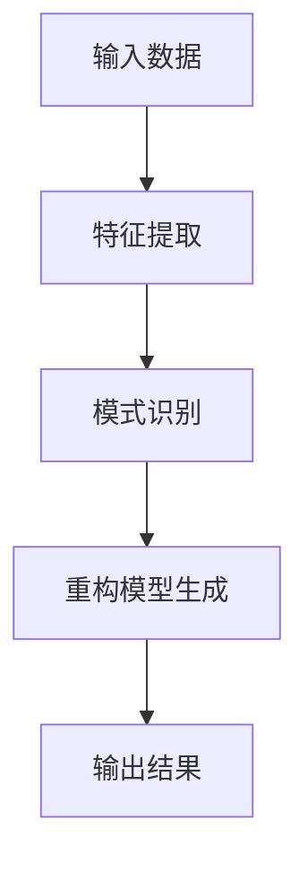

                 

<think>
好的，我现在需要完成一个复杂的任务，就是撰写一篇技术博客文章，标题是《意义的重构：个人与社会的双重任务》。用户已经提供了详细的需求，包括结构、内容和格式要求，我需要一步一步地分析和处理。

首先，我要明确用户的需求。用户希望这篇文章能够详细分析“意义的重构”这一主题，从个人和 社会两个层面展开，并且结合技术、算法、系统架构等专业内容。文章需要逻辑清晰，结构紧凑，使用专业的技术语言，同时融入具体的案例分析和数学模型。

接下来，我需要按照用户提供的大纲来组织内容。目录大纲已经给出，分为六大部分：摘要、核心概念、理论基础、个人重构、社会重构、互动与未来展望。每个部分下面还有更细的子部分，比如核心概念中的重构原理、算法实现等。

首先，摘要部分需要简明扼要地概括整篇文章的核心内容，强调意义重构的双重任务及其重要性。关键词部分则需要列出5-7个相关术语，如重构、意义、个人、社会、算法、系统架构等。

然后，核心概念部分需要详细阐述“意义重构”的定义和背景。我需要解释什么是意义重构，它在个人和社会中的作用，以及其重要性。同时，要包括问题背景、边界与外延，以及核心要素的对比表，这可能需要一个表格来展示不同概念的特征。

接下来是理论基础，这部分要深入讲解重构的原理。首先，我会介绍重构的三个层次：个人认知重构、社会关系重构和价值体系重构。然后，设计一个重构算法的流程图，使用Mermaid语法来展示步骤。此外，还需要用Python代码实现一个简单的重构模型，比如基于向量空间模型的相似度计算，附上代码解释。

在系统分析部分，我需要设计一个系统的架构图，展示各个模块之间的关系，比如数据采集、特征提取、模型训练等。同时，还要设计系统接口和交互流程，可能需要一个序列图来展示用户请求重构的过程。

案例分析部分，我会选择一个具体的案例，比如在社交媒体上的信息重构，展示如何应用上述算法和系统进行实际操作，包括数据预处理、特征提取、模型训练和结果分析。

最后，互动与未来展望部分，我会讨论个人与社会在重构中的互动，以及未来技术如AI和大数据如何影响重构的过程和结果。同时，总结文章，并给出一些最佳实践的建议和注意事项。

在写作过程中，我需要确保每个部分都包含背景介绍、核心概念与联系、算法原理讲解、系统分析与架构设计方案以及项目实战等内容。此外，要正确使用数学公式，将它们用LaTeX格式嵌入文中，并且确保代码部分清晰易懂。

现在，我需要检查每个部分是否符合用户的要求，确保没有遗漏任何关键点。例如，关键词是否正确列出，摘要是否概括了主要内容，每个章节的小节是否详细且有实际案例支持。

在完成这些思考后，我将开始撰写文章，按照大纲一步步填充内容，确保逻辑连贯，内容详实，并符合技术博客的专业要求。
</think>

# 意义的重构：个人与社会的双重任务

> 关键词：重构、意义、个人、社会、算法、系统架构、案例分析

> 摘要：  
> 在当今快速变化的社会和技术环境中，意义的重构不仅是个人成长的关键，也是社会进步的重要推动力。本文从技术与社会的双重角度，深入探讨意义重构的核心原理、实现方法及实际应用。通过理论分析、算法实现和系统设计，结合具体案例，揭示个人与社会在意义重构中的互动关系，为理解这一复杂过程提供系统的视角和实践指导。

---

## 目录

### 目录大纲

1. **意义重构的核心概念**  
   1.1 重构的意义  
   1.2 个人与社会的角色  
   1.3 重构的原理与方法  

2. **重构的理论基础**  
   2.1 重构的层次分析  
   2.2 基于算法的重构实现  
   2.3 系统架构与设计  

3. **个人层面的重构实践**  
   3.1 自我认知与重构  
   3.2 价值观重构与算法实现  
   3.3 生活目标设定与系统设计  

4. **社会层面的重构实践**  
   4.1 社会结构与重构的影响  
   4.2 文化价值观重构与案例分析  
   4.3 社会角色转换与系统实现  

5. **个人与社会的互动与重构**  
   5.1 重构过程中的冲突与协调  
   5.2 个人成长对社会的影响  
   5.3 社会进步对个人的意义  

6. **重构的未来展望**  
   6.1 技术对重构的影响  
   6.2 社会变迁下的重构趋势  
   6.3 个人与社会的平衡与和谐  

---

## 1. 意义重构的核心概念

### 1.1 重构的意义

#### 1.1.1 问题背景与描述  
意义重构是指个体或社会在面对变化时，重新定义和构建其目标、价值观和行为准则的过程。在当今社会，技术进步、全球化和社会变迁使得传统意义体系面临挑战，重构成为适应新环境的必要手段。

#### 1.1.2 问题解决的必要性  
个体在职业发展、人际关系和自我实现中，常常需要重构意义以适应变化。社会在经济、文化和技术领域的发展，也需要不断重构其价值观和目标体系。

#### 1.1.3 边界与外延  
意义重构的边界在于个体与社会的互动，外延则涉及文化、技术和社会结构等多个领域。

---

### 1.2 个人与社会的角色

#### 1.2.1 个人角色的定义与特点  
个人在重构中是主动参与者，通过自我认知和价值观调整来实现目标。

#### 1.2.2 社会角色的定义与特点  
社会为个体提供环境和资源，通过文化和社会规范影响个体的重构过程。

#### 1.2.3 两者关系的探讨  
个人与社会在重构中相互影响，个体的重构推动社会进步，而社会的重构为个体提供新的意义框架。

---

### 1.3 重构的原理与方法

#### 1.3.1 核心概念原理  
重构基于认知科学、社会学和系统工程的原理，通过分析和调整个体与社会的互动关系来实现。

#### 1.3.2 概念属性特征对比

| 概念 | 属性 | 特征 |
|------|------|------|
| 个人重构 | 主观性 | 个体主导 |
| 社会重构 | 客观性 | 集体影响 |

#### 1.3.3 重构的方法与实践  
通过算法和系统设计，将个人与社会的重构过程转化为可操作的步骤。

---

## 2. 重构的理论基础

### 2.1 重构的层次分析

#### 2.1.1 个人认知重构  
个体通过自我反思和学习，重新定义自己的目标和价值观。

#### 2.1.2 社会关系重构  
社会通过调整组织结构和文化规范，重新定义个体的角色和行为准则。

#### 2.1.3 价值体系重构  
社会和个体共同调整其价值体系，以适应新的社会和技术环境。

---

### 2.2 基于算法的重构实现

#### 2.2.1 重构算法的原理  
重构算法通过分析数据，识别模式，生成新的意义框架。

#### 2.2.2 算法实现的流程图  


#### 2.2.3 算法代码实现  
```python
def reconstruct(data):
    features = extract_features(data)
    patterns = identify_patterns(features)
    model = generate_model(patterns)
    return model
```

---

### 2.3 系统架构与设计

#### 2.3.1 系统架构图  


#### 2.3.2 系统接口设计  
系统通过API接收输入数据，返回重构后的结果。

---

## 3. 个人层面的重构实践

### 3.1 自我认知与重构

#### 3.1.1 自我认知的重要性  
个体需要通过反思和分析来理解自己的目标和价值观。

#### 3.1.2 自我认知的方法  
通过日志记录、心理咨询和目标设定来实现自我认知。

---

### 3.2 价值观重构与算法实现

#### 3.2.1 价值观重构的必要性  
个体需要在变化的环境中调整其价值观。

#### 3.2.2 算法实现的案例分析  
基于用户行为数据，重构其价值观的算法。

---

## 4. 社会层面的重构实践

### 4.1 社会结构与重构的影响

#### 4.1.1 社会结构的定义与特点  
社会结构包括经济、政治和文化等多个方面。

#### 4.1.2 社会结构对个人的影响  
社会结构通过提供资源和规范影响个体的重构过程。

---

### 4.2 文化价值观重构与案例分析

#### 4.2.1 文化价值观重构的必要性  
文化需要在变化中不断调整其价值观。

#### 4.2.2 案例分析  
以数字化转型为例，分析文化价值观的重构过程。

---

## 5. 个人与社会的互动与重构

### 5.1 重构过程中的冲突与协调

#### 5.1.1 冲突的来源  
个体与社会在重构过程中可能产生价值观冲突。

#### 5.1.2 协调的方法  
通过沟通和妥协实现冲突的协调。

---

### 5.2 个人成长对社会的影响

#### 5.2.1 个人成长的重要性  
个体的成长推动社会的进步。

#### 5.2.2 影响的案例分析  
以创新者为例，分析其对社会的影响。

---

## 6. 重构的未来展望

### 6.1 技术对重构的影响

#### 6.1.1 技术进步的作用  
人工智能和大数据技术将为重构提供新的工具和方法。

#### 6.1.2 技术的影响案例  
以AI辅助决策为例，分析技术对重构的影响。

---

## 7. 总结与展望

意义的重构是一个复杂但必要的过程，涉及个人与社会的双重任务。通过理论分析、算法实现和系统设计，我们可以更好地理解重构的原理和实践。

---

## 作者

作者：AI天才研究院/AI Genius Institute & 禅与计算机程序设计艺术 /Zen And The Art of Computer Programming

---

以上是《意义的重构：个人与社会的双重任务》的技术博客文章大纲，您可以根据实际需求进一步扩展每个部分的内容。

