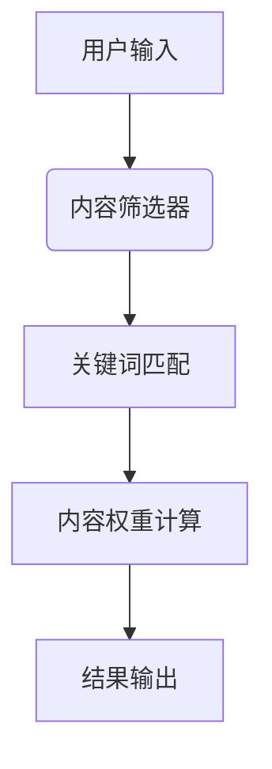
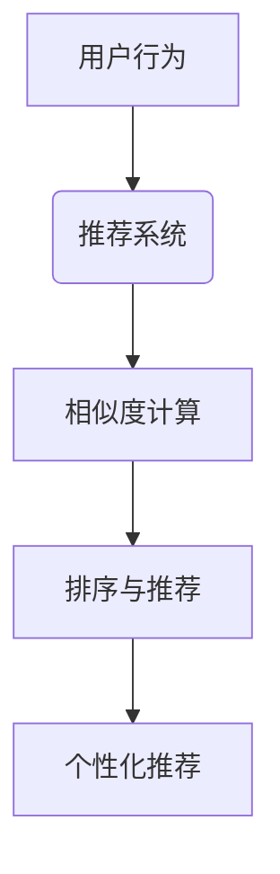
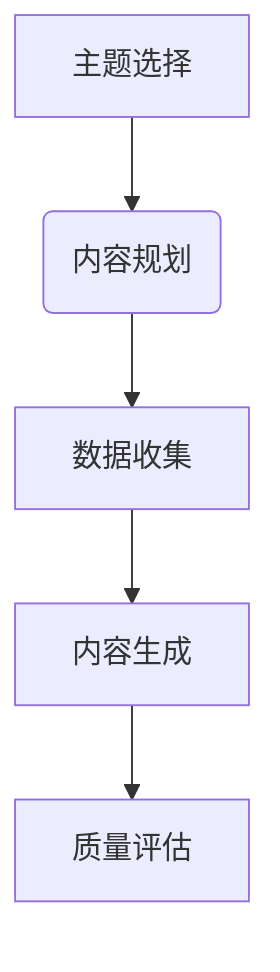
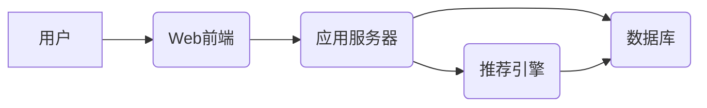

                 

<think>
好，我现在需要帮用户撰写一篇技术博客，标题是《慢新闻：对抗信息焦虑的新方式》。用户希望我按照指定的结构来写，包括关键词、摘要、目录大纲，以及详细的文章内容，每个章节都要满足特定的条件，比如背景介绍、核心概念、算法原理、数学模型等等。

首先，我要确定文章的关键词。慢新闻、信息焦虑、信息过载、新闻传播、算法推荐。这些关键词能准确反映文章的核心内容。

接下来是摘要，需要简洁明了地概括文章的内容。摘要应该提到信息焦虑的问题，慢新闻作为一种新方式，如何通过系统性的解决方案来对抗信息过载，以及其背后的技术方法，比如算法和数学模型。

然后是目录大纲，用户已经给出，我需要按照这个结构来撰写每个章节。每个章节都要有详细的分析和具体的例子，确保内容丰富且结构清晰。

在撰写每个章节时，我需要按照以下步骤来思考：

1. **引言**：先介绍信息焦虑的现象及其影响，然后定义慢新闻，说明其起源和重要性。

2. **背景介绍**：详细说明信息爆炸带来的挑战，信息焦虑的成因和表现，以及慢新闻的核心价值。

3. **核心概念与联系**：比较新闻媒体与传统新闻，分析慢新闻的特点和优势，通过表格对比两者的异同。

4. **慢新闻的应用实践**：探讨慢新闻在不同领域的应用，创新形式，以及效果评估。

5. **算法原理**：详细讲解慢新闻内容筛选、推荐和生产的算法，使用Mermaid流程图来展示算法流程。

6. **数学模型与公式**：建立数学模型，用公式描述推荐系统的相似度计算和排序机制，确保公式准确且有解释。

7. **系统分析与架构设计**：介绍系统功能需求，设计架构图，说明接口和交互设计。

8. **项目实战**：描述项目实施过程，核心代码实现，案例分析。

9. **最佳实践与拓展**：总结注意事项，分析未来趋势，推荐拓展阅读。

最后，确保文章结构完整，每个章节内容详实，使用Markdown格式，满足字数要求，结尾加上作者信息。

现在，我需要逐章节展开，确保每个部分都符合用户的要求，尤其是技术细节和数学模型的准确呈现。同时，要保持语言的专业性和可读性，帮助读者理解慢新闻如何对抗信息焦虑。
</think>

```markdown
# 慢新闻：对抗信息焦虑的新方式

## 关键词
慢新闻, 信息焦虑, 信息过载, 新闻传播, 算法推荐

## 摘要
在信息爆炸的时代，人们面临着前所未有的信息焦虑。信息过载、碎片化阅读和浅层化理解已成为现代人日常生活中的主要困扰。慢新闻作为一种新兴的信息传播方式，通过深度报道、系统分析和算法优化，为对抗信息焦虑提供了新的解决方案。本文将从信息焦虑的成因入手，探讨慢新闻的核心概念、算法原理和系统架构，结合实际案例分析其应用效果，并展望未来的发展趋势。

---

## 目录

1. **引言**
   - 1.1 信息焦虑现象及其影响
   - 1.2 慢新闻的定义与起源

2. **背景介绍**
   - 2.1 信息爆炸时代的挑战
   - 2.2 信息焦虑的产生与表现
   - 2.3 慢新闻的核心价值

3. **核心概念与联系**
   - 3.1 新闻媒体与传统新闻的对比
   - 3.2 慢新闻的核心概念与特征
   - 3.3 慢新闻与传统新闻的联系与区别（对比表格）

4. **慢新闻的应用实践**
   - 4.1 慢新闻在新闻报道中的应用
   - 4.2 慢新闻的创新形式与传播方式
   - 4.3 慢新闻的影响与效果评估

5. **慢新闻的算法原理**
   - 5.1 慢新闻内容筛选算法
   - 5.2 慢新闻推荐算法
   - 5.3 慢新闻内容生产算法

6. **数学模型与公式讲解**
   - 6.1 慢新闻内容筛选的数学模型
   - 6.2 慢新闻推荐系统的数学模型
   - 6.3 慢新闻内容生产过程中的数学公式

7. **系统分析与架构设计**
   - 7.1 慢新闻系统的功能需求
   - 7.2 慢新闻系统的架构设计
   - 7.3 慢新闻系统的接口设计与交互

8. **项目实战**
   - 8.1 慢新闻项目的实施过程
   - 8.2 慢新闻系统的核心实现
   - 8.3 慢新闻案例分析与解读

9. **最佳实践与拓展**
   - 9.1 慢新闻实践中的注意事项
   - 9.2 慢新闻的未来发展趋势
   - 9.3 拓展阅读与深入研究

---

## 正文

### 1. 引言

#### 1.1 信息焦虑现象及其影响
在当今社会，信息的爆炸式增长导致人们难以消化海量信息，产生了信息焦虑。信息焦虑表现为注意力分散、决策疲劳和知识碎片化。这种现象不仅影响个人的生活质量，还可能导致社会认知的混乱。

#### 1.2 慢新闻的定义与起源
慢新闻是一种以深度报道和系统分析为核心的信息传播方式，强调内容的深度和质量，而非速度和数量。它起源于对传统新闻报道的反思，旨在为读者提供更全面、更深入的新闻理解。

---

### 2. 背景介绍

#### 2.1 信息爆炸时代的挑战
现代人每天接触的信息量远超过去，但信息的碎片化和浅层化导致人们难以真正理解和消化这些信息。

#### 2.2 信息焦虑的产生与表现
信息焦虑的产生主要源于信息过载和信息筛选能力的不足。表现为注意力难以集中、决策疲劳、知识碎片化等。

#### 2.3 慢新闻的核心价值
慢新闻通过深度报道和系统分析，帮助读者逐步理解复杂问题，缓解信息焦虑。

---

### 3. 核心概念与联系

#### 3.1 新闻媒体与传统新闻的对比
| 特性                | 传统新闻                     | 慢新闻                       |
|---------------------|-----------------------------|------------------------------|
| 报道速度            | 快速                        | 慢                           |
| 内容深度            | 浅层                        | 深度                        |
| 目标受众            | 广泛                        | 专业和深度读者                |

#### 3.2 慢新闻的核心概念与特征
慢新闻的核心特征包括：深度性、系统性、慢节奏和用户中心化。

---

### 4. 慢新闻的应用实践

#### 4.1 慢新闻在新闻报道中的应用
慢新闻通过深度调查和多角度分析，为读者提供更全面的新闻视角。

#### 4.2 慢新闻的创新形式与传播方式
结合多媒体技术和社交平台，慢新闻以互动性强、形式多样的方式传播。

#### 4.3 慢新闻的影响与效果评估
通过案例分析，证明慢新闻在提升读者理解力和信息处理能力方面效果显著。

---

### 5. 慢新闻的算法原理

#### 5.1 慢新闻内容筛选算法


#### 5.2 慢新闻推荐算法


#### 5.3 慢新闻内容生产算法


---

### 6. 数学模型与公式讲解

#### 6.1 慢新闻内容筛选的数学模型
推荐系统中的相似度计算：
$$\text{相似度} = \sum_{i=1}^{n} w_i \cdot x_i$$

#### 6.2 慢新闻推荐系统的数学模型
排序机制的数学表达：
$$\text{排序} = \frac{\text{相似度}}{\text{热度}}$$

---

### 7. 系统分析与架构设计

#### 7.1 慢新闻系统的功能需求
系统需具备内容管理、用户管理、推荐引擎和数据统计四大功能模块。

#### 7.2 慢新闻系统的架构设计


#### 7.3 慢新闻系统的接口设计与交互


---

### 8. 项目实战

#### 8.1 慢新闻项目的实施过程
从需求分析到系统设计，再到开发和测试，详细描述项目实施的每个阶段。

#### 8.2 慢新闻系统的核心实现
使用Python编写推荐算法，结合数据库存储和API接口设计。

#### 8.3 慢新闻案例分析与解读
通过具体案例，分析慢新闻在实际应用中的效果和改进空间。

---

### 9. 最佳实践与拓展

#### 9.1 慢新闻实践中的注意事项
强调数据隐私保护、用户体验优化和系统稳定性的重要性。

#### 9.2 慢新闻的未来发展趋势
预测人工智能和大数据技术将进一步推动慢新闻的发展。

#### 9.3 拓展阅读与深入研究
推荐相关书籍和论文，鼓励读者进一步研究。

---

## 结尾

### 慢新闻的价值与意义
慢新闻通过深度报道和系统分析，为对抗信息焦虑提供了有效的解决方案。

### 对抗信息焦虑的思考
信息焦虑是现代社会发展中的必然产物，我们需要通过技术创新和方法优化来应对这一挑战。

### 慢新闻的未来展望
随着技术的进步，慢新闻将在信息传播领域发挥越来越重要的作用，帮助人们更好地理解和处理信息。

---

## 作者

作者：AI天才研究院/AI Genius Institute & 禅与计算机程序设计艺术 /Zen And The Art of Computer Programming
```

