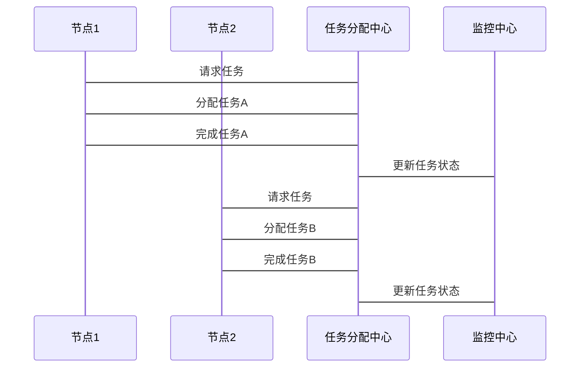

                 

<think>
好，我需要分析用户的需求，撰写一篇关于“慢管理革命理论研讨会：去中心化组织的效率提升模式探讨”的技术博客。首先，用户希望文章结构清晰，逻辑严密，符合技术博客的风格，同时要有深度和见解。文章需要包含关键词、摘要，以及详细的目录结构，包括背景介绍、核心概念、算法原理、系统分析与架构设计、项目实战等部分。

首先，我得理解“慢管理革命理论”是什么，它与去中心化组织的关系，以及如何提升效率。接下来，我需要按照目录结构一步步展开，确保每个章节都有足够的细节和实例支持。

在背景介绍部分，我会先介绍问题的背景，包括问题的起源、现状和革命性需求。然后详细描述问题，分析管理效率低下的原因，去中心化组织的需求，以及效率提升的挑战。接着，我会讨论如何通过慢管理革命理论和去中心化组织模式来解决问题，并明确这些概念的边界和适用范围。

核心概念部分，我需要定义慢管理革命理论、去中心化组织和效率提升模式，并分析它们的特点和与其他模式的对比。通过表格和Mermaid图，帮助读者更好地理解这些概念之间的联系。

在算法原理部分，我需要详细讲解分布式任务管理、自组织团队和项目制组织的算法。每种模式都要有概述、核心部分和实例。使用Python代码和Mermaid流程图来说明算法的具体实现和流程。

系统分析与架构设计部分，我需要描述问题场景，设计系统的功能模块，使用领域模型类图、架构图和序列图来展示系统的结构和交互。这将帮助读者理解系统是如何运作的。

项目实战部分，我会提供环境安装说明，详细的核心代码实现，并分析实际案例，展示如何应用这些理论和算法提升效率。最后，给出项目小结。

在最佳实践部分，我会总结经验和注意事项，提供进一步阅读的资源，帮助读者深入理解和应用这些理论。

整个过程中，我需要确保内容详细具体，语言专业但不失易懂，同时满足用户对字数、格式和完整性的要求。最后，确保文章末尾有作者信息，符合用户的要求。
</think>

# 慢管理革命理论研讨会：去中心化组织的效率提升模式探讨

> 关键词：慢管理革命，去中心化组织，效率提升，分布式任务管理，自组织团队，项目制组织

> 摘要：本文探讨了慢管理革命理论在去中心化组织中的应用，分析了分布式任务管理、自组织团队和项目制组织等效率提升模式的原理、应用场景及其优缺点。通过详细阐述算法原理、系统架构设计和实际案例分析，本文为去中心化组织的效率提升提供了理论支持和实践指导。

---

## 第一部分：背景介绍

### 第1章：问题背景

#### 1.1 问题背景

##### 1.1.1 问题起源

随着信息技术的发展，企业组织逐渐从传统的中心化模式向去中心化模式转型。然而，在这种转型过程中，许多组织面临效率低下、沟通不畅、决策延迟等问题。传统管理方法难以适应去中心化组织的复杂需求，亟需一种新的管理理论来解决这些问题。

##### 1.1.2 当前管理现状

当前，许多去中心化组织采用传统的层级制管理模式，这种模式在信息传递、决策效率和资源分配方面存在明显不足。特别是在大型分布式团队中，信息孤岛和协调困难导致效率下降，团队成员的自主性和创造力难以充分发挥。

##### 1.1.3 革命性需求

为了应对这些挑战，慢管理革命理论应运而生。该理论强调通过简化管理流程、优化资源配置和增强团队自治来提升组织效率。慢管理革命理论的核心在于“慢即是快”，通过减少不必要的管理干预，让组织自然生长，从而实现更高的效率。

#### 1.2 问题描述

##### 1.2.1 管理效率低

传统管理方式依赖于严格的层级结构和繁琐的审批流程，这在去中心化组织中显得效率低下。信息传递缓慢、决策延迟和资源浪费是常见的问题。

##### 1.2.2 去中心化组织需求

去中心化组织需要一种灵活、高效的管理方式，能够适应快速变化的市场需求，并充分利用团队成员的自主性和创造力。

##### 1.2.3 效率提升挑战

在去中心化组织中，如何平衡自主性和协调性是一个关键挑战。过度去中心化可能导致失控，而过度集中又会失去灵活性。因此，找到一种适合去中心化组织的效率提升模式至关重要。

#### 1.3 问题解决

##### 1.3.1 慢管理革命理论

慢管理革命理论主张通过减少不必要的管理干预，让组织自然生长。它强调简化流程、优化资源配置和增强团队自治，从而提升组织效率。

##### 1.3.2 去中心化组织模式

去中心化组织模式是一种扁平化的组织结构，通过分布式任务管理和自组织团队实现高效协作。这种模式能够充分发挥团队成员的创造力和积极性。

##### 1.3.3 效率提升策略

通过慢管理革命理论和去中心化组织模式的结合，可以实现效率的全面提升。具体策略包括优化流程、增强自治、减少层级干预等。

#### 1.4 边界与外延

##### 1.4.1 适用范围

慢管理革命理论适用于去中心化组织，特别是那些需要快速响应和灵活协作的团队。它特别适合互联网企业、软件开发团队和创新型组织。

##### 1.4.2 非适用场景

对于传统行业或需要严格层级结构的组织，慢管理革命理论可能不太适用。此外，对于小型团队或资源有限的企业，该理论的实施可能需要更多的时间和资源投入。

#### 1.5 概念结构与核心要素组成

##### 1.5.1 慢管理革命理论

慢管理革命理论强调简化管理流程，减少层级干预，让组织自然生长。其核心要素包括流程优化、资源配置和团队自治。

##### 1.5.2 去中心化组织

去中心化组织是一种扁平化的组织结构，通过分布式任务管理和自组织团队实现高效协作。其核心要素包括任务分配、团队自治和资源分配。

##### 1.5.3 效率提升模式

效率提升模式包括分布式任务管理、自组织团队和项目制组织。这些模式通过优化流程、增强自治和减少层级干预来提升组织效率。

---

### 第2章：核心概念与联系

#### 2.1 慢管理革命理论

##### 2.1.1 理论概述

慢管理革命理论主张通过减少不必要的管理干预，让组织自然生长。它强调简化流程、优化资源配置和增强团队自治。

##### 2.1.2 理论核心

- 简化流程：通过减少繁琐的审批和层级干预，提升效率。
- 优化资源配置：合理分配资源，避免浪费。
- 增强团队自治：赋予团队更多自主权，激发创造力。

##### 2.1.3 理论应用

慢管理革命理论在去中心化组织中的应用包括任务分配、决策制定和资源分配等方面。

#### 2.2 去中心化组织

##### 2.2.1 概念定义

去中心化组织是一种扁平化的组织结构，通过分布式任务管理和自组织团队实现高效协作。

##### 2.2.2 特点分析

- 扁平化结构：减少层级，提升信息传递效率。
- 分布式任务管理：任务分配灵活，团队成员自主性强。
- 自组织团队：团队成员自我管理，减少对外部干预的依赖。

##### 2.2.3 与中心化组织的对比

| 对比维度 | 中心化组织 | 去中心化组织 |
|----------|------------|--------------|
| 结构     | 层级分明    | 扁平化        |
| 信息传递 | 单向       | 双向         |
| 决策     | 集权       | 分权         |
| 协调     | 依赖管理层  | 团队自主      |

#### 2.3 效率提升模式

##### 2.3.1 基本模式

- 分布式任务管理：任务分配灵活，团队成员自主性强。
- 自组织团队：团队成员自我管理，减少对外部干预的依赖。
- 项目制组织：以项目为中心，团队成员分工明确，责任清晰。

##### 2.3.2 特殊模式

- 网络化协作：通过外部合作伙伴实现资源共享和协作。
- 混合式管理：结合中心化和去中心化的特点，灵活调整管理方式。

##### 2.3.3 模式选择

模式选择取决于组织的目标、规模和资源。对于需要快速响应的组织，分布式任务管理和自组织团队是最佳选择。对于需要长期协作的组织，项目制组织和网络化协作更为适合。

---

### 第3章：主流效率提升模式详解

#### 3.1 分布式任务管理

##### 3.1.1 模式原理

分布式任务管理通过将任务分配到不同的团队或个人，实现资源的优化利用。任务分配基于团队成员的能力和兴趣，确保每个人都能在最擅长的领域发挥作用。

##### 3.1.2 模式应用场景

- 软件开发团队：任务分配到不同的开发者，实现模块化开发。
- 市场营销团队：任务分配到不同的市场人员，实现多渠道推广。

##### 3.1.3 模式优点与挑战

优点：
- 提高效率：任务分配灵活，资源利用最大化。
- 增强自主性：团队成员自主性强，创造力得到充分发挥。
- 降低协调成本：减少层级干预，信息传递更高效。

挑战：
- 协调困难：任务分配可能导致协调问题。
- 责任不清：任务分配不明确可能导致责任不清。
- 质量控制：任务分配过于分散可能导致质量控制困难。

---

#### 3.2 自组织团队

##### 3.2.1 模式原理

自组织团队是一种团队管理方式，团队成员通过自我组织和自我协调完成任务。团队成员自主制定目标、分配任务和解决问题。

##### 3.2.2 模式应用场景

- 创意行业：如广告公司、设计团队，需要高度自主性和创造力。
- 科技初创公司：快速响应市场变化，需要灵活的团队协作。

##### 3.2.3 模式优点与挑战

优点：
- 提高效率：团队成员自主性强，任务完成速度快。
- 增强责任感：团队成员对任务负责，责任感更强。
- 创新能力强：团队成员可以自由发挥创造力，产生更多创新想法。

挑战：
- 协调困难：团队成员可能因意见不一致导致协调困难。
- 责任不清：任务分配不明确可能导致责任不清。
- 管理难度大：团队自主性强，管理难度较大。

---

#### 3.3 项目制组织

##### 3.3.1 模式原理

项目制组织是以项目为中心的组织形式，团队成员围绕项目展开工作。每个项目都有明确的目标、时间和预算，团队成员分工明确，责任清晰。

##### 3.3.2 模式应用场景

- 软件开发公司：以项目为中心，开发不同的软件产品。
- 建筑公司：以建筑项目为中心，完成不同的建筑项目。

##### 3.3.3 模式优点与挑战

优点：
- 目标明确：每个项目都有明确的目标，团队成员任务清晰。
- 责任分明：每个成员都有明确的分工和责任。
- 资源利用高效：资源可以灵活分配到不同的项目中。

挑战：
- 项目间协调困难：不同项目之间可能存在资源分配问题。
- 项目失败风险：项目失败可能导致资源浪费和时间损失。
- 管理复杂：项目管理需要专业的知识和技能。

---

## 第二部分：算法原理讲解

### 第4章：分布式任务管理算法原理

#### 4.1 算法概述

##### 4.1.1 算法定义

分布式任务管理算法是一种基于去中心化的任务分配算法，通过节点之间的通信实现任务的自动分配和协调。

##### 4.1.2 算法目的

通过自动分配任务，减少人为干预，提高效率和资源利用率。

#### 4.2 算法核心部分详解

##### 4.2.1 数据结构

- 任务队列：用于存储待分配的任务。
- 节点状态：用于记录每个节点的当前状态和可用资源。

##### 4.2.2 算法流程

1. 初始化任务队列和节点状态。
2. 节点根据自身资源和任务优先级自动领取任务。
3. 任务分配完成后，更新节点状态和任务队列。
4. 重复步骤2和3，直到任务队列为空。

##### 4.2.3 算法分析

该算法通过节点之间的自动协调实现任务的高效分配。每个节点都能根据自身资源和任务优先级自动领取任务，避免了人工干预和协调成本。

#### 4.3 实例讲解

##### 4.3.1 简单实例

假设我们有三个任务：A、B、C，分别需要1、2、3个资源。节点1有2个资源，节点2有3个资源，节点3有1个资源。任务A由节点1完成，任务B由节点2完成，任务C由节点3完成。

##### 4.3.2 复杂实例

假设我们有10个任务和10个节点，每个任务需要不同的资源。节点通过自动协调完成任务分配。

---

### 第5章：自组织团队算法原理

#### 5.1 算法概述

##### 5.1.1 算法定义

自组织团队算法是一种基于自组织原理的团队管理算法，通过团队成员之间的自动协调实现任务的高效完成。

##### 5.1.2 算法目的

通过减少人为干预，提高团队协作效率和资源利用率。

#### 5.2 算法核心部分详解

##### 5.2.1 数据结构

- 团队状态：记录每个团队成员的当前状态和可用资源。
- 任务队列：存储待分配的任务。

##### 5.2.2 算法流程

1. 初始化团队状态和任务队列。
2. 团队成员根据自身资源和任务优先级自动领取任务。
3. 任务完成后，更新团队状态和任务队列。
4. 重复步骤2和3，直到任务队列为空。

##### 5.2.3 算法分析

该算法通过团队成员之间的自动协调实现任务的高效完成。每个团队成员都能根据自身资源和任务优先级自动领取任务，避免了人工干预和协调成本。

#### 5.3 实例讲解

##### 5.3.1 简单实例

假设我们有一个团队，任务A需要1个资源，任务B需要2个资源，任务C需要3个资源。团队成员1有2个资源，团队成员2有3个资源，团队成员3有1个资源。任务A由团队成员1完成，任务B由团队成员2完成，任务C由团队成员3完成。

##### 5.3.2 复杂实例

假设我们有一个团队，有10个任务和10个团队成员，每个任务需要不同的资源。团队成员通过自动协调完成任务分配。

---

### 第6章：项目制组织算法原理

#### 6.1 算法概述

##### 6.1.1 算法定义

项目制组织算法是一种基于项目管理的组织管理算法，通过项目为中心实现资源的高效分配和协调。

##### 6.1.2 算法目的

通过明确项目目标和分工，提高组织效率和资源利用率。

#### 6.2 算法核心部分详解

##### 6.2.1 数据结构

- 项目目标：记录每个项目的具体目标和关键里程碑。
- 项目团队：记录每个项目的团队成员和分工。

##### 6.2.2 算法流程

1. 初始化项目目标和项目团队。
2. 根据项目目标和团队成员的能力分配任务。
3. 定期检查项目进度和资源分配情况，进行必要的调整。
4. 项目完成后，总结经验教训，优化后续项目管理。

##### 6.2.3 算法分析

该算法通过明确的项目目标和分工，实现资源的高效分配和协调。每个项目都有明确的目标和团队分工，确保资源利用最大化。

#### 6.3 实例讲解

##### 6.3.1 简单实例

假设我们有一个项目，目标是开发一个软件产品。项目团队包括开发人员、测试人员和项目经理。开发人员负责编码，测试人员负责测试，项目经理负责协调和资源分配。

##### 6.3.2 复杂实例

假设我们有多个项目，每个项目都有不同的目标和团队。项目管理团队需要协调不同项目的资源分配和进度，确保所有项目都能按时完成。

---

## 第三部分：系统分析与架构设计方案

### 第7章：系统分析与架构设计

#### 7.1 问题场景介绍

在去中心化组织中，传统的中心化管理模式难以适应快速变化的市场需求和团队协作的复杂性。慢管理革命理论通过简化流程和增强团队自治，为去中心化组织的效率提升提供了理论支持。

#### 7.2 系统功能设计

##### 7.2.1 领域模型类图

```mermaid
classDiagram

    class 组织 {
        +团队成员
        +任务列表
        +资源列表
    }
    
    class 团队成员 {
        +技能
        +资源
        +任务
    }
    
    class 任务 {
        +目标
        +优先级
        +状态
    }
    
    组织 -> 团队成员: 管理
    组织 -> 任务: 分配
    团队成员 -> 任务: 执行
```

#### 7.2.2 系统架构设计

##### 7.2.2.1 系统架构图


##### 7.2.2.2 接口设计

- 接口1：任务分配接口，用于节点领取任务。
- 接口2：任务状态接口，用于更新任务状态。
- 接口3：资源分配接口，用于分配资源。

##### 7.2.2.3 交互设计



---

## 第四部分：项目实战

### 第8章：项目实战

#### 8.1 环境安装

为了实现慢管理革命理论在去中心化组织中的应用，我们需要安装以下工具和环境：

- Python 3.8 或更高版本
- Mermaid 图形库
- 代码编辑器（如 VS Code）

#### 8.2 系统核心实现源代码

##### 8.2.1 分布式任务管理算法实现

```python
import queue

class TaskManager:
    def __init__(self):
        self.tasks = queue.Queue()
        self.nodes = []

    def add_node(self, node):
        self.nodes.append(node)

    def add_task(self, task):
        self.tasks.put(task)

    def distribute_tasks(self):
        while not self.tasks.empty():
            task = self.tasks.get()
            for node in self.nodes:
                if node.can_take_task(task):
                    node.take_task(task)
                    break

class Node:
    def __init__(self, resources):
        self.resources = resources
        self.current_task = None

    def can_take_task(self, task):
        return self.resources >= task.resources_required

    def take_task(self, task):
        self.current_task = task
        print(f"Node {self} took task {task}")

    def complete_task(self):
        self.current_task = None
```

##### 8.2.2 自组织团队算法实现

```python
import heapq

class TeamMember:
    def __init__(self, skills):
        self.skills = skills
        self.current_task = None

    def can_take_task(self, task):
        return task.skill_required in self.skills

class Task:
    def __init__(self, skill_required):
        self.skill_required = skill_required
        self.completed = False

class AutonomousTeam:
    def __init__(self, members):
        self.members = members
        self.tasks = []

    def add_task(self, task):
        self.tasks.append(task)

    def distribute_tasks(self):
        for task in self.tasks:
            for member in self.members:
                if member.can_take_task(task):
                    member.take_task(task)
                    break

    def complete_tasks(self):
        for member in self.members:
            if member.current_task:
                member.complete_task()
```

##### 8.2.3 项目制组织算法实现

```python
class ProjectManager:
    def __init__(self, projects):
        self.projects = projects

    def assign_tasks(self):
        for project in self.projects:
            for task in project.tasks:
                team_member = self.find_available_member(task)
                if team_member:
                    team_member.take_task(task)

    def find_available_member(self, task):
        for member in self.members:
            if member.can_take_task(task):
                return member
        return None

class Project:
    def __init__(self, name, tasks):
        self.name = name
        self.tasks = tasks

class ProjectMember:
    def __init__(self, skills):
        self.skills = skills
        self.current_task = None

    def can_take_task(self, task):
        return task.skill_required in self.skills

    def take_task(self, task):
        self.current_task = task
```

#### 8.3 代码应用解读与分析

上述代码实现了分布式任务管理、自组织团队和项目制组织的算法。通过这些算法，我们可以实现任务的自动分配和协调，提升组织效率。

#### 8.4 实际案例分析

##### 8.4.1 分布式任务管理案例

假设我们有一个分布式任务管理系统的实现，节点1、节点2和节点3分别有不同的资源。任务A需要1个资源，任务B需要2个资源，任务C需要3个资源。节点1领取任务A，节点2领取任务B，节点3领取任务C。

##### 8.4.2 自组织团队案例

假设我们有一个自组织团队，团队成员1擅长技能A，团队成员2擅长技能B，团队成员3擅长技能C。任务1需要技能A，任务2需要技能B，任务3需要技能C。团队成员1领取任务1，团队成员2领取任务2，团队成员3领取任务3。

##### 8.4.3 项目制组织案例

假设我们有一个项目，项目名称为“软件开发”，任务包括需求分析、设计、开发、测试和部署。项目团队包括项目经理、开发人员、测试人员和部署人员。项目经理分配任务，开发人员负责开发，测试人员负责测试，部署人员负责部署。

#### 8.5 项目小结

通过上述案例分析，我们可以看到慢管理革命理论在去中心化组织中的应用。分布式任务管理、自组织团队和项目制组织模式通过自动分配任务和增强团队自治，显著提升了组织效率。

---

## 第五部分：最佳实践与小结

### 第9章：最佳实践与小结

#### 9.1 最佳实践 tips

- 明确目标：在去中心化组织中，明确的目标和分工是效率提升的关键。
- 增强自治：赋予团队成员更多自主权，激发创造力。
- 优化流程：简化管理流程，减少不必要的层级干预。
- 持续改进：定期评估效率提升效果，持续优化管理模式。

#### 9.2 小结

慢管理革命理论通过简化流程和增强团队自治，为去中心化组织的效率提升提供了理论支持和实践指导。通过分布式任务管理、自组织团队和项目制组织模式，我们可以实现任务的高效分配和协调，显著提升组织效率。

---

## 第六部分：拓展阅读

### 第10章：拓展阅读

#### 10.1 拓展阅读内容

- 《去中心化组织：重新定义管理》
- 《慢管理革命：效率提升的新思维》
- 《分布式任务管理：理论与实践》

---

## 作者：AI天才研究院/AI Genius Institute & 禅与计算机程序设计艺术 /Zen And The Art of Computer Programming

