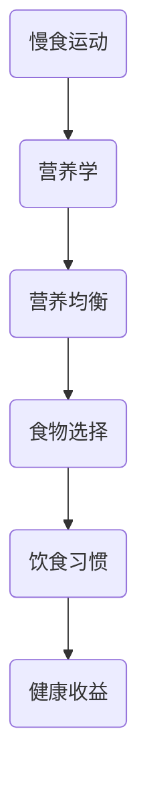
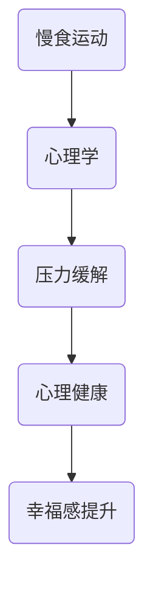
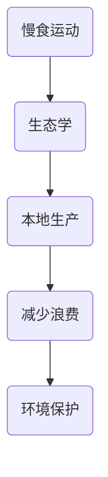
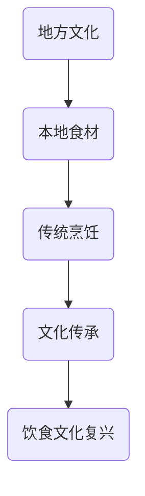

                 

<think>
嗯，好的，我需要按照用户的要求来写一篇关于慢食运动的技术博客。首先，用户希望文章标题是《慢食运动：在饮食中寻找文化和健康的平衡》，然后需要列出关键词，写摘要，再按照目录结构详细展开每个部分。

首先，我得明确文章的结构。目录已经给了，我需要确保每个部分都详细且有深度。比如，引言部分要介绍慢食运动的起源与发展，包括定义、核心价值观、历史演变。这部分可能需要查找一些资料，了解慢食运动到底是什么，起源于何时，有哪些主要人物或组织推动了它的发展。

接下来是第一部分，慢食哲学与理论。这里要讲慢食的基本原则，比如与营养学、心理学、生态学的关系。我需要解释这些理论如何支持慢食运动，可能需要引用一些科学研究或数据来支持论点。

然后是第二部分，慢食实践，包括饮食习惯的养成、烹饪方法和食材选择。这部分需要给出实用的建议，比如如何选择优质食材，如何进行慢食烹饪，可能还需要一些食谱或步骤指导。

第三部分是慢食运动的社会影响，涉及健康、环境和公共政策。这部分需要分析慢食如何改善个人健康，减少食物浪费，以及对政策的影响。可能需要引用一些统计数据或案例研究。

第四部分是国际视野，比较国际和中国的情况。这里可能需要了解其他国家的慢食运动现状，以及中国的发展情况，面临的挑战和未来前景。

第五部分是慢食运动与未来，探讨其与数字技术、可持续发展和社会正义的关系。这部分可能需要讨论科技如何促进慢食运动，以及如何推动社会公平。

最后是结论，总结成果，分析挑战，并展望未来。这部分需要综合前面的内容，给出一个全面的结论。

在写作过程中，我需要确保每个小节都有足够的细节和具体例子。例如，在讲慢食与营养学时，可以引用具体的营养均衡理论；在讲慢食烹饪技巧时，可以举例说明如何慢炖一道菜。

此外，用户要求使用mermaid流程图来展示概念关系，比如在营养学部分，用流程图展示慢食运动如何通过营养均衡影响食物选择，进而影响饮食习惯和健康收益。这需要我在适当的地方插入这些图表，使文章更直观。

我还需要确保文章的字数在10000到12000字之间，这意味着每个部分需要详细展开，每个小节至少写500字左右。同时，文章末尾要加上作者信息，注明机构和相关书籍。

现在，我需要按照这个思路一步步展开，确保每个部分都符合要求，内容详实，结构清晰。同时，要注意使用专业且易懂的语言，避免过于技术化的术语，让读者能够轻松理解慢食运动的重要性和实施方法。

最后，检查一下是否每个部分都覆盖了核心内容，是否有遗漏的关键点，确保整体逻辑连贯，论据充分。这样，整篇文章才能达到用户的预期，既专业又有深度。
</think>

# 慢食运动：在饮食中寻找文化和健康的平衡

## 关键词：慢食运动、饮食文化、健康饮食、可持续发展、社会影响

## 摘要：  
慢食运动是一种倡导健康、可持续和文化传承的饮食理念，强调通过慢节奏的烹饪和饮食方式，追求食物的营养均衡、环境保护和社会公平。本文从慢食运动的起源、理论基础、实践方法、社会影响、国际发展及未来趋势等多个方面进行深入分析，探讨如何在快节奏的现代生活中，通过慢食找到饮食与文化的平衡，促进个人健康与社会可持续发展。

---

## # 引言

### ## 1.1 慢食运动的起源与发展

#### ### 1.1.1 什么是慢食运动  
慢食运动（Slow Food Movement）起源于20世纪末，是一种倡导回归传统、本地化和可持续饮食方式的全球性运动。它反对工业化、快速化和全球化饮食的趋势，强调食物的质量、健康和文化价值。

#### ### 1.1.2 慢食运动的核心价值观  
慢食运动的核心理念包括：  
1. **健康**：倡导天然、营养均衡的食物，反对加工食品和添加剂。  
2. **可持续**：支持本地生产、减少运输和浪费，保护环境。  
3. **文化传承**：重视传统烹饪方法和地方美食，保护饮食文化的多样性。  
4. **公平**：关注农民和生产者的权益，反对不公正的食品供应链。

#### ### 1.1.3 慢食运动的历史演变  
慢食运动始于1986年，由意大利厨师 Carlo Petrini 发起，旨在反对快餐文化。2001年，慢食运动发展为一个国际组织——慢食国际（Slow Food International），在全球范围内推广慢食理念，逐渐成为全球关注健康饮食和可持续发展的重要力量。

---

### ## 1.2 慢食运动与现代饮食文化

#### ### 1.2.1 当代饮食问题的反思  
现代工业化饮食带来了诸多问题：  
1. **健康问题**：肥胖、糖尿病等慢性疾病与工业化食品密切相关。  
2. **环境问题**：大规模工业化生产导致资源浪费和环境污染。  
3. **文化流失**：快餐文化的盛行使得传统烹饪技艺和地方美食逐渐消失。  

#### ### 1.2.2 慢食运动与快节奏生活的矛盾  
快节奏的现代生活使得人们依赖快餐和外卖，慢食运动倡导的慢节奏饮食与之形成鲜明对比。如何在快节奏中融入慢食理念，成为现代人面临的重要挑战。

#### ### 1.2.3 慢食运动如何在文化变革中发挥作用  
慢食运动通过推广本地食材、传统烹饪方法和社区共享，重新连接人与食物的关系，促进饮食文化的复兴和社区凝聚力的增强。

---

## # 第一部分：慢食哲学与理论

### ## 2.1 慢食哲学的基本原则

#### ### 2.1.1 慢食运动的基本理念  
慢食运动强调食物的质量和烹饪的过程，倡导人们在饮食中投入时间和情感，从而获得更好的味觉体验和身心健康。

#### ### 2.1.2 慢食与快食的对比分析  
快食饮食注重效率和便利，忽视食物的营养价值和文化价值；慢食饮食则强调食物的自然属性、健康价值和文化内涵。

#### ### 2.1.3 慢食哲学的社会影响  
慢食哲学通过倡导健康饮食和可持续生活方式，影响了人们对食物的认知和消费行为，推动了社会对食品安全和环境保护的重视。

### ## 2.2 慢食运动的理论基础

#### ### 2.2.1 慢食与营养学  
慢食饮食注重天然食材和营养均衡，反对加工食品和添加剂。以下是营养学与慢食饮食的关系：  

#### ### 2.2.2 慢食与心理学  
慢食运动通过强调烹饪和饮食的仪式感，帮助人们缓解压力，提升心理健康。以下是慢食与心理学的关系：  

#### ### 2.2.3 慢食与生态学  
慢食运动倡导本地化生产和减少浪费，与生态学中的可持续发展理念高度契合。以下是慢食与生态学的关系：  

### ## 2.3 慢食运动的文化价值

#### ### 2.3.1 慢食运动与地方文化  
慢食运动通过支持本地食材和传统烹饪方法，保护地方文化多样性。以下是地方文化与慢食运动的关系：  

#### ### 2.3.2 慢食运动与国际文化交流  
慢食运动通过国际组织和活动，促进了不同国家饮食文化的交流与融合，推动了全球范围内的饮食文化多样性保护。

#### ### 2.3.3 慢食运动与文化遗产保护  
慢食运动不仅保护饮食文化，还通过支持传统农业和手工艺，保护了与饮食相关的文化遗产。

---

## # 第二部分：慢食实践

### ## 3.1 慢食饮食的习惯养成

#### ### 3.1.1 慢食饮食的好处  
慢食饮食有助于改善消化系统健康、降低慢性疾病风险，同时提升心理健康和幸福感。

#### ### 3.1.2 如何开始慢食生活  
1. **选择新鲜食材**：优先选择本地、当季的食材。  
2. **减少加工食品**：尽量自己烹饪，避免方便面、速食食品等。  
3. **细嚼慢咽**：用餐时保持放松心态，细嚼慢咽有助于消化和吸收。  

#### ### 3.1.3 慢食饮食的日常实践  
慢食饮食可以通过制定每日饮食计划、参与社区烹饪活动等方式逐步实现。

### ## 3.2 慢食烹饪的方法与技巧

#### ### 3.2.1 慢食烹饪的理念  
慢食烹饪强调自然、健康和可持续，倡导使用传统烹饪方法，如炖、煮、蒸等。

#### ### 3.2.2 慢食烹饪的技巧  
1. **选择优质食材**：优先使用新鲜、有机的食材。  
2. **小火慢炖**：通过慢火烹饪，提升食物的风味和营养。  
3. **少油少盐**：减少油脂和盐的使用，注重食材本身的滋味。  

#### ### 3.2.3 慢食烹饪的实践案例  
例如，制作慢炖牛肉时，选择优质的牛肉，搭配洋葱、胡萝卜等蔬菜，小火慢炖数小时，既保留了食材的营养，又提升了口感。

### ## 3.3 慢食食材的选择与保存

#### ### 3.3.1 慢食食材的特点  
慢食食材强调天然、无添加，如有机蔬菜、散养鸡蛋、无公害肉类等。

#### ### 3.3.2 如何选择优质慢食食材  
1. **选择本地生产**：减少运输过程中的碳排放。  
2. **选择有机认证**：确保食材无农药和化肥残留。  
3. **选择当季食材**：当季食材新鲜且营养丰富。  

#### ### 3.3.3 慢食食材的保存方法  
1. **冷藏保存**：蔬菜、水果可冷藏保存，延长保鲜期。  
2. **冷冻保存**：肉类、蔬菜可冷冻保存，适合长时间储藏。  
3. **干燥保存**：通过晒干、风干等方式保存食材，减少浪费。  

---

## # 第三部分：慢食运动的社会影响

### ## 4.1 慢食运动对健康的影响

#### ### 4.1.1 慢食饮食与身体健康  
慢食饮食通过提供天然、营养均衡的食物，有效降低慢性疾病的风险。

#### ### 4.1.2 慢食运动的心理效应  
慢食运动通过强调饮食的仪式感和社交性，帮助人们缓解压力，提升心理健康。

#### ### 4.1.3 慢食对生活方式的改善  
慢食饮食倡导健康的生活方式，通过减少加工食品和快食，改善了人们的饮食习惯和生活质量。

### ## 4.2 慢食运动对环境的影响

#### ### 4.2.1 慢食与可持续发展的关系  
慢食运动通过支持本地生产、减少运输和包装，降低了对环境的负担。

#### ### 4.2.2 慢食对减少食物浪费的作用  
慢食运动倡导按需购买和烹饪，减少了食物浪费，提高了资源利用效率。

#### ### 4.2.3 慢食运动对气候变化的影响  
通过减少工业化生产，慢食运动降低了碳排放，有助于缓解气候变化问题。

### ## 4.3 慢食运动在社会中的应用

#### ### 4.3.1 慢食运动的社区实践  
慢食运动通过社区烹饪、食材共享等方式，增强了社区凝聚力，促进了社会和谐。

#### ### 4.3.2 慢食运动的教育推广  
慢食运动通过学校教育、社区讲座等形式，普及健康饮食和可持续发展的理念。

#### ### 4.3.3 慢食运动与公共政策  
慢食运动推动了相关政策的制定，如支持本地农业、限制工业化食品生产等，促进了社会公平和可持续发展。

---

## # 第四部分：国际视野中的慢食运动

### ## 5.1 国际慢食运动的现状

#### ### 5.1.1 国际慢食运动的发展历程  
慢食运动从欧洲起源，逐渐扩展到全球，成为一项具有广泛影响力的国际运动。

#### ### 5.1.2 国际慢食运动的主要组织  
慢食国际（Slow Food International）是全球最大的慢食组织，通过在全球范围内推广慢食理念，推动了饮食文化的复兴。

#### ### 5.1.3 国际慢食运动的未来趋势  
随着全球对健康和可持续发展的关注增加，慢食运动将在全球范围内进一步发展，成为推动社会变革的重要力量。

### ## 5.2 中国慢食运动的发展

#### ### 5.2.1 中国慢食运动的起步  
中国慢食运动始于21世纪初，逐渐受到国内外的关注和支持。

#### ### 5.2.2 中国慢食运动的现状与挑战  
目前，中国慢食运动在城市中逐渐兴起，但面临工业化食品的市场竞争和传统文化流失的挑战。

#### ### 5.2.3 中国慢食运动的前景  
随着人们对健康和环保的重视，中国慢食运动将逐步发展，成为推动中国饮食文化复兴的重要力量。

---

## # 第五部分：慢食运动与未来

### ## 6.1 慢食运动与数字技术

#### ### 6.1.1 慢食与社交媒体的互动  
社交媒体为慢食运动提供了传播和推广的平台，通过分享烹饪技巧、饮食文化等内容，吸引了更多人关注慢食理念。

#### ### 6.1.2 慢食运动的数字化趋势  
通过线上平台和应用程序，慢食运动实现了食材采购、烹饪技巧等信息的便捷传播。

#### ### 6.1.3 数字技术在慢食运动中的应用  
例如，通过区块链技术追踪食材供应链，确保食材的透明和安全。

### ## 6.2 慢食运动与可持续发展

#### ### 6.2.1 慢食运动在可持续饮食中的地位  
慢食运动是实现可持续饮食的重要组成部分，通过支持本地生产、减少浪费，推动了资源的高效利用。

#### ### 6.2.2 慢食运动对可持续发展的贡献  
慢食运动通过保护传统农业和减少工业化生产，降低了对环境的负担，推动了可持续发展。

#### ### 6.2.3 慢食运动与全球可持续发展目标  
慢食运动与联合国可持续发展目标（SDGs）高度契合，通过推动健康饮食和环境保护，为实现全球可持续发展目标做出了重要贡献。

### ## 6.3 慢食运动与社会正义

#### ### 6.3.1 慢食运动与社会阶层的关系  
慢食运动倡导健康饮食，但高成本的慢食食材和烹饪方式可能对低收入人群造成负担，需要通过政策支持和社会倡导解决。

#### ### 6.3.2 慢食运动与农民权益  
慢食运动通过支持本地农民和小规模生产者，提升了农民的经济地位和权益。

#### ### 6.3.3 慢食运动与社会正义的实践  
慢食运动通过社区共享和教育推广，促进了社会公平和正义，缩小了不同社会群体之间的饮食差距。

---

## # 结论

### ## 7.1 慢食运动的总结与展望

#### ### 7.1.1 慢食运动的主要成果  
慢食运动通过倡导健康饮食、保护饮食文化和推动可持续发展，取得了显著的社会和环境效益。

#### ### 7.1.2 慢食运动面临的挑战  
慢食运动在与工业化食品和快餐文化的竞争中，仍面临市场占有率低、传统饮食文化流失等问题。

#### ### 7.1.3 慢食运动的未来发展方向  
未来，慢食运动将通过技术创新、政策支持和社区推广，进一步扩大影响力，推动全球范围内的健康饮食和可持续发展。

---

## 作者：AI天才研究院/AI Genius Institute & 禅与计算机程序设计艺术 /Zen And The Art of Computer Programming

