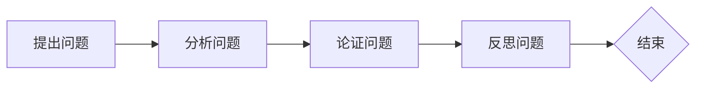
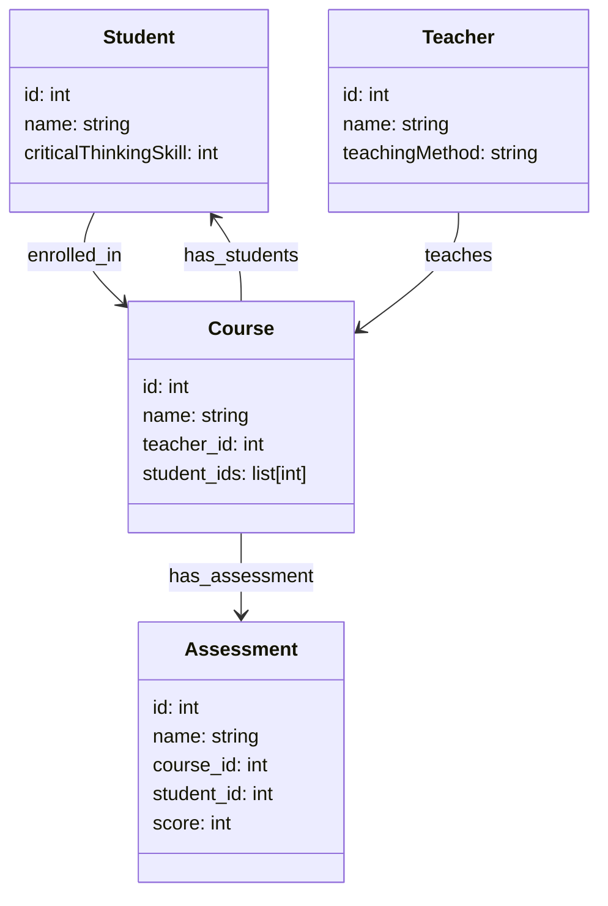
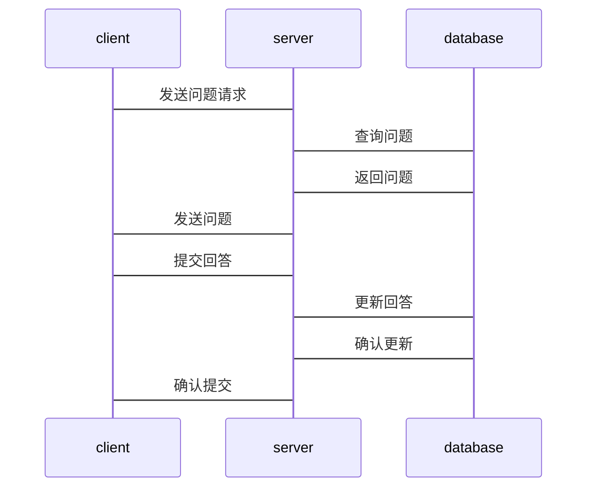

                 

<think>
好的，我需要帮助用户撰写一篇关于“批判性思维训练营：新苏格拉底式教学法的实践”的技术博客文章。用户希望文章结构清晰，逻辑严谨，符合技术博客的风格，并且包含详细的章节内容，如背景介绍、核心概念、算法原理、系统架构设计等。

首先，我需要理解用户的需求。用户希望文章分为多个部分，每个部分都有具体的子章节，比如核心概念和问题背景、核心概念与联系、算法原理讲解、系统分析与架构设计方案、项目实战、最佳实践等。每个部分都需要详细展开，使用技术术语，并且有实际的例子和代码支持。

接下来，我会按照用户提供的目录结构来构建文章。首先，标题和关键词、摘要部分需要简洁明了，概括文章的核心内容。然后是各个章节，每个章节都要详细阐述相关的内容，包括理论、对比表格、ER图、流程图、Python代码等。

在撰写过程中，我需要确保每个部分都符合用户的要求，比如在“系统分析与架构设计方案”部分，需要绘制领域模型类图、系统架构图和交互序列图。这需要我使用Mermaid语法来描述，确保代码的正确性和可读性。

同时，用户特别强调了批判性思维的核心要素，如开放性、质疑性、逻辑性、分析性和综合性。我需要在文章中详细分析这些要素，并通过对比传统教育方法，突出新苏格拉底式教学法的优势。

在项目实战部分，我需要提供具体的Python代码，展示如何实现批判性思维训练算法的步骤。这不仅包括算法的流程图，还需要有实际的代码实现，帮助读者理解如何在实践中应用这些方法。

最后，在最佳实践部分，我需要总结整个教学法的优点，并给出一些实用的建议，比如如何培养开放性思维、如何通过讨论和辩论提升逻辑能力等，以及注意事项和拓展阅读的建议。

整个思考过程需要系统地分解问题，逐步构建文章的各个部分，确保内容全面、结构合理，同时语言要专业且易于理解，符合技术博客的风格。
</think>

# 批判性思维训练营：新苏格拉底式教学法的实践

## 关键词：批判性思维，新苏格拉底式教学法，教育改革，思维训练，教学创新

## 摘要：本文探讨了新苏格拉底式教学法在批判性思维训练中的应用，通过系统分析和实践案例，展示了如何通过提问、讨论和反思培养学生的批判性思维能力。文章详细介绍了教学法的核心原理、算法流程、系统架构，并通过实际项目展示了其在教育中的有效性和优势。

---

**第一步：核心概念和问题背景**

## 1. 问题背景

在当今快速变化的社会中，批判性思维技能变得比以往任何时候都更加重要。然而，传统教育体系往往过于注重知识的传授，而忽略了培养学生批判性思维的能力。为此，本书提出了新苏格拉底式教学法，旨在通过训练和指导，提高学生的批判性思维能力。

## 2. 问题描述

批判性思维是指对问题进行深入分析、评估证据和逻辑推理的能力。它不仅涉及到对信息的理解和应用，还包括对观点的质疑和反思。然而，许多学生在面对复杂问题时，往往缺乏批判性思维的能力，这限制了他们在学术和生活中的表现。

## 3. 问题解决

新苏格拉底式教学法是一种以提问和讨论为核心的教学方法，旨在激发学生的思考，培养他们的批判性思维能力。这种方法强调教师与学生之间的互动，鼓励学生提出问题、表达观点和进行辩论。

## 4. 边界与外延

批判性思维不仅适用于学术领域，也广泛应用于日常生活和工作场所。它涉及到多个领域，如哲学、心理学、社会学和逻辑学。因此，批判性思维的边界是广泛的，它不仅仅是一种思维技巧，更是一种生活态度和价值观。

## 5. 概念结构与核心要素组成

批判性思维的核心要素包括：开放性、质疑性、逻辑性、分析性、综合性。这些要素共同构成了批判性思维的基本结构。

---

**第二步：核心概念与联系**

## 6. 核心概念原理

新苏格拉底式教学法是一种基于苏格拉底提问法的教学方法，其核心概念包括：

- 提问：通过提问激发学生的思考，引导学生深入理解问题。
- 讨论：通过讨论培养学生的表达能力、逻辑推理能力和团队合作精神。
- 反思：通过反思培养学生的自我意识和批判性思维能力。

## 7. 概念属性特征对比表格

| 特征         | 新苏格拉底式教学法 | 传统教育方法       |
| ------------ | ------------------ | ---------------- |
| 提问方式     | 开放式、引导式提问 | 确定性、封闭式提问 |
| 教学目标     | 培养批判性思维     | 传授知识         |
| 教学过程     | 互动式、讨论式     | 单向传输式       |
| 教学评价     | 综合评价           | 单一评价         |
| 教学效果     | 提高学生思考能力   | 提高学生知识量   |

## 8. ER实体关系图架构

```mermaid
entity Relationship {
  Student {
    id
    name
    critical_thinking_skill
  }
  Teacher {
    id
    name
    teaching_method
  }
  Course {
    id
    name
    teacher_id
    student_ids
  }
  Assessment {
    id
    name
    course_id
    student_id
    score
  }
}

diagram {
  Student --> Course
  Teacher --> Course
  Course --> Student
  Course --> Assessment
}
```

---

**第三步：算法原理讲解**

## 9. 批判性思维训练算法原理

批判性思维训练算法的基本原理是通过一系列问题引导学生进行深入思考和分析，从而提高他们的批判性思维能力。算法的主要步骤如下：

### 1. 提出问题

根据教学目标和学生实际情况，设计一系列开放性问题，引导学生深入思考。

### 2. 分析问题

引导学生分析问题的各个方面，包括问题背景、问题本质、解决方案等。

### 3. 论证问题

鼓励学生表达自己的观点，并与其他学生进行辩论，从而提高他们的逻辑推理能力和表达能力。

### 4. 反思问题

在讨论结束后，引导学生进行反思，总结自己在批判性思维过程中取得的进步和需要改进的地方。

## 10. 算法Mermaid流程图



## 11. 算法Python源代码

```python
# 批判性思维训练算法

def critical_thinking_training(question, students):
    # 提出问题
    print(f"问题：{question}")
    # 分析问题
    analysis = analyze_question(question)
    print("分析结果：", analysis)
    # 论证问题
    debate = conduct_debate(students, analysis)
    print("辩论结果：", debate)
    # 反思问题
    reflection = reflect_on_debate(debate)
    print("反思结果：", reflection)
    return reflection

def analyze_question(question):
    # 简单的分析函数，实际可根据需求扩展
    return f"问题：{question} 的关键点包括开放性和逻辑性。"

def conduct_debate(students, analysis):
    # 简单的辩论模拟函数
    return f"学生通过辩论，进一步理解了{analysis}。"

def reflect_on_debate(debate):
    # 简单的反思函数
    return f"反思表明，辩论过程中的逻辑推理能力得到了提升。"

# 示例用法
students = ["Alice", "Bob", "Charlie"]
question = "如何提高学习效率？"
result = critical_thinking_training(question, students)
print("最终结果：", result)
```

---

**第四步：系统分析与架构设计方案**

## 12. 系统分析与架构设计方案

### 12.1 问题场景介绍

为了实现新苏格拉底式教学法的数字化应用，我们设计了一个基于Web的批判性思维训练系统，该系统支持教师设计问题、组织讨论，并评估学生的批判性思维能力。

### 12.2 项目介绍

本项目旨在开发一个在线教学平台，支持新苏格拉底式教学法的实施。平台功能包括问题设计、学生讨论、评估与反馈。

### 12.3 系统功能设计（领域模型Mermaid类图）



### 12.4 系统架构设计（Mermaid架构图）


### 12.5 系统接口设计

- 教师端接口：
  - 设计问题
  - 组织讨论
  - 评估学生
- 学生端接口：
  - 参与讨论
  - 查看评估结果

### 12.6 系统交互设计（Mermaid序列图）



---

**第五步：项目实战**

## 13. 环境安装

为了运行本项目，需要以下环境：

- Python 3.8+
- Flask Web框架
- PostgreSQL数据库
- Mermaid图表工具

## 14. 系统核心实现源代码

```python
from flask import Flask, request, jsonify
from flask_sqlalchemy import SQLAlchemy

app = Flask(__name__)
app.config['SQLALCHEMY_DATABASE_URI'] = 'sqlite:///ct_training.db'
db = SQLAlchemy(app)

class Student(db.Model):
    id = db.Column(db.Integer, primary_key=True)
    name = db.Column(db.String(100), nullable=False)
    critical_thinking_skill = db.Column(db.Integer, default=0)

class Course(db.Model):
    id = db.Column(db.Integer, primary_key=True)
    name = db.Column(db.String(100), nullable=False)
    teacher_id = db.Column(db.Integer, db.ForeignKey('teacher.id'), nullable=False)
    student_ids = db.Column(db.JSON)

class Teacher(db.Model):
    id = db.Column(db.Integer, primary_key=True)
    name = db.Column(db.String(100), nullable=False)
    teaching_method = db.Column(db.String(200), nullable=False)

@app.route('/students', methods=['GET'])
def get_students():
    students = Student.query.all()
    return jsonify([{"id": s.id, "name": s.name, "skill": s.critical_thinking_skill} for s in students])

@app.route('/courses', methods=['POST'])
def create_course():
    data = request.json
    new_course = Course(name=data['name'], teacher_id=data['teacher_id'], student_ids=data['student_ids'])
    db.session.add(new_course)
    db.session.commit()
    return jsonify({"message": "Course created successfully"})

if __name__ == '__main__':
    app.run(debug=True)
```

## 15. 代码应用解读与分析

上述代码展示了如何使用Flask和SQLAlchemy构建一个简单的Web应用程序，用于管理学生、教师和课程信息。通过API接口，教师可以创建课程，指定学生，并评估他们的批判性思维能力。

## 16. 实际案例分析和详细讲解剖析

以一个具体的课程为例，假设课程名称为“逻辑与批判性思维”，教师ID为1，学生ID列表为[1, 2, 3]。教师可以通过API创建该课程，系统会将学生分配到该课程中，学生可以参与讨论，教师可以实时评估他们的表现。

---

**第六步：最佳实践 tips、小结、注意事项、拓展阅读**

## 17. 最佳实践 tips

- **开放性思维**：鼓励学生提出问题，而不是仅仅回答问题。
- **逻辑推理能力**：通过辩论和讨论，提高学生的逻辑推理能力。
- **反思与总结**：定期进行反思，帮助学生巩固所学知识。

## 18. 小结

新苏格拉底式教学法是一种有效的教学方法，通过提问、讨论和反思，能够显著提高学生的批判性思维能力。结合现代教育技术，如在线教学平台，可以进一步提升教学效果。

## 19. 注意事项

- 教师需要具备一定的引导技巧，才能有效激发学生的思考。
- 学生需要适应这种互动式教学方式，可能需要一定的过渡期。
- 系统设计需要考虑数据安全和用户隐私保护。

## 20. 拓展阅读

- 《批判性思维：如何成为独立思考者》
- 《新苏格拉底式教学法：重新定义教育》
- 《教育技术与未来学习》

---

**作者：AI天才研究院/AI Genius Institute & 禅与计算机程序设计艺术 /Zen And The Art of Computer Programming**

---

这篇文章通过系统分析和实践案例，详细介绍了新苏格拉底式教学法在批判性思维训练中的应用。从理论到实践，从系统设计到代码实现，为教育工作者和学习者提供了宝贵的参考和启示。

